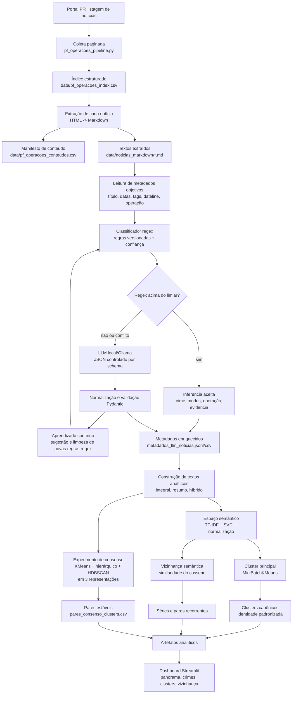

# NT PF

Atlas analitico sobre noticias de operacoes da Policia Federal brasileira. O projeto coleta a base publica de noticias, extrai o conteudo principal de cada pagina, organiza os dados em artefatos tabulares e abre um painel narrativo em Streamlit para explorar crimes, padroes temporais, clusters semanticos e clusters canonicos guiados por identidade.

## Fonte

Base publica consultada:

- [Noticias de operacoes da PF](https://www.gov.br/pf/pt-br/assuntos/noticias/noticias-operacoes?b_start:int=0)

## Objetivo

O foco do projeto e identificar quais tipos de crimes aparecem com maior recorrencia ao longo do tempo e observar correlacoes entre temas, contextos operacionais e distribuicao territorial. Um exemplo de pergunta que o trabalho tenta responder e como lavagem de dinheiro se relaciona com outros crimes em anos e contextos diferentes.

## O que o projeto faz

1. Coleta a listagem paginada de operacoes publicadas no portal da PF.
2. Estrutura os metadados basicos em CSV.
3. Abre cada noticia individualmente e extrai o conteudo principal em markdown.
4. Gera artefatos analiticos com classificacao, recorrencia temporal por cluster canonico, pares semelhantes e distribuicoes por ano.
5. Publica um painel em Streamlit para leitura exploratoria e narrativa dos resultados.

## Stack

- Python
- Pandas
- Streamlit
- Plotly
- scikit-learn
- BeautifulSoup
- requests
- docling

## Estrutura do repositorio

```text
NT_PF/
|-- .zenodo.json
|-- CITATION.cff
|-- DATASET_README.md
|-- LICENSE
|-- data/
|   |-- analise_qualitativa/   # saidas geradas pelo pipeline
|   |-- noticias_markdown/     # markdown de cada noticia extraida
|   `-- reference/
|       `-- brazil_states.geojson
|-- scripts/
|   |-- pf_llm_metadata.py
|   |-- pf_llm_models.py
|   |-- project_config.py
|   |-- pf_operacoes_pipeline.py
|   `-- pf_analise_qualitativa.py
|-- setup.ps1
|-- pyproject.toml
|-- uv.lock
|-- requirements-runtime.txt
|-- requirements-extraction.txt
|-- requirements-lock.txt
|-- streamlit_app.py
|-- requirements.txt
`-- .gitignore
```

## Reproducibilidade

- Ambiente validado com Python 3.13.12.
- Os perfis de dependencias ficam separados em quatro arquivos para reduzir conflito e deixar cada uso mais claro:
  - [requirements-runtime.txt](requirements-runtime.txt): analise, dashboard e LLM.
  - [requirements-extraction.txt](requirements-extraction.txt): coleta e extracao.
  - [requirements.txt](requirements.txt): ambiente completo, agregando runtime + extraction.
  - [requirements-lock.txt](requirements-lock.txt): lockfile do ambiente validado localmente.
- O fluxo principal agora usa [pyproject.toml](pyproject.toml) e `uv.lock` com dois perfis:
  - dependencias base no `[project.dependencies]`
  - coleta e extracao no grupo `extraction`
- As constantes compartilhadas do projeto ficam centralizadas em [scripts/project_config.py](scripts/project_config.py), incluindo caminhos, defaults de scraping, defaults da LLM e referencias geograficas reaproveitadas pelo pipeline e pelo app.
- O manifesto `data/pf_operacoes_conteudos.csv` pode registrar extracoes com falha; a etapa de analise consome apenas registros com `status=ok` e markdown realmente disponivel.

## Como executar

Com `uv`, o setup mais simples fica assim:

```powershell
uv sync --group extraction
```

Se preferir o bootstrap do repositorio, use:

```powershell
.\setup.ps1
```

Esse script:

- procura um Python 3.13 ou 3.12
- usa `uv sync` quando `uv` e `pyproject.toml` estiverem disponiveis
- usa `uv.lock` quando ele existir
- cai para o fluxo legado com `pip` apenas como fallback

Se der conflito em outra maquina, o primeiro ponto para conferir e a versao do Python. O ambiente deste projeto foi validado com `Python 3.13.12`, mas as dependencias principais usadas para analise local tambem aceitam `Python 3.12`.

### Modo leve para outra maquina

Se a outra maquina ja vai receber os arquivos locais prontos em `data/noticias_markdown`, `data/pf_operacoes_index.csv` e `data/pf_operacoes_conteudos.csv`, voce nao precisa instalar a pilha completa de coleta com `docling`.

Nesse caso, use o setup leve:

```powershell
.\setup.ps1 -Profile runtime
```

Ele instala apenas o necessario para:

- rodar `run_local.py`
- gerar os artefatos analiticos
- abrir `streamlit_app.py`
- usar a LLM com `ollama` ou `groq`

Esse e o caminho mais indicado quando houver conflito de bibliotecas em outra maquina.

### Modo com extracao completa

Se a outra maquina tambem vai coletar e extrair noticias do portal, use o setup de extracao completa:

```powershell
.\setup.ps1 -Profile extraction
```

Esse fluxo instala o ambiente completo definido em `requirements.txt`, que agrega a base de analise, o dashboard, os provedores de LLM e a pilha de extracao.

Se voce quiser usar diretamente o `uv` sem passar pelo script:

```powershell
uv sync
uv sync --group extraction
```

O primeiro comando instala a base de analise, dashboard e LLM. O segundo adiciona a pilha de coleta e extracao.

### Modo local sem argumentos

Se os arquivos locais ja estiverem presentes em `data/noticias_markdown`, `data/pf_operacoes_index.csv` e `data/pf_operacoes_conteudos.csv`, voce pode rodar o pipeline inteiro sem passar argumentos:

```powershell
.\.venv\Scripts\python.exe .\run_local.py
```

Ou, no PowerShell do Windows:

```powershell
.\run_local.ps1
```

Esse fluxo usa os caminhos padrao do repositorio, processa os arquivos locais com a LLM, gera os artefatos analiticos e deixa o painel pronto para abrir.

### Fluxo completo da pipeline



Se quiser testar sem processar toda a base, voce pode limitar a etapa da LLM sem usar argumentos de linha de comando:

```powershell
$env:PF_LLM_LIMIT="20"
.\.venv\Scripts\python.exe .\run_local.py
```

Se quiser pular a etapa da LLM e apenas regenerar os artefatos analiticos com o JSONL ja existente:

```powershell
$env:PF_SKIP_LLM="1"
.\.venv\Scripts\python.exe .\run_local.py
```

### Etapa 1: sincronizar a base automaticamente

```powershell
.\.venv\Scripts\python.exe .\scripts\pf_operacoes_pipeline.py
```

Esse e o modo mais simples: sem argumentos, o script assume `sync` e usa os caminhos padrao do repositorio.

Se quiser explicitar o mesmo fluxo manualmente:

```powershell
.\.venv\Scripts\python.exe .\scripts\pf_operacoes_pipeline.py sync --index-csv .\data\pf_operacoes_index.csv --content-csv .\data\pf_operacoes_conteudos.csv --markdown-dir .\data\noticias_markdown
```

Esse comando atualiza o indice e baixa apenas as noticias que ainda nao existem na base local.

Se quiser rodar as etapas separadamente, os comandos antigos `collect` e `extract` continuam disponiveis.

### Etapa 2: gerar a analise qualitativa

```powershell
.\.venv\Scripts\python.exe .\scripts\pf_analise_qualitativa.py
```

Sem argumentos, o script usa os caminhos padrao do repositorio e salva a saida em `data/analise_qualitativa`.

### Etapa 2b: gerar metadados estruturados com LLM

O projeto tambem pode ler cada noticia em markdown e separar duas camadas: `metadata_extraido`, lido diretamente do arquivo, e `inferencia_llm`, usada apenas para interpretar o corpo da noticia. O script `scripts/pf_llm_metadata.py` usa schema Pydantic para validar a saida e aceita dois provedores:

- `ollama`: padrao local
- `groq`: via API compativel com OpenAI

Por padrao, o provider funciona em modo `auto`: tenta o provider preferido disponivel e, se houver falha de configuracao ou execucao, cai para o outro.

```powershell
.\.venv\Scripts\python.exe .\scripts\pf_llm_metadata.py
```

Sem argumentos, o script usa `data/noticias_markdown` como entrada e salva os artefatos em `data/analise_qualitativa`.

Por padrao, ele usa estes valores:

- `data/noticias_markdown` como entrada
- `data/analise_qualitativa/metadados_llm_noticias.jsonl` como JSONL
- `data/analise_qualitativa/metadados_llm_noticias.csv` como CSV tabular
- `gemma3n:e2b` como modelo quando `PF_LLM_PROVIDER=ollama`
- `llama-3.3-70b-versatile` como modelo quando `PF_LLM_PROVIDER=groq`
- `http://localhost:11434` como host do Ollama
- `https://api.groq.com/openai/v1` como base URL da Groq

Se quiser limitar o processamento sem voltar ao uso de argumentos, basta definir a variavel de ambiente antes da execucao:

```powershell
$env:PF_LLM_LIMIT="5"
.\.venv\Scripts\python.exe .\scripts\pf_llm_metadata.py
```

Se quiser usar a Groq API com a sua chave:

```powershell
$env:PF_LLM_PROVIDER="groq"
$env:GROQ_API_KEY="gsk_sua_chave_aqui"
$env:PF_LLM_MODEL="llama-3.3-70b-versatile"
.\.venv\Scripts\python.exe .\scripts\pf_llm_metadata.py
```

Se preferir rodar o pipeline inteiro com Groq:

```powershell
$env:PF_LLM_PROVIDER="groq"
$env:GROQ_API_KEY="gsk_sua_chave_aqui"
.\.venv\Scripts\python.exe .\run_local.py
```

Variaveis uteis:

- `PF_LLM_PROVIDER`: `auto`, `ollama` ou `groq`
- `PF_LLM_MODEL`: troca o modelo sem editar codigo
- `PF_OLLAMA_MODEL`: troca especificamente o modelo de fallback/local
- `PF_GROQ_MODEL`: troca especificamente o modelo da Groq
- `PF_LLM_BASE_URL`: sobrescreve a URL base do provider
- `PF_LLM_API_KEY`: alternativa generica a `GROQ_API_KEY`
- `PF_LLM_LIMIT`: limita quantos markdowns serao processados
- `PF_SKIP_LLM=1`: pula a etapa da LLM em `run_local.py`

Os contratos oficiais dessa saida ficam nas classes `NoticiaMetadataExtraido`, `NoticiaLLMInference` e `NoticiaEnriquecida`, definidas em `scripts/pf_llm_models.py`. A LLM foi incorporada como uma camada semântica controlada: ela só atua quando as regras regex não resolvem o caso com confiança suficiente, responde em JSON validado por Pydantic e só pode usar categorias previamente permitidas. O papel dela é interpretar o corpo da notícia, produzir rótulos substantivos, gerar resumo/evidência e alimentar o aprendizado contínuo de novas regras regex. Título, datas, tags e demais metadados objetivos continuam sendo leitura direta do markdown, não inferência da LLM.

Cada registro retorna uma estrutura como:

```text
Titulo: PF combate disseminacao de pornografia infantil pela internet
Data: 18/05/2019
Dateline: Manaus/AM.
Tags diretas: [Operacao PF, Destaque]
Operacao direta: Sem nome de operacao explicito
Identidade canonica: crime_abuso_sexual_infantil
Classificacao: Por crime
Crimes mais presentes: abuso_sexual_infantil
Modus operandi: atuacao_online, busca_apreensao
```

### Camada experimental de resumo controlado

Além dos rótulos de crime e modus operandi, a inferência da LLM agora inclui uma camada de resumo controlado:

- `resumo_curto`: uma frase factual curta sobre o caso.
- `resumo_estruturado`: campos separados para fato central, alvo, local, ação policial e resultado.
- `evidencia_textual`: trecho curto que sustenta a classificação.
- `atores_mencionados`: atores, órgãos ou grupos citados no texto.
- `setor_afetado`: domínio substantivo afetado, escolhido de uma lista controlada.
- `precisa_reprocessamento`: flag para ambiguidade, insuficiência textual ou conflito entre sinais, usada para nova rodada automatizada.

Essa camada não substitui o texto integral. Ela cria uma segunda representação, mais padronizada, para testar a hipótese de que resumos factuais reduzem a heterogeneidade dos relatos e melhoram a interpretabilidade de agrupamentos semânticos. O pipeline analítico passa a preservar três textos de clusterização:

- `texto_cluster_integral`: título, subtítulo e corpo normalizado, com geografia removida da leitura semântica.
- `texto_cluster_resumo`: título, subtítulo, resumo curto, resumo estruturado, evidência, atores e setor afetado.
- `texto_cluster_hibrido`: combinação ponderada entre identidade/taxonomia, resumo e texto integral.

O cluster principal do painel continua usando a representação híbrida para manter compatibilidade com a leitura atual. Os textos integral e resumido entram no experimento de consenso.

### Experimento de consenso de clusters

Após gerar os artefatos analíticos, o pipeline roda especificações alternativas com K-means, clusterização hierárquica e HDBSCAN sobre as três representações textuais. Em vez de gravar uma matriz completa de coocorrência, que ficaria grande para milhares de notícias, o projeto salva pares estáveis entre vizinhos semânticos:

- `data/analise_qualitativa/clusterizacoes_consenso.csv`: rótulo de cluster de cada notícia em cada especificação.
- `data/analise_qualitativa/pares_consenso_clusters.csv`: pares de notícias que aparecem juntos em pelo menos 80% das especificações testadas.

Esses arquivos servem para avaliar se a proximidade observada é robusta a mudanças de representação textual e algoritmo. O resultado deve ser interpretado como diagnóstico metodológico, não como substituto automático da classificação final.

O HDBSCAN entra aqui como ferramenta exploratória, não como classificador final. Ele ajuda porque não exige definir previamente o número de clusters, marca ruído/outliers com `-1`, lida melhor com grupos de tamanhos diferentes e pode revelar subtemas densos dentro de categorias grandes, como `corrupcao_desvio`, `crimes_ambientais` ou `crimes_contra_crianca`. O cluster principal do painel continua sendo K-means por escala e reprodutibilidade; HDBSCAN funciona como teste de robustez e descoberta de grupos naturais.

### Aprendizado contínuo sem intervenção humana obrigatória

A pipeline foi desenhada para reduzir intervenção manual no ciclo de classificação. O fluxo é:

1. Regras regex classificam primeiro os casos de alta confiança.
2. Casos abaixo do limiar, conflitantes ou sem regra suficiente passam para a LLM.
3. A LLM retorna JSON controlado por schema, com rótulos permitidos, resumo, evidência e sinais de ambiguidade.
4. O módulo `improve_regex_from_llm` tenta derivar padrões candidatos a partir da inferência da LLM.
5. `clean_learned_rules_file` remove padrões frágeis, genéricos, malformados ou sem evidência suficiente.
6. As regras aprendidas ficam em `data/analise_qualitativa/regex_classifier_rules.json` e entram na próxima execução.

Esse ciclo não assume que a LLM cria categorias livres. Ela só pode usar a taxonomia permitida, e as regras aprendidas passam por filtros automáticos antes de afetar o classificador. Assim, o sistema melhora cobertura ao longo das execuções sem exigir revisão humana nessa etapa do processo.

O algoritmo operacional de redução de custo é:

```text
para cada noticia:
    metadados = extrair_campos_objetivos(markdown)
    resultado_regex = classificar_com_regex(noticia, regras_estaticas + regras_aprendidas)

    se resultado_regex.confianca >= limiar:
        usar resultado_regex
        fonte_classificacao = "regex"
        custo_llm = 0
    senao:
        inferencia = chamar_llm_com_schema_fechado(noticia)
        inferencia = validar_e_normalizar_pydantic(inferencia)
        fonte_classificacao = "llm"

        regras_candidatas = derivar_regex_da_inferencia(noticia, inferencia)
        regras_validas = filtrar_regras_frageis(regras_candidatas)
        salvar_regras_aprendidas(regras_validas)

na proxima execucao:
    regras_aprendidas entram antes da LLM
    mais noticias sao resolvidas localmente por regex
    menos chamadas LLM sao necessarias
```

### Etapa 3: abrir o painel

```powershell
.\.venv\Scripts\python.exe -m streamlit run .\streamlit_app.py
```

## Artefatos gerados

- `data/pf_operacoes_index.csv`: indice estruturado com titulo, subtitulo, data, tags e link.
- `data/pf_operacoes_conteudos.csv`: manifesto com o status da extracao de cada noticia.
- `data/noticias_markdown/*.md`: texto principal de cada noticia convertido para markdown.
- `data/analise_qualitativa/`: tabelas analiticas e relatorio narrativo.
- `data/analise_qualitativa/clusterizacoes_consenso.csv`: atribuicoes de cluster em especificacoes alternativas.
- `data/analise_qualitativa/pares_consenso_clusters.csv`: pares semanticamente proximos que permanecem juntos em multiplas especificacoes.
- `streamlit_app.py`: painel para leitura exploratoria dos resultados.

## Citacao e licenca

- O codigo deste projeto esta licenciado sob MIT. Veja [LICENSE](LICENSE).
- A citacao de software recomendada esta em [CITATION.cff](CITATION.cff).
- Os metadados iniciais para integracao com Zenodo estao em [.zenodo.json](.zenodo.json).

## Partes do painel Streamlit

O `streamlit_app.py` organiza a leitura em uma navegacao lateral com seis partes principais. Cada uma responde a um tipo diferente de pergunta sobre o acervo.

### Panorama

E a porta de entrada do painel. Resume o corpus com metricas gerais, introduz a historia analitica do projeto e mostra uma visao ampla do conjunto de noticias antes do mergulho por tema. Serve para responder perguntas como volume total, distribuicao geral e dimensao do acervo analisado.

### Crimes e Modus

Explora os crimes rotulados e os modos de operacao identificados no corpus. Esta parte mostra recorrencia por ano, comparacoes de sinais ao longo do tempo e leituras territoriais por estado. E a secao para entender quais crimes aparecem mais, como eles evoluem e onde ganham maior intensidade.

### Clusters

Agrupa noticias semanticamente parecidas. Aqui o painel mostra o tamanho de cada cluster, termos dominantes, crimes mais frequentes, linha do tempo, mapa por estados citados e uma rede 3D de proximidade entre clusters. Nessa rede, a similaridade entre um cluster e outro e calculada a partir do corpus textual agregado de cada cluster, ou seja, pela uniao dos textos das noticias que pertencem a ele. Quando um cluster aparece solto, isso nao significa erro automaticamente: indica apenas que, no limiar atual da rede, o corpus agregado dele nao encontrou conexoes fortes o suficiente com os demais clusters. Esta secao ajuda a enxergar blocos tematicos do acervo, em vez de olhar noticia por noticia.

### Tempo por Clusters Canonicos

Mostra identidades canonicas estaveis ao longo do tempo, como `crime_abuso_sexual_infantil` ou `crime_contrabando_descaminho`. O painel separa uma visao executiva e uma exploracao detalhada, com ranking de clusters canonicos, filtros por tipo, intensidade e periodo. E a parte usada para identificar repeticao, persistencia e condensacao tematica sem depender apenas de clustering nao supervisionado.

### Vizinhanca Semantica

Traz a leitura de caso. A partir de uma noticia-fonte, o painel recupera os vizinhos mais proximos por similaridade do cosseno, exibe o markdown extraido e mostra as noticias relacionadas. Serve para sair do agregado e voltar ao detalhe, inspecionando exemplos concretos de proximidade semantica.

### Artefatos

Funciona como inventario final do pipeline. Lista os principais arquivos produzidos pela analise e exibe o relatorio narrativo consolidado. Esta secao ajuda a conectar o painel visual com os artefatos tabulares e textuais gerados durante o processamento.

### Navegacao lateral

A barra lateral organiza o percurso sugerido de leitura do painel nesta ordem:

1. Panorama
2. Crimes e Modus
3. Clusters
4. Tempo por Clusters Canonicos
5. Vizinhanca Semantica
6. Artefatos

### Estado inicial sem dados

Quando os arquivos gerados pelo pipeline ainda nao existem, o app nao falha. Em vez disso, ele mostra uma tela de orientacao com os comandos necessarios para reconstruir os dados localmente antes de abrir o painel completo.

## Publicacao no Zenodo

Para uma publicacao mais limpa e reutilizavel, a recomendacao e separar dois registros:

1. `Software`: codigo-fonte, README, licenca MIT, citacao e metadados do Zenodo.
2. `Dataset`: CSVs e artefatos analiticos derivados, acompanhados de documentacao metodologica e dicionario dos arquivos.

O arquivo [DATASET_README.md](DATASET_README.md) descreve os artefatos e a estrategia recomendada para esse segundo deposito.

## Versao enxuta para GitHub e para o deposito de software

Este repositorio foi preparado para subir ao GitHub sem levar o volume inteiro de artefatos gerados localmente. Por isso, os seguintes caminhos ficam fora do versionamento:

- `data/pf_operacoes_index.csv`
- `data/pf_operacoes_conteudos.csv`
- `data/noticias_markdown/`
- `data/analise_qualitativa/*.csv`
- `data/analise_qualitativa/*.jsonl`
- `data/analise_qualitativa/*.md`
- `scripts/data/`

O arquivo `data/reference/brazil_states.geojson` continua versionado porque e uma referencia estatica usada pelo mapa do painel.

Se voce clonar o projeto e abrir o app sem gerar os dados antes, o `streamlit_app.py` mostra uma tela de orientacao com os comandos necessarios para reconstruir os artefatos localmente.

## Observacoes

- O pipeline depende de acesso a rede para consultar o portal publico da PF.
- A primeira execucao pode demorar porque envolve raspagem, extracao textual e geracao de artefatos analiticos.
- O repositorio foi mantido enxuto de proposito para facilitar publicacao, clonagem e manutencao no GitHub.
- O portal de origem da PF informa licenciamento proprio para o conteudo publicado em `gov.br`; por isso, o deposito de software e o deposito de dados derivados devem ser tratados separadamente e com atribuicao explicita a fonte publica.
