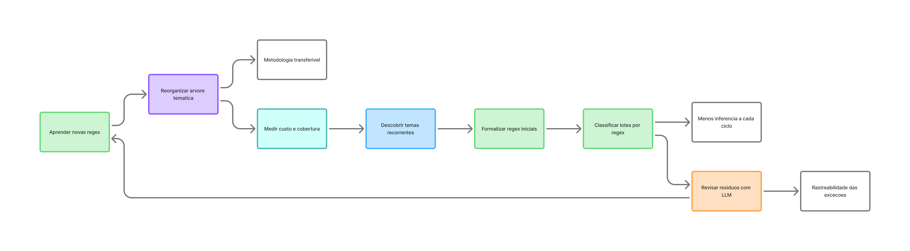
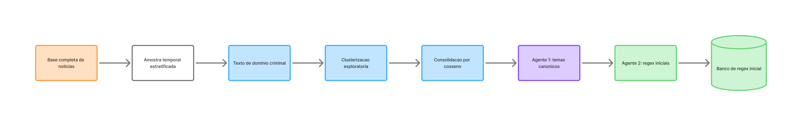
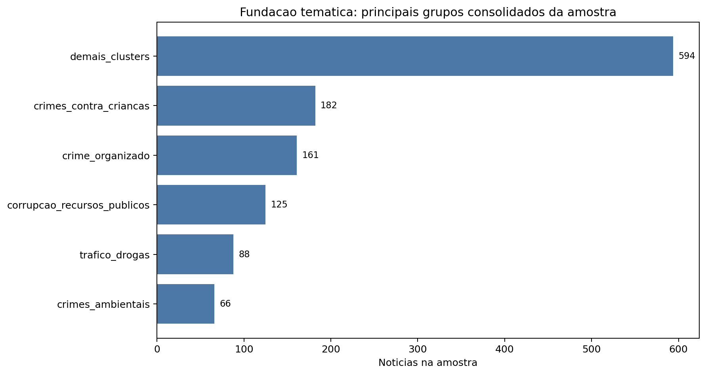
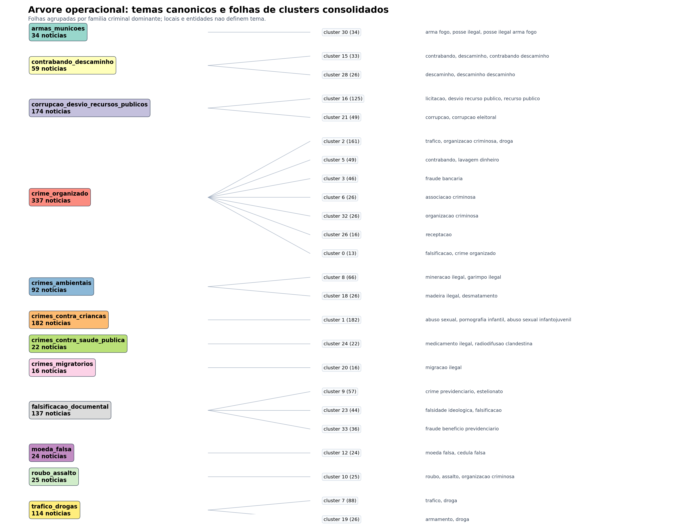
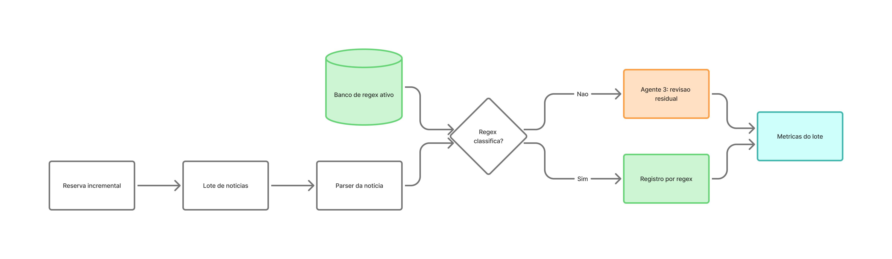
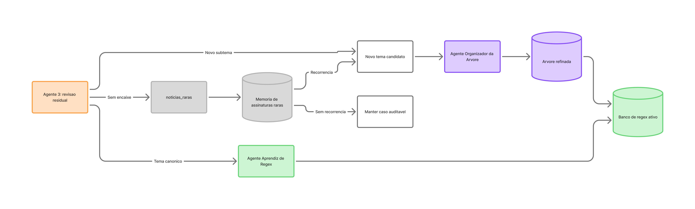
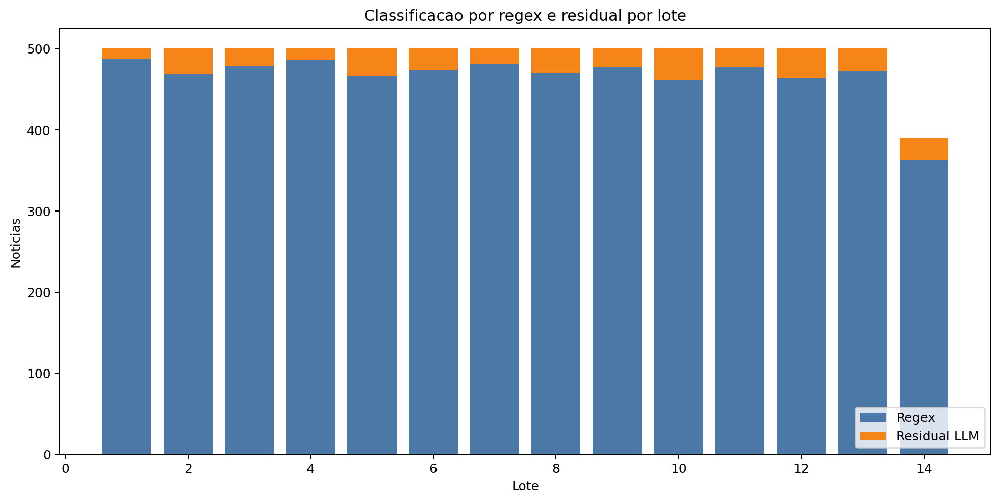
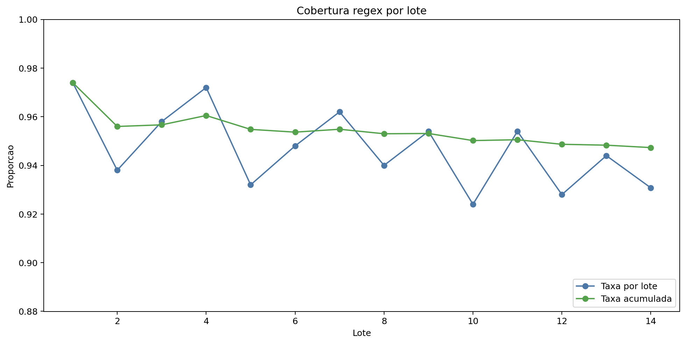
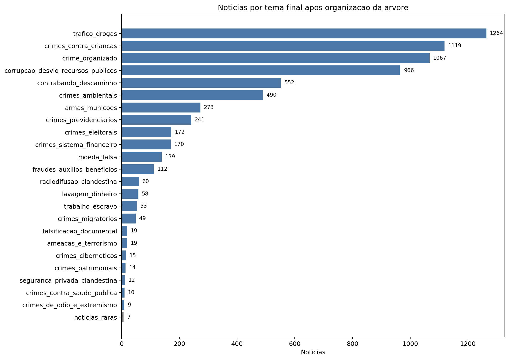

# NT PF

Metodologia incremental, autonoma e auditavel para classificar noticias publicas de operacoes da Policia Federal brasileira por temas criminais e modus operandi.

O projeto combina amostragem temporal, clusterizacao exploratoria, similaridade do cosseno, agentes de IA, geracao de regex, classificacao residual por LLM e reorganizacao periodica de uma arvore tematica. A ideia central e reduzir custo de inferencia: a LLM entra apenas quando o classificador regex nao consegue resolver a noticia.

## Conceito

A metodologia trata a classificacao como um ciclo fechado. Primeiro, uma amostra da base e usada para descobrir a fundacao tematica. Depois, os temas viram regex iniciais. A massa restante e processada em lotes: cada noticia passa por parser, regex e, se necessario, por revisao residual com LLM. Quando a LLM encontra um caso util, esse caso pode gerar aprendizado para o banco de regex ou virar candidato para reorganizacao da arvore.



A figura resume o comportamento incremental: descobrir temas, formalizar regras, classificar lotes, revisar residuos, aprender novas regras, reorganizar a arvore e medir custo/cobertura. O objetivo nao e apenas classificar uma base, mas construir um procedimento reutilizavel para bases textuais que crescem continuamente.

## Objetivo da classificacao

A classificacao busca identificar o dominio criminal ou o modus operandi principal da noticia. Ela nao deve transformar localidades, nomes de operacao, orgaos parceiros ou entidades ocasionais em temas finais.

Pontos de atencao:

- clusters podem refletir lugar ou forma textual, nao crime;
- regex muito especificas nao generalizam;
- regex muito amplas contaminam temas diferentes;
- nomes de operacao e localidades nao devem ser ancora principal;
- noticias raras precisam de memoria, mas nao devem virar tema definitivo sem recorrencia;
- candidatos novos devem ser comparados com todos os temas existentes antes de promocao.

## Fluxo metodologico

### 1. Ingestao e divisao da base

A base e dividida em duas partes:

- **fundacao tematica**: amostra temporal estratificada usada para descobrir temas e gerar regex iniciais;
- **reserva incremental**: restante da base, processado em lotes para medir cobertura regex, residuos e aprendizado.



Na rodada documentada, a base tinha 8.106 noticias. A fundacao usou 1.216 noticias, 15% do total, e a reserva incremental ficou com 6.890 noticias.

### 2. Texto de dominio, clusterizacao e similaridade

Antes da clusterizacao, o texto e reduzido para sinais de dominio criminal: titulo, subtitulo, tags, condutas, crimes, objetos ilicitos, modus operandi e trechos relevantes do corpo. Localidades, nomes proprios, nomes de operacao e termos administrativos tem peso reduzido.

A clusterizacao organiza a amostra inicial em folhas exploratorias. A metodologia e compativel com HDBSCAN; quando a densidade fica instavel, o pipeline registra fallback operacional. Em seguida, a similaridade do cosseno consolida clusters semanticamente proximos.



Na execucao documentada, foram gerados 34 clusters brutos e 24 clusters consolidados. Esses clusters nao sao a classificacao final; eles sao insumo para o Agente 1.

### 3. Agente 1: temas canonicos

O Agente 1 recebe os clusters consolidados e cria temas canonicos por crime ou modus operandi. Ele junta folhas do mesmo dominio criminal, separa subtemas quando necessario e impede que localidades ou entidades virem classes.



A figura mostra a arvore operacional: temas canonicos a esquerda, folhas de clusters no meio e termos dominantes a direita. O tema final e a agregacao analitica dessas folhas, nao o cluster isolado.

### 4. Agente 2: regex iniciais

O Agente 2 recebe os temas canonicos e as evidencias associadas a cada folha. Ele gera regex iniciais suficientes para cobrir a diversidade observada em cada tema. Nao ha limite artificial de regex por tema: a regra e ter ancora em crime, conduta ou modus operandi.

Na rodada documentada:

| Indicador | Valor |
|---|---:|
| Regex iniciais aceitas | 5.739 |
| Padroes iniciais ativos apos consolidacao | 5.146 |

### 5. Execucao incremental em lotes

Cada noticia da reserva incremental passa pelo parser e depois pelo classificador regex. Se a regex classifica acima do limiar, a decisao e registrada. Se falha, a noticia segue para o Agente 3.



Esse desenho e `regex-first`: o banco deterministico resolve o que ja foi aprendido, e a LLM revisa apenas excecoes.

### 6. Agente 3, aprendiz de regex e noticias raras

O Agente 3 revisa apenas residuos. Ele pode classificar em tema canonico existente, criar `novo_tema_candidato` ou marcar como `noticias_raras`. O Agente Aprendiz transforma evidencias residuais em regex candidatas. Noticias raras recebem assinatura e ficam em memoria; se a assinatura reaparece, volta ao ciclo como candidata.



Na execucao documentada, 51 regras foram aprendidas no ciclo residual. O banco final nao possui regex para `noticias_raras`; esse estado e tecnico, usado para memoria e auditoria.

### 7. Agente Organizador da Arvore

O Agente Organizador revisa globalmente os temas canonicos, candidatos, contagens, evidencias, regex aprendidas e sugestoes por similaridade. Sua funcao e impedir crescimento desordenado da taxonomia.

Ele decide se um candidato deve ser:

- absorvido por tema existente;
- consolidado em macrotema;
- promovido a novo tema canonico;
- mantido como raro;
- descartado como ruido.

## Resultados da rodada documentada

| Indicador | Valor |
|---|---:|
| Base total | 8.106 noticias |
| Fundacao tematica | 1.216 noticias |
| Reserva incremental | 6.890 noticias |
| Clusters consolidados | 24 |
| Temas canonicos iniciais | 17 |
| Regex iniciais aceitas | 5.739 |
| Lotes processados | 14 |
| Capturadas por regex | 6.527 |
| Residuais enviados a LLM | 363 |
| Taxa regex acumulada | 94,73% |
| Taxa residual LLM | 5,27% |
| Regras aprendidas | 51 |
| Noticias raras finais | 7 |



O grafico mostra que a maior parte das noticias foi resolvida por regex em todos os lotes, enquanto a LLM ficou concentrada nos residuos.



A taxa regex permaneceu acima de 92% em todos os lotes, sustentando a hipotese de reducao de custo de inferencia.



Os maiores temas finais foram `trafico_drogas`, `crimes_contra_criancas`, `crime_organizado` e `corrupcao_desvio_recursos_publicos`.

## Trabalhos relacionados

A metodologia se aproxima de linhas conhecidas, mas se diferencia pela integracao em ciclo operacional fechado.

| Linha | Semelhanca | Diferenca deste projeto | Links |
|---|---|---|---|
| Snorkel / data programming | Usa regras programaticas e supervisao fraca. | As regex permanecem como classificador deterministico operacional, nao apenas como fonte para treinar outro modelo. | [paper](https://arxiv.org/abs/1711.10160), [repo](https://github.com/snorkel-team/snorkel) |
| HDBSCAN | Usa clusterizacao exploratoria e deteccao de agrupamentos. | Clusters sao folhas de apoio, nao classes finais; agentes transformam folhas em temas canonicos. | [repo](https://github.com/scikit-learn-contrib/hdbscan) |
| BERTopic | Usa embeddings, clusters e termos representativos para topicos. | A descoberta de topicos vira banco de regex incremental e auditavel. | [paper](https://arxiv.org/abs/2203.05794), [repo](https://github.com/MaartenGr/BERTopic) |
| LLMs em weak supervision | Usa LLM como fonte de rotulagem. | A LLM atua apenas nos residuos e gera aprendizado reutilizavel. | [Language Models in the Loop](https://arxiv.org/abs/2205.02318) |
| LLMs gerando labeling functions | Automatiza criacao de funcoes de rotulagem. | A regex gerada passa por controle de dominio, validacao e organizacao da arvore. | [paper](https://arxiv.org/abs/2311.00739) |
| Taxonomia automatica com LLMs | Usa LLM para construir ou ajustar taxonomias. | A arvore afeta diretamente regex, residuos, noticias raras e metricas de custo. | [paper](https://www.mdpi.com/2673-4117/6/11/283) |
| Snowball / bootstrapping de padroes | Transforma evidencias em padroes reutilizaveis. | Aplica bootstrapping a classificacao tematica incremental com agentes e auditoria por lote. | [paper](https://www.microsoft.com/en-us/research/publication/snowball-extracting-relations-from-large-plain-text-collections/) |

## Como rodar

Use apenas:

```bat
rodar_sistema.bat
```

O script nao exige argumentos. Ele executa a geracao/sincronizacao da base, limpa artefatos anteriores, monta a fundacao, processa os lotes incrementais, roda reorganizacao da arvore, reavalia noticias raras e gera metricas/graficos/relatorios.

## Saidas principais

Os resultados de execucao ficam em:

```text
data/analise_qualitativa/incremental/
```

Principais artefatos:

- `documentos_base.jsonl`: base estruturada usada na execucao;
- `amostra_inicial.csv`: amostra temporal da fundacao;
- `reserva_incremental.csv`: massa processada em lotes;
- `resumo_clusters_amostra.csv`: resumo dos clusters da amostra;
- `temas_canonicos_agent1.json`: temas iniciais do Agente 1;
- `regex_iniciais_agent2.json`: regex iniciais propostas;
- `regex_classifier_rules.json`: banco ativo de regex;
- `metrics_batches.csv`: metricas por lote;
- `events.jsonl`: trilha completa de eventos;
- `temas_candidatos_agent3.jsonl`: candidatos criados no residual;
- `arvore_temas_agent1_refinada.json`: arvore refinada;
- `noticias_raras_observacoes.jsonl`: memoria incremental de noticias raras;
- `classificacoes_incrementais_pos_quarentena.csv`: saida final consolidada.

O artigo metodologico completo esta em:

```text
artigo/TD_clusterizacao_noticias_pf.md
```

## Estrutura principal

```text
NT_PF/
|-- rodar_sistema.bat
|-- rodar_sistema.py
|-- artigo/
|   |-- TD_clusterizacao_noticias_pf.md
|   `-- media/
|-- data/
|   |-- reference/
|   `-- analise_qualitativa/
|-- scripts/
|   |-- incremental/
|   |-- agentes/
|   |-- schemas/
|   `-- tools/
|-- pyproject.toml
`-- uv.lock
```

## Configuracao LLM

Para usar OpenAI, preencha o `.env`:

```text
PF_LLM_PROVIDER=openai
PF_OPENAI_API_KEY=sua_chave_openai_aqui
PF_OPENAI_MODEL=gpt-4.1-mini
```

Fallback local:

```text
PF_LLM_PROVIDER=ollama
PF_OLLAMA_MODEL=llama3.2
PF_OLLAMA_BASE_URL=http://localhost:11434
```

## Dependencias

O ambiente usa `uv` e Python `>=3.12,<3.14`.

As dependencias dos agentes LangChain ficam no grupo opcional `agents`, declarado no `pyproject.toml`.
