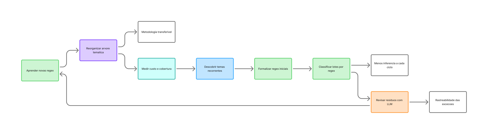

# NT PF

Metodologia incremental, autonoma e auditavel para clusterizar, organizar e classificar grandes volumes de textos. O estudo de caso atual usa noticias publicas de operacoes da Policia Federal brasileira.

O projeto combina amostragem temporal, clusterizacao exploratoria, similaridade do cosseno, agentes de IA, discriminadores canonicos auditaveis, memoria associativa WNN, revisao residual por LLM e reorganizacao periodica da arvore tematica. A ideia central e reduzir custo de inferencia: a LLM entra apenas quando a camada WNN nao consegue resolver o documento com seguranca.

## 1. Introducao

A metodologia trata a clusterizacao e a classificacao como um ciclo fechado. Primeiro, uma amostra da base e usada para descobrir a fundacao tematica. Depois, os temas viram discriminadores canonicos que alimentam uma memoria WNN. A massa restante e processada em lotes: cada documento passa por parser, preprocessamento linguistico, WNN e, se necessario, revisao residual com LLM. Quando a LLM encontra um caso util, esse caso pode gerar novos discriminadores ou virar candidato para reorganizacao da arvore.



## 2. Objetivo da classificacao

A classificacao busca identificar o tema substantivo principal do documento. Na aplicacao com noticias da Policia Federal, esse tema e o dominio criminal ou o modus operandi principal. Ela nao deve transformar localidades, nomes de operacao, orgaos parceiros ou entidades ocasionais em temas finais.

Pontos de atencao:

- clusters podem refletir lugar ou forma textual, nao o tema substantivo desejado;
- discriminadores muito estreitos nao generalizam;
- discriminadores amplos demais contaminam temas diferentes;
- nomes de operacao e localidades nao devem ser ancora principal;
- documentos raros precisam de memoria, mas nao devem virar tema definitivo sem recorrencia;
- candidatos novos devem ser comparados com todos os temas existentes antes de promocao.

## 3. Estudo de caso: noticias da Policia Federal

A aplicacao pratica usa noticias publicas de operacoes da Policia Federal brasileira. Essa base foi escolhida por representar um dominio textual real, volumoso e heterogeneo, com linguagem institucional, termos especializados, localidades, nomes de operacao, orgaos parceiros e atualizacao temporal.

No estudo de caso, a classificacao busca identificar o dominio criminal ou o modus operandi principal da noticia. Localidades, nomes de operacao e entidades ocasionais sao preservados para auditoria, mas nao devem virar temas finais.

## 4. Metodologia incremental proposta

### 4.1 Ingestao e divisao da base

A base e dividida em duas partes:

- **fundacao tematica**: amostra temporal estratificada usada para descobrir temas e gerar discriminadores iniciais;
- **reserva incremental**: restante da base, processado em lotes para medir cobertura WNN, residuos e aprendizado.

### 4.2 Texto de dominio, clusterizacao e similaridade

Antes da clusterizacao, o texto e reduzido para sinais substantivos do dominio. Na aplicacao com noticias da Policia Federal, isso significa priorizar substantivos, verbos, adjetivos, termos de crime e termos de modus operandi presentes no corpo textual. Localidades, nomes proprios, nomes de operacao e termos administrativos tem peso reduzido.

A clusterizacao organiza a amostra inicial em folhas exploratorias. A metodologia e compativel com HDBSCAN; quando a densidade fica instavel, o pipeline registra fallback operacional. Em seguida, a similaridade do cosseno consolida clusters semanticamente proximos.

### 4.3 Agente 1: temas canonicos

O Agente 1 recebe os clusters consolidados e cria temas canonicos pelo atributo substantivo do dominio. Na aplicacao da Policia Federal, isso significa crime ou modus operandi. Ele junta folhas do mesmo dominio tematico, separa subtemas quando necessario e impede que localidades ou entidades virem classes.

### 4.4 Agente 2: discriminadores WNN

O Agente 2 recebe os temas canonicos e as evidencias associadas a cada folha. Ele gera discriminadores canonicos auditaveis para alimentar a memoria WNN. Esses discriminadores sao pequenos conjuntos de marcadores lexicais do micromundo do tema, sem dependencia de ordem, e hoje cobrem tanto `crime` quanto `modus_operandi`.

Os artefatos principais dessa etapa sao:

- `temas_canonicos_agent1.json`
- `agente2_result.json`
- `wnn_feature_bank.json`

### 4.5 Execucao incremental em lotes

Cada documento da reserva incremental passa pelo parser, preprocessamento linguistico e classificacao WNN. Quando a WNN atinge confianca e margem suficientes, a decisao e registrada. Quando a WNN se abstem ou identifica um caso composto/ambiguo, o documento segue para o Agente 3.

### 4.6 Agente 3 e aprendizado residual

O Agente 3 revisa apenas residuos. Ele pode:

- classificar em tema canonico existente;
- registrar `novo_tema_candidato`;
- marcar como `noticias_raras`.

Quando houver evidencia suficiente, a decisao residual e convertida em novos discriminadores WNN para `crime` e/ou `modus_operandi`. Noticias raras recebem assinatura e ficam em memoria; se a assinatura reaparece, volta ao ciclo como candidata.

### 4.7 Agente Organizador da Arvore

O Agente Organizador revisa globalmente os temas canonicos, candidatos, contagens, evidencias, discriminadores aprendidos e sugestoes por similaridade. Sua funcao e impedir crescimento desordenado da taxonomia.

Ele decide se um candidato deve ser:

- absorvido por tema existente;
- consolidado em macrotema;
- promovido a novo tema canonico;
- mantido como raro;
- descartado como ruido.

## 5. Como rodar

Use:

```bat
rodar_sistema.bat
```

O script executa a geracao/sincronizacao da base, limpa artefatos anteriores, monta a fundacao, processa os lotes incrementais, roda reorganizacao da arvore, reavalia noticias raras e gera metricas, graficos e relatorios.

Configuracao padrao atual:

- `PF_SKIP_SYNC=false`: sincroniza a base antes da execucao.
- `PF_SAMPLE_FRACTION=0.10`: fundacao tematica com 10% da base.
- `PF_BATCH_SIZE=500`: processamento incremental em lotes de 500 noticias.
- `PF_THEME_TREE_REVIEW_INTERVAL_BATCHES=1`: revisao da arvore ao final de cada lote.
- `PF_WNN_ENABLED=true`: ativa a camada WNN.
- `PF_WNN_CONFIDENCE_THRESHOLD=0.50`: limiar de aceitacao da WNN.
- `PF_WNN_MARGIN_THRESHOLD=0.12`: margem minima entre o melhor e o segundo melhor tema.
- `PF_WNN_MIN_ACTIVE_DISCRIMINATORS=2`: minimo de discriminadores ativos para aceitacao.
- `PF_WNN_MAX_DISCRIMINATORS_PER_THEME=35`: limita o banco de discriminadores por tema.

## 6. Saidas principais

Os resultados de execucao ficam em:

```text
data/analise_qualitativa/incremental/
```

Principais artefatos:

- `documentos_base.jsonl`: base estruturada usada na execucao;
- `amostra_inicial.csv`: amostra temporal da fundacao;
- `reserva_incremental.csv`: massa processada em lotes;
- `resumo_clusters_amostra.csv`: resumo dos clusters da amostra;
- `temas_canonicos_agent1.json`: temas iniciais do Agente 1;
- `wnn_feature_bank.json`: banco ativo de discriminadores e memoria WNN;
- `metrics_batches.csv`: metricas por lote;
- `resumo_custo_tokens.json` e `resumo_custo_tokens.md`: consumo de tokens por chamadas LLM residuais;
- `events.jsonl`: trilha completa de eventos;
- `temas_candidatos_agent3.jsonl`: candidatos criados no residual;
- `arvore_temas_agent1_refinada.json`: arvore refinada;
- `noticias_raras_observacoes.jsonl`: memoria incremental de noticias raras;
- `classificacoes_incrementais_pos_quarentena.csv`: saida final consolidada.

Campos de custo por LLM:

- `prompt_tokens_total`: tokens enviados ao modelo no lote;
- `completion_tokens_total`: tokens retornados pelo modelo no lote;
- `tokens_total`: soma de prompt e resposta no lote;
- `avg_tokens_per_llm`: media de tokens por noticia residual revisada;
- `events.jsonl.tokens`: consumo individual por residual.

O artigo metodologico completo esta em:

```text
artigo/TD_clusterizacao_noticias_pf.md
```

## 7. Estrutura principal

```text
NT_PF/
|-- rodar_sistema.bat
|-- rodar_sistema.py
|-- artigo/
|   |-- TD_clusterizacao_noticias_pf.md
|   `-- media/
|-- data/
|   |-- reference/
|   `-- analise_qualitativa/
|-- scripts/
|   |-- incremental/
|   |-- agentes/
|   |-- schemas/
|   `-- tools/
|-- pyproject.toml
`-- uv.lock
```

Scripts centrais da execucao atual:

- `rodar_sistema.py`: orquestra sincronizacao, fundacao, lotes, arvore, reavaliacao e relatorios.
- `scripts/pf_operacoes_pipeline.py`: sincroniza e materializa a base de noticias da PF.
- `scripts/incremental/run_all_incremental.py`: executa a metodologia incremental ponta a ponta.
- `scripts/incremental/amostragem.py`: cria amostra inicial e reserva incremental.
- `scripts/incremental/clusterizacao_inicial.py`: gera clusters exploratorios da fundacao.
- `scripts/incremental/agente1_temas.py`: consolida temas canonicos.
- `scripts/incremental/agente2_discriminadores.py`: gera discriminadores iniciais para a WNN.
- `scripts/incremental/processar_lotes.py`: roda a classificacao incremental por lotes.
- `scripts/agentes/agente3_residual.py`: revisa residuos e produz aprendizado.
- `scripts/agentes/agente_organizador_arvore.py`: reorganiza a arvore tematica.
- `scripts/incremental/dashboard_dash.py`: painel operacional em Dash.

## 8. Configuracao LLM

Para usar OpenAI, preencha o `.env`:

```text
PF_LLM_PROVIDER=openai
PF_OPENAI_API_KEY=sua_chave_openai_aqui
PF_OPENAI_MODEL=gpt-4.1-mini
```

Fallback local:

```text
PF_LLM_PROVIDER=ollama
PF_OLLAMA_MODEL=llama3.2
PF_OLLAMA_BASE_URL=http://localhost:11434
```
