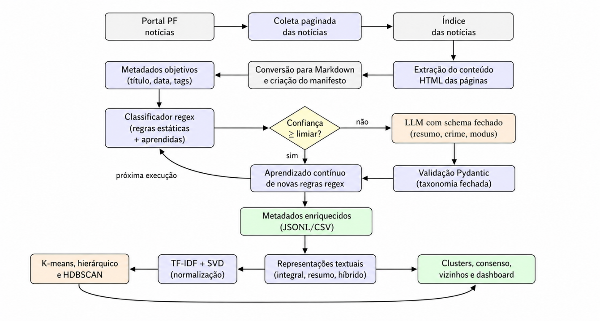
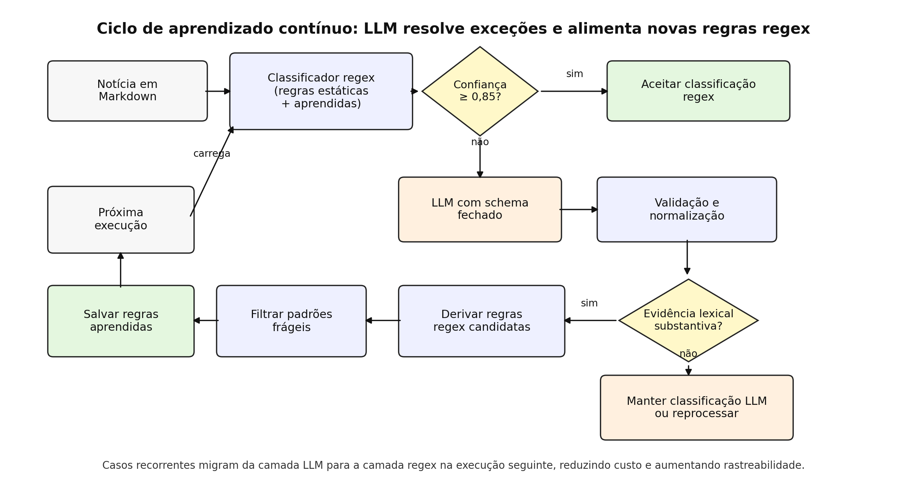
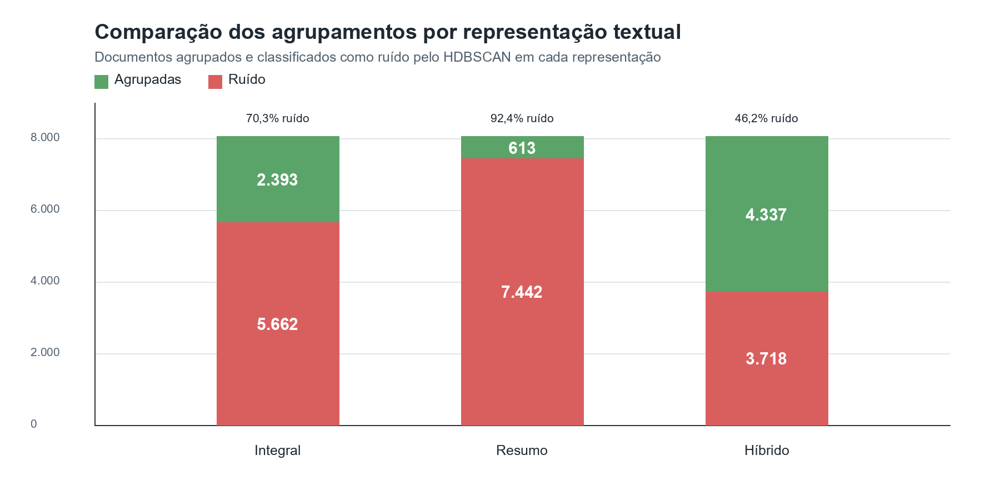
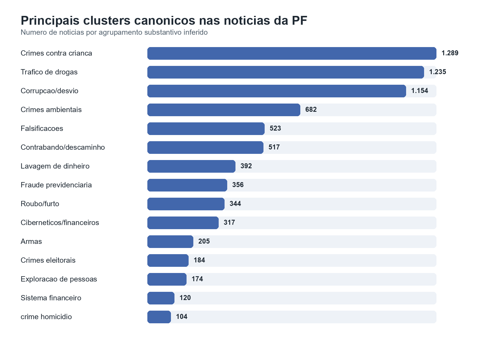
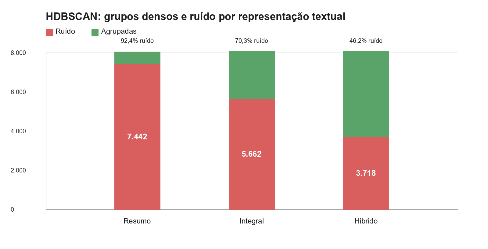

**NOTÍCIAS DA POLÍCIA FEDERAL COMO BASE PARA MAPEAR PRIORIDADES DE ATUAÇÃO: CLASSIFICAÇÃO HÍBRIDA, CLUSTERIZAÇÃO SEMÂNTICA E APRENDIZADO CONTÍNUO**

Texto para Discussão - versão preliminar

Projeto NT PF

# SINOPSE

Este Texto para Discussão apresenta uma metodologia computacional para transformar notícias públicas sobre operações da Polícia Federal em uma base analítica estruturada. A contribuição central é uma arquitetura híbrida que não entrega a classificação integralmente a modelos de linguagem: regras regex auditáveis resolvem primeiro os casos de alta confiança; a LLM é acionada apenas em casos não cobertos ou ambíguos; e as inferências da LLM alimentam um ciclo de aprendizado contínuo que amplia a cobertura das regras em execuções futuras. A aplicação sobre 8.048 arquivos Markdown e 8.055 notícias no corpus analítico indica que 7.891 notícias foram resolvidas por regex e 164 por LLM, preservando interoperabilidade e reduzindo custo computacional. O estudo também gera clusters canônicos, séries anuais e visualizações que ajudam a responder em que frentes de atuação a PF aparece de forma mais recorrente nas notícias publicadas.

Palavras-chave: Polícia Federal; notícias públicas; modelos de linguagem; regras regex; clusterização semântica; aprendizado contínuo; mineração de texto; políticas públicas.

# ABSTRACT

This discussion paper presents a computational methodology to transform public news about Brazilian Federal Police operations into a structured analytical dataset. Its main contribution is a hybrid architecture that does not delegate classification entirely to large language models: auditable regular-expression rules first classify high-confidence cases; the LLM is called only for ambiguous or uncovered cases; and LLM inferences feed a continuous learning loop that expands rule coverage in future runs. Applied to 8,048 markdown files and 8,055 news items in the analytical corpus, the method classified 7,891 news items through regex and 164 through the LLM, preserving interpretability and reducing computational cost. The study also produces canonical clusters, annual series and visualizations that help assess which areas of Federal Police activity are most visible in institutional news.

Keywords: Federal Police; public news; large language models; regular expressions; semantic clustering; continuous learning; text mining; public policy.

# 1 INTRODUÇÃO

Bases textuais públicas têm se tornado fontes relevantes para análise de políticas públicas, comunicação institucional e padrões de atuação estatal. No campo da segurança pública, notícias oficiais publicadas por órgãos governamentais registram operações, apreensões, mandados, prisões, cooperação interinstitucional e diferentes tipos de crimes investigados. Embora esses textos não substituam bases administrativas, inquéritos ou registros operacionais internos, eles formam um repositório público contínuo da atuação comunicada pelas instituições.

No caso da Polícia Federal (PF), o portal institucional reúne milhares de notícias distribuídas ao longo de vários anos, cobrindo temas como tráfico de drogas, crimes ambientais, corrupção, fraudes previdenciárias, crimes cibernéticos, contrabando e exploração sexual infantil. Esse conjunto textual permite observar padrões de recorrência temática, mudanças de visibilidade ao longo do tempo e relações entre categorias de crime, atores institucionais e territórios de atuação.

O uso analítico desse tipo de base, entretanto, apresenta desafios metodológicos importantes. As notícias possuem formatos heterogêneos, diferentes níveis de detalhamento e estilos variados de redação. Algumas apresentam tags informativas e vocabulário altamente padronizado; outras dependem do corpo textual para explicitar o tipo de crime investigado, o modus operandi ou os atores envolvidos. Além disso, o volume crescente de documentos dificulta abordagens puramente manuais de classificação e organização.

Uma alternativa seria utilizar modelos de linguagem de grande escala (Large Language Models – LLMs) para classificar automaticamente todas as notícias. Apesar da flexibilidade semântica desses modelos, abordagens integralmente baseadas em LLM tendem a elevar custo computacional, reduzir rastreabilidade e dificultar a reprodutibilidade dos resultados. Em aplicações relacionadas a políticas públicas e bases institucionais, esses aspectos são particularmente relevantes, pois classificações precisam ser auditáveis, reprocessáveis e comparáveis ao longo do tempo.

Este Texto para Discussão propõe uma arquitetura híbrida para classificação e organização de notícias da Polícia Federal. A metodologia combina regras regex auditáveis, acionadas como primeira camada de decisão, com modelos de linguagem utilizados apenas em casos ambíguos ou não cobertos pelas regras determinísticas. Além disso, as inferências produzidas pela LLM podem alimentar um mecanismo incremental de aprendizado contínuo, permitindo ampliar a cobertura das regras em execuções futuras.

A proposta busca responder a duas questões principais. A primeira é metodológica: como incorporar LLMs em pipelines de classificação textual sem transformar toda a decisão em um processo exclusivamente probabilístico e pouco auditável? A segunda é substantiva: o conjunto de notícias públicas da Polícia Federal permite identificar padrões recorrentes da atuação institucional comunicada ao público?

A aplicação empírica utilizou um corpus composto por 8.055 notícias estruturadas a partir de arquivos Markdown extraídos do portal institucional da PF. A arquitetura híbrida permitiu resolver a maior parte das classificações por meio de regras determinísticas, reduzindo substancialmente a necessidade de chamadas a modelos de linguagem. Além da classificação temática, o trabalho também produz clusters semânticos, séries temporais anuais e agrupamentos canônicos voltados à análise exploratória da comunicação institucional da Polícia Federal.

O objetivo do trabalho não é estimar diretamente incidência criminal, produtividade policial ou esforço operacional da instituição. A unidade de análise é a notícia publicada, entendida como manifestação da atuação publicizada da PF. Ainda assim, a sistematização desse corpus cria uma base empírica relevante para estudos sobre comunicação institucional, segurança pública, governança algorítmica e métodos híbridos de classificação textual aplicados ao setor público.

# 2 TRABALHOS RELACIONADOS

A literatura recente sobre classificação textual tem destacado o uso de modelos de linguagem de grande escala em tarefas com poucas amostras rotuladas, taxonomias extensas e categorias abertas. Esses modelos são capazes de interpretar textos heterogêneos, reconhecer relações semânticas e produzir classificações mesmo quando o vocabulário dos documentos varia substancialmente. Essa flexibilidade tem estimulado seu uso em tarefas de anotação, triagem documental, classificação temática e extração de informação em larga escala.

Estudos como o de Gilardi, Alizadeh e Kubli (2023) indicam que modelos de linguagem podem atuar como anotadores competitivos em certas tarefas de ciências sociais. De modo semelhante, Crowl et al. (2025) demonstram o uso de LLMs para mensurar conteúdo jornalístico em grande escala, analisando críticas à polícia em notícias locais. Esses trabalhos reforçam o potencial dos modelos de linguagem como instrumentos de classificação textual, especialmente quando o volume documental torna inviável a leitura manual integral.

Outra vertente relevante é a classificação textual em contexto aberto. O trabalho de Zitei, Sakiyama e Marcacini (2025), *Open-World Text Classification by Combining Weak Models and Large Language Models*, é particularmente próximo desta pesquisa. Os autores propõem combinar um modelo fraco, baseado em vizinhos mais próximos, com uma LLM. O modelo fraco reduz o espaço decisório ao selecionar as classes mais prováveis, e a LLM atua posteriormente como decisora final entre essas alternativas. A estratégia busca reduzir custo, limitar o tamanho do prompt e tornar viável a classificação quando há grande número de classes candidatas.

Este Texto para Discussão dialoga com essa literatura, mas desloca o papel atribuído à LLM. Em vez de utilizar um modelo auxiliar apenas para restringir o conjunto de classes antes da decisão final do modelo de linguagem, a metodologia proposta utiliza regras determinísticas e auditáveis como primeira camada de classificação. Casos resolvidos com alta confiança são aceitos sem chamada à LLM; apenas documentos ambíguos ou não cobertos pelas regras são encaminhados ao modelo. Assim, a redução de custo não decorre apenas da diminuição do espaço de classes apresentado à LLM, mas da prevenção estrutural de chamadas ao modelo em grande parte do corpus.

O mecanismo de aprendizado contínuo por regras também se aproxima da literatura de supervisão fraca programática. Em data programming, Ratner et al. (2016) propõem que heurísticas, regras e funções de rotulagem sejam usadas para produzir sinais supervisionados de baixo custo, posteriormente depurados para treinar classificadores. O sistema Snorkel, de Ratner et al. (2017), operacionaliza essa lógica ao combinar diferentes fontes fracas de supervisão por meio de labeling functions. Trabalhos mais recentes incorporam modelos de linguagem a esse ciclo. Smith et al. (2022) tratam prompts de modelos de linguagem como labeling functions dentro de um arcabouço de weak supervision, enquanto Li, Zhang e Wang (2024) exploram LLMs para gerar labeling functions, incluindo funções baseadas em palavras-chave, estatísticas e expressões regulares. O ALCHEmist, de Huang et al. (2024), é ainda mais próximo da motivação de custo: em vez de consultar a LLM para rotular repetidamente cada instância, propõe usar o modelo para gerar programas de rotulagem armazenáveis, reutilizáveis e executáveis localmente. A estratégia deste TD dialoga diretamente com essa linha, mas com uma diferença operacional: a LLM não é usada para produzir apenas rótulos fracos ou treinar um classificador posterior; suas inferências validadas geram regras regex candidatas que entram na próxima execução da própria pipeline, reduzindo chamadas futuras ao modelo e preservando auditabilidade.

A literatura sobre representação semântica e clusterização textual também fundamenta este trabalho. Métodos como Sentence-BERT, BERTopic e Top2Vec demonstram a utilidade de embeddings e representações vetoriais para aproximar documentos por similaridade semântica. Técnicas como K-means, agrupamento hierárquico e HDBSCAN são frequentemente utilizadas para identificar padrões latentes em coleções textuais, seja para modelagem de tópicos, exploração documental ou detecção de agrupamentos densos. Trabalhos recentes também exploram o uso de modelos de linguagem em tarefas de agrupamento com poucas amostras, como em Zhang et al. (2024), reforçando o interesse metodológico por combinações entre representação semântica, clusterização e inferência assistida por modelos.

Neste TD, a clusterização semântica é tratada como instrumento exploratório, e não como substituto da classificação substantiva. Essa distinção é importante. Clusters podem revelar proximidades temáticas, vizinhanças documentais e subgrupos relevantes, mas não equivalem automaticamente a categorias jurídicas ou administrativas. Por isso, o trabalho separa três camadas analíticas: a classificação temática híbrida, os agrupamentos exploratórios e os clusters canônicos usados para síntese substantiva.

Também são relevantes os estudos sobre consenso em clusterização, como Monti et al. (2003), que propõem avaliar a estabilidade de agrupamentos a partir de múltiplas especificações. A ideia de consenso é incorporada aqui como mecanismo diagnóstico: pares de notícias que permanecem próximos em diferentes representações textuais e algoritmos indicam maior estabilidade semântica. Esse procedimento ajuda a distinguir agrupamentos robustos de resultados sensíveis a parâmetros ou escolhas de representação.

A contribuição deste trabalho, portanto, está na combinação dessas três linhas: classificação textual com LLMs, clusterização semântica e governança de pipelines computacionais aplicados a bases públicas. O objetivo não é apenas demonstrar que uma LLM pode classificar notícias, mas propor uma arquitetura em que o modelo de linguagem tenha uso seletivo, controlado e auditável. Essa opção metodológica permite explorar a capacidade semântica dos modelos sem transformar toda a pipeline em uma caixa-preta probabilística.

No caso analisado, essa arquitetura é aplicada a um corpus real de notícias públicas da Polícia Federal, com heterogeneidade textual, categorias recorrentes e necessidade de interpretação cuidadosa dos resultados. A abordagem busca, assim, contribuir tanto para a literatura metodológica sobre uso controlado de LLMs quanto para estudos aplicados sobre comunicação institucional, segurança pública e produção de indicadores a partir de fontes textuais públicas.

# 3 DADOS E REPRESENTATIVIDADE

O corpus analisado é formado por notícias públicas de operações e ações da Polícia Federal publicadas em seu portal institucional. A coleta teve como objetivo transformar esse conjunto textual disperso em uma base estruturada, preservando informações como título, subtítulo, data de publicação, data de atualização, tags, localidade, corpo da notícia e referência ao arquivo original.

A execução analisada neste TD consolidou 8.048 arquivos Markdown processados na etapa de metadados e 8.055 notícias no corpus analítico enriquecido. A diferença decorre do controle incremental e da consolidação posterior de registros da base analítica. As datas identificadas nos metadados processados vão de 29/11/2011 a 08/05/2026. Como a série de 2026 não corresponde necessariamente a um ano fechado, suas frequências devem ser lidas como retrato parcial do período coletado.

A unidade de análise deste trabalho é a notícia publicada. Essa definição é metodologicamente importante, pois uma notícia não corresponde necessariamente a uma operação policial única. Uma mesma operação pode gerar várias publicações, em diferentes fases ou localidades, e uma única notícia pode reunir mais de um tipo de crime, órgão participante ou ação operacional. Portanto, as frequências apresentadas ao longo do texto devem ser interpretadas como frequências de notícias, e não como número de operações, inquéritos, mandados ou ocorrências criminais.

O corpus analítico final contém 8.055 notícias estruturadas a partir dos arquivos coletados. Cada registro foi enriquecido com metadados extraídos do texto e com campos produzidos pela pipeline de classificação, incluindo categorias temáticas, crimes mais presentes, modus operandi, fonte da classificação e agrupamentos semânticos. Essa organização permite combinar leitura quantitativa, exploração semântica e análise qualitativa orientada por evidências textuais.

A principal vantagem da base é permitir a observação sistemática da atuação publicizada da Polícia Federal. As notícias indicam quais temas, territórios, operações e tipos de crime aparecem com maior frequência na comunicação institucional. Nesse sentido, o corpus é adequado para analisar visibilidade pública, recorrência temática, mudanças na agenda comunicada e padrões de apresentação da atuação policial ao longo do tempo.

Essa interpretação, contudo, exige cautela. A base não mede diretamente a incidência real dos crimes investigados, a produtividade policial, o orçamento mobilizado, o efetivo empregado ou o esforço operacional total da instituição. A frequência de notícias pode ser influenciada por critérios de comunicação, relevância jornalística, campanhas institucionais, padronização de notas, operações de maior visibilidade ou mudanças editoriais no portal.

Assim, a base permite responder com segurança a perguntas sobre a comunicação pública da atuação da PF, mas não substitui bases administrativas ou operacionais. Para inferir prioridade institucional em sentido mais forte, seria necessário cruzar os resultados com outros dados, como registros de operações, mandados, apreensões, inquéritos, recursos orçamentários, efetivo mobilizado ou relatórios de gestão.

## 3.1 Comparação com inquéritos e tipos penais

Um exercício preliminar de comparação com a distribuição temática de inquéritos e tipos penais da Polícia Federal reforça essa leitura cautelosa. Como as duas fontes possuem unidades de análise diferentes, a comparação não deve ser interpretada como equivalência direta entre notícias e inquéritos. Ainda assim, a aproximação entre os grandes eixos temáticos é relevante para avaliar a representatividade substantiva do corpus de notícias. Temas como tráfico de drogas, corrupção e desvios de recursos públicos, crimes contra crianças, falsificações, contrabando, lavagem de dinheiro, crimes ambientais e fraudes previdenciárias aparecem com destaque nas duas bases. Essa convergência sugere que a comunicação pública da PF não constitui uma narrativa completamente dissociada da prática investigativa registrada em bases administrativas.

*Quadro 1 — Comparação exploratória entre temas de inquéritos e notícias da PF.*

| Tema | Inquéritos/tipos penais PF | % da base de inquéritos | Notícias/operações PF | % das notícias |
| --- | ---: | ---: | ---: | ---: |
| Crimes contra criança | 1.720 | 10,5% | 1.289 | 17,0% |
| Tráfico de drogas | 1.469 | 9,0% | 1.235 | 16,3% |
| Corrupção/desvio/fraudes públicas | 4.070 | 24,9% | 1.154 | 15,2% |
| Crimes ambientais | 294 | 1,8% | 682 | 9,0% |
| Falsificações/documentos | 2.296 | 14,0% | 523 | 6,9% |
| Contrabando/descaminho | 876 | 5,4% | 517 | 6,8% |
| Lavagem de dinheiro | 780 | 4,8% | 392 | 5,2% |
| Fraude previdenciária | 1.268 | 7,8% | 356 | 4,7% |
| Roubo/furto/fraudes eletrônicas | 378 | 2,3% | 344 | 4,5% |
| Crimes cibernéticos/financeiros | 2.242 | 13,7% | 317 | 4,2% |
| Armas | ~0-baixo | ~0% | 205 | 2,7% |
| Crimes eleitorais | ~0-baixo | ~0% | 184 | 2,4% |
| Exploração de pessoas/migração ilegal | 182 | 1,1% | 174 | 2,3% |
| Sistema financeiro | 1.772 | 10,8% | 120 | 1,6% |
| Homicídios | residual | residual | 104 | 1,4% |

Fonte: Elaboração própria, a partir da base de notícias classificada pela pipeline e de agregação temática de inquéritos/tipos penais da PF.

Nota: as categorias foram compatibilizadas de forma exploratória. As bases diferem quanto à unidade de análise, granularidade jurídica e possibilidade de sobreposição temática.

O Quadro 1 indica convergência nos temas de maior saliência, mas também revela distorções esperadas em uma fonte comunicacional. Crimes contra crianças e crimes ambientais aparecem proporcionalmente mais nas notícias do que nos inquéritos/tipos penais, possivelmente por combinarem alta legitimidade pública, forte apelo simbólico e narrativas mais facilmente comunicáveis. Em sentido inverso, crimes financeiros complexos, falsificações documentais, crimes contra o sistema financeiro e parte das fraudes aparecem com peso maior na base de inquéritos do que na comunicação institucional. Isso sugere que uma parcela importante do trabalho cotidiano da PF é menos visível publicamente, sobretudo quando envolve investigações abstratas, técnicas ou de menor apelo imagético.

A contribuição empírica deste corpus está justamente em abrir uma camada intermediária de análise: ele não representa o universo completo da atividade policial, mas transforma uma fonte pública, dispersa e pouco estruturada em uma base analítica auditável. Com isso, torna-se possível identificar padrões de visibilidade, formular hipóteses sobre prioridades comunicadas e selecionar casos para investigações qualitativas ou cruzamentos com dados administrativos.

# 4 METODOLOGIA

A metodologia foi organizada para transformar notícias públicas da Polícia Federal em uma base analítica estruturada, combinando extração textual, classificação temática, clusterização semântica e consolidação de artefatos para análise. Conforme ilustrado na Figura 1, a pipeline foi desenhada com dois princípios centrais: preservar rastreabilidade das decisões classificatórias e reduzir o uso de modelos de linguagem aos casos em que regras determinísticas não fossem suficientes.



*Figura 1 — Fluxo de dados da pipeline de extração, classificação e clusterização.*

*Fonte: Elaboração própria.*

O fluxo geral compreende quatro etapas principais. Primeiro, as páginas de notícias são convertidas para arquivos Markdown, preservando título, subtítulo, data de publicação, data de atualização, tags, localidade e corpo textual. Em seguida, esses arquivos passam por uma etapa de extração de metadados e classificação híbrida. Na terceira etapa, os textos classificados são transformados em representações vetoriais para clusterização e análise de vizinhança semântica. Por fim, os resultados são consolidados em tabelas, séries anuais, clusters canônicos e arquivos auxiliares para análise substantiva. Os detalhes de cada etapa são tratados nas subseções seguintes, de modo a separar preparação textual, classificação, exemplos auditáveis, clusterização, consenso, validação e consolidação dos artefatos.

## 4.1 Extração e estruturação dos textos

A primeira etapa consistiu na organização das notícias em arquivos Markdown. Essa escolha permitiu preservar a estrutura textual de cada publicação de forma legível e reprocessável. Cada arquivo manteve os principais elementos da notícia original, como título, subtítulo, data, tags, localidade e corpo da matéria.

A partir desses arquivos, foram extraídos campos objetivos, sem uso de LLM, incluindo data de publicação, título, subtítulo, unidade federativa, município quando disponível, tags e referência ao arquivo de origem. Essa separação entre metadados objetivos e inferências classificatórias é importante porque evita que informações diretamente disponíveis no texto sejam reconstruídas de forma probabilística.

Os critérios de inclusão foram: presença de arquivo Markdown legível, existência de texto principal suficiente para classificação e identificação mínima de título ou referência de origem. Registros vazios, incompletos ou sem corpo textual utilizável devem ser preservados como ocorrência de controle, mas não entram na análise substantiva principal. O processamento incremental utiliza o campo `arquivo_markdown` como chave operacional, evitando que notícias com títulos repetidos sejam indevidamente sobrescritas. A deduplicação substantiva entre notícias e operações ainda é tratada como limitação, pois uma mesma operação pode gerar diferentes publicações.

Os arquivos Markdown também funcionam como base de auditoria. Sempre que uma notícia é classificada por regra ou por LLM, é possível retornar ao texto original para verificar a evidência textual que sustentou a decisão. Por isso, os exemplos completos de Markdown devem ser mantidos como material suplementar, e não no corpo principal da metodologia.

Exemplos completos de arquivos Markdown utilizados na classificação são apresentados no Apêndice A, de modo a preservar a rastreabilidade dos casos sem interromper o fluxo metodológico do corpo principal.

## 4.2 Classificação híbrida

A classificação temática foi realizada por uma arquitetura híbrida. A primeira camada utiliza regras regex previamente definidas para identificar evidências lexicais associadas a categorias recorrentes, como tráfico de drogas, crimes ambientais, corrupção, contrabando, crimes contra crianças, lavagem de dinheiro, falsificações e fraudes previdenciárias.

Quando a regra encontra evidência textual suficiente e supera o limiar de confiança definido na pipeline, a notícia é classificada diretamente pela camada determinística. Na execução analisada, o limiar operacional padrão foi 0,85. Nesses casos, a fonte da classificação é registrada como regex, permitindo auditoria posterior do padrão acionado e da categoria atribuída.

Um exemplo simplificado de regra utilizada para crimes ambientais é apresentado a seguir. Na implementação, esse padrão integra um conjunto maior de expressões associadas ao rótulo `crimes_ambientais`, com peso próprio e busca insensível a maiúsculas/minúsculas:

```python
("crimes_ambientais", (
    r"\bgarimpo ilegal\b",
    r"\bdesmatamento\b",
    r"\bextracao (?:ilegal|ilicita) de (?:ouro|minerios?|madeira|areia)\b",
    r"\bmadeira ilegal\b",
    r"\bexploracao ilegal de madeira\b",
    r"\bcomercio ilegal de animais silvestres\b",
), 1.1)
```

Assim, quando uma notícia contém expressões como “garimpo ilegal” ou “exploração ilegal de madeira”, a camada regex registra o rótulo substantivo, a evidência textual encontrada e a confiança atribuída. Esse desenho permite reexecutar a classificação e verificar exatamente qual padrão sustentou a decisão.

Nos casos em que as regras não produzem confiança suficiente, a notícia é encaminhada para uma LLM. A configuração padrão do projeto usa provedor local Ollama, modelo `gemma3n:e2b`, temperatura 0 e até três tentativas. O modelo não atua livremente: sua saída é limitada por uma taxonomia controlada e por um schema estruturado. A resposta deve conter campos como categoria canônica, crimes mais presentes, modus operandi, resumo curto, evidência textual, atores mencionados, setor afetado e indicação de eventual necessidade de reprocessamento.

Essa opção decorre de uma escolha metodológica e operacional. Testes exploratórios com LLMs comerciais e locais indicaram que a classificação integral por modelo de linguagem seria financeiramente mais onerosa para reprocessamentos sucessivos e, quando realizada sem regras prévias, taxonomia fechada e schema de resposta, tendia a produzir rótulos instáveis, agrupamentos próprios ou categorias não previstas pela pesquisa. Assim, a LLM não foi adotada como substituta das regras, mas como camada semântica controlada para casos residuais e como mecanismo de aprendizado para aprimorar a cobertura regex. O desenho não parte da premissa de que LLMs sejam incapazes de classificar notícias; parte da constatação de que, neste corpus, as regras já capturavam grande parte dos casos de alta confiança e que o uso sem controle da LLM reduziria rastreabilidade e comparabilidade.

O encaminhamento à LLM também é controlado. A notícia não é enviada com uma pergunta aberta; ela é inserida em um prompt com contexto, categorias permitidas e exigência de resposta em JSON válido. De forma abreviada, o formato é:

```text
Você é um assistente de classificação.

Conforme o contexto abaixo, classifique em qual categoria ele cai.

Contexto:
<texto da notícia em Markdown>

Lista de categorias permitidas:
{
  "classificacao": ["Por crime", "Com operacao nomeada", "Outras"],
  "crimes_mais_presentes": [...],
  "modus_operandi": [...],
  "setor_afetado": [...]
}

Regras:
- use somente as categorias permitidas;
- não crie categorias novas;
- gere evidência_textual como trecho curto do contexto;
- marque precisa_reprocessamento=true quando houver ambiguidade.
```

Esse formato limita o espaço de decisão da LLM e facilita validação automática por schema. A resposta esperada não é um comentário livre, mas um objeto estruturado com campos padronizados, como `classificacao`, `identidade_canonica`, `crimes_mais_presentes`, `modus_operandi`, `resumo_curto`, `evidencia_textual`, `setor_afetado` e `precisa_reprocessamento`.

Após a resposta da LLM, os campos são validados e normalizados antes de serem incorporados à base. Esse procedimento evita que a saída do modelo seja aceita como texto livre sem controle estrutural. Além disso, inferências recorrentes produzidas pela LLM podem gerar regras candidatas, posteriormente filtradas para compor a camada determinística em execuções futuras.

A distribuição das notícias por fonte de classificação é apresentada na Tabela 1.

*Tabela 1 — Distribuição das notícias por fonte da classificação.*

| Fonte da classificação | Número de notícias | Participação aproximada |
| --- | --- | --- |
| Regex | 7.891 | 98,0% |
| LLM | 164 | 2,0% |
| Total | 8.055 | 100,0% |

*Fonte: Elaboração própria com dados da execução local.*

A Tabela 1 mostra que a camada determinística resolveu praticamente todo o corpus analítico: 7.891 notícias, ou aproximadamente 98,0% do total. A LLM foi acionada em 164 casos, cerca de 2,0% da base. Esse resultado sustenta a função metodológica da arquitetura híbrida: a LLM não opera como classificador universal, mas como camada residual para casos ambíguos, menos padronizados ou não cobertos pelas regras existentes.

Essa distribuição também deve ser interpretada à luz do limiar adotado. Em etapas exploratórias, limiares mais altos preservavam apenas classificações regex de maior confiança; na execução consolidada, o limiar operacional foi fixado em 0,85 para permitir que parte dos casos menos evidentes fosse encaminhada à LLM e retornasse como insumo de aprendizado. Portanto, o volume reduzido de chamadas ao modelo não significa ausência de experimentação com LLM, mas sim uma decisão de desenho: concentrar o uso do modelo onde ele agregava interpretação semântica, reduzir custo recorrente e transformar inferências úteis em regras auditáveis para rodadas futuras.

## 4.3 Aprendizado contínuo e redução de custo

Um dos diferenciais da arquitetura é que a LLM não apenas resolve casos residuais; ela também produz insumos para reduzir sua própria necessidade em rodadas futuras. O ciclo começa com a aplicação das regras regex. Quando uma notícia é resolvida com confiança suficiente, a classificação é aceita localmente, sem custo de chamada ao modelo. Quando a notícia fica abaixo do limiar, apresenta ambiguidade ou não encontra regra aplicável, ela é encaminhada à LLM com taxonomia fechada e resposta validada por schema.

Esse mecanismo de aprendizado incremental é representado na Figura 2. O ponto central é que a LLM entra como uma camada de exceção e, quando produz uma inferência validada com evidência textual aproveitável, essa inferência pode gerar regras candidatas para a próxima execução.



*Figura 2 — Ciclo de aprendizado contínuo para reduzir chamadas futuras à LLM.*

*Fonte: Elaboração própria.*

A Figura 2 mostra que o aprendizado ocorre entre uma rodada e a seguinte, e não durante a inferência de um único documento. Em uma primeira execução, a LLM resolve casos que a camada regex não conseguiu classificar com confiança suficiente. Em seguida, a pipeline extrai padrões candidatos a partir da evidência textual e dos rótulos normalizados. Depois de filtradas, essas regras passam a compor a camada determinística. Na próxima rodada, notícias semelhantes podem ser resolvidas localmente, sem nova chamada à LLM. É esse deslocamento de casos recorrentes da LLM para regex que reduz custo computacional ao longo do tempo.

Após a resposta da LLM, a pipeline compara a categoria atribuída, a evidência textual e os termos substantivos presentes no documento. Se a inferência contém evidência lexical clara, o sistema tenta derivar regras candidatas. Por exemplo, uma notícia encaminhada à LLM sobre comercialização ilegal de medicamentos pode revelar padrões recorrentes como “produtos farmacêuticos introduzidos no país de forma ilícita”, “venda irregular de medicamentos” ou “medicamentos sem registro”. Esses padrões não entram automaticamente na base final: eles passam por filtros que removem expressões genéricas, frágeis, malformadas ou sem relação substantiva com a categoria atribuída.

As regras aprovadas são gravadas em arquivo versionável e carregadas na execução seguinte junto com as regras originais. Com isso, uma parte dos casos que antes dependia da LLM passa a ser resolvida pela camada determinística. Esse mecanismo cria uma economia incremental: o custo maior da LLM é concentrado nos casos novos ou difíceis, enquanto padrões já aprendidos migram para uma etapa local, auditável e reprodutível.

O registro abaixo exemplifica, de forma abreviada, como um caso classificado pela LLM fica gravado no arquivo JSONL. A camada regex identificou apenas sinais operacionais, como busca e apreensão e Receita Federal, mas ficou abaixo do limiar. A LLM então atribuiu a identidade canônica `crime_fraude_fiscal`, registrou evidência textual e manteve a fonte da classificação como `llm`.

```json
{
  "arquivo": "operacao-retificatio-investiga-fraudes-em-declaracoes-de-imposto-de-renda-em-santa-catarina-ba9b63bf.md",
  "metadata_extraido": {
    "titulo": "Operação Retificatio investiga fraudes em declarações de Imposto de Renda em Santa Catarina",
    "data_publicacao": "30/05/2019",
    "tags": ["Operação PF", "SC", "imposto de renda", "Receita Federal"]
  },
  "inferencia_llm": {
    "identidade_canonica": "crime_fraude_fiscal",
    "classificacao": "Por crime",
    "crimes_mais_presentes": ["fraude_fiscal"],
    "modus_operandi": ["atuacao_online", "busca_apreensao"],
    "evidencia_textual": "Foram inseridas deduções fictícias, objetivando aumentar a restituição de imposto retido na fonte ou diminuir o valor do imposto a pagar.",
    "setor_afetado": "sistema_financeiro",
    "precisa_reprocessamento": false
  },
  "fonte_classificacao": "llm",
  "regex_classificacao": {
    "accepted": false,
    "confidence": 0.70,
    "source": "regex_below_threshold"
  },
  "regex_rules_aprendidas": [
    {
      "kind": "modus",
      "label": "busca_apreensao",
      "pattern": "\\bfederais\\w*\\b.{0,240}\\bderam\\w*\\b.{0,240}\\bbusca\\w*\\b.{0,240}\\bapreensao\\w*\\b"
    }
  ]
}
```

Na etapa seguinte, regras aprovadas são consolidadas em um arquivo versionável de padrões aprendidos. O exemplo abaixo mostra o formato de uma regra derivada de feedback da LLM para uma categoria de crime. Na próxima execução, esse padrão é carregado junto com as regras estáticas; se uma notícia semelhante contiver os termos na mesma janela textual, ela pode ser classificada por regex, sem nova chamada ao modelo.

```json
{
  "kind": "crime",
  "classificador": "comercializacao_medicamentos_nao_autorizados",
  "source": "llm_feedback",
  "uses": 1,
  "patterns_do_classificador": [
    {
      "pattern_do_classificador": "\\bcumpridos\\w*\\b.{0,240}\\bmandados\\w*\\b.{0,240}\\bcomercializacao\\w*\\b.{0,240}\\bmedicamentos\\w*\\b",
      "weight": 1.4,
      "uses": 1,
      "examples": ["PF deflagra Operação Slim em São Paulo"]
    }
  ]
}
```

Na execução analisada, foram identificados 123 registros com sugestões de aprendizado e 136 sugestões de regra. A base consolidada de regras aprendidas passou a conter 18 grupos e 168 padrões. Esses números indicam que a LLM funciona como camada complementar de classificação e como geradora de aprendizado operacional. O ganho metodológico não está apenas em classificar melhor uma rodada específica, mas em tornar as próximas rodadas menos dependentes do modelo, reduzindo custo computacional e aumentando rastreabilidade.

## 4.4 Exemplos auditáveis de classificação

Para tornar o funcionamento da classificação mais transparente, esta seção apresenta dois exemplos sintéticos de decisões classificatórias. A Tabela 2 resume um caso resolvido diretamente por regra regex, enquanto os arquivos Markdown completos correspondentes são apresentados no Apêndice A, preservando a rastreabilidade dos casos sem interromper o fluxo metodológico do corpo principal.

*Tabela 2 — Exemplo de notícia classificada por regra regex.*

| Campo | Informação |
| --- | --- |
| Título | PF combate exploração ilegal de madeira e garimpo em terra indígena no Pará |
| Evidências textuais | “exploração ilegal de madeira”; “garimpos ilegais”; “Terra Indígena”; “crimes ambientais” |
| Fonte da classificação | Regex |
| Categoria canônica | Crimes ambientais |
| Interpretação | A presença de termos substantivos diretamente associados a garimpo ilegal, exploração de madeira e área protegida permitiu classificação determinística, sem chamada à LLM. |

A Tabela 2 mostra uma situação em que os sinais lexicais são suficientemente explícitos para dispensar chamada ao modelo de linguagem. Termos como “garimpos ilegais”, “exploração ilegal de madeira” e “Terra Indígena” conectam diretamente a notícia à categoria de crimes ambientais, permitindo decisão determinística, auditável e de baixo custo.

Durante a ação, foram identificados dois garimpos ativos e localizadas serrarias móveis contendo madeira já processada e pronta para embarque, além de um caminhão utilizado no transporte irregular. No momento da chegada das equipes, não havia trabalhadores no local.

Também foram identificados e inutilizados no local dois equipamentos do tipo escavadeira, um trator empregado na extração de madeira e duas motos utilizadas no apoio logístico às atividades ilícitas.

A operação reforça o compromisso das instituições envolvidas no enfrentamento aos crimes ambientais em áreas protegidas e integra o conjunto de ações permanentes da Polícia Federal voltadas à repressão à exploração ilegal de recursos naturais em terras indígenas. Esses trechos ilustram como a auditoria pode retornar ao texto original para confirmar a evidência que sustentou a decisão.

O segundo exemplo segue a lógica oposta. A Tabela 3 apresenta um caso semanticamente claro, mas menos aderente às regras mais frequentes da taxonomia inicial, o que justifica encaminhamento à LLM.

*Tabela 3 — Exemplo de notícia encaminhada à LLM.*

| Campo | Informação |
| --- | --- |
| Título | PF desarticula comércio ilegal de medicamentos em Campo Grande/MS |
| Evidências textuais | “comercialização ilegal de produtos farmacêuticos”; “controle de diabetes”; “emagrecimento”; “introduzidos no país de forma ilícita” |
| Fonte da classificação | LLM |
| Motivo do encaminhamento | O texto indica comércio ilícito de medicamentos, mas não aciona com alta confiança uma das regras criminais mais frequentes da taxonomia inicial. |
| Categoria esperada | Saúde, mercado consumidor, contrabando/descaminho ou categoria correlata, conforme a taxonomia operacional vigente. |
| Interpretação | O caso ilustra o papel residual da LLM: resolver documentos semanticamente claros, mas lexicalmente menos padronizados para as regras existentes, e gerar evidências que podem originar novas regras candidatas. |

A Tabela 3 evidencia a utilidade da camada semântica controlada. A notícia não é obscura, mas seu vocabulário principal gira em torno de medicamentos, controle de diabetes, emagrecimento e introdução ilícita de produtos no país. Esse tipo de formulação pode ficar abaixo do limiar regex, mas ainda assim contém evidências suficientes para uma classificação estruturada pela LLM e para posterior aprendizado de novas regras.

## 4.5 Representações textuais e clusterização semântica

Após a classificação temática, as notícias foram transformadas em representações textuais para análise de similaridade e clusterização. Foram utilizadas três formas principais de representação: uma versão integral do texto, uma versão resumida e uma versão híbrida, combinando informações textuais e campos estruturados da classificação.

Essas representações foram convertidas em matrizes vetoriais por meio de TF-IDF, com unigramas e bigramas, remoção de stopwords em português, frequência mínima de três documentos, frequência máxima de 80% dos documentos e limite de 40.000 atributos. Em seguida, foi aplicada redução de dimensionalidade por SVD, com até 160 componentes, e normalização dos vetores resultantes. A clusterização principal foi realizada com K-means em mini-lotes, escolhido por sua estabilidade operacional e escalabilidade para milhares de documentos. O número de clusters foi selecionado por avaliação de silhouette em amostra de até 2.000 documentos, testando `k` igual a 12, 16, 20, 24, 28 e 32, com `random_state=42`. Na execução consolidada, o agrupamento operacional principal gerou 16 clusters exploratórios.

A clusterização, neste trabalho, não substitui a classificação temática. Sua função é exploratória: identificar grupos de notícias semanticamente próximas, apoiar a análise de vizinhança, detectar padrões recorrentes e auxiliar na construção de clusters canônicos. Por isso, os resultados de clusterização são interpretados como agrupamentos semânticos, e não como categorias jurídicas definitivas.

O HDBSCAN foi utilizado como camada diagnóstica. Por ser um método baseado em densidade, ele é útil para identificar agrupamentos mais compactos e documentos considerados ruído. Na implementação, o tamanho mínimo de cluster é definido como `max(15, min(120, int(sqrt(n)) * 2))`, e `min_samples` como metade desse valor, com mínimo de cinco. A comparação entre representações textuais é apresentada na Figura 3.



*Figura 3 — Comparação dos agrupamentos por representação textual.*

*Fonte: Elaboração própria com dados da pipeline.*

A Figura 3 sintetiza como diferentes representações do mesmo corpus produzem comportamentos distintos de agrupamento. A versão integral preserva maior riqueza lexical, mas também carrega ruído narrativo; a versão resumida reduz heterogeneidade, mas pode perder sinais substantivos; e a versão híbrida combina texto, resumo e campos estruturados. Essa comparação justifica tratar a clusterização como instrumento exploratório e não como classificação final. Em especial, a quantidade elevada de documentos marcados como ruído em algumas especificações reforça que o HDBSCAN deve ser usado como diagnóstico complementar, útil para outliers, subtemas e agrupamentos densos, mas inadequado como classificador isolado.

## 4.6 Consenso entre especificações

Para avaliar a estabilidade dos agrupamentos, foi construída uma etapa de consenso entre diferentes especificações de clusterização. Foram combinados algoritmos e representações textuais, incluindo K-means, agrupamento hierárquico e HDBSCAN aplicados às versões integral, resumida e híbrida dos textos.

A ideia central é identificar pares de notícias que permanecem próximos em diferentes configurações. Pares recorrentes indicam maior estabilidade semântica, enquanto aproximações que aparecem apenas em uma especificação podem refletir sensibilidade ao algoritmo ou à representação textual utilizada.

Esse procedimento não tem como objetivo produzir uma classificação final alternativa. Ele funciona como diagnóstico de robustez e como instrumento auxiliar para examinar vizinhanças documentais. Na prática, o consenso ajuda a identificar notícias semanticamente semelhantes, validar agrupamentos canônicos e selecionar casos representativos para análise qualitativa. A execução consolidada gerou 15.276 pares estáveis com pontuação de consenso igual ou superior a 0,80; a pontuação média desses pares foi 0,91, com valores entre 0,8889 e 1,0.

## 4.7 Validação e controle de qualidade

O controle de qualidade da pipeline distingue dois níveis de validação. O primeiro é a validação operacional automática, já incorporada à pipeline. Ela inclui schema fechado para respostas da LLM, normalização de rótulos, registro da fonte da classificação, armazenamento da evidência textual, controle de confiança regex e sinalização de registros que precisam de reprocessamento. Esse controle torna cada decisão rastreável, mas não substitui avaliação substantiva independente.

O segundo nível é a validação qualitativa por amostragem, necessária para estimar erro de classificação. Essa etapa ainda deve ser executada antes de uma versão final publicável. O protocolo recomendado é selecionar amostras estratificadas por fonte da classificação (`regex` e `llm`), por categorias substantivas maiores e por casos marcados para reprocessamento; revisar manualmente classe principal, crimes multilabel, modus operandi e evidência textual; e registrar falsos positivos, falsos negativos e divergências de granularidade. Sempre que possível, a validação deve produzir taxas de concordância, exemplos de erro e ajustes correspondentes nas regras.

Até que essa validação manual seja concluída, os resultados devem ser apresentados como evidências exploratórias e classificações auditáveis, não como medidas definitivas de acurácia. Essa distinção é metodologicamente importante: a alta cobertura por regex demonstra redução de custo e rastreabilidade, mas não prova, sozinha, qualidade substantiva da classificação.

## 4.8 Consolidação dos artefatos analíticos

A última etapa da metodologia consistiu na consolidação dos resultados em arquivos analíticos. A pipeline gera uma base enriquecida de notícias, contendo metadados, categorias temáticas, fonte da classificação, clusters exploratórios, clusters canônicos, frequências anuais e pares de consenso.

Esses artefatos permitem diferentes formas de análise. As tabelas de frequência indicam os temas mais recorrentes no corpus. As séries anuais permitem observar mudanças de visibilidade ao longo do tempo. Os clusters canônicos oferecem uma síntese substantiva mais estável do que os agrupamentos puramente exploratórios. Já os pares de consenso ajudam a localizar documentos semanticamente próximos em diferentes especificações.

A relação completa dos artefatos gerados pela pipeline, incluindo arquivos intermediários, tabelas finais e campos operacionais, é apresentada no Apêndice B.

# 5 RESULTADOS

Os resultados indicam que a pipeline conseguiu transformar o conjunto de notícias públicas da Polícia Federal em uma base estruturada para análise temática, temporal e semântica. A combinação entre classificação híbrida, clusters canônicos e séries anuais permitiu identificar os temas mais recorrentes na comunicação institucional da PF e observar variações de visibilidade ao longo do tempo.

A maior parte das notícias foi classificada pela camada determinística, enquanto a LLM atuou apenas em parcela residual do corpus. Esse resultado confirma, empiricamente, a viabilidade da arquitetura proposta: regras auditáveis resolveram os casos de vocabulário mais estável, e o modelo de linguagem foi reservado para situações ambíguas ou não cobertas pela taxonomia inicial. A tabela de distribuição por fonte da classificação foi apresentada na seção metodológica, pois constitui evidência direta do funcionamento da pipeline.

## 5.1 Principais clusters canônicos

Os clusters canônicos representam a consolidação substantiva das classificações produzidas pela pipeline. Diferentemente dos agrupamentos puramente exploratórios, eles combinam evidências textuais, categorias temáticas, crimes mais presentes e padronização dos rótulos. Para uma primeira leitura agregada, a Figura 4 apresenta a distribuição visual dos principais clusters canônicos identificados na execução consolidada.



*Figura 4 — Principais clusters canônicos nas notícias da PF.*

*Fonte: Elaboração própria com dados do pipeline.*

A Figura 4 mostra uma concentração clara em poucos eixos substantivos. Crimes contra crianças, tráfico de drogas e corrupção/desvio formam o primeiro grupo de maior visibilidade no corpus. Em seguida, aparecem crimes ambientais, falsificações, contrabando/descaminho, lavagem de dinheiro, fraude previdenciária, roubo/furto e crimes cibernéticos/financeiros. Essa distribuição sugere que a comunicação pública da PF, no período analisado, não se dispersa aleatoriamente entre muitos temas de peso semelhante; ao contrário, ela se organiza em torno de frentes recorrentes de atuação publicizada.

Essa leitura visual, contudo, não é suficiente para interpretar a composição dos grupos. Cada cluster pode reunir diferentes tipos de operação, múltiplos rótulos secundários e vocabulários específicos. Por isso, depois da visão agregada da Figura 3, a Tabela 4 detalha os maiores clusters canônicos, indicando quantidade de notícias, anos ativos e termos fortes que ajudam a ativar ou interpretar cada categoria. A execução consolidada gerou 38 clusters canônicos; a tabela apresenta os grupos de maior tamanho.

*Tabela 4 — Maiores clusters canônicos no corpus analítico.*

| Categoria | Notícias | Anos ativos | Termos fortes para ativar classificação |
| --- | --- | --- | --- |
| Crimes contra criança | 1289 | 8 | pornografia infantil; abuso sexual; exploração sexual; estupro de vulnerável; armazenamento/compartilhamento |
| Tráfico de drogas | 1235 | 9 | tráfico de drogas; cocaína; maconha; skunk; entorpecentes; rota; aeroporto; fronteira |
| Corrupção/desvio | 1154 | 9 | corrupção; desvio de recursos; fraude em licitação; vantagem indevida; agente público; verbas públicas |
| Crimes ambientais | 682 | 8 | garimpo ilegal; desmatamento; madeira ilegal; terra indígena; recursos naturais; fauna silvestre |
| Falsificações | 523 | 8 | documento falso; moeda falsa; diploma falso; falsificação; identidade falsa; fraude documental |
| Contrabando/descaminho | 517 | 8 | contrabando; descaminho; cigarros; mercadoria estrangeira; importação irregular; fronteira |
| Lavagem de dinheiro | 392 | 8 | lavagem de dinheiro; ocultação de bens; bloqueio de valores; laranjas; empresas de fachada; criptoativos |
| Fraude previdenciária | 356 | 8 | INSS; benefício previdenciário; BPC/LOAS; aposentadoria; pensão; fraude em benefício |
| Roubo/furto | 344 | 8 | roubo; furto; receptação; carga; Correios; agência bancária; explosivos |
| Cibernéticos/financeiros | 317 | 8 | fraude bancária; phishing; invasão de sistema; dados; cartões; internet banking; golpes digitais |
| Armas | 205 | 8 | arma de fogo; munições; fuzil; tráfico de armas; CAC; porte ilegal |
| Crimes eleitorais | 184 | 9 | compra de votos; crimes eleitorais; campanha; candidato; urna; abuso de poder econômico |

Fonte: Elaboração própria com dados do pipeline.

A Tabela 4 complementa a leitura visual ao mostrar que os maiores clusters não são apenas volumosos, mas também persistentes ao longo da série. Tráfico de drogas, corrupção/desvio e crimes eleitorais aparecem em nove anos ativos, enquanto a maior parte dos demais grupos aparece em oito anos. Os termos fortes ajudam a tornar a classificação auditável: eles indicam quais sinais lexicais e substantivos sustentam a agregação, como pornografia infantil e exploração sexual no caso de crimes contra crianças; cocaína, maconha e fronteira no caso de tráfico de drogas; e licitação, vantagem indevida e verbas públicas no caso de corrupção/desvio.

Em conjunto, a Figura 4 e a Tabela 4 cumprem papéis diferentes. A figura permite perceber rapidamente a hierarquia dos temas mais visíveis; a tabela explicita a base numérica e lexical dessa hierarquia. Essa combinação é importante porque evita tratar os clusters canônicos como simples rótulos finais: eles são agregações interpretáveis, mas ainda dependem de evidências textuais, persistência temporal e leitura substantiva.

## 5.2 Frequência anual das categorias

A análise anual permite observar mudanças na visibilidade dos temas ao longo do tempo. Para cada ano, foram identificadas as categorias mais frequentes, considerando a recorrência de notícias classificadas nos clusters canônicos. A Tabela 5 apresenta as cinco categorias mais frequentes em cada ano da série.

*Tabela 5 — Cinco categorias mais frequentes por ano nas notícias da PF.*

| Ano | Cinco categorias mais frequentes em ordem | Total top 5 |
| --- | --- | --- |
| 2019 | Corrupção/desvio (106); Tráfico de drogas (58); Crimes contra criança (35); Falsificações (31); Roubo/furto (30) | 260 |
| 2020 | Corrupção/desvio (213); Tráfico de drogas (103); Crimes ambientais (85); Crimes contra criança (64); Falsificações (44) | 509 |
| 2021 | Corrupção/desvio (179); Tráfico de drogas (164); Crimes ambientais (102); Crimes contra criança (83); Fraude previdenciária (81) | 609 |
| 2022 | Corrupção/desvio (129); Tráfico de drogas (127); Crimes contra criança (98); Crimes ambientais (67); Falsificações (67) | 488 |
| 2023 | Crimes contra criança (157); Tráfico de drogas (124); Corrupção/desvio (93); Crimes ambientais (70); Contrabando/descaminho (67) | 511 |
| 2024 | Crimes contra criança (398); Tráfico de drogas (261); Corrupção/desvio (186); Crimes ambientais (151); Contrabando/descaminho (116) | 1112 |
| 2025 | Crimes contra criança (345); Tráfico de drogas (286); Corrupção/desvio (182); Crimes ambientais (142); Contrabando/descaminho (115) | 1070 |
| 2026 | Tráfico de drogas (111); Crimes contra criança (109); Corrupção/desvio (64); Contrabando/descaminho (45); Crimes ambientais (38) | 367 |

Fonte: Elaboração própria com dados do pipeline.

Nota: o ano de 2026 não está completo. Seus valores representam apenas o período coletado até 08/05/2026 e, portanto, não devem ser comparados diretamente com anos fechados sem normalização pelo período de cobertura.

A Tabela 5 indica três padrões principais. Primeiro, tráfico de drogas aparece como uma categoria persistente em todo o período analisado, mantendo presença elevada ano a ano. Segundo, corrupção/desvio apresenta maior destaque nos anos iniciais da série, especialmente entre 2019 e 2022. Terceiro, crimes contra crianças crescem fortemente em 2024 e 2025, tornando-se a categoria mais frequente nesses anos. A nota sobre 2026 é essencial para evitar leitura equivocada de tendência: como a coleta vai apenas até 08/05/2026, o total daquele ano representa uma fração do período anual e não deve ser interpretado como queda ou estabilização sem ajuste temporal.

## 5.3 Leitura substantiva dos principais resultados

A concentração das notícias em crimes contra crianças, tráfico de drogas e corrupção/desvio sugere que esses temas ocupam posição central na comunicação pública da PF no período analisado. Essa centralidade, contudo, deve ser lida como recorrência comunicacional, não como medida direta de incidência criminal ou esforço operacional.

O crescimento de crimes contra crianças em 2024 e 2025 pode refletir maior número de operações comunicadas, maior padronização das publicações ou intensificação de ações voltadas ao combate à exploração sexual infantil e crimes digitais associados. A categoria combina termos ligados a abuso sexual, pornografia infantil, armazenamento e compartilhamento de material ilícito, o que favorece a identificação por regras textuais.

O tráfico de drogas aparece como uma frente persistente ao longo da série. As notícias desse grupo envolvem apreensões, rotas nacionais e internacionais, aeroportos, fronteiras, transporte de entorpecentes e, em alguns casos, vínculos com organizações criminosas e lavagem de dinheiro. Essa permanência anual sugere que o tema constitui eixo estável da atuação publicizada da PF.

Corrupção e desvio de recursos públicos também formam um agrupamento expressivo. O cluster reúne notícias sobre fraudes em licitações, desvios de verbas públicas, vantagem indevida, atuação de agentes públicos, lavagem de dinheiro e organizações criminosas. Sua maior presença nos anos iniciais da série pode estar associada à visibilidade de operações envolvendo recursos públicos e investigações anticorrupção.

Crimes ambientais aparecem como categoria substantiva relevante e territorialmente marcada. O grupo inclui garimpo ilegal, desmatamento, extração de madeira, pesca ilegal, comércio de animais silvestres e atuação em áreas protegidas. Esse resultado reforça a importância de preservar variáveis territoriais na base, permitindo análises futuras por estado, região ou bioma.

Contrabando/descaminho, falsificações, lavagem de dinheiro e fraudes previdenciárias aparecem como categorias intermediárias, mas consistentes. Esses grupos indicam que a base não captura apenas crimes de alta visibilidade midiática, mas também práticas recorrentes associadas a fronteiras, documentos, benefícios públicos, circulação de mercadorias e ocultação patrimonial.

## 5.4 Clusterização exploratória e estabilidade semântica

Além da classificação temática, a pipeline produziu agrupamentos exploratórios para examinar proximidade semântica entre notícias. Esses agrupamentos não foram tratados como categorias finais, mas como instrumentos auxiliares para identificar vizinhanças, subtemas e possíveis inconsistências de classificação.

O K-means em mini-lotes foi utilizado como principal método operacional de agrupamento, por apresentar estabilidade e escalabilidade para o tamanho do corpus. Já o HDBSCAN foi usado como camada diagnóstica, permitindo identificar grupos densos e documentos tratados como ruído. A Figura 5 apresenta a distribuição entre documentos agrupados e documentos classificados como ruído nas três representações textuais.



*Figura 5 — HDBSCAN: grupos densos e ruído por representação textual.*

*Fonte: Elaboração própria com dados da pipeline.*

A Figura 5 mostra a quantidade de documentos classificados como ruído nas diferentes representações textuais: integral, resumida e híbrida. Os resultados indicam 5.662 notícias como ruído na representação integral, 7.442 na representação resumida e 3.718 na representação híbrida. Em termos complementares, a representação híbrida agrupou 4.337 notícias, contra 2.393 na representação integral e 613 na representação resumida. Esses números mostram que o HDBSCAN é útil para diagnóstico, mas inadequado como classificador final isolado.

A etapa de consenso entre especificações complementa essa análise. Pares de notícias que permanecem próximos em diferentes algoritmos e representações indicam maior estabilidade semântica. Esse resultado é útil para selecionar casos semelhantes, validar agrupamentos canônicos e apoiar análises qualitativas futuras.

## 5.5 Síntese dos resultados

Em conjunto, os resultados mostram que a metodologia produziu três ganhos principais. O primeiro é a organização temática de um corpus amplo de notícias públicas, permitindo identificar categorias recorrentes e sua evolução anual. O segundo é a redução do uso da LLM a casos residuais, preservando custo e auditabilidade. O terceiro é a criação de camadas exploratórias, por meio de clusters e consenso, que ampliam a capacidade de análise sem substituir a classificação substantiva.

A leitura dos resultados confirma que a base é adequada para estudar a atuação publicizada da Polícia Federal. Ela permite observar quais temas aparecem com maior frequência na comunicação institucional, como essa visibilidade varia ao longo dos anos e quais grupos de notícias apresentam proximidade semântica. Esses achados fornecem base empírica para a discussão metodológica e substantiva apresentada na seção seguinte.

# 6 DISCUSSÃO

Os resultados mostram que notícias institucionais podem ser transformadas em uma base analítica útil para estudar padrões de comunicação pública da atuação estatal. No caso da Polícia Federal, a organização do corpus permitiu identificar temas recorrentes, acompanhar sua variação anual e construir agrupamentos semânticos capazes de orientar leituras substantivas. A principal contribuição da metodologia, contudo, não está apenas na classificação das notícias, mas no desenho de uma arquitetura computacional compatível com exigências de rastreabilidade, reprodutibilidade e controle de custo.

## 6.1 Implicações metodológicas da arquitetura híbrida

A experiência indica que modelos de linguagem podem ser incorporados a pipelines de classificação textual sem que toda a decisão seja transferida ao modelo. Em vez de utilizar a LLM como classificador universal, a arquitetura proposta reserva seu uso para casos ambíguos, incompletos ou não cobertos por regras determinísticas. Essa escolha altera a lógica de aplicação da IA: o modelo deixa de ser a camada dominante e passa a operar como recurso complementar em pontos de maior incerteza.

Essa interpretação deve ser formulada com cuidado. O estudo não prova que a arquitetura híbrida seja, em termos absolutos, mais precisa do que uma classificação integral por LLM sob condições ideais de custo, modelo, prompt e validação. O que os resultados mostram é que, para este corpus específico, a camada regex já resolvia grande parte dos documentos com alta confiança e que o uso da LLM sem taxonomia e schema tendia a comprometer padronização, ao criar agrupamentos ou rótulos fora do desenho analítico. A contribuição metodológica está, portanto, em mostrar uma forma controlada, econômica e reprodutível de incorporar LLMs quando já existe uma camada determinística funcional.

Essa estratégia é especialmente relevante para bases institucionais. Em contextos de pesquisa aplicada e políticas públicas, não basta que uma classificação seja plausível; é necessário que ela possa ser auditada, reproduzida e comparada em execuções futuras. A presença de uma fonte de classificação — regex ou LLM — permite distinguir decisões determinísticas de inferências semânticas. Com isso, torna-se possível avaliar quais resultados dependem de regras estáveis e quais exigiram interpretação probabilística.

Outro aspecto importante é a economia do reprocessamento. Bases textuais institucionais tendem a ser atualizadas continuamente, o que exige novas rodadas de extração, classificação e consolidação. Se toda notícia dependesse de chamada à LLM, cada reprocessamento ampliaria custo e dependência externa. Ao concentrar as chamadas ao modelo nos casos residuais, a pipeline torna-se mais adequada a execuções recorrentes e monitoramento longitudinal.

O mecanismo de aprendizado contínuo reforça essa lógica. Casos resolvidos pela LLM podem indicar padrões lexicais ainda ausentes na camada determinística. Quando esses padrões são suficientemente específicos e passam por filtragem, podem ser convertidos em regras candidatas para execuções futuras. Dessa forma, a LLM não apenas resolve exceções, mas contribui para melhorar a cobertura da camada auditável.

## 6.2 Interpretação substantiva dos resultados

Do ponto de vista substantivo, os resultados indicam que crimes contra crianças, tráfico de drogas, corrupção/desvio, crimes ambientais, falsificações e contrabando/descaminho ocupam posição central na comunicação pública da Polícia Federal no período analisado. Esses temas aparecem de forma recorrente nos clusters canônicos e nas frequências anuais, sugerindo padrões relevantes de visibilidade institucional.

Essa leitura, entretanto, deve ser delimitada com precisão. O corpus analisado mede notícias publicadas, não operações realizadas. Portanto, os resultados permitem observar a atuação publicizada da PF, isto é, aquilo que a instituição escolhe comunicar, padroniza em notas e torna disponível ao público. A frequência de uma categoria no portal institucional não equivale automaticamente à incidência real do crime, ao volume de recursos empregados ou à prioridade operacional interna.

Essa distinção não reduz a importância da base. Pelo contrário, define corretamente seu objeto. A comunicação institucional é uma dimensão relevante da relação entre Estado e sociedade. Ela influencia a percepção pública sobre prioridades, riscos, territórios e tipos de crime. Assim, mapear os temas mais recorrentes nas notícias da PF permite estudar não apenas a atuação policial comunicada, mas também a construção pública de uma agenda de segurança.

A comparação exploratória com inquéritos e tipos penais reforça esse ponto. A convergência entre as duas distribuições dá sustentação à utilização das notícias como aproximação razoável dos grandes focos investigativos da instituição, especialmente em estudos exploratórios e qualitativos. Ao mesmo tempo, as diferenças observadas impedem tratar a base como espelho perfeito do esforço operacional. A comunicação institucional tende a amplificar temas de maior legitimidade moral e impacto público, como crimes contra crianças e crimes ambientais, enquanto reduz a visibilidade relativa de investigações financeiras, documentais e patrimoniais mais complexas. A base, portanto, é representativa dos grandes eixos da atuação publicizada, mas também carrega os filtros próprios de uma fonte institucional voltada à comunicação pública.

A base também permite formular hipóteses para investigação posterior. Por exemplo, o crescimento de crimes contra crianças em 2024 e 2025 pode refletir intensificação de operações, maior padronização comunicacional, aumento da visibilidade pública do tema ou combinação desses fatores. Da mesma forma, a persistência de tráfico de drogas ao longo da série sugere estabilidade comunicacional desse eixo, mas não permite, isoladamente, medir sua participação relativa no esforço operacional da instituição.

## 6.3 Limitações da base e da classificação

A primeira limitação decorre da unidade de análise. Como o registro analisado é a notícia, uma mesma operação pode aparecer mais de uma vez no corpus, especialmente quando há fases sucessivas, desdobramentos regionais ou atualizações institucionais. Isso pode aumentar a visibilidade de determinadas categorias sem representar, necessariamente, aumento proporcional de operações distintas.

A segunda limitação está relacionada ao caráter multilabel das notícias. Um mesmo texto pode tratar simultaneamente de tráfico de drogas, lavagem de dinheiro, organização criminosa, armas e corrupção. Forçar uma única categoria dominante simplificaria excessivamente a realidade textual. Por isso, a classificação multilabel é metodologicamente adequada, mas exige cuidado na interpretação de frequências agregadas, pois categorias podem se sobrepor.

A terceira limitação envolve vieses de publicação. Nem toda atuação da PF resulta em notícia, e nem toda notícia possui o mesmo nível de detalhe. Algumas áreas podem ser mais divulgadas por sua relevância pública, por maior padronização de comunicação ou por interesse institucional em determinados períodos. Mudanças no portal, na equipe de comunicação ou na política editorial também podem afetar a série histórica.

A quarta limitação está associada à própria classificação automatizada. Embora a camada determinística favoreça auditabilidade, regras regex dependem de vocabulários definidos e podem perder casos com formulações incomuns. A LLM, por sua vez, amplia flexibilidade semântica, mas introduz incerteza probabilística. O uso combinado dessas camadas reduz parte desses problemas, mas não elimina a necessidade de validação qualitativa em amostras selecionadas.

A quinta limitação diz respeito à validade externa da arquitetura proposta. Os resultados foram obtidos em um corpus no qual a camada regex já apresentava bom desempenho, devido à recorrência de vocabulários institucionais, tags padronizadas e expressões típicas de operações da PF. Portanto, não se deve concluir que a metodologia híbrida será sempre superior a uma abordagem integralmente baseada em LLM em qualquer base textual. O trabalho também não realiza um teste cabal entre todas as combinações possíveis de LLMs, prompts, modelos comerciais, modelos locais e taxonomias. A comparação relevante, neste TD, é mais pragmática: dado um conjunto de regras que já classifica com alta confiança boa parte do corpus, a LLM é usada de forma seletiva para reduzir custo, mitigar instabilidade classificatória e ampliar incrementalmente a cobertura auditável.

Por fim, comparações anuais devem considerar a completude do período. Como a coleta de 2026 vai apenas até 08/05/2026, seus valores não devem ser comparados diretamente com anos fechados. Nessa situação, a análise deve ser apresentada como retrato parcial, ou normalizada por período de cobertura.

## 6.4 Usos futuros e agenda de pesquisa

A base estruturada abre diferentes possibilidades de extensão. A primeira é o cruzamento com dados administrativos, como registros de operações, mandados, apreensões, inquéritos, efetivo mobilizado, orçamento e relatórios de gestão. Esse cruzamento permitiria distinguir melhor visibilidade comunicacional de esforço operacional.

A segunda possibilidade é a análise territorial. Como muitas notícias mencionam estados, municípios, fronteiras, terras indígenas, aeroportos e áreas protegidas, a base pode ser enriquecida com normalização geográfica. Isso permitiria investigar a distribuição espacial dos temas, como crimes ambientais na Amazônia Legal, contrabando em áreas de fronteira ou crimes cibernéticos em grandes centros urbanos.

A terceira extensão é a análise de redes de cooperação institucional. As notícias frequentemente mencionam órgãos como Receita Federal, Ministério Público, Ibama, ICMBio, polícias civis, polícias militares, forças internacionais e órgãos de controle. A extração sistemática desses atores pode gerar redes de cooperação, indicando quais temas mobilizam maior articulação interinstitucional.

A quarta possibilidade é o acompanhamento longitudinal de mudanças discursivas. Como o corpus é formado por textos de comunicação oficial, ele permite observar variações no vocabulário institucional: crescimento de termos ligados a crimes digitais, maior destaque a bloqueio de bens, mudanças na linguagem sobre proteção de crianças ou aumento da centralidade de temas ambientais.

Essas extensões reforçam que a base deve ser entendida como ponto de partida para pesquisa aplicada. Seu valor está em tornar legível, estruturado e auditável um conjunto amplo de textos públicos. A partir dela, é possível formular hipóteses, selecionar casos, orientar cruzamentos e aprofundar análises qualitativas sobre segurança pública, comunicação estatal e uso responsável de IA em bases institucionais.

# 7 CONCLUSÃO

Este Texto para Discussão apresentou uma metodologia para transformar notícias públicas da Polícia Federal em uma base analítica estruturada, voltada à análise temática, temporal e semântica da atuação institucional comunicada ao público. A partir de um corpus de 8.055 notícias, a pipeline organizou metadados, classificações temáticas, clusters canônicos, séries anuais e agrupamentos exploratórios.

A principal contribuição metodológica está na arquitetura híbrida de classificação. O trabalho mostra que modelos de linguagem podem ser incorporados a pipelines de análise textual sem ocupar o papel de camada decisória universal. Ao combinar regras determinísticas auditáveis com acionamento seletivo da LLM, a metodologia reduz custo computacional, preserva rastreabilidade e permite reprocessamentos mais estáveis.

Do ponto de vista substantivo, os resultados indicam que a base permite observar padrões relevantes da atuação publicizada da Polícia Federal. Crimes contra crianças, tráfico de drogas, corrupção/desvio, crimes ambientais, falsificações e contrabando/descaminho aparecem como temas recorrentes na comunicação institucional, com variações importantes ao longo dos anos analisados.

Esses achados devem ser interpretados com cautela. A unidade de análise é a notícia, não a operação policial, o inquérito ou a ocorrência criminal. Portanto, a base não mede diretamente incidência criminal, produtividade policial ou esforço operacional da instituição. Seu valor está em estruturar uma fonte pública dispersa e torná-la útil para análise de visibilidade institucional, formulação de hipóteses e seleção de casos para estudos posteriores.

Como agenda futura, recomenda-se cruzar os resultados com bases administrativas, aprimorar a deduplicação entre notícias e operações, normalizar informações territoriais e desenvolver análises sobre redes de cooperação institucional. Também é importante manter rotinas de validação qualitativa e monitoramento da estabilidade das regras, de modo que o uso de IA permaneça transparente, auditável e metodologicamente controlado.

# REFERÊNCIAS

ANGELOV, D. Top2Vec: Distributed representations of topics. arXiv:2008.09470, 2020.

CAMPELLO, R. J. G. B.; MOULAVI, D.; SANDER, J. Density-based clustering based on hierarchical density estimates. Advances in Knowledge Discovery and Data Mining, 2013.

CROWL, J. N. et al. Measuring criticism of the police in local news media using large language models. Proceedings of the National Academy of Sciences, 2025. Disponível em: <https://www.pnas.org/>.

GILARDI, F.; ALIZADEH, M.; KUBLI, M. ChatGPT outperforms crowd workers for text-annotation tasks. Proceedings of the National Academy of Sciences, 2023.

GROOTENDORST, M. BERTopic: Neural topic modeling with a class-based TF-IDF procedure. arXiv:2203.05794, 2022.

HUANG, T.-H.; CAO, C.; BHARGAVA, V.; SALA, F. The ALCHEmist: Automated labeling 500x CHEaper than LLM data annotators. NeurIPS, 2024.

LI, C.; ZHANG, D.; WANG, J. LLM-assisted labeling function generation for semantic type detection. VLDB 2024 Workshop: The 1st International Workshop on Data-driven AI (DATAI), 2024.

MONTI, S. et al. Consensus clustering: a resampling-based method for class discovery and visualization of gene expression microarray data. Machine Learning, v. 52, p. 91-118, 2003.

RATNER, A. J.; DE SA, C. M.; WU, S.; SELSAM, D.; RÉ, C. Data programming: Creating large training sets, quickly. Advances in Neural Information Processing Systems, v. 29, 2016.

RATNER, A.; BACH, S. H.; EHRENBERG, H.; FRIES, J.; WU, S.; RÉ, C. Snorkel: Rapid training data creation with weak supervision. Proceedings of the VLDB Endowment, v. 11, n. 3, p. 269-282, 2017.

REIMERS, N.; GUREVYCH, I. Sentence-BERT: Sentence embeddings using Siamese BERT-networks. EMNLP-IJCNLP, 2019.

SMITH, R.; FRIES, J. A.; HANCOCK, B.; BACH, S. H. Language models in the loop: Incorporating prompting into weak supervision. arXiv:2205.02318, 2022.

ZHANG, Y. et al. Large language models enable few-shot clustering. Transactions of the Association for Computational Linguistics, 2024.

ZITEI, D. P.; SAKIYAMA, K. M.; MARCACINI, R. M. Open-world text classification by combining weak models and large language models. 2025.

## APÊNDICE A — EXEMPLOS DE ARQUIVOS MARKDOWN

**A.1 Exemplo classificado por regex**

### PF combate exploração ilegal de madeira e garimpo em terra indígena no Pará

Ação integrada com a Funai e Força Nacional inutiliza maquinário e desarticula estrutura clandestina

Publicado em 17/04/2026 18h51

Tags: Operação PF, Polícia Federal, Extração ilegal de madeira, Garimpo, Pará

**Redenção/PA.** Nesta sexta-feira (17/4), a Polícia Federal, em ação conjunta com a Fundação Nacional dos Povos Indígenas (Funai) e a Força Nacional, realizou operação na Terra Indígena Kayapó, na região de Ourilândia do Norte/PA, com foco no combate à exploração ilegal de madeira e na identificação de garimpos ilegais ativos.

Durante a ação, foram identificados dois garimpos ativos e localizadas serrarias móveis contendo madeira já processada e pronta para embarque, além de um caminhão utilizado no transporte irregular. No momento da chegada das equipes, não havia trabalhadores no local.

Também foram identificados e inutilizados no local dois equipamentos do tipo escavadeira, um trator empregado na extração de madeira e duas motos utilizadas no apoio logístico às atividades ilícitas.

A operação reforça o compromisso das instituições envolvidas no enfrentamento aos crimes ambientais em áreas protegidas e integra o conjunto de ações permanentes da Polícia Federal voltadas à repressão à exploração ilegal de recursos naturais em terras indígenas.

*Comunicação Social da Polícia Federal no Pará cs.srpa@pf.gov.br @pf.para*

**A.2 Exemplo encaminhado à LLM**

### PF desarticula comércio ilegal de medicamentos em Campo Grande/MS

Operação Emagrecimento Seguro III apura a venda irregular de produtos usados no controle de diabetes e de emagrecimento

Publicado em 14/04/2026 09h16

Atualizado em 14/04/2026 09h19

Tags: Operação PF, MS, Medicamentos, Mato Grosso do Sul

**Campo Grande/MS.** A Polícia Federal realizou, nessa segunda-feira (13/4), a Operação Emagrecimento Seguro III, com o cumprimento de quatro mandados de busca e apreensão no município de Campo Grande/MS, expedidos pela Justiça Federal.

A investigação tem como objetivo reprimir a comercialização ilegal de produtos farmacêuticos destinados ao controle de diabetes e ao emagrecimento, introduzidos no país de forma ilícita.

*Comunicação da Polícia Federal em Mato Grosso do Sul Contato: (67) 3303-5626/5627 E-mail: cs.srms@pf.gov.br*

## APÊNDICE B — DETALHES OPERACIONAIS DA PIPELINE

A execução local utiliza principalmente os scripts scripts/pf_llm_metadata.py e scripts/pf_analise_qualitativa.py. O primeiro consolida metadados, aplica a classificação híbrida e registra a fonte da inferência. O segundo organiza o corpus enriquecido, produz representações textuais, executa clusterizações, constrói clusters canônicos e calcula artefatos de consenso.

Os principais artefatos gerados incluem metadados_llm_noticias.jsonl, metadados_llm_noticias.csv, corpus_enriquecido.csv, resumo_clusters.csv, clusters_canonicos.csv, clusters_canonicos_por_ano.csv, crimes_por_ano.csv, clusterizacoes_consenso.csv e pares_consenso_clusters.csv.

Na rodada descrita neste TD, a execução ocorreu em 08/05/2026, com 8.048 arquivos Markdown processados na etapa de metadados e 8.055 notícias no corpus analítico final. A classificação usou limiar regex de 0,85; provedor LLM local via Ollama; modelo padrão `gemma3n:e2b`; temperatura 0; e até três tentativas por chamada. A análise semântica usou `random_state=42`, TF-IDF com unigramas e bigramas, frequência mínima de três documentos, frequência máxima de 80%, até 40.000 atributos, SVD com até 160 componentes, K-means em mini-lotes com `batch_size=1024`, busca de `k` em {12, 16, 20, 24, 28, 32} por silhouette e consenso entre K-means, agrupamento hierárquico e HDBSCAN nas representações integral, resumida e híbrida.

## APÊNDICE C — DICIONÁRIO ANALÍTICO E REPRODUTIBILIDADE

A reprodutibilidade depende de versionamento dos scripts, dos arquivos de regras, do corpus Markdown e dos artefatos gerados. A opção por regex e schema fechado favorece auditoria: uma notícia classificada por regra pode ser reavaliada por inspeção do padrão acionado; uma notícia classificada pela LLM preserva a fonte da classificação e os campos normalizados.

A cada execução, recomenda-se registrar data, modelo de LLM, limiar regex, número de arquivos processados, número de chamadas à LLM, número de regras aprendidas, clusters gerados e pares de consenso. Esses metadados permitem comparar rodadas e avaliar se o aprendizado contínuo está reduzindo dependência da LLM sem degradar a qualidade substantiva.

Por fim, a metodologia deve ser tratada como instrumento de análise exploratória e classificatória, não como mecanismo automático de verdade. Seu valor está em acelerar leitura, padronizar evidências e tornar visíveis padrões que depois podem ser examinados qualitativamente ou cruzados com bases administrativas.

| Campo | Tipo | Origem | Descrição | Uso analítico |
| --- | --- | --- | --- | --- |
| `link` | Texto | Coleta/metadados | URL ou referência canônica da notícia. | Rastreabilidade, deduplicação e retorno ao texto original. |
| `arquivo_markdown` | Texto | Pipeline local | Nome do arquivo Markdown processado. | Controle incremental e prevenção de perda por títulos repetidos. |
| `titulo`, `subtitulo` | Texto | Markdown | Título e subtítulo da publicação. | Identificação da notícia e composição das representações textuais. |
| `data_publicacao`, `data_atualizacao` | Data | Markdown/metadados | Datas normalizadas quando disponíveis. | Séries temporais e controle de completude anual. |
| `tags` | Lista | Portal/Markdown | Tags institucionais associadas à notícia. | Sinal auxiliar para classificação e análise temática. |
| `dateline`, `uf`, `municipio` | Texto | Extração objetiva | Localidade mencionada no início ou nos metadados da notícia. | Análise territorial e filtros geográficos. |
| `llm_fonte_classificacao` | Categoria | Classificador | Indica `regex` ou `llm`. | Auditoria, custo computacional e avaliação da cobertura determinística. |
| `confianca_regex` | Número | Classificador regex | Escore atribuído pela camada determinística. | Controle de limiar e seleção de casos ambíguos. |
| `crimes_mais_presentes` | Lista | Regex/LLM | Rótulos multilabel de crimes ou categorias substantivas. | Frequências temáticas e análise de sobreposição. |
| `modus_operandi` | Lista | Regex/LLM | Modos de atuação identificados, como busca e apreensão, bloqueio de bens ou atuação online. | Leitura operacional e comparação entre categorias. |
| `resumo_curto`, `evidencia_textual` | Texto | LLM ou campos derivados | Síntese factual e trecho justificativo. | Auditoria qualitativa e seleção de exemplos. |
| `cluster_id` | Inteiro | K-means | Agrupamento exploratório principal. | Vizinhança semântica; não deve ser lido como categoria jurídica. |
| `cluster_canonico_label` | Categoria | Consolidação analítica | Rótulo substantivo padronizado. | Tabelas anuais, painéis e discussão de resultados. |
| `pares_consenso_clusters.csv` | Arquivo | Consenso | Pares de notícias estáveis entre especificações. | Seleção de casos semelhantes e diagnóstico de robustez. |
| `precisa_reprocessamento` | Booleano | Regex/LLM | Indica ambiguidade, conflito ou insuficiência. | Priorização de nova rodada automatizada ou revisão qualitativa. |

O monitoramento da pipeline deve observar cobertura regex, volume de chamadas à LLM, qualidade lexical das regras aprendidas e estabilidade semântica dos agrupamentos. Regras aprendidas não devem ser genéricas demais; precisam conter evidência substantiva do tipo de crime ou modus operandi, como tráfico de drogas, pornografia infantil, garimpo ilegal, fraude previdenciária ou lavagem de dinheiro.
