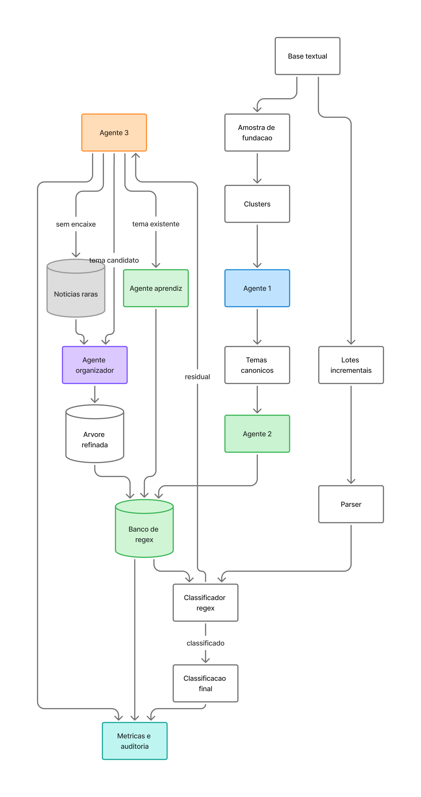

# Uma Metodologia Incremental para Clusterização, Classificação e Aprendizado Contínuo em Grandes Bases Textuais

## Resumo

Grandes bases textuais institucionais crescem continuamente e tornam custosa a organizacao tematica, a classificacao e a revisao manual de documentos. Este trabalho propoe uma metodologia incremental, autonoma e auditavel para clusterizar, classificar e aprender continuamente a partir dessas bases. A abordagem combina amostragem temporal estratificada, clusterizacao exploratoria, consolidacao semantica por similaridade do cosseno, agentes de linguagem com respostas estruturadas, geracao e validacao de expressoes regulares, classificacao residual por LLM e reorganizacao periodica de uma arvore tematica. A LLM nao atua como classificador principal da base inteira: ela revisa apenas os residuos que escapam das regras deterministicas, e parte desse aprendizado pode ser convertida em regras reutilizaveis para lotes futuros. Como aplicacao empirica, a metodologia e aplicada a 8.106 noticias publicas da Policia Federal, base real e heterogenea marcada por linguagem institucional, termos especializados, localidades, nomes de operacao e atualizacao temporal. Na aplicacao documentada, 15% da base foi usada como amostra inicial e 85% como reserva incremental. A etapa inicial gerou 24 clusters consolidados, 17 temas canonicos e 5.739 regex iniciais aceitas. Na reserva incremental, 94,73% dos textos foram classificados diretamente por regex, enquanto 5,27% exigiram revisao residual por LLM. Os resultados indicam que a metodologia pode apoiar processos institucionais de organizacao tematica, classificacao auditavel, aprendizado continuo e reducao de custos operacionais em bases textuais volumosas e em crescimento.

## 1. Introducao

Instituicoes publicas que produzem ou analisam informacao em larga escala, como o Ipea, institutos estaduais de seguranca publica, observatorios, orgaos de controle e centros de pesquisa aplicada, lidam cada vez mais com grandes volumes de textos. Relatorios, noticias, registros administrativos, descricoes de ocorrencias, documentos tecnicos e comunicados institucionais acumulam evidencias relevantes para analise de politicas publicas, mas nem sempre chegam organizados em categorias estaveis. O desafio deixa de ser apenas armazenar documentos: passa a ser transformar fluxos textuais continuos em informacao tematica, comparavel, auditavel e reutilizavel.

Esse processo e dificil porque grandes bases textuais sao heterogeneas, crescem ao longo do tempo e frequentemente combinam temas recorrentes com temas emergentes. Alem disso, apresentam variacao lexical, repeticao de formatos, mudancas temporais de enfoque e elementos acidentais, como localidades, nomes proprios, codigos internos, operacoes, eventos e entidades. A rotulagem humana tende a ser cara e pouco escalavel; por outro lado, uma classificacao automatica sem controle pode reproduzir ruido, transformar metadados em categorias e gerar taxonomias instaveis. Em ambientes institucionais, esse problema e tambem operacional: cada nova rodada de dados exige custo, tempo, documentacao e capacidade de revisao.

Modelos de linguagem ampliam a capacidade de interpretar textos e podem apoiar tarefas de classificacao, extracao de evidencias e nomeacao de temas. No entanto, usar LLM em toda a base pode ser caro, pouco previsivel e menos reprodutivel quando nao ha uma camada deterministica de verificacao. A proposta deste trabalho parte dessa tensao: usar LLM onde ela agrega mais valor, isto e, nos residuos e excecoes, e converter parte desse aprendizado em regras auditaveis para reduzir chamadas futuras. Com isso, busca-se um ciclo de aprendizado continuo que contribua para diminuir custos operacionais ao longo do tempo.

Este Texto para Discussao tem como objetivo propor uma metodologia incremental, autonoma e transparente para clusterizar, classificar e aprender continuamente a partir de grandes bases textuais. A proposta busca responder a um problema operacional comum a instituicoes que lidam com dados textuais em larga escala: como organizar temas recorrentes, reconhecer excecoes, reduzir custo de inferencia e preservar rastreabilidade ao longo de sucessivas rodadas de dados. A metodologia e aplicada empiricamente a noticias publicas da Policia Federal, por constituirem uma base real, volumosa, heterogenea e marcada por termos especializados; nessa aplicacao, o alvo de classificacao e crime ou modus operandi. O texto esta organizado da seguinte forma: a secao 2 apresenta o referencial teorico; a secao 3 discute trabalhos relacionados; a secao 4 detalha a metodologia; a secao 5 apresenta os resultados; a secao 6 apresenta conclusao, criterios de qualidade e limitacoes observadas; e o apendice registra resultados por lote.

A metodologia proposta parte de quatro premissas:

1. A maior parte da base tende a ser composta por temas recorrentes.
2. Temas recorrentes podem ser capturados por regras regex bem ancoradas nos atributos substantivos do dominio.
3. A LLM deve ser usada prioritariamente nos residuos, isto e, nos casos que escapam das regras.
4. Cada residuo deve deixar uma trilha auditavel e, quando possivel, transformar-se em aprendizado para reduzir chamadas futuras de LLM.

O resultado esperado nao e apenas uma classificacao pontual da base usada como aplicacao, mas um procedimento transferivel de clusterizacao, classificacao e treinamento incremental autonomo, sem intervencao humana no ciclo operacional.

## 2. Referencial teorico

A metodologia proposta se apoia em quatro familias conceituais: clusterizacao de textos, representacoes semanticas por embeddings, classificacao por regras interpretaveis e uso controlado de modelos de linguagem. Esses elementos nao sao tratados como tecnicas isoladas, mas como partes de uma arquitetura incremental. A clusterizacao organiza a diversidade inicial da base; os embeddings permitem estimar proximidade semantica entre documentos e temas; as regras oferecem classificacao deterministica e auditavel; e a LLM atua nos casos residuais, em que a regra ainda nao acumulou evidencia suficiente.

A clusterizacao de textos e usada como mecanismo exploratorio para revelar agrupamentos iniciais em uma base sem rotulos consolidados. Em colecoes institucionais, esse procedimento ajuda a identificar regioes tematicas recorrentes sem exigir uma taxonomia previa completa. Contudo, clusters nao devem ser confundidos com categorias finais. Um cluster pode refletir um crime, uma forma de redacao, uma localidade, uma operacao especifica ou uma combinacao desses elementos. Por isso, a metodologia trata clusters como folhas exploratorias, sujeitas a consolidacao semantica e revisao por agentes antes de se tornarem temas canonicos.

Embeddings e similaridade do cosseno fornecem uma camada de comparacao semantica entre documentos, clusters e temas. Essa camada e util tanto na fundacao tematica quanto na execucao incremental, pois ajuda a indicar quando uma noticia residual se aproxima de um tema ja existente ou quando um conjunto de residuos sugere uma folha nova. Ainda assim, a similaridade nao substitui a decisao tematica: ela funciona como evidencia auxiliar. A classificacao final precisa respeitar o alvo substantivo definido pela aplicacao, evitando que proximidades superficiais, entidades frequentes ou localidades dominantes sejam transformadas em categorias principais.

O uso de regras interpretaveis, especialmente expressoes regulares, aproxima a proposta de abordagens de supervisao fraca e rotulagem programatica. A vantagem operacional das regex e sua auditabilidade: cada classificacao pode ser rastreada ate um padrao textual explicito. Ao mesmo tempo, regras escritas manualmente tendem a ser incompletas, rigidas e custosas de manter. A contribuicao metodologica esta em usar agentes para gerar, validar e atualizar essas regras a partir de evidencias observadas, mantendo a classificacao deterministica como camada principal e reduzindo progressivamente a dependencia de inferencia por modelo.

Modelos de linguagem entram como componente interpretativo e residual. Em vez de usar LLM para classificar toda a base, a metodologia restringe sua atuacao aos documentos que escapam do banco de regex. Esse desenho busca equilibrar capacidade semantica e custo operacional: a LLM interpreta excecoes, registra justificativas, sugere temas candidatos ou documentos raros e produz insumos para novas regras. O aprendizado incremental ocorre quando essas decisoes residuais sao convertidas em regex, reorganizacao da arvore tematica ou memoria auditavel de casos raros.

Por fim, a metodologia adota uma perspectiva de aprendizado continuo. A base textual cresce ao longo do tempo, e a taxonomia precisa acompanhar esse crescimento sem perder estabilidade. Isso exige separar temas canonicos, folhas candidatas, documentos raros e metadados auxiliares. Exige tambem registrar metricas de cobertura, residuos, consumo de tokens, custo operacional e alteracoes no banco de regras. Assim, o referencial teorico combina tecnicas de descoberta nao supervisionada, regras deterministicas e revisao por LLM em um ciclo de classificacao incremental, auditavel e transferivel.

## 3. Trabalhos relacionados

A metodologia proposta se aproxima de pesquisas sobre supervisao fraca, modelagem de topicos, uso de LLMs como fontes de rotulagem, construcao automatica de taxonomias e bootstrapping de regras. Esses trabalhos mostram que a reducao de custo de rotulagem e inferencia e um problema recorrente em grandes bases textuais. A diferenca central deste Texto para Discussao esta na integracao dessas ideias em um ciclo operacional unico, no qual clusters, agentes, regex, revisao residual e reorganizacao tematica atuam de forma incremental e auditavel.

A literatura de supervisao fraca e *data programming*, representada por Snorkel (Ratner et al., 2017; Ratner et al., 2018), propoe o uso de funcoes de rotulagem para gerar sinais programaticos em bases pouco ou nao rotuladas. Trabalhos de supervisao fraca orientada por ontologias, como Fries et al. (2021), tambem mostram que regras, ontologias e conhecimento de dominio podem apoiar classificacao em contextos especializados. Este trabalho se aproxima dessa literatura ao usar regras interpretaveis como fonte de classificacao, mas se diferencia porque as regex nao sao apenas sinais fracos para treinar outro modelo: elas permanecem como classificador operacional, versionado e atualizado pelo ciclo incremental.

A etapa de descoberta tematica dialoga com a modelagem de topicos e com tecnicas de clusterizacao baseadas em embeddings. LDA (Blei, Ng e Jordan, 2003), HDBSCAN (McInnes, Healy e Astels, 2017), Sentence-BERT (Reimers e Gurevych, 2019) e BERTopic (Grootendorst, 2022) oferecem referencias importantes para organizar colecoes textuais em grupos semanticamente proximos. A diferenca deste trabalho e que os clusters nao sao tratados como categorias finais. Eles funcionam como folhas exploratorias, posteriormente interpretadas por agentes, consolidadas em temas canonicos e operacionalizadas por regex auditaveis.

Pesquisas recentes tambem investigam o uso de LLMs em supervisao fraca e geracao de funcoes de rotulagem. Smith et al. (2022) discutem modelos de linguagem no ciclo de supervisao fraca, enquanto Guan, Chen e Koudas (2023) analisam se LLMs podem desenhar funcoes de rotulagem precisas. Este trabalho compartilha a ideia de usar LLMs para reduzir esforco humano, mas restringe seu papel: a LLM nao rotula toda a base e nao substitui a camada deterministica. Ela atua nos residuos, gera evidencias estruturadas e pode produzir aprendizado convertido em regex para reduzir chamadas futuras.

A construcao automatica de taxonomias com LLMs, embeddings e palavras-chave, discutida por Balakrishnan (2025), e outro eixo relacionado. No presente trabalho, a arvore tematica tambem e ajustada por agentes, mas com finalidade operacional: ela orienta o banco de regex, a revisao residual, o tratamento de documentos raros e as metricas de custo. De modo complementar, tecnicas classicas de bootstrapping de padroes, como Snowball (Agichtein e Gravano, 2000), inspiram a ideia de transformar evidencias observadas em regras reutilizaveis. A contribuicao aqui esta em aplicar esse principio a classificacao tematica incremental, com agentes especializados, memoria de excecoes, validacao de regex e relatorios de cobertura por lote.

Assim, a contribuicao deste trabalho nao esta em propor isoladamente clusterizacao, regex, LLM ou supervisao fraca. O destaque esta na engenharia do ciclo completo: uma metodologia autonoma, sem intervencao humana operacional, que descobre temas em amostra temporal, gera temas canonicos, cria regex iniciais, classifica a massa em lotes, usa LLM apenas nos residuos, aprende novas regras, reorganiza a arvore e documenta custo, cobertura, evidencias e excecoes.

## 4. Metodologia

A metodologia proposta organiza grandes colecoes de textos em um ciclo incremental, autonomo e auditavel. Sua premissa central e separar o trabalho recorrente, que pode ser resolvido por regras deterministicas, do trabalho interpretativo, que deve ser reservado para casos residuais. Em vez de acionar LLM para toda a base, o metodo usa a LLM apenas quando o banco de regras nao encontra evidencia suficiente. Cada residual revisado pode produzir aprendizado reutilizavel, reduzindo chamadas futuras e contribuindo para queda progressiva do custo operacional.

O ciclo metodologico possui duas fases complementares. A primeira e a fundacao tematica, construida a partir de uma amostra temporal da base. Nessa fase, a clusterizacao exploratoria organiza a diversidade inicial, a similaridade do cosseno consolida folhas proximas, o Agente 1 nomeia temas canonicos e o Agente 2 gera regex iniciais. A segunda fase e a execucao incremental, em que a massa restante passa por parser, classificador regex, revisao residual por LLM quando necessario, aprendizado de novas regras e reorganizacao periodica da arvore tematica.

A figura apresenta a metodologia como um ciclo fechado. A base alimenta uma descoberta inicial de temas; os temas sao transformados em regras; as regras classificam novos lotes; os residuos seguem para revisao; as excecoes geram aprendizado; e a arvore tematica e reorganizada periodicamente. A imagem tambem evidencia que a metodologia nao termina quando uma base e classificada: ela busca acumular aprendizado para que ciclos futuros dependam menos de inferencia e mais de regras auditaveis.

### 4.1 Alvo da classificacao e controles de dominio

A primeira decisao metodologica e definir qual atributo substantivo deve ser classificado. Em uma base juridica, esse atributo pode ser tipo de acao; em uma base de saude, pode ser agravo ou procedimento; em uma base de seguranca, pode ser natureza criminal ou modus operandi. Essa definicao orienta a construcao do texto de dominio, a nomeacao dos temas canonicos e a validacao das regex.

Na aplicacao com noticias da Policia Federal, o alvo da classificacao e o dominio criminal ou o modus operandi principal. Por isso, categorias como `trafico_drogas`, `crimes_contra_criancas`, `crime_organizado`, `corrupcao_desvio_recursos_publicos`, `crimes_ambientais`, `armas_municoes`, `falsificacao_documental` e `moeda_falsa` sao temas substantivos. Localidades, unidades da federacao, nomes de operacao, orgaos parceiros e entidades ocasionais sao preservados para auditoria, mas nao entram como temas canonicos principais.

Essa separacao evita que a clusterizacao transforme metadados frequentes em classes finais. Ao mesmo tempo, a arquitetura permite criar camadas analiticas complementares. Agentes especializados derivados da logica do Agente 2 podem ser usados para extrair localidades, orgaos, entidades ou nomes de operacoes como dimensoes separadas, sem contaminar a taxonomia tematica principal.

### 4.2 Ingestao, amostra de fundacao e reserva incremental

A ingestao divide a base em duas massas. A primeira e uma amostra inicial, preferencialmente estratificada no tempo, usada para construir a fundacao tematica. A segunda e a reserva incremental, composta pelos documentos restantes, usada para testar a cobertura das regras, medir residuos e observar o aprendizado do sistema ao longo dos lotes.

A figura apresenta a fase de fundacao. A amostra temporal e convertida em texto de dominio, passa por clusterizacao exploratoria, e os clusters sao consolidados por similaridade do cosseno. Em seguida, o Agente 1 transforma folhas de clusters em temas canonicos, e o Agente 2 gera regex iniciais para o banco ativo. A fracao da amostra, o tamanho dos lotes e os parametros operacionais podem variar conforme o dominio, o volume da base e o custo aceitavel de inferencia.

### 4.3 Texto de dominio, clusterizacao e similaridade

Antes da clusterizacao, cada documento e transformado em texto de dominio. Essa etapa seleciona sinais relevantes para o atributo que se deseja classificar e reduz o peso de elementos acidentais. Na aplicacao empirica, o texto de dominio prioriza titulo, subtitulo, tags, condutas, crimes, objetos ilicitos, modus operandi e trechos relevantes do corpo, enquanto reduz localidades, nomes de operacao, orgaos parceiros e termos administrativos genericos.

A clusterizacao tem papel exploratorio. Ela organiza a amostra inicial em folhas semanticamente proximas, mas nao define a classificacao final. Essa distincao e importante: clusters podem refletir formato textual, localidade, entidade ou recorrencia lexical, e nao necessariamente o tema substantivo desejado. Por isso, os clusters sao insumo para os agentes, nao categorias finais.

Depois da clusterizacao bruta, a similaridade do cosseno e usada para consolidar clusters proximos. Essa etapa reduz fragmentacao e ajuda a identificar folhas que pertencem ao mesmo tema. Na aplicacao PF, por exemplo, clusters sobre abuso sexual infantil, pornografia infantojuvenil e compartilhamento de material podem ser consolidados em um mesmo campo tematico. Em outro dominio, a mesma etapa deve consolidar folhas segundo o atributo substantivo definido para a taxonomia.

### 4.4 Agentes da metodologia

A figura apresenta o fluxo simplificado entre os agentes da metodologia. Ela indica apenas de onde vem cada insumo e para onde segue cada saida: a amostra de fundacao alimenta os clusters, os clusters alimentam os temas canonicos, os temas alimentam o banco inicial de regex, e os lotes incrementais percorrem parser, classificador regex, revisao residual, aprendizado e reorganizacao da arvore. Os detalhes de decisao de cada agente sao descritos a seguir, para evitar que o diagrama assuma uma funcao explicativa excessiva.

A metodologia utiliza agentes especializados para separar responsabilidades. Essa divisao evita que um unico agente decida simultaneamente clusters, temas, regex, residuos e reorganizacao taxonomica. Cada agente recebe um tipo de entrada, produz uma saida estruturada e deixa evidencias auditaveis.

O Agente 1 recebe clusters consolidados e cria temas canonicos. Sua funcao e agregar folhas que pertencem ao mesmo dominio substantivo, separar subtemas quando houver identidade distinta e impedir que localidades, entidades ou nomes de operacao virem classes principais. Ele atua como bifurcador de temas e precisa considerar o conjunto completo de temas disponiveis antes de promover uma nova categoria.

O Agente 2 recebe temas canonicos e evidencias associadas a cada folha. Sua funcao e gerar regex iniciais suficientes para cobrir a diversidade observada em cada tema. As regras precisam ser ancoradas no atributo substantivo do dominio. Na aplicacao PF, isso significa crime, conduta ou modus operandi. Regex baseadas apenas em localidade, nome de operacao, orgao ou entidade acidental devem ser rejeitadas ou deslocadas para camadas analiticas complementares.

O Agente 3 atua apenas nos residuos, isto e, nos documentos que nao foram classificados por regex. Ele recebe o texto estruturado, as labels canonicas disponiveis, sugestoes por similaridade do cosseno e evidencias textuais. Sua decisao pode classificar o documento em tema existente, propor novo tema candidato ou registrar o caso como documento raro quando nao houver encaixe defensavel.

O Agente Aprendiz de Regex recebe decisoes residuais e tenta converter evidencias em regras reutilizaveis. Ele nao reclassifica o documento; sua tarefa e produzir regex candidata e validar se ela captura o caso positivo sem depender de metadados acidentais. Quando aprovada, a regra entra no banco ativo e pode reduzir chamadas futuras de LLM.

O Agente Organizador da Arvore realiza uma revisao global dos temas. Ele recebe temas canonicos, candidatos criados pelo Agente 3, contagens, evidencias, regex aprendidas e sugestoes por similaridade. Sua funcao e evitar crescimento desordenado da taxonomia, decidindo se candidatos devem ser absorvidos por temas existentes, promovidos, consolidados em macrotemas, mantidos como raros ou descartados como ruido.

### 4.5 Execucao incremental e caminho do documento

Na execucao incremental, a reserva e processada em lotes. Cada documento passa primeiro pelo parser, que estrutura os campos relevantes. Depois, o classificador regex tenta atribuir uma label. Se a regra classifica acima do limiar definido, a decisao e registrada como classificacao deterministica. Se a regra falha, o documento segue para revisao residual pelo Agente 3.

A figura apresenta o caminho operacional do documento. O banco de regex aparece antes da LLM porque a metodologia adota uma logica `regex-first`: tudo que ja foi aprendido deve ser resolvido de forma deterministica; somente o que escapa das regras deve consumir inferencia. Essa escolha permite medir, lote a lote, quanto da base foi absorvido por regras e quanto ainda depende de interpretacao por modelo.

### 4.6 Aprendizado residual, documentos raros e reorganizacao da arvore

O aprendizado residual e o mecanismo que fecha o ciclo incremental. Quando o Agente 3 classifica um residual em tema canonico ou identifica um novo tema candidato, o caso pode alimentar o Agente Aprendiz de Regex. Quando nao ha encaixe defensavel, o documento e registrado como raro. Documentos raros nao devem gerar tema ou regex imediatamente, mas recebem assinatura para que recorrencias futuras possam ser detectadas.

A figura mostra a relacao entre revisao residual, aprendizado e reorganizacao. Um residual pode gerar regex incremental, candidato de tema ou memoria de documento raro. Quando assinaturas raras reaparecem, elas podem voltar ao ciclo como candidatos. Periodicamente, o Agente Organizador da Arvore analisa o conjunto completo e decide o que deve ser absorvido, promovido ou mantido como raro.

### 4.7 Banco de regex, metricas e auditabilidade

O banco de regex e o classificador deterministico principal da metodologia. Ele registra label, padrao, fonte, exemplos, usos e origem da regra. Ao longo dos lotes, esse banco pode receber regex incrementais aprovadas pelo ciclo residual. Com isso, a metodologia preserva interpretabilidade e cria uma trilha clara entre evidencia textual, regra e classificacao.

O custo operacional da metodologia deve ser medido pela proporcao de documentos resolvidos por regex e pela quantidade de tokens consumidos nos residuos enviados a LLM. Para cada lote, o sistema registra `prompt_tokens_total`, `completion_tokens_total`, `tokens_total` e `avg_tokens_per_llm`. Para cada documento residual, o evento individual em `events.jsonl` registra os tokens da chamada.

Cada etapa produz artefatos persistentes. Isso permite reconstruir a origem da amostra, os clusters, as decisoes dos agentes, as regras incorporadas, as metricas por lote e os casos raros.

| Artefato | Funcao |
|---|---|
| `documentos_base.jsonl` | Base estruturada usada na execucao |
| `amostra_inicial.csv` | Amostra temporal da fundacao |
| `reserva_incremental.csv` | Massa processada em lotes |
| `resumo_clusters_amostra.csv` | Resumo dos clusters da amostra |
| `temas_canonicos_agent1.json` | Temas iniciais do Agente 1 |
| `regex_iniciais_agent2.json` | Regex iniciais propostas |
| `regex_classifier_rules.json` | Banco ativo de regex |
| `metrics_batches.csv` | Metricas por lote |
| `resumo_custo_tokens.json` | Resumo do consumo de tokens nas chamadas LLM residuais |
| `events.jsonl` | Trilha completa de eventos |
| `temas_candidatos_agent3.jsonl` | Candidatos criados no residual |
| `arvore_temas_agent1_refinada.json` | Arvore refinada |
| `noticias_raras_observacoes.jsonl` | Memoria incremental de noticias raras |
| `classificacoes_incrementais_pos_quarentena.csv` | Saida final consolidada |

A tabela lista os artefatos de auditoria. Eles tornam o ciclo transparente: cada classificacao pode ser rastreada ate a regra, o agente, o lote ou a decisao residual que a produziu.

## 5. Resultados

Esta secao apresenta os resultados obtidos na aplicacao empirica com noticias da Policia Federal. Diferentemente da metodologia, que descreve como o ciclo funciona, os resultados mostram o que foi produzido por essa proposta: divisao da base, consolidacao de clusters, geracao de regex, cobertura por lote, aprendizado residual, tratamento de documentos raros e metricas de auditoria.

### 5.1 Desenho empirico da aplicacao

A aplicacao utilizou 8.106 noticias publicas da Policia Federal. A base foi dividida em uma amostra inicial temporalmente estratificada e uma reserva incremental. A amostra de fundacao foi usada para descobrir a estrutura tematica inicial; a reserva foi usada para avaliar a capacidade do banco de regex de classificar documentos novos em lotes.

| Item | Valor |
|---|---:|
| Base total | 8.106 noticias |
| Amostra inicial | 1.216 noticias |
| Fracao da amostra | 15% |
| Reserva incremental | 6.890 noticias |
| Estratificacao | Ano |

A tabela apresenta a divisao utilizada na aplicacao empirica. Esses valores nao sao parametros obrigatorios da metodologia, mas indicam que uma fracao relativamente pequena da base foi suficiente para gerar uma fundacao tematica usada na classificacao incremental.

### 5.2 Fundacao tematica e temas canonicos

Na fundacao tematica, a clusterizacao inicial produziu 34 clusters brutos. A consolidacao por similaridade do cosseno reduziu esse conjunto para 24 clusters consolidados, com 5 grupos fundidos e sem clusters classificados como ruido. Esse resultado mostra que a clusterizacao exploratoria gerou folhas uteis, mas tambem revelou fragmentacao que precisava ser corrigida antes da nomeacao canonica.

| Item | Valor |
|---|---:|
| Clusters brutos | 34 |
| Clusters consolidados | 24 |
| Grupos fundidos por cosseno | 5 |
| Clusters de ruido | 0 |
| Temas canonicos finais | 17 |

A tabela resume o efeito da consolidacao. A reducao de 34 clusters brutos para 24 clusters consolidados indica que parte da separacao inicial era granular demais para ser tratada como tema final.

A figura mostra os principais grupos consolidados da fundacao tematica. Ela deve ser lida como fotografia da amostra inicial, nao como taxonomia definitiva. Sua funcao e mostrar quais regioes tematicas tiveram massa suficiente para orientar a etapa seguinte de nomeacao canonica.

A figura apresenta a arvore operacional da aplicacao PF. A esquerda aparecem temas canonicos; ao centro, as folhas de clusters que alimentam esses temas; a direita, termos dominantes usados como evidencia. A visualizacao reforca que o tema final nao e o cluster isolado, mas a agregacao analitica de folhas por familia substantiva.

### 5.3 Banco inicial e banco final de regex

O Agente 2 gerou 5.739 regex iniciais aceitas. Apos consolidacao e validacao, 5.146 padroes permaneceram ativos como banco inicial. Ao longo da execucao incremental, o ciclo residual adicionou 51 padroes aprendidos, resultando em 5.197 padroes regex ativos no banco final.

| Item | Valor |
|---|---:|
| Regex iniciais aceitas | 5.739 |
| Padroes iniciais ativos apos consolidacao | 5.146 |
| Padroes aprendidos pelo residual | 51 |
| Padroes regex ativos finais | 5.197 |
| Classificadores ativos | 23 |
| Labels ativas finais no banco | 23 |

A tabela descreve a composicao do banco deterministico. A maior parte dos padroes veio da fundacao tematica, enquanto o ciclo residual adicionou regras novas para reduzir chamadas futuras de LLM. A ausencia de limite artificial por tema permitiu que cada folha observada gerasse padroes proprios, desde que respeitasse os criterios de dominio.

### 5.4 Cobertura incremental e custo operacional

Na reserva incremental, 6.890 noticias foram processadas em 14 lotes. No acumulado, 6.527 noticias foram classificadas por regex e 363 seguiram para LLM residual. Isso representa taxa regex acumulada de 94,73% e taxa residual de 5,27%.

| Indicador | Valor |
|---|---:|
| Noticias na reserva incremental | 6.890 |
| Lotes processados | 14 |
| Tamanho medio dos lotes | 492,14 |
| Capturadas por regex | 6.527 |
| Residuais enviados a LLM | 363 |
| Taxa regex acumulada | 94,73% |
| Taxa residual LLM | 5,27% |
| Aprendizados por lote, em media | 3,64 |

A tabela resume o principal resultado operacional: a maior parte da reserva foi resolvida pelo classificador deterministico, concentrando o custo de LLM nos documentos residuais.

A figura compara, por iteracao, quantos documentos foram resolvidos por regex e quantos precisaram de LLM residual. O contraste evidencia que o regex domina o fluxo operacional.

A figura mostra a estabilidade da taxa de classificacao por regex ao longo dos lotes. Ela permite acompanhar se a cobertura deterministica se mantem estavel ou se novos tipos de texto aumentam a dependencia de LLM.

O custo deve ser lido por duas dimensoes: proporcao de documentos resolvidos por regex e consumo de tokens nos residuos. Para cada lote, o sistema registra `prompt_tokens_total`, `completion_tokens_total`, `tokens_total` e `avg_tokens_per_llm`. Para cada documento residual, o evento individual em `events.jsonl` registra os tokens da chamada. Essa instrumentacao permite estimar custo operacional em execucoes futuras e comparar cenarios de modelo local, Groq ou OpenAI.

### 5.5 Aprendizado residual e noticias raras

Na execucao documentada, 51 regras foram aprendidas no ciclo residual e permaneceram ativas no banco final. Das 48 ocorrencias inicialmente tratadas como quarentena ou raras, 41 foram absorvidas por macrotemas apos reorganizacao, e 7 permaneceram como `noticias_raras`.

| Item | Valor |
|---|---:|
| Regras aprendidas no ciclo residual | 51 |
| Padroes aprendidos ativos | 51 |
| Quarentenas reavaliadas | 48 |
| Reclassificadas para macrotemas | 41 |
| Mantidas como `noticias_raras` | 7 |
| `noticias_raras` no banco de regex | Nao |

A tabela mostra que o ciclo residual produziu aprendizado sem transformar excecoes isoladas em categorias definitivas. O banco final nao possui regex para `noticias_raras`, pois esse estado funciona como memoria operacional e nao como tema substantivo. Ainda assim, documentos raros preservam assinatura e evidencia para que recorrencias futuras possam ser avaliadas pelo Agente Organizador.

A figura apresenta a distribuicao final das noticias por tema na aplicacao PF. Os maiores volumes ficaram em `trafico_drogas`, `crimes_contra_criancas`, `crime_organizado` e `corrupcao_desvio_recursos_publicos`, enquanto `noticias_raras` permaneceu residual, com 7 casos finais.

## 6. Conclusao

A metodologia implementa um ciclo fechado de clusterizacao, classificacao e aprendizado incremental para grandes bases textuais. Ela usa uma amostra temporal para descobrir a fundacao tematica, clusterizacao e similaridade para organizar a diversidade inicial, agentes especializados para nomear temas e gerar regex, regex para classificar a maior parte da massa, LLM apenas para residuos e um mecanismo de aprendizado que converte excecoes recorrentes em regras reutilizaveis.

Na aplicacao com noticias da Policia Federal, o resultado principal e a demonstracao de uma arquitetura de baixo custo e alta rastreabilidade: 94,73% da reserva incremental foi classificada por regex, enquanto 5,27% exigiu LLM residual. Os textos que nao se encaixaram imediatamente nao foram descartados; foram convertidos em `noticias_raras`, com assinaturas auditaveis capazes de alimentar futuros candidatos quando houver recorrencia.

A leitura dos resultados deve considerar cinco criterios de qualidade. O primeiro e custo, medido pela proporcao de documentos classificados por regex antes de acionar LLM e pela quantidade de tokens consumidos nos residuos. O segundo e cobertura, isto e, a capacidade do banco de regex capturar temas recorrentes da base textual. O terceiro e precisao operacional, protegida por validadores que rejeitam regex ancoradas apenas em localidade, entidade, nome de operacao ou termo generico. O quarto e estabilidade taxonomica, associada a capacidade de impedir proliferacao de microtemas. O quinto e transparencia, garantida por artefatos, eventos, evidencias e metricas persistentes.

A aplicacao tambem evidenciou limitacoes. A qualidade da fundacao depende da amostra inicial: uma amostra pequena pode deixar de observar temas raros ou emergentes. Clusterizacao nao equivale a categoria final, pois clusters podem refletir formato textual, localidade, entidade ou termos institucionais. Regex sao interpretaveis, mas podem gerar falsos positivos se forem amplas demais. Documentos raros exigem memoria incremental: se forem ignorados, o sistema perde aprendizado; se forem promovidos cedo demais, o banco fica ruidoso. Por fim, os resultados dependem do modelo LLM disponivel e da qualidade dos schemas estruturados, razao pela qual o uso de fallback local ou remoto deve ser registrado em eventos.

Mesmo com essas limitacoes, a abordagem e transferivel para outros dominios textuais em que haja grande volume, crescimento continuo, baixa disponibilidade de rotulagem humana, necessidade de transparencia e pressao por reducao de custo de inferencia. A contribuicao central nao e classificar apenas uma base especifica, mas propor uma forma auditavel de transformar classificacoes residuais em aprendizado incremental.

## 7. Referencias conceituais

- McInnes, L.; Healy, J.; Astels, S. HDBSCAN: Hierarchical density based clustering. Journal of Open Source Software, 2017.
- Reimers, N.; Gurevych, I. Sentence-BERT: Sentence embeddings using Siamese BERT-networks. EMNLP-IJCNLP, 2019.
- Ratner, A. et al. Snorkel: Rapid Training Data Creation with Weak Supervision. arXiv:1711.10160, 2017. https://arxiv.org/abs/1711.10160
- Ratner, A. et al. Snorkel DryBell: A Case Study in Deploying Weak Supervision at Industrial Scale. arXiv:1812.00417, 2018. https://arxiv.org/abs/1812.00417
- Fries, J. A. et al. Ontology-driven weak supervision for clinical entity classification in electronic health records. Nature Communications, 2021. https://www.nature.com/articles/s41467-021-22328-4
- Blei, D. M.; Ng, A. Y.; Jordan, M. I. Latent Dirichlet Allocation. Journal of Machine Learning Research, 2003.
- Grootendorst, M. BERTopic: Neural topic modeling with a class-based TF-IDF procedure. arXiv:2203.05794, 2022. https://arxiv.org/abs/2203.05794
- Smith, R. et al. Language Models in the Loop: Incorporating Prompting into Weak Supervision. arXiv:2205.02318, 2022. https://arxiv.org/abs/2205.02318
- Guan, N.; Chen, K.; Koudas, N. Can Large Language Models Design Accurate Label Functions? arXiv:2311.00739, 2023. https://arxiv.org/abs/2311.00739
- Huang, C.; He, G. Text Clustering as Classification with LLMs. arXiv:2410.00927, 2024. https://huggingface.co/papers/2410.00927
- Balakrishnan, A. Automated Taxonomy Construction Using Large Language Models: A Comparative Study of Fine-Tuning and Prompt Engineering. Information, 2025. https://www.mdpi.com/2673-4117/6/11/283
- Agichtein, E.; Gravano, L. Snowball: Extracting Relations from Large Plain-Text Collections. ACM Digital Library, 2000.

## 8. Apendice: resultados por lote

| Lote | Noticias | Regex | Residual/LLM | Aprendizados | Taxa regex |
|---|---:|---:|---:|---:|---:|
| lote_0001 | 500 | 487 | 13 | 1 | 97,40% |
| lote_0002 | 500 | 469 | 31 | 4 | 93,80% |
| lote_0003 | 500 | 479 | 21 | 4 | 95,80% |
| lote_0004 | 500 | 486 | 14 | 3 | 97,20% |
| lote_0005 | 500 | 466 | 34 | 7 | 93,20% |
| lote_0006 | 500 | 474 | 26 | 3 | 94,80% |
| lote_0007 | 500 | 481 | 19 | 1 | 96,20% |
| lote_0008 | 500 | 470 | 30 | 4 | 94,00% |
| lote_0009 | 500 | 477 | 23 | 2 | 95,40% |
| lote_0010 | 500 | 462 | 38 | 4 | 92,40% |
| lote_0011 | 500 | 477 | 23 | 3 | 95,40% |
| lote_0012 | 500 | 464 | 36 | 2 | 92,80% |
| lote_0013 | 500 | 472 | 28 | 6 | 94,40% |
| lote_0014 | 390 | 363 | 27 | 7 | 93,08% |

A tabela apresenta o detalhamento por lote que foi resumido na secao de resultados. Ela fica no apendice para preservar a rastreabilidade sem interromper a narrativa principal.

