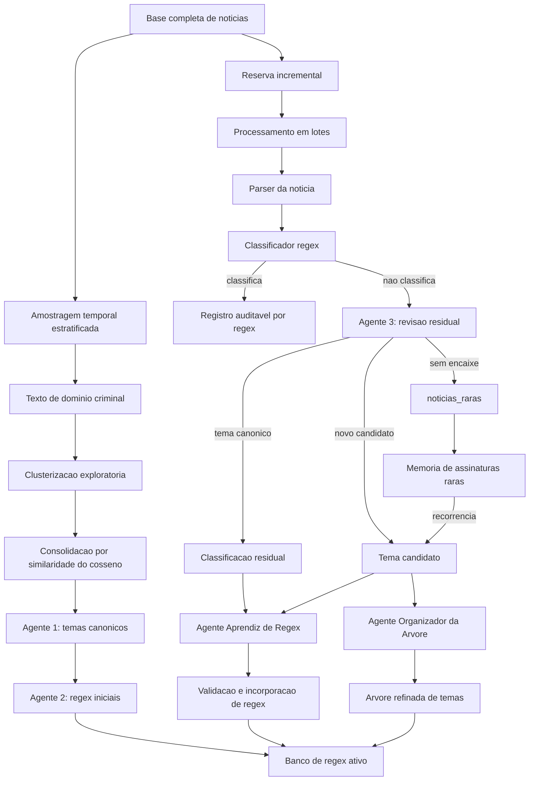
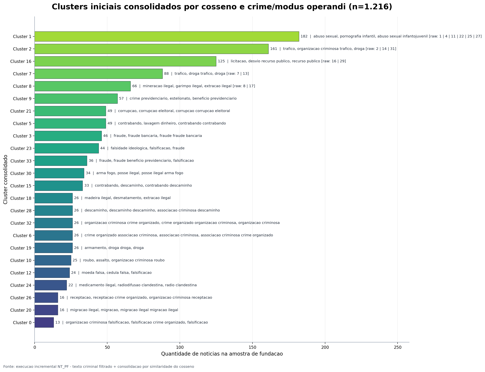
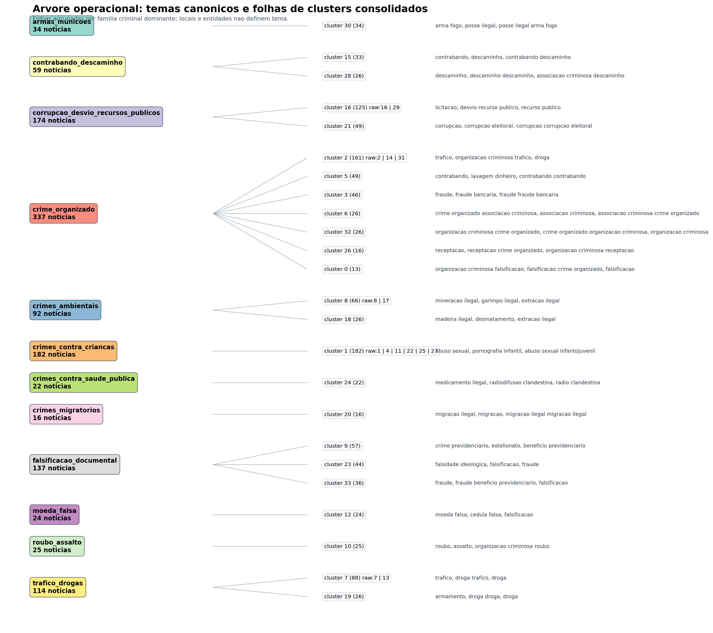

# Metodologia autonoma de classificacao incremental de noticias da Policia Federal

## Resumo

Este documento formaliza uma metodologia autonoma, incremental e auditavel para classificar noticias publicas da Policia Federal por temas criminais e modus operandi. A proposta combina amostragem temporal estratificada, clusterizacao exploratoria, consolidacao semantica por similaridade do cosseno, agentes de linguagem com respostas estruturadas, geracao e validacao de expressoes regulares, classificacao residual por LLM e reorganizacao periodica da arvore tematica.

O objetivo metodologico e reduzir o custo de inferencia ao longo do tempo sem abrir mao de rastreabilidade. A LLM nao atua como classificador principal permanente; ela e acionada apenas quando o banco de regex nao encontra evidencia suficiente. Quando a LLM classifica um residual, esse caso pode produzir aprendizado reutilizavel para os lotes seguintes. Quando o caso ainda nao tem recorrencia, ele e registrado como `noticias_raras`, preservando memoria e evitando a criacao prematura de regex ruidoso.

Na execucao documentada, a base possuia 8.106 noticias. A metodologia utilizou 15% da base como amostra inicial estratificada no tempo, totalizando 1.216 noticias. Os 85% restantes, com 6.890 noticias, foram processados em 14 lotes de 500 noticias, com ultimo lote de 390. A etapa inicial gerou 24 clusters consolidados, 17 temas canonicos iniciais e 5.739 regex iniciais aceitas. Durante a execucao incremental, 6.527 noticias foram classificadas diretamente por regex, 363 seguiram para revisao residual por LLM, 51 regras foram aprendidas e 48 casos foram posteriormente reavaliados a partir da arvore refinada. Ao final, 41 desses casos foram absorvidos por macrotemas e 7 permaneceram como `noticias_raras`.

## 1. Problema

Bases textuais institucionais crescem continuamente. Em contextos como noticias da Policia Federal, os textos apresentam grande diversidade de temas, variacao lexical, repeticao de formatos, mudancas temporais de enfoque e presenca de elementos acidentais, como localidades, nomes de operacoes e entidades. Classificar manualmente esse volume e caro, lento e pouco escalavel. Classificar tudo com LLM tambem e custoso, alem de dificultar reproducibilidade quando nao ha uma camada deterministica de verificacao.

A metodologia proposta parte de quatro premissas:

1. A maior parte da base tende a ser composta por temas recorrentes.
2. Temas recorrentes podem ser capturados por regras regex bem ancoradas em crime, conduta ou modus operandi.
3. A LLM deve ser usada prioritariamente nos residuos, isto e, nos casos que escapam das regras.
4. Cada residuo deve deixar uma trilha auditavel e, quando possivel, transformar-se em aprendizado para reduzir chamadas futuras de LLM.

O resultado esperado nao e apenas uma classificacao pontual da base, mas um procedimento transferivel de treinamento incremental autonomo, sem intervencao humana no ciclo operacional.

## 2. Objetivo

O objetivo geral e construir um sistema de classificacao incremental, autonomo e transparente que:

- descubra uma fundacao tematica minima a partir de uma amostra temporal da base;
- gere temas canonicos por crimes e modus operandi, evitando localidades e entidades como categorias finais;
- crie regex iniciais para temas recorrentes;
- processe a massa restante em lotes;
- acione LLM apenas para residuos;
- aprenda novas regex a partir de casos residuais classificados;
- reorganize periodicamente a arvore de temas;
- trate casos sem recorrencia como `noticias_raras`, sem descartar sua memoria;
- documente metricas, evidencias, decisoes e graficos de cada rodada.

## 3. Desenho geral da metodologia

A metodologia e composta por duas fases principais: fundacao tematica e execucao incremental.

Na fundacao tematica, uma amostra temporalmente estratificada e usada para descobrir os principais dominios criminais da base. Essa amostra passa por clusterizacao exploratoria e consolidacao por similaridade. Em seguida, o Agente 1 cria temas canonicos e o Agente 2 gera regex iniciais.

Na execucao incremental, os dados restantes sao processados em lotes. Cada noticia passa primeiro pelo banco de regex. Se for classificada, o sistema apenas registra a decisao. Se nao for classificada, a noticia segue para o Agente 3, que revisa o residual usando a lista de temas canonicos e sugestoes por similaridade do cosseno. Quando o residual gera aprendizado, o Agente Aprendiz de Regex tenta transformar a evidencia em regex. Periodicamente, o Agente Organizador da Arvore revisa todos os candidatos, funde folhas equivalentes e decide o que deve ser absorvido, promovido ou mantido como raro.

## 4. Amostragem temporal estratificada

A primeira decisao metodologica e nao usar a base inteira para descoberta inicial. A base e incremental e cresce continuamente; portanto, usar tudo na fundacao tornaria a etapa inicial mais cara e menos alinhada com o objetivo de baixo custo.

A metodologia seleciona uma fracao da base como amostra inicial. Na execucao documentada, a fracao foi de 15%. A selecao e estratificada temporalmente por ano para evitar que a amostra seja dominada por periodos recentes. O procedimento garante representacao minima de diferentes momentos da base e reduz o risco de temas antigos desaparecerem da fundacao.

Na rodada documentada:

| Item | Valor |
|---|---:|
| Base total | 8.106 noticias |
| Amostra inicial | 1.216 noticias |
| Fracao da amostra | 15% |
| Reserva incremental | 6.890 noticias |
| Estratificacao | Ano |

Distribuicao temporal da amostra inicial:

| Ano | Noticias |
|---|---:|
| 2011 | 1 |
| 2019 | 69 |
| 2020 | 117 |
| 2021 | 149 |
| 2022 | 126 |
| 2023 | 130 |
| 2024 | 273 |
| 2025 | 257 |
| 2026 | 94 |

## 5. Texto de dominio criminal

Antes da clusterizacao, os textos sao normalizados e reduzidos a uma representacao voltada ao dominio criminal. Essa etapa existe porque textos institucionais contêm muitos sinais que ajudam a identificar documentos, mas nao devem definir temas: nomes de cidades, unidades federativas, datas, nomes de operacoes, orgaos parceiros e entidades ocasionais.

O texto de dominio prioriza:

- crimes;
- condutas;
- objetos ilicitos;
- modus operandi;
- termos das tags;
- titulo, subtitulo e trechos do corpo da noticia.

Ele reduz o peso de:

- localidades;
- nomes proprios;
- nomes de operacao;
- termos administrativos genericos;
- informacoes acidentais.

Esse filtro nao elimina a informacao original. A noticia completa continua disponivel para auditoria, LLM e validacao posterior. O objetivo e apenas impedir que a clusterizacao inicial crie temas como localidades, siglas regionais ou eventos administrativos.

## 6. Clusterizacao exploratoria e consolidacao por cosseno

A clusterizacao inicial tem papel exploratorio. Ela nao e a classificacao final. Seu objetivo e organizar a amostra em grupos proximos para que o Agente 1 tenha uma representacao inicial da diversidade tematica.

A metodologia e compativel com HDBSCAN, especialmente quando a densidade dos embeddings favorece agrupamentos naturais e deteccao de ruido. Na execucao documentada, foi acionado `minibatch_kmeans_fallback`, uma alternativa operacional de baixo custo registrada no artefato de execucao. O uso de fallback nao altera a logica metodologica, pois a clusterizacao e apenas uma etapa de organizacao da fundacao.

Depois da clusterizacao bruta, a similaridade do cosseno e usada para consolidar clusters semanticamente proximos. Essa etapa e importante porque clusters separados podem pertencer ao mesmo tema criminal. Por exemplo, clusters sobre abuso infantil, pornografia infantojuvenil e compartilhamento de material podem ser consolidados em `crimes_contra_criancas`.

Na execucao documentada:

| Item | Valor |
|---|---:|
| Clusters brutos | 34 |
| Clusters consolidados | 24 |
| Grupos fundidos por cosseno | 5 |
| Clusters de ruido | 0 |

Exemplos de consolidacao por cosseno:

| Grupo | Clusters brutos fundidos | Familia dominante | Tamanho |
|---|---|---|---:|
| 1 | 1, 4, 11, 22, 25, 27 | crimes_contra_criancas | 182 |
| 2 | 2, 14, 31 | crime_organizado | 161 |
| 7 | 7, 13 | trafico_drogas | 88 |
| 8 | 8, 17 | crimes_ambientais | 66 |
| 16 | 16, 29 | corrupcao_recursos_publicos | 125 |

## 7. Agentes da metodologia

A arquitetura usa agentes especializados, cada um com uma responsabilidade delimitada. A separacao reduz ambiguidade, melhora a auditabilidade e evita que um mesmo agente decida tudo sem controle.

### 7.1 Agente 1: Bifurcador de temas canonicos

O Agente 1 recebe os clusters consolidados da amostra inicial. Sua tarefa e criar temas canonicos a partir de crimes e modus operandi, nao de localidades ou entidades.

Ele deve:

- agregar clusters que pertencem ao mesmo dominio criminal;
- separar subtemas quando houver identidade criminal distinta;
- criar nomes canonicos em `lowercase_com_underscores`;
- registrar termos de evidencia;
- descartar ou isolar ruido;
- evitar que uma localidade vire tema.

Exemplo de criterio:

`crimes_contra_criancas` pode englobar abuso sexual infantil, pornografia infantil, disseminacao de material infantojuvenil e compartilhamento desse material pela internet, desde que a identidade criminal central seja violencia ou exploracao contra criancas e adolescentes.

Na execucao documentada, o Agente 1 aceitou 17 temas canonicos iniciais.

### 7.2 Agente 2: Gerador de regex iniciais

O Agente 2 recebe os temas canonicos e as evidencias associadas a cada tema. Sua funcao e gerar regex suficientes para cobrir as folhas observadas dentro de cada tema.

As regex devem:

- ter ancora em crime, conduta ou modus operandi;
- evitar dependência de localidade;
- evitar nomes de operacao;
- evitar entidades acidentais;
- ser validadas contra exemplos positivos e negativos;
- ser registradas com label, fonte e exemplos.

Nao ha limite artificial de regex por tema. A quantidade depende da diversidade observada nas folhas de cada tema.

Na execucao documentada:

| Item | Valor |
|---|---:|
| Regex iniciais aceitas | 5.739 |
| Padrões iniciais ativos apos consolidacao | 5.146 |

### 7.3 Agente 3: Revisor residual

O Agente 3 atua apenas quando a regex nao classifica uma noticia. Ele recebe:

- texto estruturado da noticia;
- labels canonicas disponiveis;
- sugestoes por similaridade do cosseno;
- tags e titulo;
- evidencias textuais do corpo.

Sua decisao deve seguir esta ordem:

1. Classificar em tema canonico existente, se houver encaixe defensavel.
2. Gerar `novo_tema_candidato`, se houver tema substantivo claro ainda nao coberto.
3. Classificar como `noticias_raras`, se nao houver encaixe nem recorrencia suficiente.

O Agente 3 nao deve criar microtema para toda excecao. Ele tambem nao deve forcar uma classificacao quando a noticia nao cabe em nenhum tema existente. A saida deve ser estruturada por schema, contendo decisao, label, confianca, evidencia textual, justificativa e resumo curto.

### 7.4 Agente Aprendiz de Regex

O Agente Aprendiz de Regex recebe uma decisao residual e tenta transformar a evidencia em uma regra reutilizavel. Ele nao reclassifica a noticia. Sua tarefa e gerar uma regex candidata e validar se ela tem ancora de crime ou modus operandi.

Uma regex aprendida so e incorporada se:

- a label for defensavel;
- houver termos substantivos do crime ou da conduta;
- a regex capturar o caso positivo;
- a regex nao capturar indevidamente exemplos negativos;
- a regra nao for apenas localidade, entidade, nome de operacao ou frase operacional generica.

Na execucao documentada:

| Item | Valor |
|---|---:|
| Regras aprendidas no ciclo residual | 51 |
| Padrões aprendidos ativos | 51 |

### 7.5 Agente Organizador da Arvore

O Agente Organizador da Arvore executa uma revisao global apos o processamento incremental. Ele recebe:

- temas canonicos atuais;
- candidatos criados pelo Agente 3;
- contagem por candidato;
- evidencias textuais;
- regex aprendidas;
- sugestoes por similaridade do cosseno;
- banco de regex ativo.

Sua funcao e evitar que a arvore vire uma lista de microtemas. Ele decide se cada candidato deve:

- ser absorvido por um tema existente;
- ser consolidado em macrotema;
- ser promovido a novo tema canonico;
- permanecer como noticia rara;
- ser descartado como ruido.

Na execucao refinada, o organizador avaliou 55 candidatos, absorveu 19 em temas existentes e promoveu 6 macrotemas:

- `ameacas_e_terrorismo`
- `crimes_contra_saude_publica`
- `crimes_de_odio_e_extremismo`
- `crimes_patrimoniais`
- `falsificacao_documental`
- `seguranca_privada_clandestina`

## 8. Noticias raras

`noticias_raras` e um tema operacional, nao uma categoria criminal final no mesmo sentido dos demais temas. Ele existe para lidar com casos que nao cabem nos temas atuais e ainda nao apresentam recorrencia suficiente para virar macrotema ou regex.

Essa etapa resolve uma tensao metodologica:

- se todo caso raro gerar regex imediatamente, o banco fica ruidoso;
- se nenhum caso raro gerar memoria, noticias semelhantes futuras continuarao acionando LLM;
- portanto, a primeira ocorrencia rara deve ser registrada, mas nao deve necessariamente virar regex.

A solucao implementada e uma memoria de assinaturas raras. Cada noticia rara recebe uma `rare_signature`, como:

- `tortura_sequestro_carcere`;
- `violencia_domestica_feminicidio`;
- `assedio_sexual_coacao`;
- `violencia_politica_atos_antidemocraticos`;
- `execucao_mandado_prisional`.

Quando uma assinatura rara reaparece, ela deixa de ser apenas rara e passa a ser promovida automaticamente para candidato de tema. A partir desse ponto, volta ao ciclo normal: o Agente 3 registra o candidato, o Agente Aprendiz pode gerar regex e o Agente Organizador decide se o padrao deve ser absorvido, promovido ou mantido raro.

Regras importantes:

- `noticias_raras` nao gera regex diretamente;
- regex so nasce a partir de uma assinatura rara recorrente;
- o banco de regex nao deve conter classificador `noticias_raras`;
- casos raros permanecem auditaveis em arquivo proprio.

Na execucao documentada:

| Item | Valor |
|---|---:|
| Quarentenas reavaliadas | 48 |
| Reclassificadas para macrotemas | 41 |
| Mantidas como `noticias_raras` | 7 |
| `noticias_raras` no banco de regex | Nao |

## 9. Processamento incremental em lotes

A reserva incremental e processada em lotes sequenciais. Em cada lote, cada noticia segue o mesmo caminho:

1. Parser extrai titulo, subtitulo, tags, data e corpo.
2. Classificador regex tenta atribuir label.
3. Se a regex classifica acima do limiar, a decisao e registrada.
4. Se a regex falha, a noticia segue para o Agente 3.
5. O Agente 3 classifica, cria candidato ou marca como noticia rara.
6. Casos classificados ou candidatos podem alimentar o Agente Aprendiz de Regex.
7. Regex validas entram no banco ativo para os proximos itens e lotes.
8. Ao final, a arvore de temas e reorganizada globalmente.

Na execucao documentada, o limiar de confianca regex foi 0,85 e os lotes tinham 500 noticias, exceto o ultimo.

| Item | Valor |
|---|---:|
| Noticias na reserva incremental | 6.890 |
| Lotes | 14 |
| Tamanho dos lotes | 500 |
| Ultimo lote | 390 |
| Capturadas por regex | 6.527 |
| Residuais enviados a LLM | 363 |
| Taxa regex acumulada | 94,73% |
| Taxa residual LLM | 5,27% |

## 10. Resultados por lote

| Lote | Noticias | Regex | Residual/LLM | Aprendizados | Taxa regex |
|---|---:|---:|---:|---:|---:|
| lote_0001 | 500 | 487 | 13 | 1 | 97,40% |
| lote_0002 | 500 | 469 | 31 | 4 | 93,80% |
| lote_0003 | 500 | 479 | 21 | 4 | 95,80% |
| lote_0004 | 500 | 486 | 14 | 3 | 97,20% |
| lote_0005 | 500 | 466 | 34 | 7 | 93,20% |
| lote_0006 | 500 | 474 | 26 | 3 | 94,80% |
| lote_0007 | 500 | 481 | 19 | 1 | 96,20% |
| lote_0008 | 500 | 470 | 30 | 4 | 94,00% |
| lote_0009 | 500 | 477 | 23 | 2 | 95,40% |
| lote_0010 | 500 | 462 | 38 | 4 | 92,40% |
| lote_0011 | 500 | 477 | 23 | 3 | 95,40% |
| lote_0012 | 500 | 464 | 36 | 2 | 92,80% |
| lote_0013 | 500 | 472 | 28 | 6 | 94,40% |
| lote_0014 | 390 | 363 | 27 | 7 | 93,08% |

## 11. Temas finais observados

Apos a reorganizacao da arvore e a reavaliacao das noticias raras, os principais temas finais foram:

| Tema | Noticias |
|---|---:|
| trafico_drogas | 1.264 |
| crimes_contra_criancas | 1.119 |
| crime_organizado | 1.067 |
| corrupcao_desvio_recursos_publicos | 966 |
| contrabando_descaminho | 552 |
| crimes_ambientais | 490 |
| armas_municoes | 273 |
| crimes_previdenciarios | 241 |
| crimes_eleitorais | 172 |
| crimes_sistema_financeiro | 168 |
| moeda_falsa | 139 |
| fraudes_auxilios_beneficios | 112 |
| radiodifusao_clandestina | 60 |
| lavagem_dinheiro | 58 |
| trabalho_escravo | 53 |
| crimes_migratorios | 49 |
| falsificacao_documental | 19 |
| ameacas_e_terrorismo | 19 |
| crimes_ciberneticos | 15 |
| crimes_patrimoniais | 14 |
| seguranca_privada_clandestina | 12 |
| crimes_contra_saude_publica | 10 |
| crimes_de_odio_e_extremismo | 9 |
| noticias_raras | 7 |

## 12. Banco de regex

O banco de regex e o classificador deterministico principal. Ele e versionado em JSON e registra label, fonte, exemplos, usos e padroes.

Na execucao documentada:

| Item | Valor |
|---|---:|
| Classificadores ativos | 23 |
| Padroes regex ativos | 5.197 |
| Padroes vindos do Agente 2 | 5.146 |
| Padroes aprendidos pelo residual | 51 |
| Labels ativas finais no banco | 23 |

O banco final nao possui regex para `noticias_raras`. Isso e intencional: noticias raras acumulam assinatura, e somente assinaturas recorrentes podem ser promovidas para candidato e gerar regex.

## 13. Auditabilidade

Cada etapa produz artefatos persistentes. Isso permite auditar:

- qual amostra foi usada;
- quais clusters foram gerados;
- quais clusters foram fundidos por similaridade;
- quais temas canonicos foram aceitos;
- quais regex foram geradas;
- quais noticias passaram por regex;
- quais noticias foram para LLM;
- qual evidencia sustentou cada decisao residual;
- quais regex foram aprendidas;
- quais candidatos foram promovidos ou absorvidos;
- quais noticias permaneceram como raras.

Principais arquivos:

| Artefato | Funcao |
|---|---|
| `documentos_base.jsonl` | Base estruturada usada na execucao |
| `amostra_inicial.csv` | Amostra temporal da fundacao |
| `reserva_incremental.csv` | Massa processada em lotes |
| `resumo_clusters_amostra.csv` | Resumo dos clusters da amostra |
| `temas_canonicos_agent1.json` | Temas iniciais do Agente 1 |
| `regex_iniciais_agent2.json` | Regex iniciais propostas |
| `regex_classifier_rules.json` | Banco ativo de regex |
| `metrics_batches.csv` | Metricas por lote |
| `events.jsonl` | Trilha completa de eventos |
| `temas_candidatos_agent3.jsonl` | Candidatos criados no residual |
| `arvore_temas_agent1_refinada.json` | Arvore refinada |
| `noticias_raras_observacoes.jsonl` | Memoria incremental de noticias raras |
| `classificacoes_incrementais_pos_quarentena.csv` | Saida final consolidada |

## 14. Criterios de qualidade

A metodologia avalia qualidade por criterios operacionais e epistemicos.

### 14.1 Custo

O custo e medido pela proporcao de noticias classificadas por regex antes de acionar LLM. Na execucao documentada, 94,73% da reserva incremental foi resolvida por regex.

### 14.2 Cobertura

Cobertura e a capacidade do banco de regex capturar temas recorrentes. A cobertura aumenta quando regex aprendidas entram no banco e passam a classificar casos futuros.

### 14.3 Precisao operacional

Precisao operacional e protegida por validadores que rejeitam regex ancoradas apenas em localidade, entidade, nome de operacao ou termo generico. O foco deve ser crime, conduta ou modus operandi.

### 14.4 Estabilidade taxonomica

A arvore de temas nao deve crescer por acumulacao desordenada de microtemas. O Agente Organizador da Arvore consolida candidatos e evita que cada excecao vire uma categoria.

### 14.5 Transparencia

Toda decisao relevante deve deixar evidencia textual, justificativa, label, fonte e arquivo de origem.

## 15. Limitacoes

A metodologia ainda possui limitacoes importantes.

Primeiro, a qualidade da fundacao depende da amostra inicial. Uma amostra pequena pode deixar de observar temas raros ou emergentes. A estratificacao temporal reduz esse risco, mas nao o elimina.

Segundo, clusterizacao nao equivale a categoria criminal. Clusters podem refletir formato textual, localidade ou termos institucionais. Por isso, a classificacao final depende dos agentes e dos validadores de dominio.

Terceiro, regex sao interpretaveis, mas podem gerar falso positivo se forem amplas demais. A validacao por exemplos negativos e a exigencia de ancora criminal mitigam esse risco.

Quarto, noticias raras exigem memoria incremental. Se forem ignoradas, o sistema perde aprendizado; se forem promovidas cedo demais, o banco fica ruidoso. Por isso, a assinatura rara recorrente e uma etapa central.

Quinto, os resultados dependem do modelo LLM disponivel e da qualidade dos schemas estruturados. O uso de fallback local ou remoto deve ser registrado em eventos.

## 16. Conclusao

A metodologia implementa um ciclo fechado de classificacao incremental autonomo. Ela usa uma amostra temporal para descobrir a fundacao tematica, clusterizacao e similaridade para organizar a diversidade inicial, agentes especializados para nomear temas e gerar regex, regex para classificar a maior parte da massa, LLM apenas para residuos e um mecanismo de aprendizado que converte excecoes recorrentes em regras reutilizaveis.

O resultado principal e a demonstracao de uma arquitetura de baixo custo e alta rastreabilidade: 94,73% da reserva incremental foi classificada por regex, enquanto 5,27% exigiu LLM residual. As noticias que nao se encaixaram imediatamente nao foram descartadas; foram convertidas em `noticias_raras`, com assinaturas auditaveis capazes de alimentar futuros candidatos quando houver recorrencia.

Essa abordagem e transferivel para outros dominios textuais em que haja grande volume, crescimento continuo, baixa disponibilidade de rotulagem humana, necessidade de transparencia e pressao por reducao de custo de inferencia.

## 17. Referencias conceituais

- McInnes, L.; Healy, J.; Astels, S. HDBSCAN: Hierarchical density based clustering. Journal of Open Source Software, 2017.
- Reimers, N.; Gurevych, I. Sentence-BERT: Sentence embeddings using Siamese BERT-networks. EMNLP-IJCNLP, 2019.
- Ratner, A. et al. Snorkel: Rapid training data creation with weak supervision. VLDB, 2020.
- Blei, D. M.; Ng, A. Y.; Jordan, M. I. Latent Dirichlet Allocation. Journal of Machine Learning Research, 2003.
- Grootendorst, M. BERTopic: Neural topic modeling with class-based TF-IDF. 2022.
