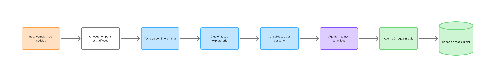
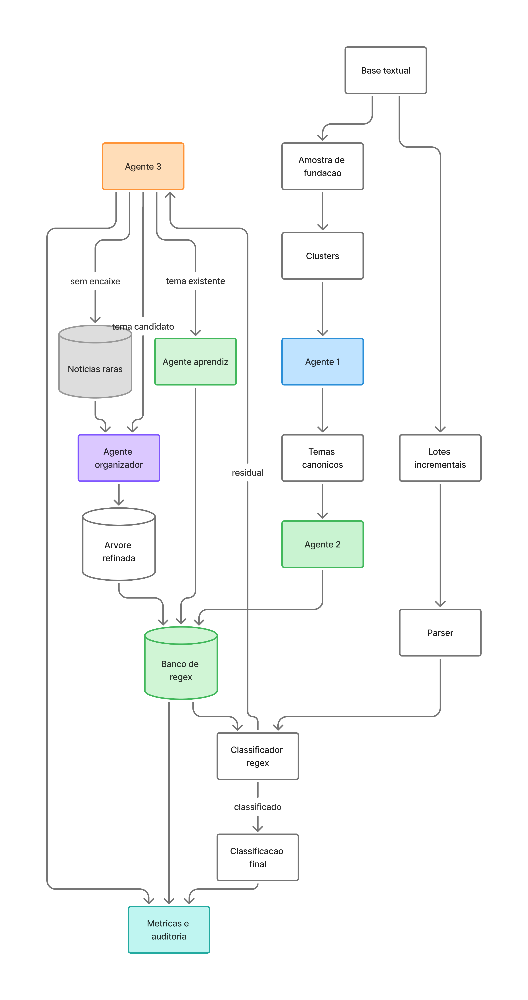
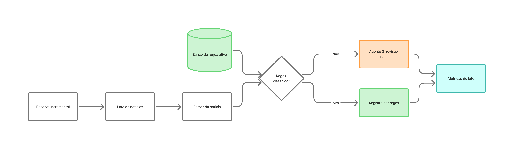
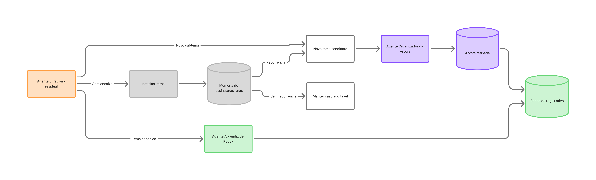

# Uma Metodologia Incremental para Clusterização, Classificação e Aprendizado Contínuo em Grandes Bases Textuais

## Resumo

Grandes bases textuais institucionais crescem continuamente e tornam custosa a organização temática, a classificação e a revisão manual de documentos. Este trabalho propõe uma metodologia incremental, autônoma e auditável para clusterizar, classificar e aprender continuamente a partir dessas bases. A abordagem combina amostragem temporal estratificada, clusterização exploratória, consolidação semântica por similaridade do cosseno, agentes de linguagem com respostas estruturadas, geração e validação de expressões regulares, classificação residual por LLM e reorganização periódica de uma árvore temática. A LLM não atua como classificador principal da base inteira: ela revisa apenas os resíduos que escapam das regras determinísticas, e parte desse aprendizado pode ser convertida em regras reutilizáveis para lotes futuros. Como aplicação empírica, a metodologia é aplicada a 8.106 notícias públicas da Polícia Federal, base real e heterogênea marcada por linguagem institucional, termos especializados, localidades, nomes de operação e atualização temporal. Na aplicação documentada, 15% da base foi usada como amostra inicial e 85% como reserva incremental. A etapa inicial gerou 24 clusters consolidados, 17 temas canônicos e 5.739 regex iniciais aceitas. Na reserva incremental, 94,73% dos textos foram classificados diretamente por regex, enquanto 5,27% exigiram revisão residual por LLM. Os resultados indicam que a metodologia pode apoiar processos institucionais de organização temática, classificação auditável, aprendizado contínuo e redução de custos operacionais em bases textuais volumosas e em crescimento.

## 1. Introdução

Instituições públicas que produzem ou analisam informação em larga escala, como o Ipea, institutos estaduais de segurança pública, observatórios, órgãos de controle e centros de pesquisa aplicada, lidam cada vez mais com grandes volumes de textos. Relatórios, notícias, registros administrativos, descrições de ocorrências, documentos técnicos e comunicados institucionais acumulam evidências relevantes para análise de políticas públicas, mas nem sempre chegam organizados em categorias estáveis. O desafio deixa de ser apenas armazenar documentos: passa a ser transformar fluxos textuais contínuos em informação temática, comparável, auditável e reutilizável.

Esse processo é difícil porque grandes bases textuais são heterogêneas, crescem ao longo do tempo e frequentemente combinam temas recorrentes com temas emergentes. Além disso, apresentam variação lexical, repetição de formatos, mudanças temporais de enfoque e elementos acidentais, como localidades, nomes próprios, códigos internos, operações, eventos e entidades. A rotulagem humana tende a ser cara e pouco escalável; por outro lado, uma classificação automática sem controle pode reproduzir ruído, transformar metadados em categorias e gerar taxonomias instáveis. Em ambientes institucionais, esse problema e também operacional: cada nova rodada de dados exige custo, tempo, documentação e capacidade de revisão.

Modelos de linguagem ampliam a capacidade de interpretar textos e podem apoiar tarefas de classificação, extração de evidências e nomeação de temas. No entanto, usar LLM em toda a base pode ser caro, pouco previsível e menos reprodutível quando não há uma camada determinística de verificação. A proposta deste trabalho parte dessa tensão: usar LLM onde ela agrega mais valor, isto é, nos resíduos e exceções, e converter parte desse aprendizado em regras auditáveis para reduzir chamadas futuras. Com isso, busca-se um ciclo de aprendizado contínuo que contribua para diminuir custos operacionais ao longo do tempo.

Este Texto para Discussão tem como objetivo propor uma metodologia incremental, autônoma e transparente para clusterizar, classificar e aprender continuamente a partir de grandes bases textuais. A proposta busca responder a um problema operacional comum a instituições que lidam com dados textuais em larga escala: como organizar temas recorrentes, reconhecer exceções, reduzir custo de inferência e preservar rastreabilidade ao longo de sucessivas rodadas de dados. A metodologia é aplicada empiricamente a notícias públicas da Polícia Federal, por constituírem uma base real, volumosa, heterogênea e marcada por termos especializados; nessa aplicação, o alvo de classificação é crime ou modus operandi. O texto está organizado da seguinte forma: a seção 2 apresenta o referencial teórico; a seção 3 discute trabalhos relacionados; a seção 4 detalha a metodologia; a seção 5 apresenta os resultados; a seção 6 apresenta Conclusão, critérios de qualidade e limitações observadas; e o Apêndice registra resultados por lote.

A metodologia proposta parte de quatro premissas:

1. A maior parte da base tende a ser composta por temas recorrentes.
2. Temas recorrentes podem ser capturados por regras regex bem ancoradas nos atributos substantivos do domínio.
3. A LLM deve ser usada prioritariamente nos resíduos, isto é, nos casos que escapam das regras.
4. Cada resíduo deve deixar uma trilha auditável e, quando possível, transformar-se em aprendizado para reduzir chamadas futuras de LLM.

O resultado esperado não é apenas uma classificação pontual da base usada como aplicação, mas um procedimento transferível de clusterização, classificação e treinamento incremental autônomo, sem intervenção humana no ciclo operacional.

## 2. Referencial teórico

A metodologia proposta se apoia em quatro famílias conceituais: clusterização de textos, representações semânticas por embeddings, classificação por regras interpretáveis e uso controlado de modelos de linguagem. Esses elementos não são tratados como técnicas isoladas, mas como partes de uma arquitetura incremental. A clusterização organiza a diversidade inicial da base; os embeddings permitem estimar proximidade semântica entre documentos e temas; as regras oferecem classificação determinística e auditável; e a LLM atua nos casos residuais, em que a regra ainda não acumulou evidência suficiente.

A clusterização de textos é usada como mecanismo exploratório para revelar agrupamentos iniciais em uma base sem rótulos consolidados. Em coleções institucionais, esse procedimento ajuda a identificar regiões temáticas recorrentes sem exigir uma taxonomia prévia completa. Contudo, clusters não devem ser confundidos com categorias finais. Um cluster pode refletir um crime, uma forma de redação, uma localidade, uma operação específica ou uma combinação desses elementos. Por isso, a metodologia trata clusters como folhas exploratórias, sujeitas a consolidação semântica e revisão por agentes antes de se tornarem temas canônicos.

Embeddings e similaridade do cosseno fornecem uma camada de comparação semântica entre documentos, clusters e temas. Essa camada é útil tanto na fundação temática quanto na execução incremental, pois ajuda a indicar quando uma notícia residual se aproxima de um tema já existente ou quando um conjunto de resíduos sugere uma folha nova. Ainda assim, a similaridade não substitui a decisão temática: ela funciona como evidência auxiliar. A classificação final precisa respeitar o alvo substantivo definido pela aplicação, evitando que proximidades superficiais, entidades frequentes ou localidades dominantes sejam transformadas em categorias principais.

O uso de regras interpretáveis, especialmente expressões regulares, aproxima a proposta de abordagens de supervisão fraca e rotulagem programática. A vantagem operacional das regex é sua auditabilidade: cada classificação pode ser rastreada até um padrão textual explícito. Ao mesmo tempo, regras escritas manualmente tendem a ser incompletas, rígidas e custosas de manter. A contribuição metodológica está em usar agentes para gerar, validar e atualizar essas regras a partir de evidências observadas, mantendo a classificação determinística como camada principal e reduzindo progressivamente a dependência de inferência por modelo.

Modelos de linguagem entram como componente interpretativo e residual. Em vez de usar LLM para classificar toda a base, a metodologia restringe sua atuação aos documentos que escapam do banco de regex. Esse desenho busca equilibrar capacidade semântica e custo operacional: a LLM interpreta exceções, registra justificativas, sugere temas candidatos ou documentos raros e produz insumos para novas regras. O aprendizado incremental ocorre quando essas decisões residuais são convertidas em regex, reorganização da árvore temática ou memória auditável de casos raros.

Por fim, a metodologia adota uma perspectiva de aprendizado contínuo. A base textual cresce ao longo do tempo, e a taxonomia precisa acompanhar esse crescimento sem perder estabilidade. Isso exige separar temas canônicos, folhas candidatas, documentos raros e metadados auxiliares. Exige também registrar métricas de cobertura, resíduos, consumo de tokens, custo operacional e alterações no banco de regras. Assim, o referencial teórico combina técnicas de descoberta não supervisionada, regras determinísticas e revisão por LLM em um ciclo de classificação incremental, auditável e transferível.

## 3. Trabalhos relacionados

A metodologia proposta se aproxima de pesquisas sobre supervisão fraca, modelagem de tópicos, uso de LLMs como fontes de rotulagem, construção automática de taxonomias e bootstrapping de regras. Esses trabalhos mostram que a redução de custo de rotulagem e inferência é um problema recorrente em grandes bases textuais. A diferença central deste Texto para Discussão está na integração dessas ideias em um ciclo operacional único, no qual clusters, agentes, regex, revisão residual e reorganização temática atuam de forma incremental e auditável.

A literatura de supervisão fraca e *data programming*, representada por Snorkel (Ratner et al., 2017; Ratner et al., 2018), propõe o uso de funções de rotulagem para gerar sinais programáticos em bases pouco ou não rotuladas. Trabalhos de supervisão fraca orientada por ontologias, como Fries et al. (2021), também mostram que regras, ontologias e conhecimento de domínio podem apoiar classificação em contextos especializados. Este trabalho se aproxima dessa literatura ao usar regras interpretáveis como fonte de classificação, mas se diferencia porque as regex não são apenas sinais fracos para treinar outro modelo: elas permanecem como classificador operacional, versionado e atualizado pelo ciclo incremental.

A etapa de descoberta temática dialoga com a modelagem de tópicos e com técnicas de clusterização baseadas em embeddings. LDA (Blei, Ng e Jordan, 2003), HDBSCAN (McInnes, Healy e Astels, 2017), Sentence-BERT (Reimers e Gurevych, 2019) e BERTopic (Grootendorst, 2022) oferecem referências importantes para organizar coleções textuais em grupos semanticamente próximos. A diferença deste trabalho é que os clusters não são tratados como categorias finais. Eles funcionam como folhas exploratórias, posteriormente interpretadas por agentes, consolidadas em temas canônicos e operacionalizadas por regex auditáveis.

Pesquisas recentes também investigam o uso de LLMs em supervisão fraca e geração de funções de rotulagem. Smith et al. (2022) discutem modelos de linguagem no ciclo de supervisão fraca, enquanto Guan, Chen e Koudas (2023) analisam se LLMs podem desenhar funções de rotulagem precisas. Este trabalho compartilha a ideia de usar LLMs para reduzir esforço humano, mas restringe seu papel: a LLM não rotula toda a base e não substitui a camada determinística. Ela atua nos resíduos, gera evidências estruturadas e pode produzir aprendizado convertido em regex para reduzir chamadas futuras.

A construção automática de taxonomias com LLMs, embeddings e palavras-chave, discutida por Balakrishnan (2025), é outro eixo relacionado. No presente trabalho, a árvore temática também é ajustada por agentes, mas com finalidade operacional: ela orienta o banco de regex, a revisão residual, o tratamento de documentos raros e as métricas de custo. De modo complementar, técnicas clássicas de bootstrapping de padrões, como Snowball (Agichtein e Gravano, 2000), inspiram a ideia de transformar evidências observadas em regras reutilizáveis. A contribuição aqui está em aplicar esse princípio à classificação temática incremental, com agentes especializados, memória de exceções, validação de regex e relatórios de cobertura por lote.

Assim, a contribuição deste trabalho não está em propor isoladamente clusterização, regex, LLM ou supervisão fraca. O destaque está na engenharia do ciclo completo: uma metodologia autônoma, sem intervenção humana operacional, que descobre temas em amostra temporal, gera temas canônicos, cria regex iniciais, classifica a massa em lotes, usa LLM apenas nos resíduos, aprende novas regras, reorganiza a árvore e documenta custo, cobertura, evidências e exceções.

## 4. Metodologia

A metodologia proposta organiza grandes coleções de textos em um ciclo incremental, autônomo e auditável. Sua premissa central é separar o trabalho recorrente, que pode ser resolvido por regras determinísticas, do trabalho interpretativo, que deve ser reservado para casos residuais. Em vez de acionar LLM para toda a base, o método usa a LLM apenas quando o banco de regras não encontra evidência suficiente. Cada residual revisado pode produzir aprendizado reutilizável, reduzindo chamadas futuras e contribuindo para queda progressiva do custo operacional.

O ciclo metodológico possui duas fases complementares. A primeira é a fundação temática, construída a partir de uma amostra temporal da base. Nessa fase, a clusterização exploratória organiza a diversidade inicial, a similaridade do cosseno consolida folhas próximas, o Agente 1 nomeia temas canônicos e o Agente 2 gera regex iniciais. A segunda fase é a execução incremental, em que a massa restante passa por parser, classificador regex, revisão residual por LLM quando necessário, aprendizado de novas regras e reorganização periódica da árvore temática.


A figura apresenta a metodologia como um ciclo fechado. A base alimenta uma descoberta inicial de temas; os temas são transformados em regras; as regras classificam novos lotes; os resíduos seguem para revisão; as exceções geram aprendizado; e a árvore temática é reorganizada periodicamente. A imagem também evidencia que a metodologia não termina quando uma base é classificada: ela busca acumular aprendizado para que ciclos futuros dependam menos de inferência e mais de regras auditáveis.

### 4.1 Alvo da classificação e controles de domínio

A primeira decisão metodológica é definir qual atributo substantivo deve ser classificado. Em uma base jurídica, esse atributo pode ser tipo de ação; em uma base de saúde, pode ser agravo ou procedimento; em uma base de segurança, pode ser natureza criminal ou modus operandi. Essa definição orienta a construção do texto de domínio, a nomeação dos temas canônicos e a validação das regex.

Na aplicação com notícias da Polícia Federal, o alvo da classificação é o domínio criminal ou o modus operandi principal. Por isso, categorias como `trafico_drogas`, `crimes_contra_criancas`, `crime_organizado`, `corrupcao_desvio_recursos_publicos`, `crimes_ambientais`, `armas_municoes`, `falsificacao_documental` e `moeda_falsa` são temas substantivos. Localidades, unidades da federação, nomes de operação, órgãos parceiros e entidades ocasionais são preservados para auditoria, mas não entram como temas canônicos principais.

Essa separação evita que a clusterização transforme metadados frequentes em classes finais. Ao mesmo tempo, a arquitetura permite criar camadas analíticas complementares. Agentes especializados derivados da lógica do Agente 2 podem ser usados para extrair localidades, órgãos, entidades ou nomes de operações como dimensões separadas, sem contaminar a taxonomia temática principal.

### 4.2 Unidade de classificação e exemplo de notícia

A unidade classificada pela metodologia é o documento textual individual. Na aplicação empírica, essa unidade é uma notícia pública da Polícia Federal. Cada notícia é tratada como um registro composto por campos estruturados, como Título, Subtítulo, data, tags e corpo. O objetivo não é classificar todos os elementos presentes no texto, mas atribuir uma label principal ao documento a partir do atributo substantivo definido na seção anterior.

| Campo da notícia | Uso na metodologia |
|---|---|
| Título | Sinal forte sobre o evento principal |
| Subtítulo | Complementa a conduta ou o objeto investigado |
| Tags | Indicam pistas temáticas, mas não definem sozinhas a classe |
| Corpo | Fornece evidências, contexto, modo de execução e objetos relacionados |
| Localidade, órgãos e nomes de operação | Preservados para auditoria, mas controlados para não virarem tema principal |

A tabela mostra como a notícia é decomposta antes da classificação. O classificador deve procurar o crime, a conduta ou o modus operandi dominante. Assim, uma notícia pode mencionar um estado, uma delegacia, uma operação e um órgão parceiro, mas esses elementos não devem substituir o alvo substantivo.

Um exemplo real da aplicação ajuda a explicitar o objeto classificado. Antes da decomposição em campos, a notícia pode ser representada como um quadro textual, preservando a forma geral do documento que entra no pipeline. Nos blocos técnicos abaixo, a ausência de diacríticos reproduz a forma normalizada utilizada pelo processamento computacional; no texto analítico, mantém-se a ortografia acentuada:

```text
<noticia>
Fonte: Policia Federal
Link: https://www.gov.br/pf/pt-br/assuntos/noticias/2024/08/a-ficco-rj-deflagra-operacao-em-combate-a-aquisicao-ilegal-de-armas-de-fogo
Arquivo local: data/noticias_markdown/a-ficco-rj-deflagra-operacao-em-combate-a-aquisicao-ilegal-de-armas-de-fogo-7f84a6a5.md
Publicacao: 27/08/2024

Titulo:
A FICCO/RJ deflagra operacao em combate a aquisicao ilegal de armas de fogo

Tags:
Operacao PF; Rio de Janeiro; Arma de fogo ilegal

Resumo do corpo:
A noticia descreve uma operacao da Policia Federal voltada a apurar aquisicao ilegal de armas por meio de documentos falsos. O texto informa cumprimento de mandados em Bom Jardim/RJ, menciona suspeita de uso de certificado de registro de arma de fogo falso e registra prisao em flagrante por posse ilegal de arma de fogo de uso restrito.
</noticia>
```

Em seguida, esse mesmo documento é convertido em campos metodologicos:

| Campo | Exemplo metodológico |
|---|---|
| Fonte | [A FICCO/RJ deflagra operação em combate a aquisição ilegal de armas de fogo](https://www.gov.br/pf/pt-br/assuntos/noticias/2024/08/a-ficco-rj-deflagra-operacao-em-combate-a-aquisicao-ilegal-de-armas-de-fogo) |
| Publicação | 27/08/2024, Polícia Federal |
| Título | A FICCO/RJ deflagra operação em combate a aquisição ilegal de armas de fogo |
| Tags | Operação PF; Rio de Janeiro; Arma de fogo ilegal |
| Corpo da notícia | A operação apura aquisição ilegal de armas por meio de documentos falsos, com mandados em Bom Jardim/RJ e prisão em flagrante por posse ilegal de arma de fogo de uso restrito. |
| Trechos relevantes | "aquisição ilegal de arma de fogo"; "certificado de registro de arma de fogo falso"; "posse ilegal de arma de fogo de uso restrito" |
| Alvo de classificação | Crime ou modus operandi principal |
| Label esperada | `armas_municoes` |

Nesse exemplo, a label não decorre de Rio de Janeiro, Bom Jardim/RJ, FICCO/RJ ou do nome da operação. Esses elementos são preservados como contexto e auditoria, mas não definem o tema canônico. A label decorre dos sinais substantivos ligados a armas de fogo, posse ilegal, aquisição ilegal e uso de documento falso para obter armamento. A classificação final do documento deve refletir essa família temática dominante.

### 4.3 Ingestão, amostra de fundação e reserva incremental

A ingestão divide a base em duas massas. A primeira é uma amostra inicial, preferencialmente estratificada no tempo, usada para construir a fundação temática. A segunda é a reserva incremental, composta pelos documentos restantes, usada para testar a cobertura das regras, medir resíduos e observar o aprendizado do sistema ao longo dos lotes.



A figura apresenta a fase de fundação. A amostra temporal é convertida em texto de domínio, passa por clusterização exploratória, e os clusters são consolidados por similaridade do cosseno. Em seguida, o Agente 1 transforma folhas de clusters em temas canônicos, e o Agente 2 gera regex iniciais para o banco ativo. A fração da amostra, o tamanho dos lotes e os parâmetros operacionais podem variar conforme o domínio, o volume da base e o custo aceitável de inferência.

### 4.4 Texto de domínio, clusterização e similaridade

Antes da clusterização, cada documento e transformado em texto de domínio. Essa etapa seleciona sinais relevantes para o atributo que se deseja classificar e reduz o peso de elementos acidentais. Na aplicação empírica, o texto de domínio prioriza Título, Subtítulo, tags, condutas, crimes, objetos ilícitos, modus operandi e trechos relevantes do corpo, enquanto reduz localidades, nomes de operação, órgãos parceiros e termos administrativos genéricos.

A clusterização tem papel exploratório. Ela organiza a amostra inicial em folhas semanticamente próximas, mas não define a classificação final. Essa distinção é importante: clusters podem refletir formato textual, localidade, entidade ou recorrência lexical, e não necessariamente o tema substantivo desejado. Por isso, os clusters são insumo para os agentes, não categorias finais.

Depois da clusterização bruta, a similaridade do cosseno é usada para consolidar clusters próximos. Essa etapa reduz fragmentacao e ajuda a identificar folhas que pertencem ao mesmo tema. Na aplicação PF, por exemplo, clusters sobre abuso sexual infantil, pornografia infantojuvenil e compartilhamento de material podem ser consolidados em um mesmo campo temático. Em outro domínio, a mesma etapa deve consolidar folhas segundo o atributo substantivo definido para a taxonomia.

### 4.5 Agentes da metodologia



A figura apresenta o fluxo simplificado entre os agentes da metodologia. Ela indica apenas de onde vem cada insumo e para onde segue cada saída: a amostra de fundação alimenta os clusters, os clusters alimentam os temas canônicos, os temas alimentam o banco inicial de regex, e os lotes incrementais percorrem parser, classificador regex, revisão residual, aprendizado e reorganização da árvore. Os detalhes de decisão de cada agente são descritos a seguir, para evitar que o diagrama assuma uma Função explicativa excessiva.

A metodologia utiliza agentes especializados para separar responsabilidades. Essa divisão evita que um único agente decida simultaneamente clusters, temas, regex, resíduos e reorganização taxonômica. Cada agente recebe um tipo de entrada, produz uma saída estruturada e deixa evidências auditáveis.

O Agente 1 recebe clusters consolidados e cria temas canônicos. Sua Função e agregar folhas que pertencem ao mesmo domínio substantivo, separar subtemas quando houver identidade distinta e impedir que localidades, entidades ou nomes de operação virem classes principais. Ele atua como bifurcador de temas e precisa considerar o conjunto completo de temas disponíveis antes de promover uma nova categoria.

O Agente 2 recebe temas canônicos e evidências associadas a cada folha. Sua Função e gerar regex iniciais suficientes para cobrir a diversidade observada em cada tema. As regras precisam ser ancoradas no atributo substantivo do domínio. Na aplicação PF, isso significa crime, conduta ou modus operandi. Regex baseadas apenas em localidade, nome de operação, órgão ou entidade acidental devem ser rejeitadas ou deslocadas para camadas analíticas complementares.

O Agente 3 atua apenas nos resíduos, isto é, nos documentos que não foram classificados por regex. Ele recebe o texto estruturado, as labels canônicas disponíveis, sugestões por similaridade do cosseno e evidências textuais. Sua decisão pode classificar o documento em tema existente, propor novo tema candidato ou registrar o caso como documento raro quando não houver encaixe defensável.

O Agente Aprendiz de Regex recebe decisões residuais e tenta converter evidências em regras reutilizáveis. Ele não reclassifica o documento; sua tarefa e produzir regex candidata e validar se ela captura o caso positivo sem depender de metadados acidentais. Quando aprovada, a regra entra no banco ativo e pode reduzir chamadas futuras de LLM.

O Agente Organizador da Árvore realiza uma revisão global dos temas. Ele recebe temas canônicos, candidatos criados pelo Agente 3, contagens, evidências, regex aprendidas e sugestões por similaridade. Sua Função e evitar crescimento desordenado da taxonomia, decidindo se candidatos devem ser absorvidos por temas existentes, promovidos, consolidados em macrotemas, mantidos como raros ou descartados como ruído.

### 4.6 Execução incremental e caminho do documento

Na execução incremental, a reserva é processada em lotes. Cada documento passa primeiro pelo parser, que estrutura os campos relevantes. Depois, o classificador regex tenta atribuir uma label. Se a regra classifica acima do limiar definido, a decisão é registrada como classificação determinística. Se a regra falha, o documento segue para revisão residual pelo Agente 3.



A figura apresenta o caminho operacional do documento. O banco de regex aparece antes da LLM porque a metodologia adota uma lógica `regex-first`: tudo que já foi aprendido deve ser resolvido de forma determinística; somente o que escapa das regras deve consumir inferência. Essa escolha permite medir, lote a lote, quanto da base foi absorvido por regras e quanto ainda depende de interpretação por modelo.

### 4.7 Aprendizado residual, documentos raros e reorganização da árvore

O aprendizado residual é o mecanismo que fecha o ciclo incremental. Quando o Agente 3 classifica um residual em tema canônico ou identifica um novo tema candidato, o caso pode alimentar o Agente Aprendiz de Regex. Quando não há encaixe defensável, o documento é registrado como raro. Documentos raros não devem gerar tema ou regex imediatamente, mas recebem assinatura para que recorrências futuras possam ser detectadas.

Quando um documento chega ao Agente 3, ele já falhou na classificação determinística por regex. Nesse ponto, a LLM recebe o texto estruturado, a lista de labels canônicas, eventuais sugestões por similaridade do cosseno e os trechos mais informativos do documento. A tarefa da LLM não é apenas escolher uma label: ela precisa indicar quais evidências sustentam a decisão, quais termos foram decisivos e se o caso deve gerar uma regra candidata. Essa etapa funciona como um mapa de evidências: os trechos mais relevantes recebem peso interpretativo maior porque explicam por que a notícia pertence a uma família temática.

Para ilustrar essa etapa com um documento diferente, considere a notícia [PF deflagra operação contra crimes de mineração ilegal](https://www.gov.br/pf/pt-br/assuntos/noticias/2024/01/pf-deflagra-operacao-contra-crimes-de-mineracao-ilegal), publicada pela Polícia Federal em 17/01/2024. Assim como na unidade de classificação apresentada anteriormente, o documento pode ser representado como um quadro textual antes de seguir para a LLM:

```text
<noticia>
PF deflagra operação contra crimes de mineração ilegal
Mais de 70 policiais federais cumprem mandados de prisão e busca e apreensão
Publicado em 17/01/2024 09h48
Tags: Bahia, Operação PF, Mineração ilegal
Juazeiro/BA. A Polícia Federal deflagrou, na manhã desta quarta-feira (17/1), a Operação Gameleira, com o objetivo de desarticular grupo criminoso que vem, reiteradamente, praticando os crimes de mineração ilegal, usurpação de bens da União, porte ilegal de explosivos e associação criminosa armada, em conjunto com diversos garimpeiros locais e estrangeiros, na região de Jaguarari/BA, Campo Formoso/BA e Oliveira dos Brejinhos/BA.
Desde as primeiras horas da manhã, mais de 70 policiais federais cumprem mandados de prisão preventiva, mandado de prisão internacional (INTERPOL) e mandados de busca e apreensão, nos municípios de Salvador/BA, Campo Formoso/BA, Jaguarari/BA, Oliveira dos Brejinhos/BA e Petrolina/PE.
As investigações revelaram que os proprietários de uma fazenda em Jaguarari/BA, local com diversos pontos de garimpo, organizavam e permitiam a extração de quartzo verde na propriedade rural por garimpeiros da região, sem qualquer autorização da Agência Nacional de Mineração (ANM) ou licença ambiental, mediante o pagamento de valores. Em seguida, o mineral era exportado para a China, através do Porto de Salvador, em contêineres.
Os investigados responderão pelos crimes de mineração ilegal, usurpação de bens da União, porte ilegal de explosivos e associação criminosa armada cujas penas, somadas, ultrapassam 15 anos de prisão.
Setor de Comunicação Social Polícia Federal / Bahia cs.srba@pf.gov.br | www.pf.gov.br
</noticia>
```

Supondo que essa notícia não tenha sido capturada pelo banco de regex inicial, ela seguiria como residual para o Agente 3. O texto enviado a LLM preservaria a fonte, o Título, as tags e os trechos do corpo associados a mineração ilegal, usurpacao de bens da União, garimpo, ausência de autorização da ANM ou licença ambiental, e eventual associação criminosa ligada a exploracao mineral.

Nesse caso, o Agente 3 poderia produzir uma decisão estruturada como a seguinte:

```json
{
  "label": "crimes_ambientais",
  "confidence": "alta",
  "fonte": "https://www.gov.br/pf/pt-br/assuntos/noticias/2024/01/pf-deflagra-operacao-contra-crimes-de-mineracao-ilegal",
  "titulo": "PF deflagra operacao contra crimes de mineracao ilegal",
  "evidencias": [
    "crimes de mineracao ilegal",
    "usurpacao de bens da Uniao",
    "extracao de quartzo verde sem autorizacao da ANM ou licenca ambiental"
  ],
  "justificativa": "A noticia descreve exploracao mineral irregular, sem autorizacao do orgao competente e sem licenca ambiental, com indicios de usurpacao de bens da Uniao.",
  "acao_aprendizado": "gerar_regex"
}
```

A partir dessa decisão, o Agente Aprendiz de Regex não usa o texto inteiro de forma indiscriminada. Ele seleciona os termos que explicam a classificação e descarta sinais acidentais. No mesmo exemplo, localidades, datas, nomes de operação e órgãos são tratados como contexto, enquanto expressões ligadas a mineração ilegal, garimpo, extração mineral, ausência de autorização e licença ambiental viram candidatas a padrão. Uma regex candidata poderia assumir a forma:

```text
(mineracao|garimpo|extracao).{0,80}(ilegal|irregular|clandestina|sem autorizacao|sem licenca).{0,80}(minerio|ouro|quartzo|recurso mineral|bem da uniao)
```

Esse padrão representa o aprendizado extraido do residual. Ele deve ser validado contra o caso positivo e contra exemplos negativos antes de entrar no banco ativo. Se aprovado, passa a classificar documentos semelhantes em lotes futuros sem nova chamada de LLM.



A figura mostra a relação entre revisão residual, aprendizado e reorganização. Um residual pode gerar regex incremental, candidato de tema ou memória de documento raro. Quando assinaturas raras reaparecem, elas podem voltar ao ciclo como candidatos. Periodicamente, o Agente Organizador da Árvore analisa o conjunto completo e decide o que deve ser absorvido, promovido ou mantido como raro.

### 4.8 Banco de regex, métricas e auditabilidade

O banco de regex é o classificador determinístico principal da metodologia. Ele registra label, padrão, fonte, exemplos, usos e origem da regra. Ao longo dos lotes, esse banco pode receber regex incrementais aprovadas pelo ciclo residual. Com isso, a metodologia preserva interpretabilidade e cria uma trilha clara entre evidência textual, regra e classificação.

O custo operacional da metodologia deve ser medido pela proporção de documentos resolvidos por regex e pela quantidade de tokens consumidos nos resíduos enviados a LLM. Para cada lote, o sistema registra `prompt_tokens_total`, `completion_tokens_total`, `tokens_total` e `avg_tokens_per_llm`. Para cada documento residual, o evento individual em `events.jsonl` registra os tokens da chamada.

Cada etapa produz artefatos persistentes. Isso permite reconstruir a origem da amostra, os clusters, as decisões dos agentes, as regras incorporadas, as métricas por lote e os casos raros.

| Artefato | Função |
|---|---|
| `documentos_base.jsonl` | Base estruturada usada na execução |
| `amostra_inicial.csv` | Amostra temporal da fundação |
| `reserva_incremental.csv` | Massa processada em lotes |
| `resumo_clusters_amostra.csv` | Resumo dos clusters da amostra |
| `temas_canonicos_agent1.json` | Temas iniciais do Agente 1 |
| `regex_iniciais_agent2.json` | Regex iniciais propostas |
| `regex_classifier_rules.json` | Banco ativo de regex |
| `metrics_batches.csv` | Métricas por lote |
| `resumo_custo_tokens.json` | Resumo do consumo de tokens nas chamadas LLM residuais |
| `events.jsonl` | Trilha completa de eventos |
| `temas_candidatos_agent3.jsonl` | Candidatos criados no residual |
| `arvore_temas_agent1_refinada.json` | Árvore refinada |
| `noticias_raras_observacoes.jsonl` | Memória incremental de notícias raras |
| `classificacoes_incrementais_pos_quarentena.csv` | Saída final consolidada |

A tabela lista os artefatos de auditoria. Eles tornam o ciclo transparente: cada classificação pode ser rastreada até a regra, o agente, o lote ou a decisão residual que a produziu.

### 4.9 Reprodutibilidade e aplicação em outra base de dados

A metodologia pode ser reproduzida em outra base textual desde que a nova aplicação explicite o alvo substantivo da classificação, disponha de documentos com texto suficiente para gerar evidências e preserve os artefatos de execução. O que se transfere não é a taxonomia criminal da Polícia Federal nem o banco de regex obtido neste estudo, mas a arquitetura: fundação temática em amostra, classificação determinística primeiro, revisão residual por LLM, aprendizado validado de regras e registro de auditoria.

Ao migrar para outro domínio, como saúde pública, decisões judiciais, atendimento ao cidadão ou atos administrativos, o pesquisador deve redefinir as categorias de interesse e os controles que impedem metadados incidentais de virarem classes. Por exemplo, em saúde o alvo pode ser agravo ou procedimento, enquanto hospital, município e profissional devem ser dimensões auxiliares; em decisões judiciais, o alvo pode ser matéria ou resultado, enquanto tribunal e relator permanecem metadados.

| Elemento | Mantido na reprodução | Adaptado à nova base |
|---|---|---|
| Unidade documental | Um registro textual por observação | Campos disponíveis, como título, ementa, descrição ou corpo |
| Alvo substantivo | Uma label principal auditável | Taxonomia e exemplos próprios do domínio |
| Fundação temática | Amostra estratificada, embeddings e clusterização | Fração amostral, estrato temporal ou institucional e parâmetros |
| Camada determinística | Banco versionado de regex com evidência | Vocabulário, padrões aceitos e critérios de validação |
| Revisão residual | LLM apenas para itens não cobertos | Prompt, modelo, limiar e política para casos raros |
| Auditoria | Artefatos, eventos, métricas e versão da execução | Nomes de arquivos, custos e critérios de avaliação |

O procedimento de reprodução pode ser executado nos seguintes passos:

1. Definir a pergunta analítica, a unidade documental e a label principal desejada, separando categorias substantivas de metadados auxiliares.
2. Ingerir e padronizar a nova base, registrando origem, período de coleta, campos utilizados, normalização de caracteres, remoção de duplicidades e eventuais filtros.
3. Reservar uma amostra de fundação estratificada por tempo ou por outra dimensão relevante e manter os demais documentos como reserva incremental.
4. Construir o texto de domínio, selecionando campos e termos que expressem o alvo de classificação e reduzindo sinais incidentais.
5. Gerar embeddings da amostra, executar a clusterização exploratória e registrar modelo, versão, semente aleatória, métrica e hiperparâmetros usados.
6. Consolidar clusters próximos e nomear temas canônicos, validando que as categorias representam o alvo substantivo definido no primeiro passo.
7. Gerar e validar as regex iniciais com exemplos positivos e negativos, versionando o banco ativo de regras.
8. Processar a reserva em lotes: aplicar primeiro as regex, encaminhar apenas resíduos à LLM e salvar classificação, evidências, tokens, modelo e versão do prompt.
9. Avaliar regex candidatas produzidas pelos resíduos e reorganizar periodicamente temas candidatos e casos raros, sem promover exceções isoladas de forma automática.
10. Relatar cobertura por regex, taxa residual, custo de inferência, alterações taxonômicas, casos raros e limitações, preservando os artefatos necessários para reexecução.

Para que a comparação entre execuções seja tecnicamente defensável, devem ser congelados ou registrados: versão da base de entrada; regras de limpeza e normalização; critério de amostragem; sementes aleatórias; modelo de embeddings; algoritmo e hiperparâmetros de clusterização; limiar de similaridade; banco de regex por versão; modelo de linguagem, prompt e schema de resposta; tamanho dos lotes; e métricas de custo e cobertura. Se um desses componentes mudar, a alteração deve ser documentada como uma nova execução, permitindo distinguir aprendizado incremental de mudança de configuração.

Essa estratégia torna o método replicável sem supor que os resultados da PF se generalizam automaticamente. Em cada nova base, a arquitetura é reproduzível; as categorias, regras e resultados precisam ser reconstruídos e avaliados segundo o domínio e a qualidade dos documentos disponíveis.

## 5. Resultados

Esta seção apresenta os resultados obtidos na aplicação empírica com notícias da Polícia Federal. Diferentemente da metodologia, que descreve como o ciclo funciona, os resultados mostram o que foi produzido por essa proposta: divisão da base, consolidação de clusters, geração de regex, cobertura por lote, aprendizado residual, tratamento de documentos raros e métricas de auditoria.

### 5.1 Desenho empírico da aplicação

A aplicação utilizou 8.106 notícias públicas da Polícia Federal. A base foi dividida em uma amostra inicial temporalmente estratificada é uma reserva incremental. A amostra de fundação foi usada para descobrir a estrutura temática inicial; a reserva foi usada para avaliar a capacidade do banco de regex de classificar documentos novos em lotes.

| Item | Valor |
|---|---:|
| Base total | 8.106 notícias |
| Amostra inicial | 1.216 notícias |
| Fração da amostra | 15% |
| Reserva incremental | 6.890 notícias |
| Estratificacao | Ano |

A tabela apresenta a divisão utilizada na aplicação empírica. Esses valores não são parâmetros obrigatórios da metodologia, mas indicam que uma fração relativamente pequena da base foi suficiente para gerar uma fundação temática usada na classificação incremental.

### 5.2 Fundação temática e temas canônicos

Na fundação temática, a clusterização inicial produziu 34 clusters brutos. A consolidação por similaridade do cosseno reduziu esse conjunto para 24 clusters consolidados, com 5 grupos fundidos e sem clusters classificados como ruído. Esse resultado mostra que a clusterização exploratória gerou folhas uteis, mas também revelou fragmentacao que precisava ser corrigida antes da nomeação canônica.

| Item | Valor |
|---|---:|
| Clusters brutos | 34 |
| Clusters consolidados | 24 |
| Grupos fundidos por cosseno | 5 |
| Clusters de ruído | 0 |
| Temas canônicos finais | 17 |

A tabela resume o efeito da consolidação. A redução de 34 clusters brutos para 24 clusters consolidados indica que parte da separação inicial era granular demais para ser tratada como tema final.


A figura mostra os principais grupos consolidados da fundação temática. Ela deve ser lida como fotografia da amostra inicial, não como taxonomia definitiva. Sua Função e mostrar quais regiões temáticas tiveram massa suficiente para orientar a etapa seguinte de nomeação canônica.


A figura apresenta a árvore operacional da aplicação PF. A esquerda aparecem temas canônicos; ao centro, as folhas de clusters que alimentam esses temas; a direita, termos dominantes usados como evidência. A visualização reforça que o tema final não é o cluster isolado, mas a agregação analítica de folhas por família substantiva.

### 5.3 Banco inicial e banco final de regex

O Agente 2 gerou 5.739 regex iniciais aceitas. Após consolidação e validação, 5.146 padrões permaneceram ativos como banco inicial. Ao longo da execução incremental, o ciclo residual adicionou 51 padrões aprendidos, resultando em 5.197 padrões regex ativos no banco final.

| Item | Valor |
|---|---:|
| Regex iniciais aceitas | 5.739 |
| Padrões iniciais ativos após consolidação | 5.146 |
| Padrões aprendidos pelo residual | 51 |
| Padrões regex ativos finais | 5.197 |
| Classificadores ativos | 23 |
| Labels ativas finais no banco | 23 |

A tabela descreve a composição do banco determinístico. A maior parte dos padrões veio da fundação temática, enquanto o ciclo residual adicionou regras novas para reduzir chamadas futuras de LLM. A ausência de limite artificial por tema permitiu que cada folha observada gerasse padrões próprios, desde que respeitasse os critérios de domínio.

### 5.4 Cobertura incremental e custo operacional

Na reserva incremental, 6.890 notícias foram processadas em 14 lotes. No acumulado, 6.527 notícias foram classificadas por regex e 363 seguiram para LLM residual. Isso representa taxa regex acumulada de 94,73% e taxa residual de 5,27%.

| Indicador | Valor |
|---|---:|
| Notícias na reserva incremental | 6.890 |
| Lotes processados | 14 |
| Tamanho médio dos lotes | 492,14 |
| Capturadas por regex | 6.527 |
| Residuais enviados a LLM | 363 |
| Taxa regex acumulada | 94,73% |
| Taxa residual LLM | 5,27% |
| Aprendizados por lote, em média | 3,64 |

A tabela resume o principal resultado operacional: a maior parte da reserva foi resolvida pelo classificador determinístico, concentrando o custo de LLM nos documentos residuais.


A figura compara, por iteração, quantos documentos foram resolvidos por regex e quantos precisaram de LLM residual. O contraste evidência que o regex domina o fluxo operacional.


A figura mostra a estabilidade da taxa de classificação por regex ao longo dos lotes. Ela permite acompanhar se a cobertura determinística se mantem estável ou se novos tipos de texto aumentam a dependência de LLM.

O custo deve ser lido por duas dimensões: proporção de documentos resolvidos por regex e consumo de tokens nos resíduos. Para cada lote, o sistema registra `prompt_tokens_total`, `completion_tokens_total`, `tokens_total` e `avg_tokens_per_llm`. Para cada documento residual, o evento individual em `events.jsonl` registra os tokens da chamada. Essa instrumentacao permite estimar custo operacional em execucoes futuras e comparar cenarios de modelo local, Groq ou OpenAI.

### 5.5 Aprendizado residual e notícias raras

Na execução documentada, 51 regras foram aprendidas no ciclo residual e permaneceram ativas no banco final. Das 48 ocorrências inicialmente tratadas como quarentena ou raras, 41 foram absorvidas por macrotemas após reorganização, e 7 permaneceram como `noticias_raras`.

| Item | Valor |
|---|---:|
| Regras aprendidas no ciclo residual | 51 |
| Padrões aprendidos ativos | 51 |
| Quarentenas reavaliadas | 48 |
| Reclassificadas para macrotemas | 41 |
| Mantidas como `noticias_raras` | 7 |
| `noticias_raras` no banco de regex | Não |

A tabela mostra que o ciclo residual produziu aprendizado sem transformar exceções isoladas em categorias definitivas. O banco final não possui regex para `noticias_raras`, pois esse estado funciona como memória operacional e não como tema substantivo. Ainda assim, documentos raros preservam assinatura e evidência para que recorrências futuras possam ser avaliadas pelo Agente Organizador.


A figura apresenta a distribuição final das notícias por tema na aplicação PF. Os maiores volumes ficaram em `trafico_drogas`, `crimes_contra_criancas`, `crime_organizado` e `corrupcao_desvio_recursos_publicos`, enquanto `noticias_raras` permaneceu residual, com 7 casos finais.

## 6. Conclusão

A metodologia implementa um ciclo fechado de clusterização, classificação e aprendizado incremental para grandes bases textuais. Ela usa uma amostra temporal para descobrir a fundação temática, clusterização e similaridade para organizar a diversidade inicial, agentes especializados para nomear temas e gerar regex, regex para classificar a maior parte da massa, LLM apenas para resíduos e um mecanismo de aprendizado que converte exceções recorrentes em regras reutilizáveis.

Na aplicação com notícias da Polícia Federal, o resultado principal é a demonstração de uma arquitetura de baixo custo e alta rastreabilidade: 94,73% da reserva incremental foi classificada por regex, enquanto 5,27% exigiu LLM residual. Os textos que não se encaixaram imediatamente não foram descartados; foram convertidos em `noticias_raras`, com assinaturas auditáveis capazes de alimentar futuros candidatos quando houver recorrência.

A leitura dos resultados deve considerar cinco critérios de qualidade. O primeiro é custo, medido pela proporção de documentos classificados por regex antes de acionar LLM e pela quantidade de tokens consumidos nos resíduos. O segundo é cobertura, isto é, a capacidade do banco de regex capturar temas recorrentes da base textual. O terceiro é precisão operacional, protegida por validadores que rejeitam regex ancoradas apenas em localidade, entidade, nome de operação ou termo genérico. O quarto é estabilidade taxonômica, associada a capacidade de impedir proliferação de microtemas. O quinto é transparência, garantida por artefatos, eventos, evidências e métricas persistentes.

A aplicação também evidenciou limitações. A qualidade da fundação depende da amostra inicial: uma amostra pequena pode deixar de observar temas raros ou emergentes. Clusterização não equivale a categoria final, pois clusters podem refletir formato textual, localidade, entidade ou termos institucionais. Regex são interpretáveis, mas podem gerar falsos positivos se forem amplas demais. Documentos raros exigem memória incremental: se forem ignorados, o sistema perde aprendizado; se forem promovidos cedo demais, o banco fica ruidoso. Por fim, os resultados dependem do modelo LLM disponível e da qualidade dos schemas estruturados, razão pela qual o uso de fallback local ou remoto deve ser registrado em eventos.

Mesmo com essas limitações, a abordagem e transferível para outros domínios textuais em que haja grande volume, crescimento contínuo, baixa disponibilidade de rotulagem humana, necessidade de transparência e pressão por redução de custo de inferência. A contribuição central não é classificar apenas uma base específica, mas propor uma forma auditável de transformar classificações residuais em aprendizado incremental.

## 7. Referências conceituais

- McInnes, L.; Healy, J.; Astels, S. HDBSCAN: Hierarchical density based clustering. Journal of Open Source Software, 2017.
- Reimers, N.; Gurevych, I. Sentence-BERT: Sentence embeddings using Siamese BERT-networks. EMNLP-IJCNLP, 2019.
- Ratner, A. et al. Snorkel: Rapid Training Data Creation with Weak Supervision. arXiv:1711.10160, 2017. https://arxiv.org/abs/1711.10160
- Ratner, A. et al. Snorkel DryBell: A Case Study in Deploying Weak Supervision at Industrial Scale. arXiv:1812.00417, 2018. https://arxiv.org/abs/1812.00417
- Fries, J. A. et al. Ontology-driven weak supervision for clinical entity classification in electronic health records. Nature Communications, 2021. https://www.nature.com/articles/s41467-021-22328-4
- Blei, D. M.; Ng, A. Y.; Jordan, M. I. Latent Dirichlet Allocation. Journal of Machine Learning Research, 2003.
- Grootendorst, M. BERTopic: Neural topic modeling with a class-based TF-IDF procedure. arXiv:2203.05794, 2022. https://arxiv.org/abs/2203.05794
- Smith, R. et al. Language Models in the Loop: Incorporating Prompting into Weak Supervision. arXiv:2205.02318, 2022. https://arxiv.org/abs/2205.02318
- Guan, N.; Chen, K.; Koudas, N. Can Large Language Models Design Accurate Label Functions? arXiv:2311.00739, 2023. https://arxiv.org/abs/2311.00739
- Huang, C.; He, G. Text Clustering as Classification with LLMs. arXiv:2410.00927, 2024. https://huggingface.co/papers/2410.00927
- Balakrishnan, A. Automated Taxonomy Construction Using Large Language Models: A Comparative Study of Fine-Tuning and Prompt Engineering. Information, 2025. https://www.mdpi.com/2673-4117/6/11/283
- Agichtein, E.; Gravano, L. Snowball: Extracting Relations from Large Plain-Text Collections. ACM Digital Library, 2000.

## 8. Apêndice: resultados por lote

| Lote | Notícias | Regex | Residual/LLM | Aprendizados | Taxa regex |
|---|---:|---:|---:|---:|---:|
| lote_0001 | 500 | 487 | 13 | 1 | 97,40% |
| lote_0002 | 500 | 469 | 31 | 4 | 93,80% |
| lote_0003 | 500 | 479 | 21 | 4 | 95,80% |
| lote_0004 | 500 | 486 | 14 | 3 | 97,20% |
| lote_0005 | 500 | 466 | 34 | 7 | 93,20% |
| lote_0006 | 500 | 474 | 26 | 3 | 94,80% |
| lote_0007 | 500 | 481 | 19 | 1 | 96,20% |
| lote_0008 | 500 | 470 | 30 | 4 | 94,00% |
| lote_0009 | 500 | 477 | 23 | 2 | 95,40% |
| lote_0010 | 500 | 462 | 38 | 4 | 92,40% |
| lote_0011 | 500 | 477 | 23 | 3 | 95,40% |
| lote_0012 | 500 | 464 | 36 | 2 | 92,80% |
| lote_0013 | 500 | 472 | 28 | 6 | 94,40% |
| lote_0014 | 390 | 363 | 27 | 7 | 93,08% |

A tabela apresenta o detalhamento por lote que foi resumido na seção de resultados. Ela fica no Apêndice para preservar a rastreabilidade sem interromper a narrativa principal.

### 8.1 Registro da notícia usada no exemplo residual

O exemplo residual da seção 4.7 utiliza uma notícia real do corpus local. O texto integral coletado pelo pipeline está preservado no arquivo indicado abaixo, junto com a fonte oficial. Para fins de leitura metodológica, este Apêndice registra os metadados e uma representação fiel do documento usado no exemplo.

| Campo | Valor |
|---|---|
| Fonte oficial | [PF deflagra operação contra crimes de mineração ilegal](https://www.gov.br/pf/pt-br/assuntos/noticias/2024/01/pf-deflagra-operacao-contra-crimes-de-mineracao-ilegal) |
| Arquivo local | `data/noticias_markdown/pf-deflagra-operacao-contra-crimes-de-mineracao-ilegal-a78d2421.md` |
| Publicação | 17/01/2024 |
| Tema usado no exemplo | `crimes_ambientais` |

```text
<noticia>
PF deflagra operação contra crimes de mineração ilegal
Mais de 70 policiais federais cumprem mandados de prisão e busca e apreensão
Publicado em 17/01/2024 09h48
Tags: Bahia, Operação PF, Mineração ilegal
Juazeiro/BA. A Polícia Federal deflagrou, na manhã desta quarta-feira (17/1), a Operação Gameleira, com o objetivo de desarticular grupo criminoso que vem, reiteradamente, praticando os crimes de mineração ilegal, usurpação de bens da União, porte ilegal de explosivos e associação criminosa armada, em conjunto com diversos garimpeiros locais e estrangeiros, na região de Jaguarari/BA, Campo Formoso/BA e Oliveira dos Brejinhos/BA.
Desde as primeiras horas da manhã, mais de 70 policiais federais cumprem mandados de prisão preventiva, mandado de prisão internacional (INTERPOL) e mandados de busca e apreensão, nos municípios de Salvador/BA, Campo Formoso/BA, Jaguarari/BA, Oliveira dos Brejinhos/BA e Petrolina/PE.
As investigações revelaram que os proprietários de uma fazenda em Jaguarari/BA, local com diversos pontos de garimpo, organizavam e permitiam a extração de quartzo verde na propriedade rural por garimpeiros da região, sem qualquer autorização da Agência Nacional de Mineração (ANM) ou licença ambiental, mediante o pagamento de valores. Em seguida, o mineral era exportado para a China, através do Porto de Salvador, em contêineres.
Os investigados responderão pelos crimes de mineração ilegal, usurpação de bens da União, porte ilegal de explosivos e associação criminosa armada cujas penas, somadas, ultrapassam 15 anos de prisão.
Setor de Comunicação Social Polícia Federal / Bahia cs.srba@pf.gov.br | www.pf.gov.br
</noticia>
```

O bloco acima não substitui o arquivo bruto da base. Ele apenas reproduz, em forma metodológica, o documento usado para explicar como o residual e classificado pela LLM é convertido em regex candidata.
