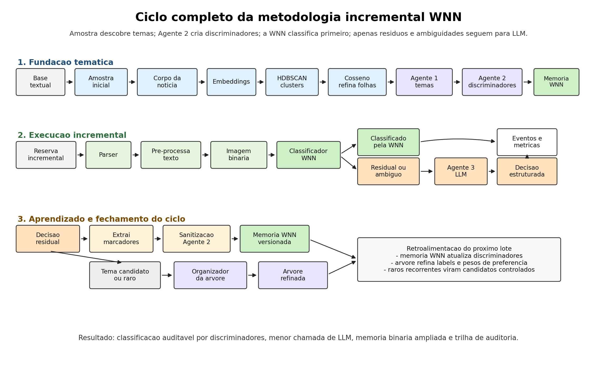
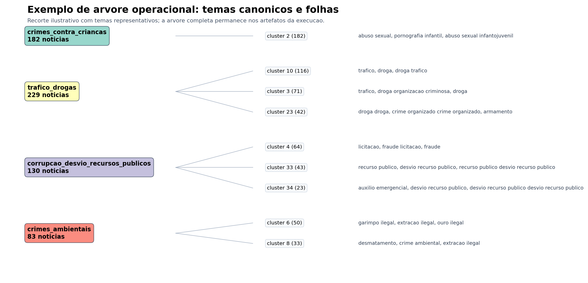
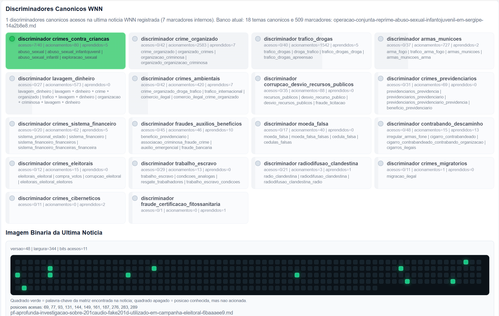
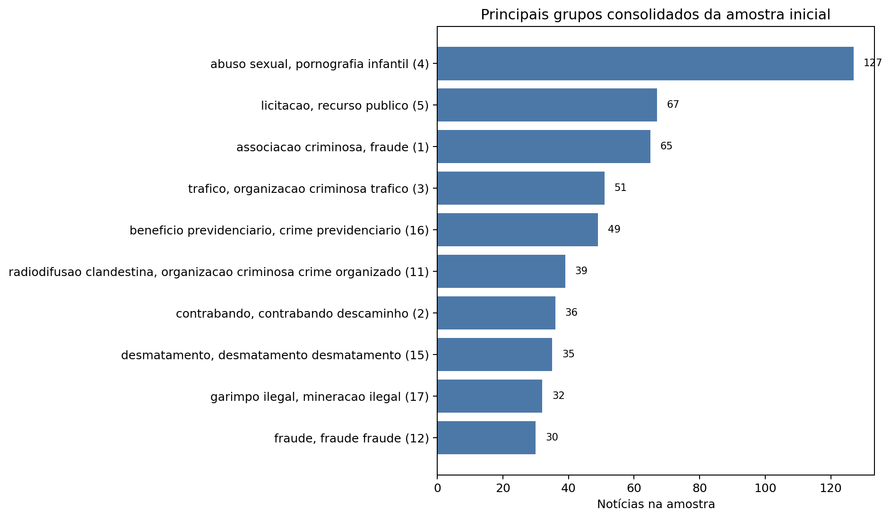
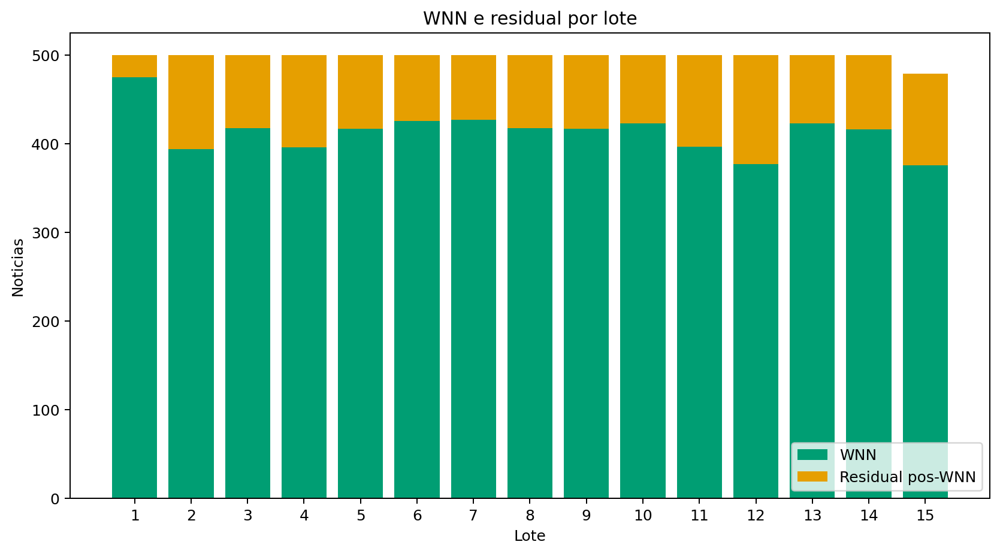
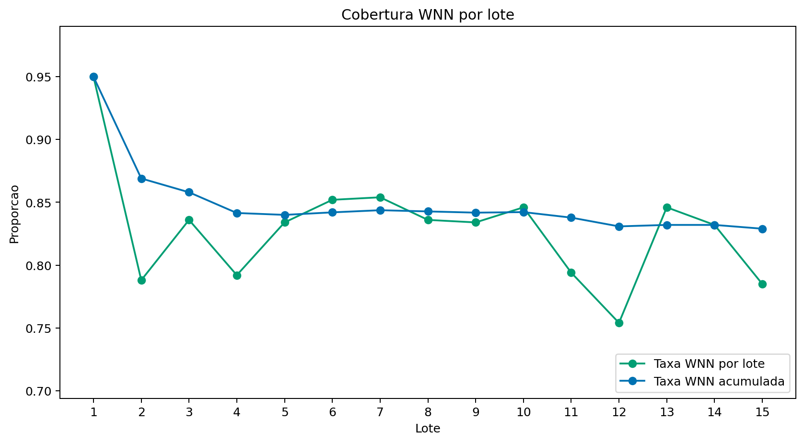
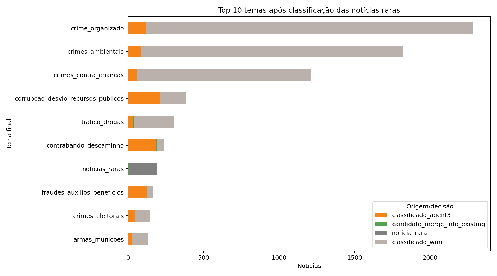

# Uma Metodologia Incremental para Clusterização, Classificação e Aprendizado Contínuo em Grandes Bases Textuais

## Resumo

Grandes bases textuais institucionais crescem continuamente e tornam custosa a organização temática, a classificação e a revisão manual de documentos. Este trabalho propõe uma metodologia incremental, autônoma e auditável para clusterizar, classificar e aprender continuamente a partir dessas bases. A abordagem combina amostragem temporal estratificada, pré-processamento linguístico, clusterização exploratória, consolidação semântica por similaridade do cosseno, agentes de linguagem com respostas estruturadas, discriminadores canônicos inspirados em WNN/WiSARD, memória binária auditável, revisão residual por LLM e reorganização periódica de uma árvore temática. A LLM não atua como classificador principal da base inteira: revisa apenas resíduos ou ambiguidades que escapam da memória determinística, e parte desse aprendizado pode ser convertida em novos marcadores reutilizáveis para lotes futuros. Como aplicação empírica, a metodologia é aplicada a notícias públicas da Polícia Federal, base real e heterogênea marcada por linguagem institucional, termos especializados, localidades, nomes de operação e atualização temporal.

## 1. Introdução

Instituições públicas que produzem ou analisam informação em larga escala, como o Ipea, institutos estaduais de segurança pública, observatórios, órgãos de controle e centros de pesquisa aplicada, lidam cada vez mais com grandes volumes de textos. Relatórios, notícias, registros administrativos, descrições de ocorrências, documentos técnicos e comunicados institucionais acumulam evidências relevantes para análise de políticas públicas, mas nem sempre chegam organizados em categorias estáveis. O desafio deixa de ser apenas armazenar documentos: passa a ser transformar fluxos textuais contínuos em informação temática, comparável, auditável e reutilizável.

Esse processo é difícil porque grandes bases textuais são heterogêneas, crescem ao longo do tempo e frequentemente combinam temas recorrentes com temas emergentes. Além disso, apresentam variação lexical, repetição de formatos, mudanças temporais de enfoque e elementos acidentais, como localidades, nomes próprios, códigos internos, operações, eventos e entidades. A rotulagem humana tende a ser cara e pouco escalável; por outro lado, uma classificação automática sem controle pode reproduzir ruído, transformar metadados em categorias e gerar taxonomias instáveis. Em ambientes institucionais, esse problema é também operacional: cada nova rodada de dados exige custo, tempo, documentação e capacidade de revisão.

Modelos de linguagem ampliam a capacidade de interpretar textos e podem apoiar tarefas de classificação, extração de evidências e nomeação de temas. No entanto, usar LLM em toda a base pode ser caro, pouco previsível e menos reprodutível quando não há uma camada determinística de verificação. A proposta deste trabalho parte dessa tensão: usar LLM onde ela agrega mais valor, isto é, nos resíduos, ambiguidades e exceções, e converter parte desse aprendizado em marcadores auditáveis que passam a compor uma memória WNN. Com isso, busca-se um ciclo de aprendizado contínuo que contribua para diminuir custos operacionais ao longo do tempo.

Este Texto para Discussão tem como objetivo propor uma metodologia incremental, autônoma e transparente para clusterizar, classificar e aprender continuamente a partir de grandes bases textuais. A proposta busca responder a um problema operacional comum a instituições que lidam com dados textuais em larga escala: como organizar temas recorrentes, reconhecer exceções, reduzir custo de inferência e preservar rastreabilidade ao longo de sucessivas rodadas de dados. A metodologia é aplicada empiricamente a notícias públicas da Polícia Federal, por constituírem uma base real, volumosa, heterogênea e marcada por termos especializados; nessa aplicação, o alvo de classificação é crime ou modus operandi. Na amostra de fundação, a clusterização gerou 35 clusters brutos, posteriormente consolidados em 27 folhas temáticas e organizados em 17 temas canônicos, indicando que os agrupamentos exploratórios precisavam ser interpretados e refinados antes de se tornarem categorias operacionais. O texto está organizado da seguinte forma: a seção 2 apresenta o referencial teórico; a seção 3 discute trabalhos relacionados; a seção 4 detalha a metodologia; a seção 5 apresenta a avaliação experimental; a seção 6 apresenta a conclusão, os critérios de qualidade e as limitações observadas; e o Apêndice registra métricas por lote.

Assim, o resultado esperado não se limita à classificação pontual da base usada como aplicação, mas consiste em um procedimento transferível de clusterização, classificação e treinamento incremental autônomo, com rastreabilidade e menor dependência de intervenção humana no ciclo operacional.

## 2. Referencial teórico

O referencial teórico deste trabalho articula cinco bases conceituais: descoberta temática em coleções textuais, representações semânticas por embeddings, classificação programática interpretável, uso controlado de modelos de linguagem e aprendizado incremental. Essas bases sustentam a metodologia proposta porque permitem separar tarefas exploratórias, decisões determinísticas e tratamento residual de exceções. A clusterização organiza a diversidade inicial da base; os embeddings oferecem evidência de proximidade semântica; os discriminadores WNN tornam a classificação auditável por marcadores e posições binárias; e a LLM atua apenas nos casos em que a camada determinística ainda não acumulou evidência suficiente.

### 2.1 Clusterização e descoberta temática

A clusterização de textos é empregada como mecanismo exploratório para identificar agrupamentos em bases sem rótulos consolidados. Métodos de modelagem de tópicos, como LDA, tratam documentos como combinações probabilísticas de tópicos latentes e se tornaram referência clássica para descoberta temática em coleções textuais (Blei, Ng e Jordan, 2003). Abordagens mais recentes combinam representações densas, redução de dimensionalidade, clusterização e extração de termos representativos, como ocorre em BERTopic (Grootendorst, 2022). No contexto deste trabalho, essas referências ajudam a posicionar a clusterização como etapa de exploração, não como etapa final de classificação.

O uso de HDBSCAN é adequado a cenários em que os grupos podem ter densidades diferentes e em que parte dos pontos pode permanecer como ruído, característica relevante em bases institucionais heterogêneas (McInnes, Healy e Astels, 2017). Ainda assim, clusters não devem ser confundidos com categorias substantivas finais. Um agrupamento pode refletir um crime, uma forma de redação, uma localidade, uma operação específica ou uma combinação desses elementos. Por isso, a metodologia trata clusters como folhas exploratórias, posteriormente consolidadas em temas canônicos.

### 2.2 Embeddings e similaridade semântica

Representações semânticas por embeddings permitem comparar documentos em um espaço vetorial, no qual textos semanticamente próximos tendem a ocupar regiões próximas. Sentence-BERT propõe uma arquitetura baseada em redes siamesas e triplet networks para gerar embeddings de sentenças adequados à comparação por similaridade do cosseno (Reimers e Gurevych, 2019). Essa base conceitual sustenta o uso de similaridade para aproximar notícias, clusters e temas durante a fundação temática e durante a execução incremental.

Neste trabalho, a similaridade do cosseno funciona como evidência auxiliar, não como decisão temática autônoma. Essa distinção é importante porque proximidades vetoriais podem ser influenciadas por entidades frequentes, localidades, nomes de operações ou vocabulário institucional recorrente. Assim, a classificação final precisa respeitar o alvo substantivo definido pela aplicação, evitando que elementos superficiais da linguagem sejam convertidos em categorias principais.

### 2.3 Supervisão fraca e regras interpretáveis

A classificação por regras interpretáveis aproxima a metodologia da literatura de supervisão fraca e *data programming*. Em Snorkel, funções de rotulagem produzem sinais programáticos que podem ser combinados para criar dados de treinamento em contextos nos quais rótulos manuais são caros ou escassos (Ratner et al., 2020). Trabalhos de supervisão fraca orientada por ontologias também mostram que conhecimento de domínio, regras e recursos externos podem apoiar tarefas de classificação em bases especializadas (Fries et al., 2021).

Na primeira formulação experimental deste trabalho, expressões regulares cumpriam papel operacional semelhante ao de funções de rotulagem, pois transformavam conhecimento textual observável em padrões aplicáveis à base. A evolução proposta substitui essa camada por discriminadores canônicos: conjuntos de marcadores não ordenados que acionam uma memória WNN. Essa escolha preserva auditabilidade, pois cada classificação pode ser rastreada até palavras-chave e posições binárias, mas reduz a dependência da ordem das palavras e permite aprendizado incremental mais granular.

### 2.4 Modelos de linguagem como componente residual

Modelos de linguagem podem ser incorporados a fluxos de supervisão fraca por meio de *prompts* e funções de rotulagem, reduzindo parte do esforço humano de anotação (Smith et al., 2022). Estudos recentes também investigam se LLMs podem projetar funções de rotulagem precisas, o que aproxima esses modelos de tarefas de geração de regras e classificação programática (Guan, Chen e Koudas, 2023). Essas referências sustentam o uso de LLMs como componente interpretativo, mas também reforçam a necessidade de controlar seu papel no processo.

Na metodologia proposta, a LLM não classifica toda a base nem substitui a camada determinística. Ela é acionada nos resíduos, isto é, nos documentos que escapam da memória WNN ou que apresentam ambiguidade entre discriminadores. Nesses casos, interpreta exceções, registra justificativas, sugere temas candidatos ou documentos raros e produz insumos para novos marcadores. O objetivo é usar a capacidade semântica da LLM onde ela agrega mais valor, preservando rastreabilidade e reduzindo chamadas futuras.

### 2.5 Aprendizado incremental e auditabilidade

A perspectiva incremental decorre do fato de que bases textuais institucionais crescem continuamente e podem incorporar temas emergentes, mudanças lexicais e novos padrões de redação. Técnicas clássicas de *bootstrapping* de padrões, como Snowball, mostram que evidências extraídas de textos podem alimentar novos padrões de extração em ciclos sucessivos (Agichtein e Gravano, 2000). Este trabalho adapta esse princípio à classificação temática: resíduos revisados podem gerar novos marcadores WNN, reorganização da árvore temática ou memória auditável de casos raros.

Em conjunto, esses referenciais delimitam o papel de cada técnica na proposta: clusters e embeddings apoiam a descoberta temática, discriminadores oferecem classificação auditável, LLMs tratam casos residuais e o aprendizado incremental preserva a atualização do sistema sem dissolver a estabilidade da taxonomia.

## 3. Trabalhos relacionados

A metodologia proposta se relaciona com cinco grupos de trabalhos: supervisão fraca, modelagem de tópicos, clusterização textual, uso de LLMs em rotulagem e construção automática de taxonomias. A comparação é feita a partir de quatro critérios: o papel atribuído às regras, a função dos clusters, o momento em que a LLM é acionada e a existência de aprendizado incremental auditável. Esses critérios permitem distinguir a proposta de abordagens que usam técnicas semelhantes de forma isolada.

Na literatura de supervisão fraca, sistemas como Snorkel usam funções de rotulagem para gerar sinais programáticos em bases com poucos rótulos manuais, normalmente com o objetivo de produzir dados de treinamento para modelos supervisionados (Ratner et al., 2017; Ratner et al., 2018; Ratner et al., 2020). Trabalhos orientados por ontologias, como Fries et al. (2021), mostram que conhecimento de domínio, regras e recursos estruturados também podem apoiar classificação em contextos especializados. A metodologia aqui proposta se aproxima desses trabalhos ao usar sinais interpretáveis como fonte de rotulagem, mas se diferencia porque os discriminadores permanecem como classificador operacional principal, versionado e auditável, em vez de funcionarem apenas como etapa intermediária para treinar outro modelo.

Trabalhos de modelagem de tópicos e clusterização textual buscam organizar coleções documentais em grupos temáticos ou semanticamente próximos. LDA é uma referência clássica para modelagem probabilística de tópicos (Blei, Ng e Jordan, 2003), enquanto BERTopic combina embeddings, clusterização e representação lexical dos tópicos (Grootendorst, 2022). HDBSCAN e Sentence-BERT também aparecem em pipelines que exploram agrupamentos e proximidade semântica em textos (McInnes, Healy e Astels, 2017; Reimers e Gurevych, 2019). A diferença deste trabalho está no tratamento dado aos agrupamentos: os clusters não são assumidos como categorias finais, mas como evidências exploratórias que precisam ser consolidadas, nomeadas e convertidas em discriminadores auditáveis alinhados ao alvo substantivo da aplicação.

Pesquisas recentes investigam o uso de LLMs como fonte de rotulagem, apoio à supervisão fraca ou mecanismo de classificação textual. Smith et al. (2022) incorporam modelos de linguagem ao ciclo de supervisão fraca por meio de *prompts*, enquanto Guan, Chen e Koudas (2023) analisam a capacidade de LLMs projetarem funções de rotulagem. Huang e He (2024) aproximam clusterização textual e classificação com LLMs, deslocando parte da decisão temática para o modelo de linguagem. Este trabalho compartilha a motivação de reduzir esforço humano, mas restringe a LLM aos resíduos que escapam dos discriminadores WNN. Assim, o modelo atua como componente interpretativo e gerador de evidências, não como classificador permanente de toda a base.

Outro eixo relacionado é a construção automática de taxonomias com apoio de LLMs, embeddings e estratégias de *prompting* ou ajuste fino. Balakrishnan (2025) discute a geração automatizada de taxonomias e compara estratégias baseadas em engenharia de *prompt* e *fine-tuning*. Na proposta deste trabalho, a árvore temática também é ajustada com apoio de agentes, mas sua função é operacional: orientar o banco de discriminadores, organizar resíduos, registrar documentos raros e apoiar métricas de cobertura, custo e rastreabilidade. Portanto, a taxonomia não é apenas um artefato descritivo, mas parte do mecanismo de classificação incremental.

Técnicas clássicas de *bootstrapping* de padrões, como Snowball, partem de evidências observadas para extrair novos padrões em grandes coleções textuais (Agichtein e Gravano, 2000). A metodologia proposta adota princípio semelhante ao transformar resíduos revisados em novos marcadores, mas desloca o foco da extração de relações para a classificação temática incremental. A contribuição central, portanto, não está em propor isoladamente clusterização, regex, WNN, LLM ou supervisão fraca, mas em integrar esses componentes em um ciclo operacional que descobre temas, gera discriminadores, classifica lotes, revisa exceções, reorganiza a árvore temática e documenta cobertura, custo, evidências e limitações.

## 4. Metodologia

Esta seção descreve a metodologia proposta, seus artefatos, seus componentes e o modo como o ciclo incremental de classificação é executado e auditado. A descrição parte da visão geral do fluxo, define a unidade documental e o alvo de classificação, apresenta os contratos entre componentes e detalha a fundação temática, a geração de discriminadores WNN, a execução incremental e a revisão residual por LLM.

### 4.1 Visão geral do ciclo metodológico

A metodologia organiza grandes coleções textuais em um ciclo incremental, autônomo e auditável. Primeiro, uma amostra inicial é extraída da base e transformada em texto de domínio, isto é, uma representação textual orientada ao alvo substantivo da classificação. Em seguida, essa amostra é vetorizada, dividida em clusters por HDBSCAN e refinada por similaridade do cosseno, de modo que folhas semanticamente próximas possam ser aproximadas antes da nomeação temática. O Agente 1 recebe os clusters consolidados e gera temas canônicos; o Agente 2 recebe esses temas e produz discriminadores iniciais; a memória WNN aplica esses discriminadores aos lotes incrementais; e apenas os documentos não classificados ou ambíguos seguem para revisão residual por LLM. As decisões residuais podem gerar novos marcadores, temas candidatos, registros de documentos raros ou ajustes na árvore temática, fechando o ciclo e reduzindo a dependência de inferência nos lotes seguintes.

A Figura 1 sintetiza esse ciclo completo. Ela mostra a fundação temática, a execução incremental e o fechamento por aprendizado residual, deixando explícito que a memória WNN e a árvore refinada retroalimentam os lotes seguintes.



*Figura 1 - Ciclo completo da metodologia incremental.*

O ciclo é executado por transferência explícita de artefatos entre componentes. A base textual é ingerida e estruturada; a amostra de fundação produz embeddings, clusters, folhas consolidadas, temas canônicos e discriminadores iniciais; a reserva incremental é processada em lotes; documentos classificados pela WNN são registrados diretamente; documentos residuais seguem para revisão por LLM; e as decisões residuais podem atualizar a memória de marcadores, a árvore temática, a lista de candidatos, o registro de notícias raras e as métricas do lote. Assim, cada etapa recebe uma entrada definida, produz uma saída verificável e alimenta a etapa seguinte.

### 4.2 Unidade documental, alvo de classificação e controles de domínio

A unidade classificada pela metodologia é o documento textual individual. Na aplicação empírica, essa unidade é uma notícia pública da Polícia Federal, tratada como um registro composto por campos como título, subtítulo, data, tags, corpo, fonte e link. O objetivo não é classificar todos os elementos mencionados no texto, mas atribuir uma label principal ao documento segundo um atributo substantivo definido previamente.

A primeira decisão metodológica é, portanto, definir esse atributo. Em uma base jurídica, ele pode ser tipo de ação; em uma base de saúde, agravo ou procedimento; em uma base de segurança, natureza criminal ou modus operandi. Na aplicação com notícias da Polícia Federal, o alvo é o domínio criminal ou o modus operandi principal. Por isso, categorias como `trafico_drogas`, `crimes_contra_criancas`, `crime_organizado`, `corrupcao_desvio_recursos_publicos`, `crimes_ambientais`, `armas_municoes`, `falsificacao_documental` e `moeda_falsa` são temas substantivos.

Localidades, unidades da federação, nomes de operação, órgãos parceiros e entidades ocasionais são preservados para auditoria, mas não entram como temas canônicos principais. Essa separação evita que a clusterização transforme metadados frequentes em classes finais. A arquitetura, contudo, permite criar camadas analíticas complementares para extrair localidade, órgão, entidade ou nome de operação sem contaminar a taxonomia temática principal. A tabela a seguir resume o papel dos principais campos da notícia na construção do texto de domínio.

**Tabela 1 - Uso dos campos da notícia na metodologia.**

| Campo da notícia | Uso na metodologia |
|---|---|
| Título | Sinal forte sobre o evento principal |
| Subtítulo | Complementa a conduta ou o objeto investigado |
| Tags | Indicam pistas temáticas, mas não definem sozinhas a classe |
| Corpo | Fornece evidências, contexto, modo de execução e objetos relacionados |
| Localidade, órgãos e nomes de operação | Preservados para auditoria, mas controlados para não virarem tema principal |

Um exemplo ilustra essa separação. Na notícia [A FICCO/RJ deflagra operação em combate a aquisição ilegal de armas de fogo](https://www.gov.br/pf/pt-br/assuntos/noticias/2024/08/a-ficco-rj-deflagra-operacao-em-combate-a-aquisicao-ilegal-de-armas-de-fogo), publicada em 27/08/2024, a label esperada é `armas_municoes`. A classificação não decorre de Rio de Janeiro, Bom Jardim/RJ, FICCO/RJ ou do nome da operação, mas dos sinais substantivos ligados a aquisição ilegal de arma de fogo, certificado de registro falso e posse ilegal de arma de fogo de uso restrito.

### 4.3 Contratos entre componentes do sistema

Para tornar a metodologia reprodutível, cada componente é definido por contrato de entrada, processamento, saída e destino. Esse contrato evita ambiguidades sobre o que uma parte do sistema entrega para a outra e explicita como o ciclo se fecha. A tabela a seguir organiza esses contratos.

**Tabela 2 - Contratos entre componentes do sistema.**

| Componente | Entrada | Processamento | Saída | Próximo destino |
|---|---|---|---|---|
| Ingestão | Arquivos ou registros textuais brutos | Normaliza campos, remove duplicidades e preserva metadados | `documentos_base.jsonl` | Divisão da base |
| Divisão da base | Base estruturada | Separa amostra de fundação e reserva incremental | `amostra_inicial.csv` e `reserva_incremental.csv` | Fundação temática e lotes |
| Parser | Documento bruto ou estruturado | Extrai título, subtítulo, tags, corpo, data, fonte e link | Documento estruturado | Texto de domínio |
| Texto de domínio | Documento estruturado e alvo substantivo | Seleciona sinais temáticos e reduz sinais acidentais | Texto normalizado para classificação | Embeddings, discriminadores e LLM residual |
| Vetorização | Textos de domínio da amostra | Gera embeddings semânticos | Matriz vetorial | HDBSCAN e cosseno |
| HDBSCAN | Embeddings da amostra | Identifica agrupamentos densos e ruídos | Clusters exploratórios | Consolidação por cosseno |
| Similaridade do cosseno | Clusters, documentos e vetores | Mede proximidade entre folhas e perfis temáticos | Clusters consolidados e sugestões de aproximação | Agente 1 e Agente 3 |
| Agente 1 | Clusters consolidados e evidências | Nomeia temas canônicos e controla metadados incidentais | `temas_canonicos_agent1.json` | Agente 2 e classificador residual |
| Agente 2 | Temas canônicos e evidências por tema | Gera discriminadores e marcadores não ordenados | `wnn_feature_bank.json` | Memória WNN |
| Memória WNN | Documento, texto semântico e banco de discriminadores | Projeta texto em vetor binário e pontua temas | Label determinística ou residual | Saída final ou Agente 3 |
| Agente 3 | Residual, labels, sugestões por cosseno e evidências | Decide label, tema candidato ou documento raro | Decisão residual estruturada | Agente 2 e árvore |
| Aprendiz de discriminadores | Decisão residual e evidências | Gera marcadores candidatos reutilizáveis | Discriminador incremental candidato | Memória WNN |
| Organizador da árvore | Temas, candidatos, raros, discriminadores e métricas | Absorve, promove, funde ou mantém casos raros | Árvore temática refinada | Próximo lote |
| Métricas e auditoria | Eventos de todas as etapas | Agrega cobertura, resíduos, custo e alterações | Relatórios e trilha de eventos | Avaliação experimental e reprodutibilidade |

Esse contrato mostra que a saída de uma etapa é sempre a entrada explícita da etapa seguinte. O fechamento do ciclo ocorre quando decisões residuais aprovadas retornam à memória WNN ou à árvore temática, alterando a classificação dos lotes futuros.

### 4.4 Fundação temática

A fundação temática constrói a primeira versão da taxonomia e do banco de discriminadores. A base estruturada é dividida em duas massas: uma amostra inicial, preferencialmente estratificada no tempo, e uma reserva incremental. A amostra é usada para descobrir temas e criar discriminadores iniciais; a reserva é usada para medir cobertura, resíduos e aprendizado ao longo dos lotes.

Cada documento da amostra é convertido em texto de domínio. Essa etapa prioriza título, subtítulo, tags, condutas, crimes, objetos ilícitos, modus operandi e trechos relevantes do corpo. Ao mesmo tempo, reduz o peso de localidades, nomes de operação, órgãos parceiros e termos administrativos genéricos. O objetivo é representar o atributo substantivo que será classificado, não todos os metadados presentes no documento.

Em seguida, os textos de domínio são vetorizados e submetidos ao HDBSCAN. O clusterizador procura regiões densas de documentos semanticamente próximos e separa documentos que não formam grupo estável. O resultado ainda não é uma taxonomia, mas um conjunto de folhas exploratórias. Essas folhas podem ser úteis para revelar recorrências, mas também podem sair fragmentadas: documentos sobre o mesmo fenômeno podem ficar em clusters diferentes por variação lexical, diferença de foco narrativo, presença de subtópicos ou distribuição desigual de densidade.

Por esse motivo, a similaridade do cosseno é aplicada depois do HDBSCAN como etapa de consolidação semântica. Enquanto o HDBSCAN responde à pergunta "quais documentos formam regiões densas no espaço vetorial?", o cosseno ajuda a responder "quais dessas regiões apontam para o mesmo tema substantivo?". A medida compara a direção dos vetores de clusters, documentos e perfis temáticos, permitindo identificar proximidade semântica mesmo quando os textos não compartilham exatamente os mesmos termos. Assim, folhas sobre abuso sexual infantil, pornografia infantojuvenil e compartilhamento de material podem ser aproximadas antes da nomeação canônica, pois tratam de uma mesma família temática.

O cosseno, contudo, não decide sozinho a classificação final. Ele produz evidência de aproximação para o Agente 1 e para a revisão residual, mas a consolidação precisa respeitar o alvo substantivo definido no domínio. Essa cautela evita que folhas sejam unidas apenas por sinais acidentais, como localidade, órgão, nome de operação ou vocabulário institucional recorrente. Na metodologia, portanto, o HDBSCAN descobre folhas exploratórias, o cosseno mede a proximidade entre essas folhas e os agentes decidem se a aproximação deve virar tema canônico, subtema, candidato ou apenas evidência auxiliar.

O Agente 1 recebe os clusters consolidados, as evidências textuais e o alvo substantivo da classificação. Sua função é transformar folhas exploratórias em temas canônicos, agregando folhas equivalentes, separando subtemas quando houver identidade distinta e impedindo que localidades, entidades ou nomes de operação sejam promovidos a classe principal. Na aplicação PF, por exemplo, folhas sobre pornografia infantojuvenil, abuso sexual infantil e compartilhamento de material podem ser consolidadas em `crimes_contra_criancas`; folhas sobre garimpo ilegal, extração mineral irregular e dano ambiental podem alimentar `crimes_ambientais`, desde que a evidência substantiva seja ambiental.

A Figura 2 apresenta um recorte ilustrativo dessa mediação entre clusters e temas canônicos. À esquerda aparecem temas finais da fundação; ao centro, folhas de clusters consolidadas; à direita, termos dominantes usados como evidência. O recorte mostra que um tema canônico pode receber uma ou mais folhas e reforça que o tema final não é o cluster isolado, mas a agregação analítica de folhas segundo uma família substantiva. A árvore completa permanece como artefato da execução.



*Figura 2 - Exemplo de construção da árvore operacional de temas canônicos e folhas de clusters.*

### 4.5 Pré-processamento linguístico e memória WNN

Na versão atual da metodologia, a camada determinística deixa de ser baseada prioritariamente em regex e passa a operar por uma memória WNN construída a partir de discriminadores canônicos. Antes da classificação, o corpo da notícia passa por pré-processamento linguístico: remoção de stopwords, normalização lexical e seleção preferencial de substantivos, verbos e adjetivos. Título, tags, nomes de operação e metadados externos podem ser preservados para auditoria, mas não devem definir sozinhos a classe.

O Agente 2 recebe os temas canônicos produzidos pelo Agente 1, as folhas de clusters, os termos de domínio e exemplos por tema. Sua tarefa é construir discriminadores: conjuntos pequenos de palavras-chave não ordenadas que caracterizam um micromundo temático. Por exemplo, o tema `crimes_contra_criancas` pode conter marcadores como `abuso_sexual`, `pornografia_infantil`, `exploracao_sexual`, `estupro_vulneravel` e `abuso_sexual_infantojuvenil`. Diferentemente de uma regex, o discriminador não exige que as palavras apareçam em uma ordem fixa.

A memória WNN é representada por uma matriz de vocabulário discriminativo. Cada palavra-chave sanitizada ocupa uma posição fixa. Quando uma notícia é processada, o texto aciona as posições correspondentes e produz uma imagem binária: `1` para posições encontradas na notícia e `0` para posições ausentes. Quando o Agente 3 identifica um padrão novo, o conjunto de palavras retorna ao Agente 2, que sanitiza, generaliza e injeta os novos marcadores na memória. Se uma palavra já existe, sua posição é reaproveitada; se não existe, ela entra no final da matriz. Assim, vetores antigos permanecem comparáveis por preenchimento de zeros à direita.



*Figura 3 - Visualização da memória WNN: discriminadores canônicos e imagem binária da notícia.*

### 4.6 Execução incremental em lotes

Na execução incremental, a reserva é processada em lotes. Cada documento passa primeiro pelo parser e pelo pré-processamento linguístico. Em seguida, o texto semântico é projetado na memória WNN, produzindo um vetor binário e uma lista de posições acionadas. Se os discriminadores ativos sustentam uma label com confiança e margem suficientes, a decisão é registrada como classificação determinística por WNN, com identificação dos marcadores, pontuação por tema, versão da memória e evidência textual.

A similaridade do cosseno atua como evidência auxiliar, não como classificador autônomo. Ela pode reforçar uma decisão quando a notícia está próxima do perfil semântico do tema acionado, ou pode bloquear uma aceitação quando há ambiguidade. Por exemplo, se marcadores de `crime_organizado` aparecem em uma notícia semanticamente muito próxima de `crimes_contra_criancas`, o documento pode ser enviado ao Agente 3 como suspeita, em vez de ser aceito automaticamente pela WNN.

O documento residual é transformado em um pacote de revisão. Esse pacote contém o corpo da notícia, o texto semântico, labels canônicas disponíveis, sugestões por similaridade do cosseno, discriminadores acionados, posições da memória e, quando houver, a razão da abstenção da WNN. Esse é o artefato passado para o Agente 3.

```json
{
  "documento_id": "id_do_documento",
  "texto_semantico": "texto normalizado com substantivos verbos adjetivos",
  "memoria_wnn": {
    "versao": 48,
    "largura": 344,
    "posicoes_acesas": [69, 77, 93, 131],
    "vetor_binario": "10001010111000..."
  },
  "labels_disponiveis": ["armas_municoes", "crimes_ambientais"],
  "sugestoes_cosseno": [
    {"label": "crimes_ambientais", "similaridade": 0.82}
  ],
  "discriminadores_acionados": ["crimes_ambientais"],
  "status_wnn": "aceito_wnn"
}
```

### 4.7 Revisão residual por LLM e aprendizado de discriminadores

O Agente 3 atua apenas nos documentos residuais, ambíguos ou suspeitos. Ele recebe o pacote de revisão e produz uma decisão estruturada. Essa decisão pode classificar o documento em tema canônico existente, propor novo tema candidato ou registrar o caso como notícia rara. A LLM deve indicar as evidências textuais usadas, justificar a decisão e informar se há marcadores reutilizáveis para a memória WNN.

Para ilustrar, considere a notícia [PF deflagra operação contra crimes de mineração ilegal](https://www.gov.br/pf/pt-br/assuntos/noticias/2024/01/pf-deflagra-operacao-contra-crimes-de-mineracao-ilegal), publicada em 17/01/2024. Se a memória ainda não tiver marcadores suficientes para aceitar `crimes_ambientais`, o documento segue ao Agente 3 como residual. Uma decisão possível é:

```json
{
  "label": "crimes_ambientais",
  "confidence": "alta",
  "evidencias": [
    "crimes de mineracao ilegal",
    "usurpacao de bens da Uniao",
    "extracao de quartzo verde sem autorizacao da ANM ou licenca ambiental"
  ],
  "justificativa": "A noticia descreve exploracao mineral irregular sem autorizacao do orgao competente e sem licenca ambiental.",
  "acao_aprendizado": "gerar_discriminador",
  "marcadores_sugeridos": ["mineracao_ilegal", "extracao_mineral", "sem_licenca_ambiental"],
  "tema_candidato": null,
  "documento_raro": false
}
```

O Agente 2 recebe essa decisão residual e não reclassifica o documento. Sua função é converter evidências substantivas em discriminadores generalizáveis. No exemplo, localidades, datas, nomes de operação e órgãos são descartados como sinais acidentais, enquanto mineração ilegal, garimpo, extração mineral, ausência de autorização e licença ambiental são mantidos como sinais classificatórios. O aprendizado resultante poderia ser:

```text
label: crimes_ambientais
marcador 1: mineracao_ilegal
marcador 2: extracao_mineral
marcador 3: garimpo_ilegal
marcador 4: sem_licenca_ambiental
```

Esses marcadores só entram na memória depois de sanitizados contra o micromundo do tema. Se aprovados, passam a acionar a WNN em lotes futuros sem nova chamada de LLM. Se rejeitados, a decisão residual permanece registrada, mas não altera a memória operacional.

### 4.8 Fechamento do ciclo e reorganização da árvore

O aprendizado residual fecha o ciclo incremental. Um residual pode gerar três tipos de saída: novos marcadores para um discriminador existente, tema candidato ou documento raro. Marcadores aprovados retornam à memória WNN; o tema candidato vai para a fila de revisão da árvore; o documento raro entra em memória específica para que recorrências futuras sejam detectadas.

O Agente Organizador da Árvore recebe, ao fim de cada lote ou rodada definida, a árvore temática atual, temas candidatos, documentos raros, discriminadores aprendidos, métricas de cobertura e sugestões por similaridade. Sua função é evitar crescimento desordenado da taxonomia e contaminação entre micromundos temáticos. Ele decide se candidatos devem ser absorvidos por temas existentes, promovidos a novos temas, fundidos em macrotemas, mantidos como raros ou descartados como ruído.

O fechamento do ciclo ocorre quando a decisão do Organizador altera os artefatos usados no próximo lote. A árvore refinada atualiza a lista de labels disponíveis ao Agente 3; marcadores aprovados ampliam a cobertura dos discriminadores; documentos raros recorrentes podem retornar como candidatos; e métricas acumuladas informam se o sistema está reduzindo dependência de LLM ou apenas deslocando resíduos para ciclos futuros.

### 4.9 Métricas, artefatos e auditabilidade

O banco de discriminadores WNN é o classificador determinístico principal da versão atual da metodologia. Ele registra label, tokens, posições da memória, fonte, confirmações, usos e origem do marcador. Ao longo dos lotes, esse banco recebe discriminadores incrementais aprovados pelo ciclo residual. Com isso, a metodologia preserva interpretabilidade e cria uma trilha clara entre evidência textual, posição binária, marcador e classificação.

O custo operacional é medido pela proporção de documentos resolvidos pela WNN e pela quantidade de tokens consumidos nos resíduos enviados à LLM. Para cada lote, o sistema registra cobertura WNN, taxa residual, quantidade de decisões LLM, novos marcadores aceitos, candidatos compostos, temas candidatos, documentos raros, `prompt_tokens_total`, `completion_tokens_total`, `tokens_total` e `avg_tokens_per_llm`. Para cada documento, o evento em `events.jsonl` pode registrar discriminadores acionados, vetor binário, posições ativas, pontuações e decisão. A tabela a seguir lista os principais artefatos preservados para auditoria e reprodutibilidade.

**Tabela 3 - Artefatos preservados para auditoria e reprodutibilidade.**

| Artefato | Função |
|---|---|
| `documentos_base.jsonl` | Base estruturada usada na execução |
| `amostra_inicial.csv` | Amostra temporal da fundação |
| `reserva_incremental.csv` | Massa processada em lotes |
| `resumo_clusters_amostra.csv` | Resumo dos clusters da amostra |
| `temas_canonicos_agent1.json` | Temas iniciais do Agente 1 |
| `wnn_feature_bank.json` | Banco ativo de discriminadores, memória vocabular e posições binárias |
| `preprocessamento_linguistico.json` | Métricas de redução lexical e backend linguístico usado |
| `metrics_batches.csv` | Métricas por lote |
| `resumo_custo_tokens.json` | Resumo do consumo de tokens nas chamadas LLM residuais |
| `events.jsonl` | Trilha completa de eventos |
| `temas_candidatos_agent3.jsonl` | Candidatos criados no residual |
| `arvore_temas_agent1_refinada.json` | Árvore refinada |
| `noticias_raras_observacoes.jsonl` | Memória incremental de notícias raras |
| `classificacoes_incrementais_pos_quarentena.csv` | Saída final consolidada |

Esses artefatos permitem reconstruir a origem da amostra, os clusters, as decisões dos agentes, os discriminadores incorporados, a memória binária, as métricas por lote e os casos raros. Cada classificação pode ser rastreada até uma posição da matriz, um marcador, um agente, um lote ou uma decisão residual.

### 4.10 Reprodutibilidade e aplicação em outra base de dados

A metodologia pode ser reproduzida em outra base textual desde que a nova aplicação explicite o alvo substantivo da classificação, disponha de documentos com texto suficiente para gerar evidências e preserve os artefatos de execução. O que se transfere não é a taxonomia criminal da Polícia Federal nem o banco de discriminadores obtido neste estudo, mas a arquitetura: fundação temática em amostra, classificação determinística por memória auditável, revisão residual por LLM, aprendizado validado de marcadores e registro de auditoria.

Ao migrar para outro domínio, como saúde pública, decisões judiciais, atendimento ao cidadão ou atos administrativos, o pesquisador deve redefinir as categorias de interesse e os controles que impedem metadados incidentais de virarem classes. Por exemplo, em saúde o alvo pode ser agravo ou procedimento, enquanto hospital, município e profissional devem ser dimensões auxiliares; em decisões judiciais, o alvo pode ser matéria ou resultado, enquanto tribunal e relator permanecem metadados. A tabela a seguir separa o que permanece estável na arquitetura e o que precisa ser adaptado ao novo domínio.

**Tabela 4 - Elementos transferíveis e adaptáveis da metodologia.**

| Elemento | Mantido na reprodução | Adaptado à nova base |
|---|---|---|
| Unidade documental | Um registro textual por observação | Campos disponíveis, como título, ementa, descrição ou corpo |
| Alvo substantivo | Uma label principal auditável | Taxonomia e exemplos próprios do domínio |
| Fundação temática | Amostra estratificada, embeddings e clusterização | Fração amostral, estrato temporal ou institucional e parâmetros |
| Camada determinística | Banco versionado de discriminadores WNN com evidência | Vocabulário, marcadores aceitos e critérios de validação |
| Revisão residual | LLM apenas para itens não cobertos | Prompt, modelo, limiar e política para casos raros |
| Auditoria | Artefatos, eventos, métricas e versão da execução | Nomes de arquivos, custos e critérios de avaliação |

O procedimento de reprodução pode ser executado nos seguintes passos:

1. Definir a pergunta analítica, a unidade documental e a label principal desejada, separando categorias substantivas de metadados auxiliares.
2. Ingerir e padronizar a nova base, registrando origem, período de coleta, campos utilizados, normalização de caracteres, remoção de duplicidades e eventuais filtros.
3. Reservar uma amostra de fundação estratificada por tempo ou por outra dimensão relevante e manter os demais documentos como reserva incremental.
4. Construir o texto de domínio, selecionando campos e termos que expressem o alvo de classificação e reduzindo sinais incidentais.
5. Gerar embeddings da amostra, executar a clusterização exploratória e registrar modelo, versão, semente aleatória, métrica e hiperparâmetros usados.
6. Consolidar clusters próximos e nomear temas canônicos, validando que as categorias representam o alvo substantivo definido no primeiro passo.
7. Gerar e validar discriminadores iniciais com exemplos positivos e negativos, versionando o banco ativo e a memória vocabular.
8. Processar a reserva em lotes: aplicar primeiro a WNN, encaminhar apenas resíduos ou ambiguidades à LLM e salvar classificação, evidências, vetor binário, tokens, modelo e versão do prompt.
9. Avaliar marcadores candidatos produzidos pelos resíduos e reorganizar periodicamente temas candidatos e casos raros, sem promover exceções isoladas de forma automática.
10. Relatar cobertura WNN, taxa residual, custo de inferência, alterações taxonômicas, casos raros e limitações, preservando os artefatos necessários para reexecução.

Para que a comparação entre execuções seja tecnicamente defensável, devem ser congelados ou registrados: versão da base de entrada; regras de limpeza e normalização; critério de amostragem; sementes aleatórias; modelo de embeddings; algoritmo e hiperparâmetros de clusterização; limiar de similaridade; banco de discriminadores por versão; vocabulário da memória WNN; modelo de linguagem, prompt e schema de resposta; tamanho dos lotes; e métricas de custo e cobertura. Se um desses componentes mudar, a alteração deve ser documentada como uma nova execução, permitindo distinguir aprendizado incremental de mudança de configuração.

Essa estratégia torna o método replicável sem supor que os resultados da PF se generalizam automaticamente. Em cada nova base, a arquitetura é reproduzível; as categorias, marcadores e resultados precisam ser reconstruídos e avaliados segundo o domínio e a qualidade dos documentos disponíveis.

## 5. Avaliação Experimental

Esta seção avalia empiricamente a metodologia em uma base real de notícias públicas da Polícia Federal. A avaliação explicita a unidade experimental, os fatores observados, os parâmetros da execução, as variáveis de resposta e a interpretação dos resultados. O objetivo não é apenas relatar números finais, mas verificar se o ciclo proposto produz cobertura determinística elevada, reduz o acionamento de LLM, registra aprendizado residual e preserva rastreabilidade.

### 5.1 Desenho experimental

A unidade experimental é a notícia individual. A base foi sincronizada a partir do portal público da Polícia Federal e convertida em documentos locais estruturados. A execução documentada utilizou 8.232 notícias, das quais 1.235 compuseram a amostra inicial de fundação e 6.997 formaram a reserva incremental. A amostra foi estratificada por ano para preservar variação temporal, enquanto a reserva foi processada em 14 lotes. A tabela a seguir sintetiza o desenho experimental.

Esta versão do artigo distingue duas camadas de avaliação. A primeira é a baseline histórica `regex-first`, já executada e preservada para comparação. A segunda é a evolução WNN, na qual a classificação determinística passa a ser feita por discriminadores canônicos e memória binária, mantendo a LLM apenas para resíduos, ambiguidades e aprendizado de novos marcadores. Essa separação é necessária porque a mudança de regex para WNN altera o mecanismo determinístico, os artefatos auditáveis e as métricas de cobertura.

**Tabela 5 - Desenho experimental da aplicação.**

| Elemento experimental | Definição na aplicação |
|---|---|
| Unidade experimental | Notícia pública da Polícia Federal |
| Tarefa avaliada | Atribuição de uma label principal de crime ou modus operandi |
| Fator principal | Arquitetura incremental com memória WNN e LLM apenas residual |
| Parâmetros fixados | Amostra estratificada, lotes de aproximadamente 500 notícias e revisão da árvore ao fim dos lotes |
| Variáveis de resposta | Cobertura WNN, taxa residual, chamadas LLM, marcadores aprendidos, candidatos compostos, notícias raras e custo em tokens |
| Baseline operacional | Comparação com a execução `regex-first` preservada como rodada anterior |
| Artefatos de verificação | `metrics_batches.csv`, `events.jsonl`, `wnn_feature_bank.json`, árvore temática e saídas pós-reorganização |

Não foi executada uma baseline externa com classificadores concorrentes. A comparação central desta avaliação é operacional: mede-se quanto da reserva incremental foi resolvido pela camada determinística antes de acionar LLM. Na baseline, essa camada era o banco de regex; na evolução proposta, é a memória WNN. Essa escolha é coerente com a hipótese prática do trabalho: se o método for adequado, a maior parte dos documentos recorrentes deve ser absorvida por uma memória auditável, deixando a LLM concentrada nos casos residuais.

### 5.2 Dados, amostragem e parâmetros da execução

A tabela a seguir apresenta os dados usados na execução. A fração de 15% não é um parâmetro obrigatório da metodologia, mas foi usada nesta aplicação para construir uma fundação temática inicial suficientemente diversa sem consumir toda a base na etapa exploratória.

**Tabela 6 - Dados, amostragem e parâmetros da execução.**

| Item | Valor |
|---|---:|
| Base total | 8.232 notícias |
| Amostra inicial | 1.235 notícias |
| Fração da amostra | 15% |
| Reserva incremental | 6.997 notícias |
| Estratificação | Ano |
| Lotes incrementais | 14 |
| Tamanho médio dos lotes | 499,79 notícias |

Na etapa de clusterização inicial, a execução registrou `minibatch_kmeans_fallback` como algoritmo operacional da rodada, com posterior consolidação por similaridade do cosseno. Esse registro é importante para a reprodutibilidade: a arquitetura metodológica prevê clusterização exploratória seguida de consolidação semântica, mas a implementação concreta deve documentar o algoritmo efetivamente usado, suas versões e seus parâmetros.

### 5.3 Fundação temática e temas canônicos

Na fundação temática, a clusterização inicial produziu 35 clusters brutos. A consolidação por similaridade do cosseno reduziu esse conjunto para 27 clusters consolidados, com 3 grupos fundidos e sem clusters classificados como ruído. O Agente 1 aceitou 17 temas canônicos. Esse resultado indica que a etapa exploratória gerou folhas temáticas úteis, mas também mostrou fragmentação que precisava ser corrigida antes da nomeação canônica.

Para interpretar os temas iniciais, esta avaliação retoma o recorte da árvore operacional apresentado anteriormente na Figura 2, na seção de Metodologia. A figura exemplifica como folhas de clusters consolidados foram agrupadas em temas canônicos, reforçando que a taxonomia inicial não resulta da adoção direta dos clusters, mas da interpretação das folhas segundo famílias substantivas. A tabela a seguir resume a passagem de clusters brutos para temas aceitos.

**Tabela 7 - Fundação temática e consolidação de clusters.**

| Item | Valor |
|---|---:|
| Clusters brutos | 35 |
| Clusters consolidados | 27 |
| Grupos fundidos por cosseno | 3 |
| Clusters de ruído | 0 |
| Temas canônicos aceitos | 17 |
| Clusters em quarentena | 0 |
| Clusters descartados | 0 |

A redução de 35 clusters brutos para 27 clusters consolidados indica que parte da separação inicial era granular demais para ser tratada como tema final. A figura a seguir mostra os principais grupos consolidados da fundação temática. Ela deve ser lida como fotografia da amostra inicial, não como taxonomia definitiva.



*Figura 4 - Principais grupos consolidados da amostra inicial.*

### 5.4 Baseline regex e banco inicial de discriminadores

Na execução histórica usada como baseline, o Agente 2 gerou 6.629 regex iniciais aceitas a partir dos temas canônicos e das evidências textuais da fundação. Essas regras formaram a camada determinística usada na reserva incremental e atingiram alta cobertura operacional. Entretanto, a análise posterior mostrou uma limitação importante: regex podem depender da ordem das palavras, podem incorporar sinais acidentais e podem crescer em quantidade sem necessariamente melhorar a precisão semântica. Por isso, a evolução WNN substitui o banco principal por discriminadores canônicos não ordenados.

**Tabela 8 - Baseline regex e evolução WNN.**

| Item | Valor |
|---|---:|
| Temas canônicos de entrada | 17 |
| Regex iniciais aceitas na baseline | 6.629 |
| Banco determinístico atual | `wnn_feature_bank.json` |
| Perfis de cosseno registrados | 17 temas |

A composição do banco é relevante para a interpretação experimental porque define a capacidade inicial da camada determinística. Quanto mais bem ancorados estiverem os discriminadores no alvo substantivo, menor tende a ser a dependência de LLM nos lotes seguintes. Por outro lado, marcadores amplos demais podem produzir falsos positivos, razão pela qual a metodologia exige sanitização, versionamento e rastreamento da origem de cada marcador.

### 5.5 Cobertura incremental e custo operacional

Na reserva incremental da baseline, 6.997 notícias foram processadas em 14 lotes. No acumulado, 6.656 notícias foram classificadas por regex e 341 seguiram para LLM residual. Isso representa taxa regex acumulada de 95,13% e taxa residual de 4,87%. Esses números funcionam como referência operacional para a nova rodada WNN: a expectativa não é apenas reproduzir cobertura, mas verificar se a memória binária mantém ou melhora a rastreabilidade com menor dependência de regras frágeis.

**Tabela 9 - Indicadores acumulados da execução incremental.**

| Indicador | Valor |
|---|---:|
| Notícias na reserva incremental | 6.997 |
| Lotes processados | 14 |
| Capturadas por regex na baseline | 6.656 |
| Residuais enviados à LLM | 341 |
| Taxa regex acumulada | 95,13% |
| Taxa residual LLM | 4,87% |
| Regras aprendidas no residual da baseline | 11 |
| Aprendizados por lote, em média | 0,79 |

A figura a seguir compara, por iteração, quantos documentos foram resolvidos por regex e quantos precisaram de LLM residual na baseline. O contraste evidencia que o classificador regex dominou o fluxo operacional dessa execução, tornando-se uma referência exigente para a evolução WNN.



*Figura 5 - Documentos classificados por regex e enviados à revisão residual por lote.*

A figura seguinte mostra a taxa de classificação por regex ao longo dos lotes. A variação entre lotes indica que a cobertura depende da composição temática de cada rodada, mas a taxa acumulada permanece elevada.



*Figura 6 - Taxa de classificação por regex ao longo dos lotes.*

O custo operacional foi medido pelo consumo de tokens nas chamadas residuais. A execução registrou 341 chamadas LLM, 338.112 tokens de prompt, 65.389 tokens de conclusão e 403.501 tokens totais, com média de 1.183,29 tokens por chamada residual. Esses valores mostram o custo associado apenas aos documentos que escaparam das regras; em uma estratégia que acionasse LLM para toda a reserva, o número de chamadas seria 6.997. A tabela a seguir detalha as medidas de custo.

**Tabela 10 - Custo de inferência nas chamadas residuais.**

| Medida de custo | Valor |
|---|---:|
| Chamadas LLM residuais | 341 |
| `prompt_tokens_total` | 338.112 |
| `completion_tokens_total` | 65.389 |
| `tokens_total` | 403.501 |
| Média de tokens por chamada LLM | 1.183,29 |

### 5.6 Aprendizado residual, reorganização temática e casos raros

A revisão residual não apenas classifica exceções: ela também registra evidências para aprendizado. Na execução baseline, o Agente Aprendiz de Regex incorporou 11 novas regras. Na evolução WNN, esse papel passa a ser desempenhado pelo Agente 2 como aprendiz de discriminadores: a decisão residual do Agente 3 é convertida em marcadores não duplicados, sanitizados contra o micromundo do tema e inseridos na memória. O Agente Organizador da Árvore continua responsável por evitar proliferação de temas e por controlar candidatos compostos.

**Tabela 11 - Aprendizado residual e reorganização temática.**

| Item | Valor |
|---|---:|
| Regras aprendidas pelo residual na baseline | 11 |
| Novos temas candidatos registrados | 11 |
| Decisões do Organizador da Árvore | 8 |
| Promoções registradas | 4 |
| Temas canônicos únicos promovidos | 2 |
| Incorporações a temas existentes | 3 |
| Casos mantidos como folha | 1 |
| Notícias raras finais | 43 |
| Erros do Agente 3 | 0 |

Esses resultados indicam que o residual funcionou como mecanismo de aprendizado controlado, não como caminho para proliferação automática de categorias. As notícias raras permaneceram separadas porque não havia recorrência ou evidência suficiente para promovê-las com segurança. A figura a seguir apresenta o Top 10 de temas consolidados na aplicação PF após a reorganização e o tratamento dos casos raros. Para fins de visualização, labels operacionais equivalentes foram agrupadas; por exemplo, `crime_trafico_drogas` e `trafico_drogas` são apresentadas como `trafico_drogas`. A classe `noticias_raras`, embora contabilizada na tabela anterior com 43 documentos, não aparece no gráfico por estar fora dos dez maiores grupos e por funcionar como categoria residual de auditoria, não como tema substantivo consolidado.



*Figura 7 - Top 10 temas consolidados após classificação das notícias raras.*

### 5.7 Interpretação e ameaças à validade

A avaliação experimental apoia a hipótese operacional do trabalho: uma fundação temática inicial combinada a uma camada determinística auditável consegue classificar grande parte da reserva incremental, deixando a LLM concentrada em uma fração menor dos documentos. A baseline regex atingiu taxa acumulada de 95,13% e taxa residual de 4,87%, mas essa cobertura precisa ser interpretada com cautela, pois regras muito amplas podem cobrir documentos sem necessariamente classificar com precisão. A evolução WNN busca preservar a auditabilidade, reduzir dependência de ordem lexical e tornar o aprendizado residual mais granular.

Entretanto, a interpretação deve considerar limites. Primeiro, a comparação é interna e operacional; não houve avaliação contra uma baseline externa de classificação supervisionada ou contra uma LLM aplicada a toda a base. Segundo, a qualidade da fundação depende da amostra inicial e da composição temporal da base. Terceiro, a execução registrou um algoritmo de clusterização de fallback, o que precisa ser considerado em reexecuções ou comparações futuras. Quarto, tanto regex quanto discriminadores WNN podem gerar falsos positivos se seus sinais forem amplos demais ou contaminados por outros temas. Por fim, notícias raras não devem ser tratadas como erro automático: elas funcionam como memória de exceções e só devem ser promovidas quando houver recorrência ou evidência substantiva suficiente.

## 6. Conclusão

Este trabalho partiu do problema de organizar grandes bases textuais institucionais que crescem continuamente, combinam temas recorrentes e emergentes e exigem classificação rastreável. Para enfrentar esse problema, foi proposta uma metodologia incremental que separa a classificação recorrente, realizada por uma camada determinística auditável, da interpretação residual, reservada à LLM. A evolução mais recente substitui a lógica `regex-first` por uma memória WNN de discriminadores canônicos, na qual cada notícia pode ser representada como uma imagem binária de marcadores acionados.

A aplicação às notícias públicas da Polícia Federal mostrou que a proposta é operacionalmente viável no domínio analisado. A baseline regex atingiu alta cobertura, classificando 95,13% da reserva incremental e encaminhando 4,87% para revisão residual por LLM. Esse resultado é relevante como referência, mas também motivou a evolução metodológica: substituir regras sensíveis à ordem das palavras por discriminadores não ordenados, versionados e representados em uma memória binária. Assim, os resíduos não são tratados apenas como falhas de classificação: eles alimentam novos marcadores, temas candidatos, reorganização da árvore temática e registros de `noticias_raras`.

A principal contribuição do trabalho é integrar clusterização exploratória, consolidação semântica, agentes de linguagem, discriminadores WNN, memória binária auditável e aprendizado incremental em um mesmo procedimento reprodutível. A metodologia não depende de assumir clusters como categorias finais nem de acionar LLM sobre toda a base. Em vez disso, transforma agrupamentos iniciais em evidências, converte parte dessas evidências em marcadores e preserva uma trilha de decisão para cada etapa relevante. Com isso, oferece uma alternativa para contextos institucionais que precisam combinar escala, transparência e atualização contínua.

Os resultados, entretanto, devem ser interpretados dentro de seus limites. A qualidade da fundação temática depende da amostra inicial e da representatividade temporal da base. A clusterização pode refletir forma textual, localidade ou vocabulário institucional, e não apenas o tema substantivo de interesse. Discriminadores WNN aumentam a flexibilidade em relação a regex, mas ainda podem gerar falsos positivos quando os marcadores são amplos demais ou contaminados por outros temas. A avaliação também utilizou uma comparação operacional interna, sem baseline externa de classificadores concorrentes. Por fim, os casos raros exigem cautela: promovê-los cedo demais pode produzir microtemas instáveis, enquanto ignorá-los pode reduzir a capacidade de aprendizado futuro.

Como trabalhos futuros, recomenda-se comparar a metodologia com classificadores supervisionados, LLM aplicada diretamente à base inteira, regex puras e abordagens clássicas de modelagem de tópicos. Também é relevante testar a transferência para outros domínios textuais, avaliar precisão por amostragem humana, estabelecer critérios quantitativos para promoção de temas candidatos e aprimorar mecanismos de detecção de falsos positivos em discriminadores. Essas extensões podem fortalecer a validade externa da proposta e tornar o ciclo incremental mais robusto para uso em bases institucionais volumosas e em crescimento.

## 7. Referências

AGICHTEIN, E.; GRAVANO, L. Snowball: extracting relations from large plain-text collections. In: *Proceedings of the 5th ACM International Conference on Digital Libraries*. New York: ACM, 2000. p. 85-94. DOI: https://doi.org/10.1145/336597.336644.

BALAKRISHNAN, A. Automated taxonomy construction using large language models: a comparative study of fine-tuning and prompt engineering. *Information*, v. 6, n. 11, 2025. Disponível em: https://www.mdpi.com/2673-4117/6/11/283.

BLEI, D. M.; NG, A. Y.; JORDAN, M. I. Latent Dirichlet allocation. *Journal of Machine Learning Research*, v. 3, p. 993-1022, 2003. Disponível em: https://jmlr.org/papers/v3/blei03a.html.

FRIES, J. A. et al. Ontology-driven weak supervision for clinical entity classification in electronic health records. *Nature Communications*, v. 12, 2021. DOI: https://doi.org/10.1038/s41467-021-22328-4.

GROOTENDORST, M. BERTopic: neural topic modeling with a class-based TF-IDF procedure. *arXiv preprint*, arXiv:2203.05794, 2022. Disponível em: https://arxiv.org/abs/2203.05794.

GUAN, N.; CHEN, K.; KOUDAS, N. Can large language models design accurate label functions? *arXiv preprint*, arXiv:2311.00739, 2023. Disponível em: https://arxiv.org/abs/2311.00739.

HUANG, C.; HE, G. Text clustering as classification with LLMs. *arXiv preprint*, arXiv:2410.00927, 2024. Disponível em: https://arxiv.org/abs/2410.00927.

MCINNES, L.; HEALY, J.; ASTELS, S. HDBSCAN: hierarchical density based clustering. *Journal of Open Source Software*, v. 2, n. 11, 2017. DOI: https://doi.org/10.21105/joss.00205.

RATNER, A. et al. Snorkel: rapid training data creation with weak supervision. *The VLDB Journal*, v. 29, p. 709-730, 2020. DOI: https://doi.org/10.1007/s00778-019-00552-1.

RATNER, A. et al. Snorkel DryBell: a case study in deploying weak supervision at industrial scale. *arXiv preprint*, arXiv:1812.00417, 2018. Disponível em: https://arxiv.org/abs/1812.00417.

RATNER, A. et al. Snorkel: rapid training data creation with weak supervision. *arXiv preprint*, arXiv:1711.10160, 2017. Disponível em: https://arxiv.org/abs/1711.10160.

REIMERS, N.; GUREVYCH, I. Sentence-BERT: sentence embeddings using Siamese BERT-networks. In: *Proceedings of the 2019 Conference on Empirical Methods in Natural Language Processing and the 9th International Joint Conference on Natural Language Processing*. Hong Kong: Association for Computational Linguistics, 2019. p. 3982-3992. Disponível em: https://aclanthology.org/D19-1410/.

SMITH, R. et al. Language models in the loop: incorporating prompting into weak supervision. *arXiv preprint*, arXiv:2205.02318, 2022. Disponível em: https://arxiv.org/abs/2205.02318.

## 8. Apêndice: métricas por lote e distribuição final

### 8.1 Métricas por lote

A Tabela 12 apresenta o detalhamento por lote usado na avaliação experimental da baseline. Além da cobertura por regex e do volume residual enviado à LLM, ela registra aprendizados incorporados, notícias raras identificadas pelo Agente 3, consumo total de tokens e taxa regex por lote. Esses valores foram preservados para comparação com a rodada WNN.

**Tabela 12 - Métricas por lote.**

| Lote | Notícias | Regex | Residual/LLM | Aprendizados | Raras | Tokens | Taxa regex |
|---|---:|---:|---:|---:|---:|---:|---:|
| lote_0001 | 500 | 493 | 7 | 0 | 1 | 8.340 | 98,60% |
| lote_0002 | 500 | 473 | 27 | 1 | 6 | 31.481 | 94,60% |
| lote_0003 | 500 | 480 | 20 | 0 | 3 | 22.446 | 96,00% |
| lote_0004 | 500 | 489 | 11 | 1 | 0 | 12.671 | 97,80% |
| lote_0005 | 500 | 463 | 37 | 1 | 4 | 43.798 | 92,60% |
| lote_0006 | 500 | 476 | 24 | 0 | 0 | 28.096 | 95,20% |
| lote_0007 | 500 | 482 | 18 | 0 | 1 | 21.776 | 96,40% |
| lote_0008 | 500 | 469 | 31 | 0 | 3 | 36.888 | 93,80% |
| lote_0009 | 500 | 489 | 11 | 0 | 0 | 13.518 | 97,80% |
| lote_0010 | 500 | 460 | 40 | 4 | 4 | 48.026 | 92,00% |
| lote_0011 | 500 | 475 | 25 | 1 | 4 | 29.362 | 95,00% |
| lote_0012 | 500 | 468 | 32 | 1 | 5 | 38.698 | 93,60% |
| lote_0013 | 500 | 471 | 29 | 1 | 7 | 33.336 | 94,20% |
| lote_0014 | 497 | 468 | 29 | 1 | 3 | 35.065 | 94,17% |

### 8.2 Distribuição final por tema consolidado

A Tabela 13 apresenta a distribuição final por tema após a reorganização da árvore e a consolidação de labels operacionais equivalentes. Essa tabela complementa a Figura 7, que mostra apenas o Top 10.

**Tabela 13 - Distribuição final por tema consolidado.**

| Tema final consolidado | Regex | Agente 3 | Incorporado | Promovido | Mantido como folha | Notícia rara | Total |
|---|---:|---:|---:|---:|---:|---:|---:|
| trafico_drogas | 1.389 | 4 | 0 | 0 | 0 | 0 | 1.393 |
| crimes_contra_criancas | 1.130 | 3 | 0 | 0 | 0 | 0 | 1.133 |
| corrupcao_desvio_recursos_publicos | 976 | 52 | 0 | 0 | 0 | 0 | 1.028 |
| crime_organizado | 956 | 63 | 0 | 0 | 0 | 0 | 1.019 |
| contrabando_descaminho | 478 | 34 | 0 | 0 | 0 | 0 | 512 |
| crimes_ambientais | 424 | 54 | 1 | 0 | 0 | 0 | 479 |
| crimes_previdenciarios | 234 | 3 | 0 | 0 | 0 | 0 | 237 |
| armas_municoes | 226 | 7 | 0 | 0 | 0 | 0 | 233 |
| crimes_sistema_financeiro | 207 | 2 | 0 | 0 | 0 | 0 | 209 |
| crimes_eleitorais | 181 | 3 | 0 | 0 | 0 | 0 | 184 |
| moeda_falsa | 123 | 5 | 0 | 0 | 0 | 0 | 128 |
| fraudes_auxilios_beneficios | 111 | 16 | 0 | 0 | 0 | 0 | 127 |
| lavagem_dinheiro | 63 | 4 | 0 | 0 | 0 | 0 | 67 |
| radiodifusao_clandestina | 54 | 8 | 0 | 0 | 0 | 0 | 62 |
| trabalho_escravo | 62 | 0 | 0 | 0 | 0 | 0 | 62 |
| crimes_migratorios | 42 | 6 | 0 | 0 | 0 | 0 | 48 |
| noticias_raras | 0 | 0 | 2 | 0 | 0 | 41 | 43 |
| crimes_ciberneticos | 0 | 25 | 0 | 0 | 0 | 0 | 25 |
| ameacas_e_terrorismo | 0 | 0 | 0 | 4 | 0 | 0 | 4 |
| seguranca_privada_clandestina | 0 | 0 | 0 | 3 | 0 | 0 | 3 |
| falsificacao_documental | 0 | 0 | 0 | 0 | 1 | 0 | 1 |

### 8.3 Registro da notícia usada no exemplo residual

O exemplo residual da seção 4.7 utiliza uma notícia real do corpus local. O texto integral coletado pelo pipeline está preservado no arquivo indicado abaixo, junto com a fonte oficial. Para fins de leitura metodológica, este Apêndice registra os metadados e uma representação fiel do documento usado no exemplo.

**Tabela 14 - Metadados da notícia usada no exemplo residual.**

| Campo | Valor |
|---|---|
| Fonte oficial | [PF deflagra operação contra crimes de mineração ilegal](https://www.gov.br/pf/pt-br/assuntos/noticias/2024/01/pf-deflagra-operacao-contra-crimes-de-mineracao-ilegal) |
| Arquivo local | `data/noticias_markdown/pf-deflagra-operacao-contra-crimes-de-mineracao-ilegal-a78d2421.md` |
| Publicação | 17/01/2024 |
| Tema usado no exemplo | `crimes_ambientais` |

```text
<noticia>
PF deflagra operação contra crimes de mineração ilegal
Mais de 70 policiais federais cumprem mandados de prisão e busca e apreensão
Publicado em 17/01/2024 09h48
Tags: Bahia, Operação PF, Mineração ilegal
Juazeiro/BA. A Polícia Federal deflagrou, na manhã desta quarta-feira (17/1), a Operação Gameleira, com o objetivo de desarticular grupo criminoso que vem, reiteradamente, praticando os crimes de mineração ilegal, usurpação de bens da União, porte ilegal de explosivos e associação criminosa armada, em conjunto com diversos garimpeiros locais e estrangeiros, na região de Jaguarari/BA, Campo Formoso/BA e Oliveira dos Brejinhos/BA.
Desde as primeiras horas da manhã, mais de 70 policiais federais cumprem mandados de prisão preventiva, mandado de prisão internacional (INTERPOL) e mandados de busca e apreensão, nos municípios de Salvador/BA, Campo Formoso/BA, Jaguarari/BA, Oliveira dos Brejinhos/BA e Petrolina/PE.
As investigações revelaram que os proprietários de uma fazenda em Jaguarari/BA, local com diversos pontos de garimpo, organizavam e permitiam a extração de quartzo verde na propriedade rural por garimpeiros da região, sem qualquer autorização da Agência Nacional de Mineração (ANM) ou licença ambiental, mediante o pagamento de valores. Em seguida, o mineral era exportado para a China, através do Porto de Salvador, em contêineres.
Os investigados responderão pelos crimes de mineração ilegal, usurpação de bens da União, porte ilegal de explosivos e associação criminosa armada cujas penas, somadas, ultrapassam 15 anos de prisão.
Setor de Comunicação Social Polícia Federal / Bahia cs.srba@pf.gov.br | www.pf.gov.br
</noticia>
```

O bloco acima não substitui o arquivo bruto da base. Ele apenas reproduz, em forma metodológica, o documento usado para explicar como um residual classificado pela LLM pode ser convertido em regex candidata.
