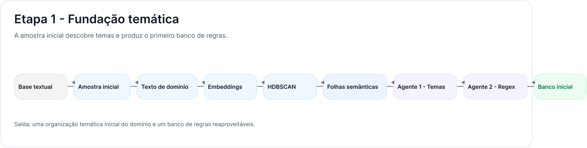
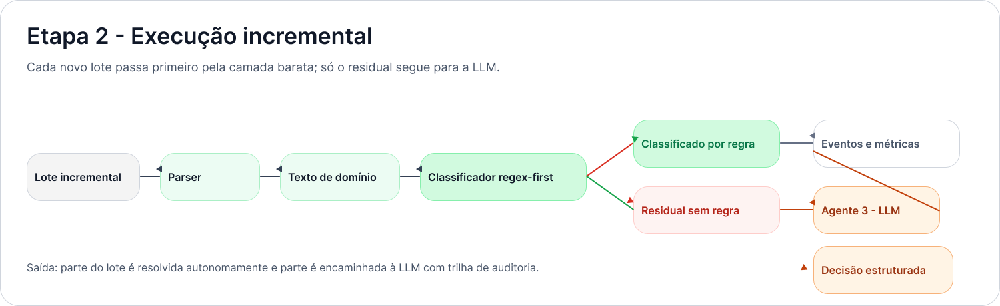
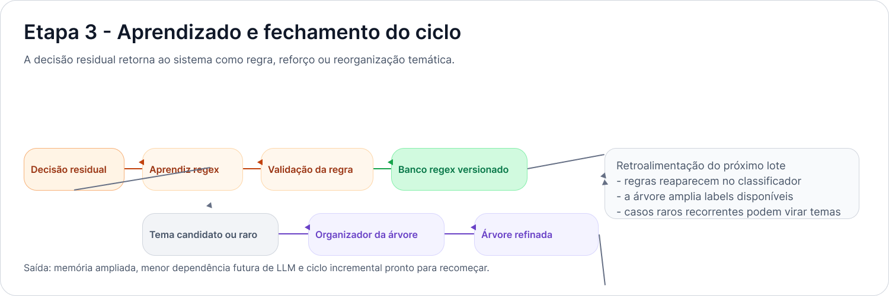

# Redução Progressiva de Custo em Classificação Textual Incremental por Meio de Memória WNN Auditável e Revisão Residual por LLM

## Resumo

Modelos de linguagem de grande porte ampliaram de forma expressiva a capacidade de classificação textual em cenários semanticamente complexos. Ainda assim, quando o problema deixa de ser apenas acertar uma classe e passa a incluir custo operacional, continuidade de uso e auditabilidade, o emprego irrestrito de LLM em todos os documentos torna-se oneroso. Em fluxos documentais extensos, parte relevante dos casos reapresenta sinais já observados anteriormente, o que sugere a possibilidade de reaproveitamento de decisões passadas. Este trabalho parte desse problema para propor uma arquitetura híbrida de classificação incremental de notícias institucionais, combinando uma memória WNN auditável com revisão residual por LLM. A abordagem projeta cada documento em uma memória binária versionada, utiliza a WNN para decidir autonomamente o crime canônico principal e reserva a LLM para os casos em que a evidência ainda é insuficiente. A decisão residual, contudo, não se encerra no caso corrente, pois também retorna ao sistema como fonte de novos discriminadores reutilizáveis. O eixo de `modus_operandi` é tratado como camada complementar, enriquecendo a saída sem comprometer a estabilidade da decisão principal. A contribuição central do trabalho está em reposicionar a LLM como supervisão residual formativa, de modo que o custo se concentre no início do processo e tenda a cair à medida que a memória WNN amadurece.

**Palavras-chave:** classificação textual incremental; redes neurais sem peso; WNN; LLM; auditabilidade; custo operacional.

## 1. Introdução

A classificação textual baseada exclusivamente em modelos de linguagem de grande porte tornou-se uma solução natural para domínios marcados por ambiguidade semântica, vocabulário variável e forte dependência de contexto. Essa força interpretativa, porém, convive com uma limitação prática importante. Em fluxos documentais extensos e contínuos, acionar uma LLM para todos os documentos significa sustentar permanentemente um custo elevado, além de dificultar a consolidação de uma memória operacional estável, rastreável e auditável. O problema se torna ainda mais evidente quando o domínio apresenta recorrência temática suficiente para sugerir que parte das decisões poderia ser reaproveitada.

No contexto de notícias institucionais, muitos documentos novos não são completamente inéditos. Embora a superfície textual mude, vários deles recompõem combinações de sinais semânticos já vistos em classificações anteriores. Em casos assim, submeter todos os textos a uma LLM significa pagar repetidamente por decisões que poderiam ser parcialmente absorvidas por uma camada mais barata e rastreável. A questão central, portanto, não é substituir a LLM, mas reposicioná-la no fluxo de modo que sua flexibilidade semântica seja reservada aos pontos em que realmente faz diferença: novidade, ambiguidade e exceção.

É nesse ponto que se insere a proposta deste artigo. Defende-se aqui uma arquitetura híbrida de classificação textual incremental na qual uma memória WNN atua como camada determinística, auditável e de baixo custo, enquanto a LLM assume o papel de mecanismo residual de descoberta e supervisão semântica. A WNN é acionada primeiro e decide autonomamente o crime canônico principal sempre que a evidência disponível for suficiente. Quando essa evidência não se sustenta, o documento é encaminhado à LLM. A decisão residual, entretanto, não resolve apenas o documento corrente: ela também retorna ao sistema na forma de novos discriminadores reutilizáveis, ampliando a cobertura futura da camada determinística.

A proposta organiza a saída em dois eixos complementares. O primeiro, `canonical_label`, concentra a decisão principal e mais estável do sistema. O segundo, `modus_operandi`, atua como complemento semântico, enriquecendo a saída final sem derrubar sozinho uma decisão de crime já sustentada. Essa separação não é apenas classificatória. Ela traduz uma opção metodológica: preservar a autonomia da decisão principal e deslocar a variabilidade mais natural do domínio para uma camada complementar.

A hipótese central deste trabalho é a de que o custo elevado da classificação se concentra nas rodadas iniciais e tende a ser amortizado progressivamente à medida que a memória WNN absorve padrões recorrentes inicialmente resolvidos por LLM. Se esse movimento se confirmar, espera-se aumento da cobertura da camada determinística, redução da taxa residual e diminuição do custo médio por documento ao longo das iterações.

As contribuições do artigo podem ser sintetizadas em quatro pontos. Primeiro, propõe-se uma arquitetura híbrida WNN+LLM voltada explicitamente à redução progressiva de custo em classificação textual incremental. Segundo, introduz-se um mecanismo de aprendizado residual que converte decisões da LLM em memória operacional reutilizável. Terceiro, formaliza-se a separação funcional entre o eixo principal de `crime` e o eixo complementar de `modus_operandi`, aumentando a estabilidade da decisão autônoma. Quarto, descreve-se uma memória binária versionada e auditável, cujo crescimento incremental preserva rastreabilidade e comparabilidade histórica.

O texto está organizado da seguinte forma. A Seção 2 apresenta a fundamentação conceitual necessária ao trabalho. A Seção 3 discute os trabalhos relacionados e posiciona a proposta. A Seção 4 descreve a metodologia, incluindo arquitetura, memória WNN e aprendizado residual. A Seção 5 apresenta os critérios de avaliação e a estratégia de interpretação dos resultados. Por fim, a Seção 6 retoma o problema, sintetiza as contribuições, discute limites e indica desdobramentos futuros.

## 2. Fundamentação/Referencial

Redes neurais sem peso, em particular a arquitetura WiSARD, partem de um princípio simples e bastante fértil para este trabalho: a decisão é produzida a partir da ativação de padrões binários associados a discriminadores específicos. Em suas aplicações clássicas, esse padrão foi inicialmente tratado como uma retina de entrada. Trabalhos posteriores, contudo, mostraram que a mesma lógica pode ser deslocada para outros domínios, inclusive para tarefas linguísticas e de classificação textual [1], [2]. Essa possibilidade é central aqui, porque permite pensar a memória não como uma imagem no sentido visual, mas como uma estrutura binária de sinais reaproveitáveis.

No campo da classificação textual, a adaptação da WiSARD para vetores binários de atributos mostrou que a arquitetura pode operar com boa eficiência em contextos semissupervisionados e incrementais [1]. O interesse deste artigo não está apenas na capacidade de classificar textos, mas na possibilidade de absorver padrões recorrentes sem perder leveza operacional. Em outras palavras, a camada WNN interessa porque oferece uma forma de memória que cresce por reaproveitamento, e não apenas uma resposta classificatória pontual.

Do ponto de vista teórico, a literatura sobre WiSARD e classificadores `n-tuple` em linguística computacional reforça a adequação da representação binária em tarefas não visuais [2]. Essa base é importante porque a proposta aqui apresentada não depende de entrada imagética, mas de uma memória binária construída sobre discriminadores textuais sanitizados. O que se preserva dos trabalhos anteriores não é a retina visual, mas o princípio de endereçamento binário e resposta por discriminadores.

Em paralelo, a literatura recente sobre LLM consolidou a capacidade desses modelos para tarefas complexas de interpretação semântica, inclusive em cenários de classificação e extração de informação. O problema aparece quando essa força interpretativa precisa conviver com exigências de custo, latência, governança e rastreabilidade. É justamente nesse cruzamento que arquiteturas híbridas se tornam atraentes, sobretudo quando a LLM deixa de ocupar o lugar de mecanismo universal de decisão e passa a atuar como camada residual.

Os conceitos centrais mobilizados pelo artigo, portanto, são três: memória WNN como estrutura binária auditável, classificação textual incremental como problema de reaproveitamento progressivo de padrões e LLM como mecanismo semântico de alta flexibilidade, porém de maior custo. É sobre essa base que a proposta metodológica é construída.

## 3. Trabalhos Relacionados

Os trabalhos relacionados permitem situar a proposta entre duas tradições que, em geral, aparecem separadas. De um lado, estão os trabalhos que exploram WNN em ambientes incrementais e de baixo custo. De outro, estão as abordagens que recorrem à capacidade semântica das LLM para lidar com novidade, ambiguidade e baixa cobertura. A contribuição deste trabalho não está em optar por uma dessas linhas contra a outra, mas em articulá-las sob uma lógica de hierarquia de custo.

Em comparação com trabalhos voltados apenas à aplicação de WiSARD na classificação textual, a principal diferença está na presença de um mecanismo explícito de supervisão residual e reaproveitamento incremental. A memória não funciona apenas como classificador, mas como camada operacional que amadurece a partir dos casos inicialmente resolvidos por inferência mais cara. Já em relação a abordagens baseadas exclusivamente em LLM, a proposta desloca o foco do acerto pontual para a amortização progressiva de custo, para a auditabilidade da decisão e para a formação de uma memória operacional reutilizável. O interesse deixa de ser apenas classificar bem um documento individual e passa a incluir a redução do custo médio de classificação ao longo do tempo.

A Tabela 1 resume a diferença funcional entre os principais componentes da arquitetura proposta.

| Componente | Papel principal | Custo relativo | Estabilidade esperada | Saída típica |
| --- | --- | --- | --- | --- |
| WNN de crime | Decidir autonomamente o crime canônico principal | Baixo | Alta | `canonical_label` aceito ou abstenção |
| WNN de modus | Complementar a decisão principal com forma de execução | Baixo | Média | zero ou mais `modus_operandi` |
| LLM residual | Resolver novidade, ambiguidade e baixa cobertura | Alto | Variável | decisão estruturada e evidências |
| Aprendizado residual | Converter revisão cara em memória reutilizável | Médio | Crescente ao longo do tempo | novos discriminadores e reforços |

Lida em conjunto com a discussão anterior, a Tabela 1 mostra que a proposta não opõe WNN e LLM como soluções rivais. Cada componente ocupa um papel específico: a WNN de `crime` concentra a decisão principal, a WNN de `modus` enriquece a saída, a LLM trata os casos residuais e o aprendizado residual transforma custo inicial em conhecimento reaproveitável. É essa articulação funcional que distingue a proposta em relação às abordagens isoladas.

## 4. Metodologia

A metodologia proposta toma como unidade de processamento o documento textual individual. No domínio empírico considerado, essa unidade corresponde a uma notícia institucional composta por título, subtítulo, corpo, data, tags, fonte e link. A sequência metodológica não é construída como um simples encadeamento técnico, mas como um ciclo de passagem entre classificação barata e classificação cara. Por isso, o procedimento é organizado em oito momentos articulados: ingestão documental, pré-processamento linguístico, projeção em memória WNN, decisão autônoma de `crime`, extração complementar de `modus_operandi`, revisão residual por LLM, aprendizado de novos discriminadores e atualização versionada da memória.

Após a coleta, o texto é submetido a um pré-processamento linguístico voltado à remoção de ruído e à priorização de sinais substantivos. O objetivo dessa etapa é reduzir a interferência de elementos acidentais, como datas, localidades ou expressões protocolares, e concentrar a classificação em termos mais estáveis para o domínio. O resultado é um texto semântico reduzido, mais adequado ao acionamento da memória WNN.

A projeção em memória WNN transforma o documento em um vetor binário indexado por um vocabulário discriminativo versionado. Cada posição da memória corresponde a uma palavra-chave sanitizada previamente associada a um ou mais discriminadores. Quando o documento ativa as posições encontradas em seu texto semântico, produz-se um padrão 0/1 reutilizável. Esse padrão não constitui uma imagem de entrada no sentido visual, mas uma representação binária auditável dos sinais acionados na memória.

A decisão principal da WNN recai sobre o eixo de `crime`. Discriminadores de crime acumulam pontuação por `label` canônica, e a classificação é aceita autonomamente apenas quando confiança, margem e evidência sustentam a decisão. O eixo de `modus_operandi` é processado em paralelo, mas sua função é complementar. Assim, um `modus_operandi` identificado pode enriquecer a saída final sem invalidar sozinho um crime principal já sustentado pela memória.

Quando a camada WNN não encontra evidência suficiente para aceitar autonomamente o documento, o caso passa a ser tratado como residual. Esse residual é encaminhado à LLM com informações estruturadas sobre o texto semântico, os discriminadores acionados, a pontuação obtida, as hipóteses parciais e os motivos da abstenção. A LLM devolve então uma decisão estruturada, que pode confirmar uma classe existente, sugerir um novo tema candidato ou registrar modos de execução adicionais.

O componente mais importante da metodologia está no fechamento do ciclo. A decisão residual não é usada apenas para resolver o documento corrente, mas para alimentar a memória com novos discriminadores e reforços sobre padrões já existentes. Com isso, exemplos inicialmente caros tornam-se sementes para futuras classificações baratas. O papel da LLM, portanto, desloca-se do uso universal para o uso formativo e residual.

A antiga Figura 1, que condensava o ciclo completo em um único painel, foi desmembrada aqui em três imagens menores para facilitar a leitura metodológica. Em vez de apresentar todo o percurso de uma vez, a exposição passa a acompanhar a ordem em que o processo efetivamente acontece: primeiro a fundação temática, depois a execução incremental e, por fim, o aprendizado que fecha o ciclo.

*Figura 1 - Fundação temática da metodologia. A amostra inicial é processada para descobrir temas, organizar folhas semânticas e produzir o primeiro banco de regras reutilizáveis.*

A Figura 1 representa a etapa de fundação temática. É nesse momento que o sistema ainda não opera sobre lotes incrementais recorrentes, mas procura construir uma base inicial de inteligibilidade do domínio. A amostra inicial é transformada em texto de domínio, projetada em embeddings, agrupada e refinada até que surjam temas mais estáveis. A partir deles, os primeiros agentes especializados produzem um banco inicial de regras. Em termos metodológicos, essa etapa importa porque define o repertório mínimo a partir do qual a classificação barata poderá começar a funcionar.

*Figura 2 - Execução incremental da metodologia. Cada novo lote passa primeiro pela camada determinística; apenas os casos residuais seguem para a LLM.*

A Figura 2 mostra a entrada do sistema em regime incremental. Uma vez estabelecida a base inicial, cada novo lote é processado por parser, convertido em texto de domínio e submetido primeiro ao classificador `regex-first`. Nessa etapa, o ponto central é a hierarquia de custo: o sistema tenta resolver autonomamente tudo o que já consegue reconhecer com segurança e separa apenas o residual para a LLM. O que se observa aqui não é apenas um desvio técnico entre dois caminhos de classificação, mas a operacionalização concreta da hipótese do trabalho: usar a camada mais barata como primeira resposta e reservar a inferência mais cara para os casos em que a memória ainda não é suficiente.

*Figura 3 - Aprendizado e fechamento do ciclo. A decisão residual retorna ao sistema como regra, reforço ou reorganização temática para os próximos lotes.*

A Figura 3 apresenta o fechamento do ciclo. O residual resolvido pela LLM não se encerra na classificação do documento corrente. Ele é reaproveitado como matéria-prima para aprendizagem: pode reforçar regras já existentes, gerar validação de novas expressões, alimentar um banco regex versionado ou até sugerir reorganizações temáticas mais amplas. É justamente nesse retorno que a proposta se distingue de um pipeline linear tradicional. A memória deixa de ser apenas um repositório estático e passa a funcionar como estrutura que amadurece a partir do próprio uso. Por isso, a leitura conjunta das três figuras deve ser entendida como uma narrativa metodológica: a base inicial descobre padrões, a execução incremental separa o que já é barato do que ainda é caro, e o aprendizado residual reduz gradualmente a dependência futura de LLM.

No interior desse procedimento, a memória WNN ocupa papel metodológico central por ser a estrutura em que o conhecimento incremental é armazenado e reativado. A memória é organizada como uma matriz de vocabulário discriminativo versionado. Cada token sanitizado ocupa uma posição fixa, preservada ao longo do tempo. Quando novos discriminadores são aprendidos, novos tokens podem ser anexados ao final da memória, sem reaproveitamento destrutivo de posições antigas. Essa política de crescimento por anexação à direita garante comparabilidade entre vetores históricos e vetores recentes, com preenchimento implícito de zeros nas posições ainda inexistentes em rodadas anteriores.

Cada discriminador contém um conjunto pequeno de palavras-chave não ordenadas, associado a um `kind` e a uma `label`. O `kind` diferencia o papel do discriminador no sistema, sobretudo entre `crime` e `modus`. Essa distinção permite interpretar a mesma memória sob dois eixos de leitura: um eixo principal, dedicado à decisão do crime canônico, e um eixo complementar, dedicado à forma de execução. A memória continua única e versionada, mas a interpretação operacional dos seus acionamentos passa a respeitar a hierarquia entre estabilidade e variabilidade.

Do ponto de vista da auditoria, a representação binária da memória pode ser mostrada como grade visual 0/1. Essa grade não substitui a lógica interna do classificador, mas torna rastreável o conjunto de posições acionadas, os tokens associados e os discriminadores potencialmente envolvidos na decisão. A visualização também permite inspecionar separadamente os trechos da memória mais associados ao eixo de crime e ao eixo de `modus_operandi`.

Essa modelagem resolve um problema operacional importante. Em classificações documentais institucionais, o crime principal tende a ser mais estável do que o modo de execução. Ao preservar o crime como núcleo de autonomia e deslocar a variabilidade maior para o eixo complementar, a proposta evita que a expansão natural de `modus_operandi` comprometa a robustez do sistema como um todo.

A Figura 4 apresenta a memória WNN por meio de dois blocos laterais independentes. Em vez de concentrar toda a explicação em uma visualização mais densa, a figura destaca separadamente a `Sessão 1`, dedicada ao crime canônico principal, e a `Sessão 2`, dedicada ao `modus_operandi`. Em cada bloco aparecem apenas quatro elementos de leitura: o papel da sessão, um recorte do padrão binário 0/1, a `label` correspondente e a lista resumida de posições ativas.

*Figura 4 - Representação simplificada da memória WNN em duas sessões. Cada cartão isola um eixo de leitura e mostra apenas o mínimo necessário para auditoria: função da sessão, recorte binário, `label` e posições ativas.*

Essa simplificação visual ajuda a sustentar a interpretação metodológica do trabalho. O conjunto de crimes pode expandir-se, e o conjunto de `modus_operandi` tende a crescer ainda mais rapidamente, mas a memória não precisa ser rebatizada nem reconstruída. Novos discriminadores são apenas anexados ao vocabulário versionado, enquanto a regra de leitura preserva a prioridade do eixo de `crime` e trata o eixo de `modus_operandi` como complemento semântico. Em outras palavras, a imagem binária permanece estável como estrutura, mesmo quando o conteúdo dos dois blocos evolui ao longo das rodadas incrementais.

O último componente metodológico relevante é o aprendizado residual por LLM, responsável por transformar baixa cobertura presente em memória útil para rodadas futuras. O residual representa a fronteira entre o que a memória já absorveu e o que ainda exige interpretação semântica mais cara. Cada documento residual é convertido em um pacote de revisão contendo o texto semântico, a saída parcial da WNN, a lista de discriminadores acionados, a versão da memória, a representação binária ativa e candidatos auxiliares obtidos por similaridade. Esse pacote busca reduzir a revisão cega por LLM e aumentar a rastreabilidade da decisão residual.

A resposta da LLM é estruturada em torno de um `canonical_label` principal, possíveis marcadores secundários e zero ou mais `labels` de `modus_operandi`. O ponto metodológico central está em que essa decisão não é consumida apenas como rótulo final. O sistema extrai dela sinais substantivos reutilizáveis, removendo evidências acidentais e convertendo traços estáveis em novos discriminadores ou reforços sobre discriminadores já existentes.

Esse mecanismo produz pelo menos três efeitos. Primeiro, amplia a memória em regiões ainda pouco cobertas. Segundo, reforça padrões recorrentes já conhecidos, aumentando sua capacidade de reaparecer em rodadas futuras. Terceiro, permite registrar candidatos a novos temas quando o residual não puder ser plenamente absorvido pelas categorias existentes. Em todos os casos, a revisão residual passa a ter valor duplo: resolve o presente e prepara o futuro.

Do ponto de vista econômico, esse é o núcleo da amortização de custo. A LLM continua necessária para novidade e exceção, mas cada chamada bem aproveitada deixa de ser custo exclusivamente consumido e passa a funcionar como investimento de aprendizado para rodadas futuras.

## 5. Resultados/Avaliação

A avaliação precisa ser orientada diretamente pela hipótese do trabalho. Não basta verificar se a arquitetura classifica documentos; é necessário observar se ela reduz progressivamente o custo de classificação ao longo do tempo. Para isso, o desenho experimental deve acompanhar a execução em lotes incrementais, registrando explicitamente a evolução da memória, da cobertura da WNN e do acionamento residual da LLM.

As unidades experimentais são os documentos da base incremental. Os principais fatores observados são a presença ou ausência de classificação autônoma pela WNN, o uso de revisão residual por LLM, o crescimento da memória discriminativa e a evolução do eixo de `modus_operandi`. Os parâmetros relevantes incluem limiares de confiança e margem, política de aceite de discriminadores e configuração do particionamento em lotes.

As variáveis de resposta devem refletir o objetivo econômico e operacional do sistema. As métricas centrais são cobertura da WNN por lote, taxa residual por lote, número de documentos encaminhados à LLM, `prompt_tokens_total`, `completion_tokens_total`, `tokens_total`, custo médio por documento, novos discriminadores aprendidos por lote e proporção de documentos com `modus_operandi` complementar. Métricas auxiliares incluem tamanho da memória, número de posições ativas por documento e distribuição final de crimes aceitos.

O desenho também precisa preservar robustez e interpretabilidade. Por isso, não basta relatar gráficos brutos; é necessário discutir tendências, anomalias e possíveis explicações alternativas. A expectativa experimental é a de observar custo alto nas iterações iniciais, seguido por aumento progressivo da cobertura da WNN e diminuição relativa do residual. Caso a hipótese não se confirme, a análise deve indicar se o problema decorre de baixa qualidade dos discriminadores, excesso de variabilidade do domínio ou crescimento descontrolado da memória.

A Tabela 2 resume as métricas experimentais mais diretamente ligadas à hipótese do trabalho.

| Métrica | Interpretação | Relação com a hipótese |
| --- | --- | --- |
| Cobertura WNN por lote | Proporção de documentos resolvidos autonomamente | Deve aumentar ao longo do tempo |
| Taxa residual por lote | Proporção de documentos enviados à LLM | Deve diminuir ao longo do tempo |
| `tokens_total` por lote | Consumo total de tokens na revisão residual | Deve cair ou crescer menos que o volume documental |
| Custo médio por documento | Custo marginal da classificação no lote | Deve diminuir com o amadurecimento da memória |
| Novos discriminadores por lote | Intensidade de aprendizado residual | Deve ser maior no início e estabilizar depois |
| Proporção de documentos com `modus_operandi` | Capacidade de enriquecer a saída sem romper a autonomia do crime | Deve crescer sem comprometer a cobertura de crime |

A leitura da Tabela 2 deve ser feita de forma integrada, e não métrica por métrica de modo isolado. O aumento da cobertura WNN e a redução da taxa residual mostram se a camada determinística está assumindo parte crescente do trabalho antes delegado à LLM. Já `tokens_total` e custo médio por documento traduzem esse comportamento em impacto operacional mensurável. O indicador de novos discriminadores por lote ajuda a explicar a dinâmica do aprendizado: espera-se intensidade maior nas primeiras rodadas, quando a memória ainda está sendo formada, e posterior estabilização quando o sistema passa a reutilizar mais do que descobrir. Por fim, a proporção de documentos com `modus_operandi` permite verificar se o enriquecimento semântico da saída cresce sem deteriorar a autonomia do eixo principal de crime. Em conjunto, essas métricas permitem avaliar não apenas se o sistema classifica, mas se ele de fato barateia a classificação ao longo do tempo.

A apresentação dos resultados deve priorizar interpretação, e não apenas enumeração de números. Em conformidade com a avaliação experimental planejada, o primeiro conjunto de gráficos deve mostrar a relação entre documentos aceitos pela WNN e documentos encaminhados ao residual por lote. É essa comparação que permite observar se a camada determinística realmente amplia sua cobertura ao longo do tempo.

Em seguida, recomenda-se apresentar a cobertura acumulada da WNN e a trajetória do custo por lote, em especial a evolução de `tokens_total` e do custo médio por documento. Esses resultados são os mais diretamente ligados à hipótese econômica do trabalho. Se a cobertura aumentar enquanto o custo médio cair, a tese central ganha sustentação empírica.

A Figura 5 exemplifica o tipo de evidência esperado para sustentar a hipótese central, ao contrastar documentos aceitos pela WNN com documentos encaminhados ao residual por lote.

*Figura 5 - Comparação entre classificações aceitas pela WNN e documentos encaminhados ao residual por lote. A tendência desejada é o aumento relativo da cobertura da WNN e a redução proporcional do residual.*

Outro grupo importante de resultados envolve o crescimento da memória. O número de novos discriminadores aprendidos por lote, a expansão do vocabulário binário e a distribuição entre discriminadores de crime e de `modus_operandi` ajudam a explicar por que a cobertura aumenta ou por que ela deixa de crescer em determinado estágio. Uma boa apresentação não deve ocultar anomalias: se alguns lotes mostrarem aumento repentino do residual ou crescimento pouco útil da memória, esses casos precisam ser discutidos de forma explícita.

Por fim, figuras e tabelas devem ter papel analítico claro. A Figura 6, por exemplo, pode ser usada para mostrar a estrutura final `WNN -> crime -> modus_operandi`, sustentando o argumento de que o eixo principal de crime permanece estável enquanto o eixo complementar absorve maior diversidade operacional.

*Figura 6 - Estrutura final da classificação produzida pela memória WNN: a raiz operacional conduz ao crime canônico principal e, abaixo dele, aos `modus_operandi` associados mais frequentes.*

A leitura da Figura 6 deve começar pela raiz WNN, que representa a memória operacional comum a todo o sistema. A partir dela, o primeiro desdobramento relevante é o nó de `crime`, pois é nele que se concentra a decisão principal e mais estável da classificação. Somente depois dessa definição é que a estrutura avança para os nós de `modus_operandi`, entendidos como descrições complementares da forma de execução. Essa ordem visual é importante porque traduz a própria hierarquia metodológica do trabalho: primeiro a memória decide o eixo canônico de crime; depois, sem derrubar essa decisão, acrescenta qualificações operacionais. Assim, a figura não deve ser lida como uma árvore de classes independentes, mas como uma árvore de decisão em camadas, na qual o nível superior sustenta a autonomia do classificador e o nível inferior amplia a riqueza semântica da saída final.

## 6. Conclusão

Este artigo propôs uma arquitetura híbrida de classificação textual incremental que combina uma memória WNN auditável com revisão residual por LLM. A proposta foi motivada pelo alto custo do uso contínuo de LLM em grandes fluxos documentais e pela percepção de que muitos documentos recorrentes podem ser absorvidos por uma camada determinística de baixo custo.

O núcleo metodológico da solução pode ser resumido em dois movimentos complementares. No primeiro, a WNN assume a decisão autônoma do crime canônico principal, preservando estabilidade operacional em torno do eixo mais recorrente do domínio. No segundo, a LLM é deslocada para o papel de revisora residual e fonte de novos discriminadores, permitindo que cada classificação cara contribua para reduzir custos futuros. O eixo de `modus_operandi` complementa a saída sem comprometer a robustez da decisão principal.

Em termos de hipótese, o trabalho sustenta que o custo elevado concentra-se no início do processo e tende a ser amortizado progressivamente à medida que a memória absorve padrões recorrentes. O valor do sistema, portanto, não está apenas em classificar documentos, mas em transformar classificações caras em memória operacional reutilizável. Se os resultados experimentais confirmarem aumento de cobertura, queda do residual e redução de custo médio por documento, a arquitetura poderá ser considerada uma alternativa viável para cenários institucionais com forte recorrência temática e necessidade de auditabilidade.

Há, contudo, limites importantes. A arquitetura não elimina a dependência inicial de LLM, pois nas primeiras rodadas a memória ainda é pequena e a taxa residual tende a ser alta. Existe também risco de generalização inadequada quando discriminadores são aprendidos a partir de evidências acidentais ou excessivamente específicas. Além disso, a diferença de estabilidade entre `crime` e `modus_operandi` exige governança contínua, já que o segundo eixo tende a crescer de modo mais dinâmico. Por fim, os resultados permanecem dependentes do domínio empírico, de modo que sua generalização para outros cenários precisa ser demonstrada experimentalmente.

Como trabalhos futuros, recomenda-se aprofundar a governança da expansão da memória, avaliar políticas de consolidação de `modus_operandi`, comparar a arquitetura com baselines mais simples e testar sua robustez em outros domínios documentais incrementais.

## Referências

[1] RANGEL, F.; FIRMINO, F.; LIMA, P. M. V.; OLIVEIRA, J. *Semi-Supervised Classification of Social Textual Data Using WiSARD*. ESANN, 2016.

[2] CARNEIRO, H. C. C. *Theoretical Results on a Weightless Neural Classifier and Application to Computational Linguistics*. Tese de Doutorado. COPPE/UFRJ, 2017.

[3] Inserir aqui as demais referências sobre LLM, classificação textual incremental, auditabilidade e trabalhos correlatos utilizados na versão final.
