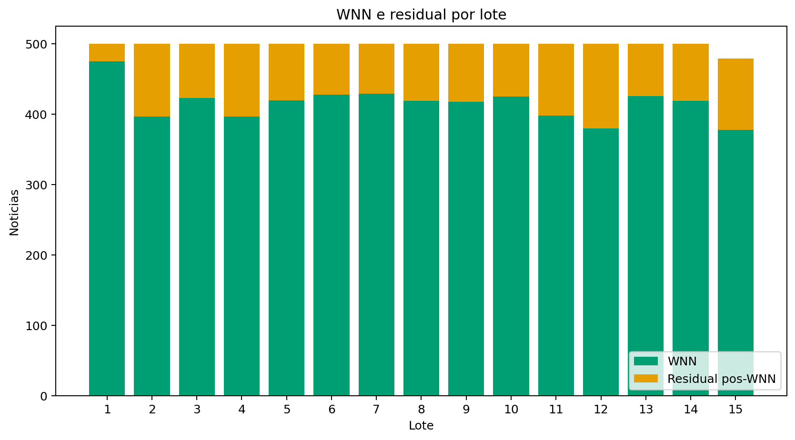
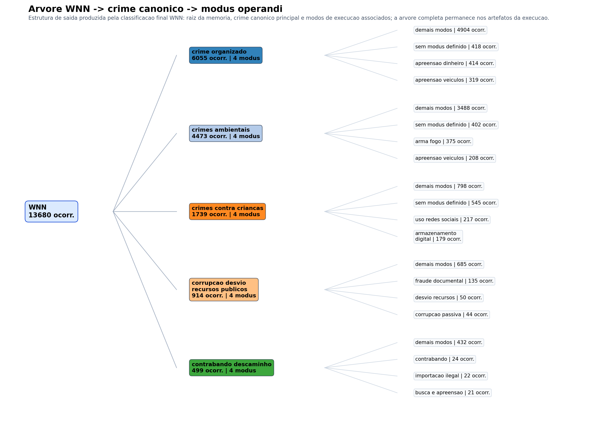

# Redução Progressiva de Custo em Classificação Textual Incremental por Meio de Memória WNN Auditável e Revisão Residual por LLM

## Resumo

Modelos de linguagem de grande porte oferecem boa flexibilidade semântica para classificação textual, mas seu uso contínuo em grandes bases documentais impõe custo operacional elevado. Este trabalho propõe uma arquitetura híbrida para classificação incremental de notícias institucionais, combinando uma memória WNN auditável com revisão residual por LLM. A proposta parte do pressuposto de que muitos documentos recorrentes podem ser absorvidos por uma camada determinística de baixo custo, enquanto casos novos, ambíguos ou insuficientemente cobertos permanecem sob responsabilidade da LLM. O sistema aplica primeiro uma memória WNN baseada em discriminadores binários versionados para decidir autonomamente o crime canônico principal. Quando a evidência não é suficiente, o documento é encaminhado à revisão residual, cuja decisão também serve como fonte de novos discriminadores reutilizáveis. O eixo de `modus_operandi` é tratado como camada complementar, enriquecendo a saída final sem comprometer a estabilidade da decisão principal por crime. A hipótese central é que, ao longo das iterações, a cobertura da WNN aumenta, a taxa residual diminui e o custo médio por documento tende a cair. O artigo descreve a arquitetura, o mecanismo de aprendizado residual, a representação binária auditável e um desenho experimental baseado em cobertura, taxa residual, consumo de tokens e custo operacional.

**Palavras-chave:** classificação textual incremental; redes neurais sem peso; WNN; LLM; auditabilidade; custo operacional.

## 1. Introdução

A classificação textual baseada exclusivamente em modelos de linguagem de grande porte é atraente em domínios com alta ambiguidade semântica, vocabulário variável e necessidade de interpretação contextual. Entretanto, em fluxos documentais extensos e contínuos, o uso irrestrito de LLM em todos os documentos tende a elevar o custo computacional e financeiro do processo, além de dificultar a construção de uma memória operacional estável e auditável. Esse problema torna-se especialmente relevante quando o domínio apresenta recorrência temática suficiente para justificar a reutilização de padrões já observados.

No contexto de notícias institucionais, muitos documentos novos não são completamente inéditos. Em diversos casos, o texto reapresenta combinações de sinais semânticos já vistos em decisões anteriores. Nesses cenários, submeter todos os documentos a uma LLM significa pagar repetidamente por classificações que poderiam ser parcialmente absorvidas por uma camada mais barata e rastreável. A questão central, portanto, não é substituir a LLM, mas deslocá-la para os casos em que sua flexibilidade semântica realmente agrega valor: novidade, ambiguidade e exceção.

Este trabalho propõe uma arquitetura híbrida de classificação textual incremental na qual uma memória WNN funciona como camada determinística auditável de baixo custo, enquanto a LLM atua como mecanismo residual de descoberta e supervisão semântica. A WNN é responsável por decidir autonomamente o crime canônico principal sempre que houver evidência suficiente. Quando essa evidência não é alcançada, o documento é encaminhado à LLM. A decisão residual, porém, não encerra apenas o caso corrente: ela também alimenta a memória com novos discriminadores reutilizáveis, ampliando a cobertura futura da camada determinística.

A proposta separa explicitamente dois eixos de saída. O primeiro eixo, `canonical_label`, sustenta a decisão principal e mais estável do sistema. O segundo eixo, `modus_operandi`, atua como complemento semântico, enriquecendo a saída final sem derrubar sozinho uma decisão de crime já bem sustentada. Essa separação permite preservar a autonomia do núcleo classificatório ao mesmo tempo em que acomoda maior variabilidade descritiva no modo de execução.

A hipótese central deste artigo é que o custo elevado da classificação concentra-se nas iterações iniciais e tende a ser amortizado progressivamente à medida que a memória WNN absorve padrões recorrentes inicialmente resolvidos por LLM. Em consequência, espera-se aumento da cobertura da camada determinística, redução da taxa residual e diminuição do custo médio por documento ao longo das rodadas incrementais.

As contribuições do trabalho são quatro. Primeiro, propõe-se uma arquitetura híbrida WNN+LLM voltada à redução progressiva de custo em classificação textual incremental. Segundo, introduz-se um mecanismo de aprendizado residual que converte decisões da LLM em discriminadores reutilizáveis na memória WNN. Terceiro, formaliza-se uma separação operacional entre o eixo principal de `crime` e o eixo complementar de `modus_operandi`, aumentando a estabilidade da decisão autônoma. Quarto, descreve-se uma memória binária versionada e auditável, na qual o crescimento incremental preserva rastreabilidade e comparabilidade histórica.

O restante deste artigo está organizado da seguinte forma. A Seção 2 apresenta a fundamentação teórica e os trabalhos relacionados. A Seção 3 descreve a arquitetura proposta. A Seção 4 detalha a memória WNN e a representação binária. A Seção 5 apresenta o aprendizado residual por LLM. A Seção 6 define o desenho experimental. A Seção 7 indica a estratégia de análise dos resultados. A Seção 8 discute limitações. Por fim, a Seção 9 apresenta as conclusões e os desdobramentos futuros.

## 2. Fundamentação Teórica e Trabalhos Relacionados

Redes neurais sem peso, em particular a arquitetura WiSARD, utilizam padrões binários de entrada e discriminadores associados a categorias específicas. Em aplicações clássicas, o padrão binário foi inicialmente tratado como retina de entrada, mas trabalhos posteriores mostraram que a mesma lógica pode ser adaptada a outros domínios, inclusive tarefas linguísticas e de classificação textual [1], [2]. Essa característica torna a WiSARD especialmente interessante em cenários nos quais a representação binária pode ser construída a partir de sinais discriminativos reutilizáveis.

No campo da classificação textual, a adaptação da WiSARD para vetores binários de atributos mostrou que a arquitetura pode operar com boa eficiência em contextos semissupervisionados e incrementais [1]. O ponto mais relevante para este trabalho não é apenas a possibilidade de classificar texto, mas a noção de que a camada WNN pode absorver padrões recorrentes de forma incremental, mantendo uma estrutura de decisão leve e rápida. Essa propriedade dialoga diretamente com o objetivo de reduzir o acionamento contínuo de modelos de custo elevado.

Do ponto de vista teórico, a literatura sobre WiSARD e classificadores `n-tuple` em linguística computacional reforça a adequação da representação binária em tarefas não visuais [2]. Essa base é importante porque a proposta deste artigo não depende de uma entrada imagética, mas de uma memória binária construída sobre discriminadores textuais sanitizados. Em outras palavras, a aderência aos trabalhos anteriores não está em reproduzir uma retina visual, e sim em preservar o princípio de endereçamento binário e resposta por discriminadores.

Em paralelo, a literatura recente sobre LLM consolidou a capacidade desses modelos para tarefas complexas de interpretação semântica, inclusive em cenários de classificação e extração de informação. Ainda assim, o uso operacional contínuo desses modelos em bases extensas continua submetido a restrições de custo, latência, governança e rastreabilidade. Nesse contexto, arquiteturas híbridas tornam-se atraentes, sobretudo quando a LLM é deslocada para o papel de camada residual em vez de mecanismo universal de decisão.

Este trabalho se diferencia por combinar essas duas linhas. A proposta não utiliza a WNN como substituta integral da LLM, nem trata a LLM como componente sempre presente no pipeline. Em vez disso, organiza o fluxo em torno de uma hierarquia de custo: primeiro decide-se o que já pode ser resolvido por memória operacional binária; apenas o resíduo segue para inferência semântica mais cara. A revisão residual, por sua vez, retorna ao sistema na forma de aprendizado incremental, fechando um ciclo de absorção progressiva de conhecimento.

A Tabela 1 resume a diferença funcional entre os principais componentes da arquitetura proposta.

| Componente | Papel principal | Custo relativo | Estabilidade esperada | Saída típica |
| --- | --- | --- | --- | --- |
| WNN de crime | Decidir autonomamente o crime canônico principal | Baixo | Alta | `canonical_label` aceito ou abstenção |
| WNN de modus | Complementar a decisão principal com forma de execução | Baixo | Média | zero ou mais `modus_operandi` |
| LLM residual | Resolver novidade, ambiguidade e baixa cobertura | Alto | Variável | decisão estruturada e evidências |
| Aprendizado residual | Converter revisão cara em memória reutilizável | Médio | Crescente ao longo do tempo | novos discriminadores e reforços |

## 3. Arquitetura Proposta

A arquitetura proposta recebe como unidade de processamento o documento textual individual. No domínio empírico considerado, essa unidade corresponde a uma notícia institucional composta por título, subtítulo, corpo, data, tags, fonte e link. O pipeline é organizado em oito etapas: ingestão documental, pré-processamento linguístico, projeção em memória WNN, decisão autônoma de `crime`, extração complementar de `modus_operandi`, revisão residual por LLM, aprendizado de novos discriminadores e atualização versionada da memória.

Após a coleta do documento, o texto é submetido a pré-processamento linguístico voltado à remoção de ruído e à priorização de sinais substantivos. Esse processamento reduz a interferência de elementos acidentais, como datas, localidades ou expressões protocolares, e concentra a classificação em termos mais estáveis para o domínio. O resultado é um texto semântico reduzido, mais adequado ao acionamento da memória WNN.

A projeção em memória WNN transforma o documento em um vetor binário indexado por vocabulário discriminativo versionado. Cada posição da memória corresponde a uma palavra-chave sanitizada previamente associada a um ou mais discriminadores. O documento ativa as posições encontradas em seu texto semântico, produzindo um padrão 0/1 reutilizável. Esse padrão não constitui uma imagem de entrada no sentido visual, mas uma representação binária auditável dos sinais acionados na memória.

A decisão principal da WNN recai sobre o eixo de `crime`. Discriminadores de crime acumulam pontuação por label canônica, e a classificação é aceita autonomamente apenas quando confiança, margem e evidência sustentam a decisão. O eixo de `modus_operandi` é processado em paralelo, mas sua função é complementar. Assim, um `modus_operandi` identificado pode enriquecer a saída final, sem invalidar sozinho um crime principal já sustentado pela memória.

Quando a camada WNN não encontra evidência suficiente para aceitar autonomamente o documento, o caso é tratado como residual. Esse residual é encaminhado à LLM com informações estruturadas sobre o texto semântico, os discriminadores acionados, a pontuação obtida, as hipóteses parciais e os motivos da abstenção. A LLM devolve uma decisão estruturada, que pode confirmar uma classe existente, sugerir um novo tema candidato ou registrar modos de execução adicionais.

O componente mais importante da arquitetura é o fechamento do ciclo. A decisão residual não é usada apenas para resolver o documento corrente, mas para alimentar a memória com novos discriminadores e reforços sobre padrões já existentes. Com isso, exemplos inicialmente caros tornam-se sementes para futuras classificações baratas. O papel da LLM, portanto, desloca-se do uso universal para o uso formativo e residual.

A Figura 1 sintetiza esse fluxo completo de amortização progressiva de custo.

*Figura 1 - Ciclo completo da metodologia incremental: a LLM atua como supervisão residual, enquanto a memória WNN absorve padrões recorrentes e amplia a cobertura da camada determinística ao longo das rodadas.*

A leitura da Figura 1 deve seguir o sentido do ciclo operacional proposto. O fluxo começa com a entrada documental e o pré-processamento linguístico, etapa em que o texto é reduzido a sinais mais estáveis para o domínio. Em seguida, o documento é projetado na memória WNN, que tenta decidir autonomamente o `crime` principal e, quando possível, complementar a saída com `modus_operandi`. Quando essa evidência não é suficiente, o caso é encaminhado ao residual por LLM, que resolve a classificação mais cara naquele instante. O ponto central da figura, porém, está no retorno desse residual para a memória: a decisão da LLM não encerra apenas o caso corrente, mas gera novos discriminadores, reforços ou ajustes que alimentam a WNN. Por isso, a figura representa um ciclo de amortização progressiva de custo, e não um pipeline linear fechado. A cada rodada, espera-se que mais documentos sejam absorvidos pela camada determinística e menos documentos dependam de revisão cara.

## 4. Memória WNN e Representação Binária

A memória WNN é organizada como uma matriz de vocabulário discriminativo versionado. Cada token sanitizado ocupa uma posição fixa, preservada ao longo do tempo. Quando novos discriminadores são aprendidos, novos tokens podem ser anexados ao final da memória, sem reaproveitamento destrutivo de posições antigas. Essa política de crescimento por anexação à direita garante comparabilidade entre vetores históricos e vetores recentes, com preenchimento implícito de zeros nas posições ainda inexistentes em rodadas anteriores.

Cada discriminador contém um conjunto pequeno de palavras-chave não ordenadas, associado a um `kind` e a uma `label`. O `kind` diferencia o papel do discriminador no sistema, sobretudo entre `crime` e `modus`. Essa distinção permite interpretar a mesma memória sob dois eixos de leitura: um eixo principal, dedicado à decisão do crime canônico, e um eixo complementar, dedicado à forma de execução. A memória continua única e versionada, mas a interpretação operacional dos seus acionamentos passa a respeitar a hierarquia entre estabilidade e variabilidade.

Do ponto de vista da auditoria, a representação binária da memória pode ser mostrada como grade visual 0/1. Essa grade não substitui a lógica interna do classificador, mas torna rastreável o conjunto de posições acionadas, os tokens associados e os discriminadores potencialmente envolvidos na decisão. A visualização também permite inspecionar separadamente os trechos da memória mais associados ao eixo de crime e ao eixo de `modus_operandi`.

Essa modelagem resolve um problema operacional relevante. Em classificações documentais institucionais, o crime principal tende a ser mais estável do que o modo de execução. Ao preservar o crime como núcleo de autonomia e deslocar a variabilidade maior para o eixo complementar, a proposta evita que a expansão natural de `modus_operandi` comprometa a robustez do sistema como um todo.

A Figura 2 apresenta a memória WNN por meio de dois blocos laterais independentes. Em vez de concentrar toda a explicação em uma visualização mais densa, a figura destaca separadamente a `Sessão 1`, dedicada ao crime canônico principal, e a `Sessão 2`, dedicada ao `modus_operandi`. Em cada bloco aparecem apenas quatro elementos de leitura: o papel da sessão, um recorte do padrão binário 0/1, a `label` correspondente e a lista resumida de posições ativas.

*Figura 2 - Representação simplificada da memória WNN em duas sessões. Cada cartão isola um eixo de leitura e mostra apenas o mínimo necessário para auditoria: função da sessão, recorte binário, `label` e posições ativas.*

Essa simplificação visual ajuda a sustentar a interpretação metodológica do trabalho. O conjunto de crimes pode expandir-se, e o conjunto de `modus_operandi` tende a crescer ainda mais rapidamente, mas a memória não precisa ser rebatizada nem reconstruída. Novos discriminadores são apenas anexados ao vocabulário versionado, enquanto a regra de leitura preserva a prioridade do eixo de `crime` e trata o eixo de `modus_operandi` como complemento semântico. Em outras palavras, a imagem binária permanece estável como estrutura, mesmo quando o conteúdo dos dois blocos evolui ao longo das rodadas incrementais.

## 5. Aprendizado Residual por LLM

O residual representa a fronteira entre o que a memória já absorveu e o que ainda exige interpretação semântica mais cara. Cada documento residual é convertido em um pacote de revisão contendo o texto semântico, a saída parcial da WNN, a lista de discriminadores acionados, a versão da memória, a representação binária ativa e candidatos auxiliares obtidos por similaridade. Esse pacote busca reduzir a revisão cega por LLM e aumentar a rastreabilidade da decisão residual.

A resposta da LLM é estruturada em torno de um `canonical_label` principal, possíveis marcadores secundários e zero ou mais labels de `modus_operandi`. O ponto metodológico central é que essa decisão não é consumida apenas como rótulo final. O sistema extrai dela sinais substantivos reutilizáveis, removendo evidências acidentais e convertendo traços estáveis em novos discriminadores ou reforços sobre discriminadores já existentes.

Esse mecanismo produz pelo menos três efeitos. Primeiro, amplia a memória em regiões ainda pouco cobertas. Segundo, reforça padrões recorrentes já conhecidos, aumentando sua capacidade de reaparecer em rodadas futuras. Terceiro, permite registrar candidatos a novos temas quando o residual não puder ser plenamente absorvido pelas categorias existentes. Em todos os casos, a revisão residual passa a ter valor duplo: resolve o presente e prepara o futuro.

Do ponto de vista econômico, esse é o núcleo da amortização de custo. A LLM continua necessária para novidade e exceção, mas cada chamada bem aproveitada deixa de ser custo exclusivamente consumido e passa a funcionar como investimento de aprendizado para rodadas futuras.

## 6. Desenho Experimental

O desenho experimental precisa ser orientado diretamente pela hipótese do trabalho. O objetivo não é apenas verificar se a arquitetura classifica documentos, mas se ela reduz progressivamente o custo de classificação ao longo do tempo. Para isso, a avaliação deve acompanhar a execução em lotes incrementais, com registro explícito da evolução da memória, da cobertura da WNN e do acionamento residual da LLM.

As unidades experimentais são os documentos da base incremental. Os principais fatores observados são: presença ou ausência de classificação autônoma pela WNN, uso de revisão residual por LLM, crescimento da memória discriminativa e evolução do eixo de `modus_operandi`. Os parâmetros relevantes incluem limiares de confiança e margem, política de aceite de discriminadores e configuração do particionamento em lotes.

As variáveis de resposta devem refletir o objetivo econômico e operacional do sistema. As métricas centrais são: cobertura da WNN por lote, taxa residual por lote, número de documentos encaminhados à LLM, `prompt_tokens_total`, `completion_tokens_total`, `tokens_total`, custo médio por documento, novos discriminadores aprendidos por lote e proporção de documentos com `modus_operandi` complementar. Métricas auxiliares incluem tamanho da memória, número de posições ativas por documento e distribuição final de crimes aceitos.

O desenho também deve considerar robustez e interpretabilidade. Assim, não basta relatar gráficos brutos; é necessário discutir tendências, anomalias e possíveis explicações alternativas. A expectativa experimental é observar custo alto nas iterações iniciais, seguido por aumento progressivo da cobertura da WNN e diminuição relativa do residual. Caso a hipótese não se confirme, a análise deve indicar se o problema decorre de baixa qualidade dos discriminadores, excesso de variabilidade do domínio ou crescimento descontrolado da memória.

A Tabela 2 resume as métricas experimentais mais diretamente ligadas à hipótese do trabalho.

| Métrica | Interpretação | Relação com a hipótese |
| --- | --- | --- |
| Cobertura WNN por lote | Proporção de documentos resolvidos autonomamente | Deve aumentar ao longo do tempo |
| Taxa residual por lote | Proporção de documentos enviados à LLM | Deve diminuir ao longo do tempo |
| `tokens_total` por lote | Consumo total de tokens na revisão residual | Deve cair ou crescer menos que o volume documental |
| Custo médio por documento | Custo marginal da classificação no lote | Deve diminuir com o amadurecimento da memória |
| Novos discriminadores por lote | Intensidade de aprendizado residual | Deve ser maior no início e estabilizar depois |
| Proporção de documentos com `modus_operandi` | Capacidade de enriquecer a saída sem romper a autonomia do crime | Deve crescer sem comprometer a cobertura de crime |

A leitura da Tabela 2 deve ser feita de forma integrada, e não métrica por métrica de modo isolado. O aumento da cobertura WNN e a redução da taxa residual mostram se a camada determinística está assumindo parte crescente do trabalho antes delegado à LLM. Já `tokens_total` e custo médio por documento traduzem esse comportamento em impacto operacional mensurável. O indicador de novos discriminadores por lote ajuda a explicar a dinâmica do aprendizado: espera-se intensidade maior nas primeiras rodadas, quando a memória ainda está sendo formada, e posterior estabilização quando o sistema passa a reutilizar mais do que descobrir. Por fim, a proporção de documentos com `modus_operandi` permite verificar se o enriquecimento semântico da saída cresce sem deteriorar a autonomia do eixo principal de crime. Em conjunto, essas métricas permitem avaliar não apenas se o sistema classifica, mas se ele de fato barateia a classificação ao longo do tempo.

## 7. Estratégia de Apresentação dos Resultados

A apresentação dos resultados deve priorizar interpretação, e não apenas enumeração de números. Em conformidade com a avaliação experimental planejada, o primeiro conjunto de gráficos deve mostrar a relação entre documentos aceitos pela WNN e documentos encaminhados ao residual por lote. Esse gráfico permite observar se a camada determinística realmente amplia sua cobertura ao longo do tempo.

Em seguida, recomenda-se apresentar a cobertura acumulada da WNN e a trajetória do custo por lote, em especial a evolução de `tokens_total` e do custo médio por documento. Esses resultados são os mais diretamente ligados à hipótese econômica do trabalho. Se a cobertura aumentar enquanto o custo médio cair, a tese central ganha sustentação empírica.

A Figura 3 exemplifica o tipo de evidência esperado para sustentar a hipótese central, ao contrastar documentos aceitos pela WNN com documentos encaminhados ao residual por lote.

*Figura 3 - Comparação entre classificações aceitas pela WNN e documentos encaminhados ao residual por lote. A tendência desejada é o aumento relativo da cobertura da WNN e a redução proporcional do residual.*

Outro grupo importante de resultados envolve o crescimento da memória. O número de novos discriminadores aprendidos por lote, a expansão do vocabulário binário e a distribuição entre discriminadores de crime e de `modus_operandi` ajudam a explicar por que a cobertura aumenta ou por que ela deixa de crescer em determinado estágio. Uma boa apresentação não deve ocultar anomalias: se alguns lotes mostrarem aumento repentino do residual ou crescimento pouco útil da memória, esses casos devem ser discutidos de forma explícita.

Por fim, figuras e tabelas devem ter papel analítico claro. A Figura 4, por exemplo, pode ser usada para mostrar a estrutura final `WNN -> crime -> modus_operandi`, sustentando o argumento de que o eixo principal de crime permanece estável enquanto o eixo complementar absorve maior diversidade operacional.

*Figura 4 - Estrutura final da classificação produzida pela memória WNN: a raiz operacional conduz ao crime canônico principal e, abaixo dele, aos `modus_operandi` associados mais frequentes.*

A leitura da Figura 4 deve começar pela raiz WNN, que representa a memória operacional comum a todo o sistema. A partir dela, o primeiro desdobramento relevante é o nó de `crime`, pois é nele que se concentra a decisão principal e mais estável da classificação. Somente depois dessa definição é que a estrutura avança para os nós de `modus_operandi`, entendidos como descrições complementares da forma de execução. Essa ordem visual é importante porque traduz a própria hierarquia metodológica do trabalho: primeiro a memória decide o eixo canônico de crime; depois, sem derrubar essa decisão, acrescenta qualificações operacionais. Assim, a figura não deve ser lida como uma árvore de classes independentes, mas como uma árvore de decisão em camadas, na qual o nível superior sustenta a autonomia do classificador e o nível inferior amplia a riqueza semântica da saída final.

## 8. Limitações

Embora a arquitetura proposta ofereça uma estratégia promissora de amortização de custo, ela não elimina a dependência inicial de LLM. Nas primeiras rodadas, a memória ainda é pequena e a taxa residual tende a ser alta. Isso significa que a viabilidade econômica do sistema depende de um horizonte incremental suficientemente longo para que a memória amadureça.

Há também risco de generalização inadequada na aprendizagem residual. Se um discriminador for construído a partir de evidências acidentais ou excessivamente específicas, a memória pode crescer com baixa utilidade operacional ou até induzir classificações equivocadas. Esse risco exige governança sobre critérios de aceite, confirmação e reorganização incremental da memória.

Outra limitação decorre da diferença de estabilidade entre os dois eixos. O crime principal tende a ser mais estável, mas o eixo de `modus_operandi` é naturalmente mais dinâmico. Embora a arquitetura reduza o impacto dessa variabilidade ao tratá-la como complemento, o crescimento contínuo desse eixo pode aumentar a complexidade do sistema e demandar políticas adicionais de agrupamento ou consolidação.

Por fim, os resultados dependem do domínio empírico. A capacidade de amortizar custo pela WNN pode ser maior em bases com recorrência temática elevada e menor em bases dominadas por novidade semântica. Assim, a generalização para outros contextos deve ser feita com cautela e sustentada por novos experimentos.

## 9. Conclusão

Este artigo propôs uma arquitetura híbrida de classificação textual incremental que combina uma memória WNN auditável com revisão residual por LLM. A proposta foi motivada pelo alto custo do uso contínuo de LLM em grandes fluxos documentais e pela observação de que muitos documentos recorrentes podem ser absorvidos por uma camada determinística de baixo custo.

O núcleo metodológico da solução está em dois movimentos complementares. Primeiro, a WNN assume a decisão autônoma do crime canônico principal, preservando estabilidade operacional em torno do eixo mais recorrente do domínio. Segundo, a LLM é deslocada para o papel de revisora residual e fonte de novos discriminadores, permitindo que cada classificação cara contribua para reduzir custos futuros. O eixo de `modus_operandi` complementa a saída sem comprometer a robustez da decisão principal.

Em termos de hipótese, o trabalho sustenta que o custo elevado concentra-se no início do processo e tende a ser amortizado progressivamente à medida que a memória absorve padrões recorrentes. O valor do sistema, portanto, não está apenas em classificar documentos, mas em transformar classificações caras em memória operacional reutilizável. Se os resultados experimentais confirmarem aumento de cobertura, queda do residual e redução de custo médio por documento, a arquitetura demonstrará ser uma alternativa viável para cenários institucionais com forte recorrência temática e necessidade de auditabilidade.

Como trabalhos futuros, recomenda-se aprofundar a governança da expansão da memória, avaliar políticas de consolidação de `modus_operandi`, comparar a arquitetura com baselines mais simples e testar sua robustez em outros domínios documentais incrementais.

## Referências

[1] RANGEL, F.; FIRMINO, F.; LIMA, P. M. V.; OLIVEIRA, J. *Semi-Supervised Classification of Social Textual Data Using WiSARD*. ESANN, 2016.

[2] CARNEIRO, H. C. C. *Theoretical Results on a Weightless Neural Classifier and Application to Computational Linguistics*. Tese de Doutorado. COPPE/UFRJ, 2017.

[3] Inserir aqui as demais referências sobre LLM, classificação textual incremental, auditabilidade e trabalhos correlatos utilizados na versão final.
