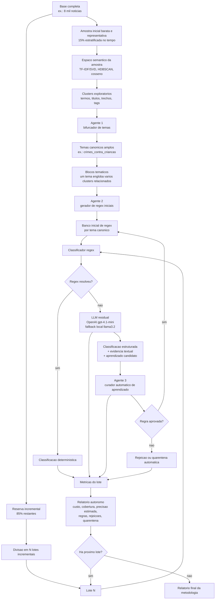

# Metodologia alvo: treinamento incremental autonomo por temas canonicos, regex e LLM

Este documento descreve a metodologia alvo do projeto. A proposta e criar um ciclo fechado, sem interferencia humana, para transformar uma base textual incremental em uma taxonomia canonica, gerar regex iniciais, classificar novos dados por regras deterministicas e usar a LLM apenas nos residuos que escaparem das regras.

O ponto central e separar duas fases:

1. **Fase de fundacao**: usa uma amostra minima viavel da base para descobrir temas canonicos e criar o banco inicial de regex.
2. **Fase incremental**: processa o restante da base, e depois os novos dados diarios, em lotes que passam apenas pela camada regex/LLM/aprendizado.

## Desenho resumido



## Principio metodologico

A clusterizacao nao e o classificador final. Ela e uma ferramenta de descoberta para revelar estrutura semantica. A taxonomia operacional nasce da leitura automatica dos clusters por um agente, que agrupa subtemas em temas canonicos amplos.

Exemplo:

- Clusters sobre `abuso sexual infantil`
- Clusters sobre `pornografia infantil`
- Clusters sobre `material de abuso infantojuvenil`
- Clusters sobre `compartilhamento pela internet`

Todos podem ser consolidados pelo Agente 1 no tema canonico:

- `crimes_contra_criancas`

Assim, o tema canonico nao precisa ser identico ao cluster. Ele funciona como um bloco interpretativo mais amplo, capaz de englobar vocabularios diferentes ligados ao mesmo fenomeno.

## Fase 1: amostra inicial representativa

A base completa nao deve ser enviada integralmente para a etapa de descoberta inicial. A rodada final da metodologia usa uma amostra inicial de 15% da base historica, estratificada temporalmente.

Regras da amostra:

- Sorteio reprodutivel com seed registrada.
- Estratificacao opcional por ano para evitar concentracao temporal.
- Registro do hash da amostra e da base completa.
- A amostra serve apenas para descobrir temas canonicos e criar regex iniciais.
- Os 85% restantes ficam reservados para testar o ciclo incremental.
- A amostra deve conter fragmentos de diferentes momentos da base, evitando concentrar toda a fundacao em um periodo recente ou antigo.

Artefatos esperados:

- `data/analise_qualitativa/incremental/amostra_inicial.csv`
- `data/analise_qualitativa/incremental/reserva_incremental.csv`
- `data/analise_qualitativa/incremental/amostragem_manifesto.json`

## Fase 2: descoberta semantica na amostra

Sobre a amostra inicial:

1. Construir texto analitico por noticia.
2. Gerar representacao vetorial.
3. Rodar HDBSCAN para grupos densos e ruido.
4. Usar cosseno para vizinhos, exemplos representativos e expansao de evidencias.
5. Produzir resumo dos clusters exploratorios.

Metricas da descoberta:

- Tamanho da amostra.
- Numero de clusters.
- Percentual de ruido.
- Tamanho medio e mediano dos clusters.
- Termos principais por cluster.
- Exemplos representativos.
- Tempo de vetorizacao.
- Tempo de HDBSCAN.
- Tempo de vizinhanca por cosseno.

## Agente 1: bifurcador de temas canonicos

Funcao:

Agrupar clusters exploratorios em blocos tematicos canonicos amplos. Esse agente nao cria regex. Ele cria a taxonomia inicial de temas.

Entrada:

- Resumo dos clusters da amostra.
- Termos principais.
- Titulos e trechos representativos.
- Tags, crimes sugeridos, modus e operacoes quando existirem.
- Vizinhos por cosseno.
- Percentual de ruido e heterogeneidade.

Saida padronizada:

- `theme_id`
- `canonical_theme`
- `theme_type`
- `description`
- `included_cluster_ids`
- `included_subthemes`
- `exclusion_rules`
- `evidence_terms`
- `confidence`
- `automation_decision`

Decisoes possiveis:

- `accept`: tema canonico aceito.
- `merge`: tema deve ser fundido com outro.
- `split`: tema amplo demais, precisa virar mais de um bloco.
- `discard`: cluster ou bloco nao serve para taxonomia inicial.
- `quarantine`: tema incerto fica fora do banco inicial, mas registrado para monitoramento.

Nao ha revisao humana. O que nao passar pelos criterios automaticos fica em quarentena e nao alimenta regex inicial.

## Agente 2: gerador de regex iniciais

Funcao:

Receber cada bloco tematico canonico aprovado pelo Agente 1 e gerar regex iniciais para classificar esse tema no restante da base.

Entrada:

- Tema canonico.
- Clusters incluidos no tema.
- Subtemas incluidos.
- Evidencias textuais.
- Exemplos positivos.
- Exemplos negativos ou regras de exclusao.
- Labels regex ja existentes.

Saida padronizada:

- `theme_id`
- `canonical_theme`
- `regex_candidates`
- `accepted_initial_rules`
- `rejected_candidates`
- `quarantined_candidates`
- `coverage_estimate`
- `precision_risk`

Regras:

- O Agente 2 nao altera a taxonomia.
- O Agente 2 nao chama a LLM residual.
- Ele so produz regex e valida automaticamente.
- Regex aprovadas entram no banco inicial.
- Regex duvidosas ficam em quarentena automatica.

## Fase 3: reserva incremental em lotes

Somente depois que os temas canonicos e regex iniciais existirem, os 85% restantes sao divididos em lotes.

Politica de lote:

- Ordenacao por data para simular chegada incremental, ou sorteio controlado para experimento.
- Cada lote registra tamanho, periodo, hash da entrada e versao das regras antes/depois.
- Os lotes nao passam pelo Agente 1.
- Os lotes nao passam pelo Agente 2, exceto quando for necessario regenerar regex iniciais por nova versao de tema.
- O fluxo normal do lote e regex -> LLM residual -> Agente 3.

Artefatos:

- `data/analise_qualitativa/incremental/lotes_manifesto.csv`
- `data/analise_qualitativa/lotes/lote_0001_input.csv`
- `data/analise_qualitativa/lotes/lote_0001_classificacoes.jsonl`
- `data/analise_qualitativa/lotes/lote_0001_relatorio.md`

## Agente 3: curador automatico de aprendizado

Funcao:

Ler o que a LLM residual classificou nos casos que escaparam da regex, gerar ou revisar regex candidatas e decidir automaticamente se elas entram no banco de regras.

Entrada:

- Registros JSONL com `regex_rules_aprendidas`.
- Inferencia da LLM residual.
- Evidencia textual.
- Resultado da regex anterior.
- Tema canonico associado.
- Exemplos positivos e negativos quando disponiveis.
- Historico de regras do tema.

Saida padronizada:

- `batch_id`
- `decisions`
- `incorporated_count`
- `rejected_count`
- `quarantined_count`
- `learned_labels`
- `residual_risks`
- `next_automatic_tests`

Decisoes possiveis:

- `incorporar`: regra valida, entra no banco regex.
- `rejeitar`: regra invalida, generica, redundante ou perigosa.
- `quarentena`: regra plausivel, mas sem evidencia automatica suficiente.

Nao existe fila de revisao humana. Quarentena significa: nao usar em producao, registrar e reavaliar automaticamente em lotes futuros.

### Criterio adicional observado na rodada final

Durante a rodada final de 15%/85%, foi detectado que algumas regex incrementais estavam usando evidencias operacionais ou contextuais, como nomes de operacao, localidades, orgaos ou trechos administrativos. Isso elevava artificialmente a cobertura, mas piorava a qualidade metodologica.

Por isso, o Agente 2 passou a exigir ancora de crime ou modus operandi antes de incorporar qualquer regex gerada apos revisao do Agente 3.

Exemplos de regras que devem ir para quarentena:

- padroes baseados em nome de operacao;
- padroes baseados apenas em localidade;
- padroes baseados em orgao publico ou unidade administrativa;
- padroes com palavras genericas de operacao policial;
- padroes sem termo substantivo da label canonica.

Exemplos de regras que podem ser incorporadas:

- `arma` + `fogo` + `ilegal` para `armas_municoes`;
- `radio` + `clandestina` para `radiodifusao_clandestina`;
- `vantagem` + `indevida` para `corrupcao_desvio_recursos_publicos`;
- `extracao` + `madeira` para `crimes_ambientais`;
- `quadrilha` + `roubo` quando o contexto justificar `crime_organizado`.

Essa decisao faz parte da metodologia: a meta nao e maximizar regex a qualquer custo, mas maximizar regras auditaveis que representem crime ou modus operandi.

## Interferencia humana zero

A metodologia precisa rodar sem decisao humana durante o ciclo.

Controles automaticos substituem revisao humana:

- Schema Pydantic obrigatorio para toda resposta de agente.
- Validacao de regex por compilacao.
- Teste contra exemplos positivos.
- Teste contra exemplos negativos.
- Bloqueio de termos proibidos ou genericos.
- Limite de explosao de cobertura fora do tema.
- Quarentena automatica para baixa confianca.
- Registro de todos os eventos em JSONL.
- Reprocessamento automatico de regras em quarentena quando surgirem novas evidencias.

O humano aparece apenas fora do ciclo, como avaliador metodologico posterior dos relatorios, nao como parte da classificacao ou aprendizado.

## HDBSCAN vs cosseno

O HDBSCAN e usado na fase de fundacao para separar grupos densos e detectar ruido. A similaridade do cosseno e usada para recuperar vizinhos, escolher exemplos representativos e medir estabilidade entre documentos.

Hipotese operacional:

- HDBSCAN ajuda a descobrir topicos latentes na amostra.
- Cosseno ajuda a recuperar exemplos e medir proximidade incremental.
- Os lotes incrementais nao precisam reclusterizar toda a base, salvo em rodadas periodicas de recalibracao.

## Metricas obrigatorias

### Fundacao

- Tamanho da base completa.
- Tamanho da amostra inicial.
- Seed e criterio de amostragem.
- Numero de clusters exploratorios.
- Numero de temas canonicos aceitos.
- Clusters descartados ou em quarentena.
- Regex iniciais geradas.
- Regex iniciais aceitas, rejeitadas e em quarentena.
- Tempo da clusterizacao.
- Tempo do Agente 1.
- Tempo do Agente 2.

### Incremental

- Total de documentos por lote.
- Percentual classificado por regex.
- Percentual enviado a LLM.
- Tokens e custo estimado.
- Tempo total do lote.
- Regex aprendidas pelo Agente 3.
- Regex rejeitadas.
- Regex em quarentena.
- Reducao progressiva de chamadas a LLM.
- Cobertura adicional apos cada lote.

### Qualidade automatica

- Concordancia regex vs LLM em amostras automaticas.
- Taxa de conflito entre regras.
- Falsos positivos estimados por contraexemplos.
- Falsos negativos estimados por residuos recorrentes.
- Estabilidade de tema canonico entre lotes.
- Reincidencia de casos em quarentena.

## Estrutura de arquivos atual

```text
rodar_sistema.bat
rodar_sistema.py
scripts/
|-- incremental/
|   |-- run_all_incremental.py              # Orquestrador que encadeia as etapas
|   |-- run_all_incremente.py              # Alias do orquestrador
|   |-- amostragem.py                       # Base completa -> 15% temporal / 85% reserva
|   |-- clusterizacao_inicial.py            # HDBSCAN/cosseno na amostra
|   |-- agente1_temas.py                    # Etapa/orquestracao do Agente 1
|   |-- agente2_regex_inicial.py            # Etapa/orquestracao do Agente 2
|   |-- processar_lotes.py                  # Regex em lotes + chamada do Agente 3
|   |-- relatorios.py                       # Metricas, graficos e relatorios
|   `-- common.py                           # Contratos, caminhos e utilitarios
|-- pf_incremental_methodology_run.py       # Wrapper de compatibilidade
|-- pf_operacoes_pipeline.py                # Geracao/sincronizacao da base
|-- pf_llm_metadata.py                      # Parser/contexto e LLM residual
|-- pf_regex_classifier.py                  # Motor regex sem regras antigas
|-- agentes/
|   |-- agente1_temas.py                    # Agente 1: bifurcador de temas canonicos
|   |-- agente2_regex.py                    # Agente 2: geracao/validacao de regex
|   |-- agente3_residual.py                 # Agente 3: revisao residual e aprendizado
|   `-- pf_incremental_agents_langchain.py  # Scaffold LangChain/Ollama
|-- schemas/
|   `-- pf_incremental_agent_schemas.py     # Schemas Pydantic dos agentes
`-- tools/
    |-- pf_generate_langchain_tools.py      # Gerador de tools
    `-- pf_incremental_langchain_tools.py   # Tools geradas/curadas

data/analise_qualitativa/
|-- regex_classifier_rules.json
|-- incremental/
|   |-- amostra_inicial.csv
|   |-- reserva_incremental.csv
|   |-- cluster_assignments_amostra.csv
|   |-- resumo_clusters_amostra.csv
|   |-- temas_canonicos_agent1.json
|   |-- regex_iniciais_agent2.json
|   |-- regex_banco_agent2.json
|   |-- metrics_batches.csv
|   |-- README_METRICAS.md
|   |-- relatorio_execucao_metodologia.md
|   |-- run_manifest.json
|   |-- run_result.json
|   |-- events.jsonl
|   `-- figures/
`-- lotes/
    `-- lote_0001_classificacoes.csv
```

## Comando oficial

O sistema foi desenhado para execucao sem argumentos:

```bat
rodar_sistema.bat
```

Modelo local padrao:

- OpenAI quando `PF_LLM_PROVIDER=openai`
- Fallback local compativel com os estudos LangChain: `llama3.2`

## Criterios de sucesso

A metodologia sera considerada bem-sucedida se demonstrar:

1. Temas canonicos estaveis gerados automaticamente a partir de amostra inicial.
2. Regex iniciais suficientes para classificar parcela relevante da reserva incremental.
3. Reducao progressiva da taxa de chamada a LLM.
4. Aprendizado automatico incorporado sem revisao humana.
5. Quarentena automatica para regras incertas.
6. Relatorios capazes de explicar custo, tempo, cobertura, regras e residuos.
7. Reprodutibilidade por seeds, hashes, schemas e logs de eventos.

## Resultado observado: rodada final 15%/85%

Checkpoint registrado em 2026-05-16 19:50:51 -03:00.

Configuracao da rodada:

- Provedor principal: OpenAI.
- Modelo principal: `gpt-4.1-mini`.
- Fallback local: `llama3.2`.
- Base total: 8106 noticias.
- Amostra de fundacao: 1216 noticias, equivalente a 15% da base.
- Reserva incremental: 6890 noticias, equivalente a 85% da base.
- Estratificacao temporal: por ano.
- Lote incremental: 10 noticias.
- Clusterizacao da amostra: 24 clusters exploratorios.
- Agente 1: 17 temas canonicos aceitos.
- Agente 2: 322 regex iniciais aceitas.

Resultado parcial antes da interrupcao operacional:

- Ultimo lote concluido: `lote_0372`.
- Documentos processados: 3720 de 6890.
- Classificados por regex: 3065.
- Enviados ao Agente 3/LLM residual: 655.
- Cobertura acumulada por regex: 82,3925%.
- Regex incrementais incorporadas: 126.
- Novos temas candidatos: 36.
- Quarentenas do Agente 3: 33.
- Erros de classificacao do Agente 3: 0.

Leitura metodologica:

- A cobertura por regex cresceu de 75,8% nos primeiros 500 documentos para patamares recorrentes acima de 82% nos blocos seguintes.
- Apos o filtro de crime/modus, a incorporacao de regex ficou mais conservadora, mas mais auditavel.
- O resultado confirma a hipotese central: a LLM residual e usada para aprender excecoes, e parte desse aprendizado passa a reduzir chamadas futuras.
- A existencia de 36 novos temas candidatos mostra que a taxonomia inicial nao deve ser tratada como final; ela deve formar uma arvore em que folhas recorrentes podem amadurecer para novos nos canonicos.

Interrupcao operacional observada:

- A execucao parou apos o lote 372 por erro de escrita no arquivo ativo `data/analise_qualitativa/regex_classifier_rules.json`.
- O erro ocorreu durante a compactacao do banco de regex aprendido.
- A correcao aplicada foi trocar a escrita direta por escrita atomica em arquivo temporario seguida de substituicao.
- Foi criado `scripts/resume_final_15_llm.py` para retomar apenas os lotes pendentes, preservando os resultados ja gravados em `metrics_batches.csv`.

Artefatos do checkpoint:

- `data/analise_qualitativa/incremental/metrics_batches.csv`
- `data/analise_qualitativa/incremental/events.jsonl`
- `data/analise_qualitativa/incremental/temas_candidatos_agent3.jsonl`
- `data/analise_qualitativa/regex_classifier_rules.json`
- `logs/execucao_final_15_llm.err.log`
- `logs/execucao_final_15_llm_resume.err.log`
