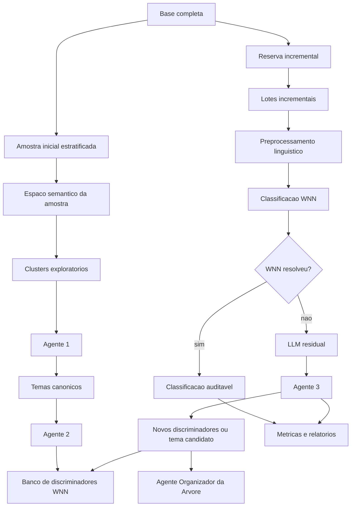

# Metodologia alvo: treinamento incremental autonomo por temas canonicos, discriminadores WNN e LLM residual

Este documento descreve a metodologia alvo do projeto. A proposta e criar um ciclo fechado, sem interferencia humana, para transformar uma base textual incremental em uma taxonomia canonica, gerar discriminadores auditaveis, classificar novos dados por memoria associativa WNN e usar a LLM apenas nos residuos que escaparem dessa camada.

O ponto central e separar duas fases:

1. **Fase de fundacao**: usa uma amostra minima viavel da base para descobrir temas canonicos e criar o banco inicial de discriminadores.
2. **Fase incremental**: processa o restante da base, e depois os novos dados, em lotes que passam por preprocessamento, WNN, LLM residual e aprendizado.

## Desenho resumido

```mermaid
flowchart TD
    A["Base completa"] --> B["Amostra inicial estratificada"]
    A --> C["Reserva incremental"]

    B --> D["Espaco semantico da amostra"]
    D --> E["Clusters exploratorios"]
    E --> F["Agente 1"]
    F --> G["Temas canonicos"]
    G --> H["Agente 2"]
    H --> I["Banco de discriminadores WNN"]

    C --> J["Lotes incrementais"]
    J --> K["Preprocessamento linguistico"]
    K --> L["Classificacao WNN"]
    L --> M{"WNN resolveu?"}
    M -- "sim" --> N["Classificacao auditavel"]
    M -- "nao" --> O["LLM residual"]
    O --> P["Agente 3"]
    P --> Q["Novos discriminadores ou tema candidato"]
    Q --> I
    Q --> R["Agente Organizador da Arvore"]
    N --> S["Metricas e relatorios"]
    P --> S
```

## Principio metodologico

A clusterizacao nao e o classificador final. Ela e uma ferramenta de descoberta para revelar estrutura semantica. A taxonomia operacional nasce da leitura automatica dos clusters por um agente, que agrupa subtemas em temas canonicos amplos.

Assim, o tema canonico nao precisa ser identico ao cluster. Ele funciona como um bloco interpretativo mais amplo, capaz de englobar vocabularios diferentes ligados ao mesmo fenomeno.

## Fase 1: amostra inicial representativa

A base completa nao deve ser enviada integralmente para a etapa de descoberta inicial. A configuracao atual usa uma amostra inicial estratificada temporalmente.

Regras da amostra:

- sorteio reprodutivel com seed registrada;
- estratificacao por ano quando configurada;
- registro do hash da amostra e da base completa;
- a amostra serve apenas para descobrir temas canonicos e criar discriminadores iniciais;
- a reserva incremental fica reservada para testar o ciclo incremental.

Artefatos esperados:

- `data/analise_qualitativa/incremental/amostra_inicial.csv`
- `data/analise_qualitativa/incremental/reserva_incremental.csv`

## Fase 2: descoberta semantica na amostra

Sobre a amostra inicial:

1. construir texto analitico por noticia;
2. gerar representacao vetorial;
3. rodar HDBSCAN para grupos densos e ruido;
4. usar cosseno para vizinhos, exemplos representativos e expansao de evidencias;
5. produzir resumo dos clusters exploratorios.

## Agente 1: bifurcador de temas canonicos

Funcao:

Agrupar clusters exploratorios em blocos tematicos canonicos amplos. Esse agente nao cria discriminadores. Ele cria a taxonomia inicial de temas.

Entrada:

- resumo dos clusters da amostra;
- termos principais;
- titulos e trechos representativos;
- tags, crimes sugeridos, modus e operacoes quando existirem;
- vizinhos por cosseno;
- percentual de ruido e heterogeneidade.

Saida padronizada:

- `canonical_theme`
- `description`
- `included_cluster_ids`
- `included_subthemes`
- `evidence_terms`
- `confidence`
- `decision`

## Agente 2: gerador de discriminadores

Funcao:

Receber cada bloco tematico canonico aprovado pelo Agente 1 e gerar discriminadores auditaveis para classificar esse tema no restante da base. Cada discriminador e representado como um conjunto pequeno de marcadores lexicais substantivos que alimenta a memoria WNN.

Entrada:

- tema canonico;
- clusters incluidos no tema;
- subtemas incluidos;
- evidencias textuais;
- exemplos positivos;
- exemplos negativos ou regras de exclusao;
- labels e discriminadores ja existentes.

Saida operacional:

- `wnn_feature_bank.json`
- total de discriminadores por tema;
- separacao entre discriminadores de `crime` e de `modus_operandi`.

Regras:

- o Agente 2 nao altera a taxonomia;
- o Agente 2 nao chama a LLM residual;
- ele produz discriminadores e valida automaticamente;
- discriminadores aprovados entram em `wnn_feature_bank.json`;
- discriminadores duvidosos ficam em quarentena automatica ou sao descartados.

## Fase 3: reserva incremental em lotes

Somente depois que os temas canonicos e os discriminadores iniciais existirem, a reserva incremental e dividida em lotes.

Politica de lote:

- ordenacao por data para simular chegada incremental, ou sorteio controlado para experimento;
- cada lote registra tamanho, periodo, hash da entrada e versao do banco WNN;
- os lotes nao passam pelo Agente 1;
- os lotes passam pela WNN e, quando necessario, pelo Agente 3;
- o fluxo normal do lote e preprocessamento -> WNN -> LLM residual -> reorganizacao da arvore.

Artefatos:

- `data/analise_qualitativa/lotes/lote_0001_classificacoes.csv`
- `data/analise_qualitativa/incremental/metrics_batches.csv`
- `data/analise_qualitativa/incremental/events.jsonl`

## Agente 3: curador automatico de aprendizado

Funcao:

Classificar os casos que escaparam da WNN usando a lista de temas canonicos disponiveis. Quando nenhuma label canonica for defensavel, registrar um novo tema candidato ou colocar o caso em quarentena/noticia rara.

Saidas:

- classificacao residual em tema canonico;
- `novo_tema_candidato`;
- `noticias_raras`;
- novos discriminadores de `crime` e `modus_operandi`.

## Agente Organizador da Arvore

Funcao:

Receber os temas canonicos atuais, os candidatos do Agente 3, as contagens, as evidencias e a proximidade por cosseno para reorganizar globalmente a taxonomia.

Decisoes possiveis:

- `merge_into_existing`
- `promote_to_canonical`
- `keep_as_leaf`
- `discard`
- `quarantine`

Artefatos gerados:

- `data/analise_qualitativa/incremental/insumo_agente_organizador_arvore.json`
- `data/analise_qualitativa/incremental/arvore_temas_agent1_refinada.json`

## Metricas centrais

As metricas principais da metodologia atual sao:

- documentos classificados pela WNN;
- residuos pos-WNN;
- chamadas LLM residuais;
- discriminadores aprendidos;
- candidatos compostos de multiplos discriminadores;
- diversidade de labels de `crime`;
- diversidade de labels de `modus_operandi`;
- custo em tokens das chamadas residuais.

## Resultado esperado

O objetivo nao e maximizar classificacao a qualquer custo, mas manter uma camada auditavel, versionada e reaproveitavel para temas recorrentes, deixando a LLM concentrada nos casos novos, raros, ambiguos ou compostos.
