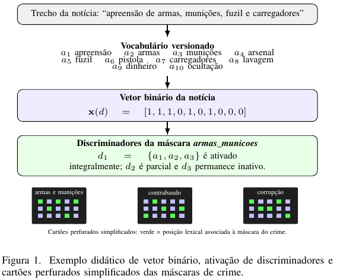

# Cartões de fala — AT

**Trabalho:** *Classificação Incremental e Auditável de Crimes em Notícias Institucionais com Memória WNN e LLM Residual*.

Os cartões usam exclusivamente os dados da execução final. “Cobertura WNN” não é acurácia: é a proporção de notícias resolvidas pela memória antes de acionar a LLM.

---

## Cartão 1 — Problema

**Fala sugerida:**

> Meu trabalho propõe uma metodologia para classificar o crime canônico principal em notícias públicas da Polícia Federal. O desafio é que a base cresce, os temas mudam e aplicar uma LLM em todas as notícias aumenta o consumo de tokens. A proposta é usar uma memória explícita para os casos recorrentes e deixar a LLM apenas para os casos que realmente exigem interpretação contextual.

**Transição:** “A questão, então, é como fazer isso sem perder rastreabilidade.”

---

## Cartão 2 — Pergunta e ideia central

**Fala sugerida:**

> A pergunta de pesquisa é: como classificar uma base institucional que cresce ao longo do tempo, reduzindo o uso de LLM e mantendo auditabilidade? A resposta proposta combina uma memória lexical binária inspirada em WNN/WiSARD com uma revisão residual por LLM. A WNN resolve o que já possui evidência recorrente; a LLM entra apenas quando a memória se abstém.

**Frase-chave:** “A LLM não foi removida; ela foi posicionada onde seu contexto é necessário.”

---

## Cartão 3 — Recorte temporal do experimento

**Figura a exibir:** [linha do tempo de tipos de crime](../data/analise_qualitativa/incremental/figures/linha_tempo_tipos_crime.png).

**Fala sugerida:**

> A separação foi cronológica, e não aleatória. A base possui 8.310 notícias. As 831 mais antigas, ou 10%, formaram a fundação temática, cobrindo de 29 de novembro de 2011 até 30 de julho de 2020. As 7.479 notícias posteriores formaram a reserva incremental, iniciada em 30 de julho de 2020. Assim, a fundação não teve acesso ao futuro: ela cria a memória inicial, e os documentos posteriores permitem observar a evolução temporal dos crimes.

**Observação:** há notícias na data de corte; a ordem cronológica do manifesto define a passagem entre fundação e reserva.

---

## Cartão 4 — Pré-processamento

**Fala sugerida:**

> Antes de agrupar e classificar, as 8.310 notícias passaram por pré-processamento linguístico. O processo preservou substantivos, verbos, adjetivos e expressões de domínio, removendo ruído textual. Foram removidos 497.688 de 1.240.262 tokens originais: uma redução de 40,13%, restando 742.574 tokens para as etapas analíticas. O corpo é a evidência principal; o título é apoio secundário e as tags não criam uma classificação por si só.

**Cuidado:** “40,13% é redução de tokens no pré-processamento; não é uma estimativa de custo financeiro.”

---

## Cartão 5 — Clusterização da fundação

**Figura a exibir:** [grupos consolidados da amostra inicial](../artigo/media/figura-2-clusters-fundacao.png).

**Fala sugerida:**

> Na fundação de 831 notícias, a representação TF-IDF gerou 12.285 termos. A execução usou MiniBatch K-Means como estratégia de fallback e produziu 28 clusters brutos, sem clusters de ruído e com silhueta de 0,288877. A similaridade do cosseno consolidou três grupos, reduzindo o conjunto para 23 clusters interpretados. Por exemplo, três clusters foram reunidos em corrupção e desvio de recursos públicos, dois em crime organizado e três em crimes contra crianças.

**Transição:** “Mas cluster não é crime automaticamente; ele precisa ser interpretado e consolidado.”

---

## Cartão 6 — Taxonomia inicial e evolução

**Fala sugerida:**

> A fundação consolidou 17 crimes canônicos. Durante o fluxo incremental, ameaças e terrorismo foi promovido, chegando a 18 categorias finais. A regra é não criar uma classe só porque um termo é frequente: candidatos similares podem ser absorvidos por uma categoria existente. Notícias raras ficam registradas para auditoria e não entram automaticamente na taxonomia de crimes.

---

## Cartão 7 — Memória WNN como cartões perfurados

**Figura a exibir:**

**Fala sugerida:**

> A melhor forma de visualizar a memória WNN neste trabalho é como cartões perfurados. Ao final da execução, ela possuía 358 posições lexicais versionadas. Todos os crimes usam as mesmas 358 posições, mas cada crime aciona um padrão diferente de posições. Os furos verdes representam termos que sustentam aquela máscara; por isso é possível comparar visualmente os padrões de armas, contrabando ou corrupção.

> Essa visualização é inspirada na retina binária e nos discriminadores da WiSARD, mas é uma adaptação interpretável deste trabalho. Ela não afirma que a implementação reproduz as RAMs e o mapeamento pseudoaleatório da WiSARD clássica.

**Frase-chave:** “O vetor binário é a definição formal; o cartão perfurado é a forma intuitiva de enxergar a memória.”

---

## Cartão 8 — Como a memória decide

**Fala sugerida:**

> Cada notícia é projetada nesse mesmo vocabulário binário. A WNN compara as posições ativas da notícia com as máscaras de crime e avalia pontuação, cobertura, confiança e margem entre alternativas. Quando há evidência suficiente, ela aceita o crime. Quando a confiança ou a margem é baixa, ela se abstém. Esse residual é encaminhado para o Agente 3, que usa a LLM para interpretar o contexto.

**Esclarecimento:** “O Agente 3 não é bleaching clássico. O desempate da WNN ocorre antes dele; a LLM interpreta os casos que permaneceram incertos.”

---

## Cartão 9 — Aprendizado e metamorfose

**Fala sugerida:**

> A decisão residual pode alimentar a memória com novos marcadores e variantes. Ao final de cada lote, a memória passa por metamorfose: padrões inválidos, duplicados ou excedentes podem ser compactados, preservando os mais confirmados. Assim, o sistema aprende com os casos difíceis, mas não cresce sem controle. A atualização é versionada e cada decisão mantém sua trilha de evidências.

---

## Cartão 10 — Resultado operacional

**Figura a exibir:** [taxas WNN, LLM e candidatos por lote](../data/analise_qualitativa/incremental/figures/taxas_wnn_llm_candidatos_por_iteracao.png).

**Fala sugerida:**

> A reserva teve 7.479 notícias, processadas em 15 lotes de aproximadamente 500. A WNN classificou diretamente 6.031 notícias: cobertura de 80,64%. Restaram 1.448 casos, ou 19,36%, encaminhados à LLM. Se a LLM fosse aplicada a toda a reserva, seriam 7.479 chamadas; a camada determinística evitou 6.031 chamadas potenciais.

**Frase-chave:** “A principal economia operacional é evitar 80,64% das chamadas potenciais à LLM.”

---

## Cartão 11 — Tokens e custo mensurável

**Figura a exibir:** [WNN, resíduos e candidatos por lote](../data/analise_qualitativa/incremental/figures/wnn_residual_candidatos_por_iteracao.png).

**Fala sugerida:**

> A revisão residual usou o modelo gpt-4.1-mini. Foram 1.448 chamadas, com consumo total de 2.615.125 tokens e média de 1.806 tokens por chamada. Esse número não mede acurácia, mas torna o custo computacional da camada LLM explícito e reproduzível. A estratégia permite acompanhar exatamente quanto do processamento ficou na memória determinística e quanto precisou de interpretação contextual.

---

## Cartão 12 — Leitura correta dos resultados

**Fala sugerida:**

> Cobertura de 80,64% não significa que a WNN acertou 80,64%. Ela significa apenas que esse percentual foi resolvido diretamente pela memória. Como não existe uma amostra de referência integralmente validada por especialistas, não é correto afirmar acurácia, precisão, revocação ou F1. O resultado demonstra viabilidade operacional, rastreabilidade e redução de chamadas à LLM; a avaliação de qualidade semântica é um próximo passo.

---

## Cartão 13 — Conclusão

**Fala sugerida:**

> A contribuição do trabalho é um ciclo incremental e auditável. A fundação histórica forma a taxonomia; a memória WNN, visualizada pelos cartões perfurados, resolve os casos recorrentes; e a LLM fica restrita aos resíduos. O resultado foi uma cobertura determinística de 80,64%, com registros das evidências, versões da memória, decisões residuais e evolução temporal dos crimes.

> Como continuidade, o trabalho precisa de validação humana independente para medir precisão, revocação e F1, além de comparações com classificadores supervisionados e com uma LLM aplicada à base inteira.

---

## Perguntas prováveis

**Por que não usar apenas a LLM?**  
Porque casos recorrentes podem ser resolvidos por evidência lexical auditável. A LLM fica reservada aos casos incertos, reduzindo chamadas e tornando o custo mensurável.

**A WNN é uma WiSARD clássica?**  
Não. É uma memória lexical binária inspirada em WNN/WiSARD. Ela não replica a retina com mapeamento pseudoaleatório para RAMs da WiSARD clássica.

**Por que o corte temporal é importante?**  
Porque a fundação só utiliza documentos históricos; os documentos posteriores simulam a chegada de notícias ao longo do tempo.

**Os cartões perfurados são a memória inteira?**  
Cada cartão é uma visualização de uma máscara sobre as mesmas 358 posições. O cartão simplifica a grade, mas conserva a ideia de quais posições lexicais sustentam cada crime.

**80,64% é acurácia?**  
Não. É cobertura da WNN antes da LLM. Acurácia exige uma referência validada por especialistas.
